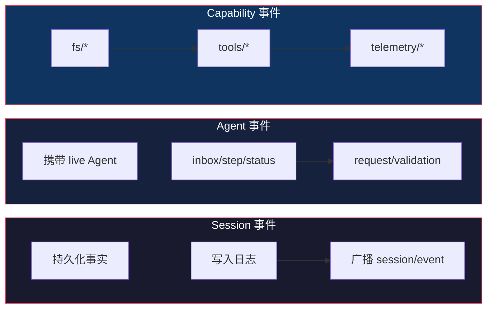

# Cordis 插件框架深度解析

> 基于 [deepseek-harness](https://github.com/deepseek-ai/deepseek-harness) 源码分析。Cordis 是 dsh 的底层插件框架，源自 [cordiverse/cordis](https://github.com/cordiverse/cordis)。

## 生活比喻：乐高积木

Cordis 的设计像乐高积木：

- **每个积木（插件）**有标准的接口（凸点和凹槽）
- **拼装顺序**由接口依赖决定，不需要手动排序
- **拆掉一块**不影响其他块，只影响它自己提供的功能
- **每块积木**都可以被同尺寸的另一块替换

传统框架像拼图——每块都有固定位置，换一块就得重拼。Cordis 像乐高——任何凸点都能接任何凹槽。

## 核心概念

### Context：服务仓库

Context 是 Cordis 的核心——一个服务注册表，所有插件通过它通信：

```typescript
import { Context } from 'cordis'

// 创建根 context
const root = new Context()

// 注册服务
root.provide('logger', new Logger())
root.provide('config', new ConfigManager())

// 其他插件通过 key 查找
const logger = root.logger  // 类型安全
```

Context 是树状的——子 context 继承父 context 的服务，也可以覆盖：

```typescript
const child = root.extend({ isolate: ['logger'] })
child.logger = new FileLogger()  // 子 context 用自己的 logger
// 父 context 的 logger 不受影响
```

### Service：插件即服务

一个插件就是一个实现了 Service 接口的对象：

```typescript
// 方式一：函数式插件
export function apply(ctx: Context) {
  ctx.provide('tools', new ToolRegistry(ctx))
  return () => {
    // 返回 disposer，卸载时自动调用
    ctx.tools.dispose()
  }
}

// 方式二：类式插件
export class ToolService extends Service {
  constructor(ctx: Context) {
    super(ctx, 'tools')  // 注册为 ctx.tools
  }

  start() {
    // 插件启动时调用
  }

  stop() {
    // 插件卸载时调用
  }
}
```

### inject：声明式依赖

插件通过 `inject` 声明依赖的服务，Cordis 自动等待依赖就绪后再加载：

```typescript
export const inject = ['tools', 'llm']

export function apply(ctx: Context) {
  // tools 和 llm 都就绪后才会执行到这里
  // 如果 tools 没注册，这个插件会一直等
}
```

这解决了传统插件系统的"加载顺序"问题——不需要手动排序，依赖关系自动决定顺序。

### effect：可逆注册

所有注册都是"效果"（effect），插件卸载时自动反注册：

```typescript
export function apply(ctx: Context) {
  // 注册一个工具
  ctx.effect(() => {
    ctx.tools.register('read_file', readFileSchema)
    return () => {
      // disposer：卸载时自动调用
      ctx.tools.unregister('read_file')
    }
  })
}
```

Cordis 保证 disposer 按注册的**逆序**执行——后注册的先清理，避免依赖问题。

## 事件系统

Cordis 的事件系统有四种分发模式，每种适合不同的场景：

### emit：广播

```typescript
// 注册顺序执行，不等待，无返回值
ctx.emit('session/event', event)
```

适合：通知、日志、UI 更新。监听器之间互不影响。

### waterfall：中间件

```typescript
// 注册顺序执行，不等待，有返回值
// 监听器接收 (...args, next)
ctx.waterfall('agent/pre-step', messages, next => {
  // 可以修改 messages
  const filtered = messages.filter(m => m.role !== 'system')
  return next(filtered)  // 委托给下一个
  // 不调用 next() = 短路
})
```

适合：请求处理链、过滤器、中间件。每个监听器可以修改参数或短路。

### parallel：并行

```typescript
// 并行执行所有监听器，等待全部完成
await ctx.parallel('agent/step-end', step)
```

适合：独立的副作用（日志、遥测、通知）。所有监听器同时执行。

### serial：串行

```typescript
// 注册顺序执行，等待每个完成，有返回值
const result = await ctx.serial('agent/request', request)
```

适合：需要顺序执行且有返回值的场景。每个监听器可以修改结果。

## 事件域

dsh 在 Cordis 基础上定义了三个事件域：



- **Session 事件**：持久化事实，写入日志，跨重载存活。用于记录用户输入、模型输出、工具调用等。
- **Agent 事件**：携带 live Agent 引用，用于观察和拦截进行中的工作。
- **Capability 事件**：在接口边界挂载策略和适配器，不导入 agent 循环。

## 优秀代码：waterfall 中间件

### 源码

```typescript
// cordis 源码（简化）
class Context {
  waterfall(name: string, ...args: any[]) {
    const listeners = this.getListeners(name)
    let index = 0

    const next = (value: any) => {
      if (index >= listeners.length) return value
      const listener = listeners[index++]
      return listener(...args, next)  // 递归调用
    }

    return next(args[0])
  }
}
```

### 好在哪

1. **简洁的递归实现**——用闭包 + 递归实现中间件链，不需要维护链表
2. **`next()` 控制流**——调用 `next()` 委托，不调用短路，非常直观
3. **值传播**——每个监听器可以通过 `next(wrappedValue)` 修改传递给下一个的值

### 模式

**Chain of Responsibility + Middleware**：每个监听器决定是否继续传递，同时可以修改传递的内容。

### 骨架代码

```typescript
// 你的项目中：用同样的模式实现中间件
class Waterfall<T> {
  private handlers: Array<(value: T, next: (v: T) => T) => T> = []

  use(handler: (value: T, next: (v: T) => T) => T) {
    this.handlers.push(handler)
  }

  execute(value: T): T {
    let index = 0
    const next = (v: T): T => {
      if (index >= this.handlers.length) return v
      return this.handlers[index++](v, next)
    }
    return next(value)
  }
}

// 使用
const pipeline = new Waterfall<string>()
pipeline.use((val, next) => {
  console.log('before')
  const result = next(val.toUpperCase())
  console.log('after')
  return result
})
pipeline.use((val, next) => {
  return next(`[${val}]`)
})

console.log(pipeline.execute('hello'))
// before
// after
// [HELLO]
```

## 实际使用：插件组合

```typescript
// 定义一个工具插件
const filePlugin = {
  inject: ['tools'],
  apply(ctx: Context) {
    ctx.tools.register('read_file', {
      description: 'Read a file',
      parameters: z.object({ path: z.string() }),
      execute: async ({ path }) => {
        return await fs.readFile(path, 'utf-8')
      }
    })
  }
}

// 定义一个 LLM 适配器插件
const deepseekPlugin = {
  inject: ['llm'],
  apply(ctx: Context) {
    ctx.llm.registerAdapter('deepseek', {
      stream: async (messages) => {
        // 调用 DeepSeek API
      }
    })
  }
}

// 组合
const root = new Context()
root.plugin(filePlugin)
root.plugin(deepseekPlugin)
```

## 对比：Cordis vs 其他插件框架

| 维度 | Cordis | NestJS | InversifyJS |
|------|--------|--------|-------------|
| 核心模型 | Context + Service | Module + Provider | Container + Binding |
| 依赖声明 | `inject` 数组 | `@Inject()` 装饰器 | `@inject()` 装饰器 |
| 生命周期 | effect + disposer | onModuleInit/Destroy | 自管理 |
| 事件系统 | 四种模式内置 | 需要额外库 | 无 |
| 配置驱动 | YAML patch | 装饰器 | 装饰器 |

Cordis 的独特之处是**配置驱动的组合**——通过 YAML patch 文件组合插件，不需要写代码。这对 agent 框架特别重要，因为用户需要通过配置而非编码来定制 agent 行为。

## 总结

Cordis 是一个**配置驱动、依赖声明、效果可逆**的插件框架。核心思想：

- **Context 是服务仓库**——通过 key 注册和查找，不直接 import
- **依赖声明式加载**——`inject` 数组决定加载顺序，不需要手动排序
- **注册即效果**——所有注册都有 disposer，卸载时自动清理
- **四种事件模式**——emit/waterfall/parallel/serial 覆盖所有通信场景

这个设计让 dsh 的每个组件都可以独立替换——换模型适配器、换工具实现、换存储后端，只需要换一个插件。
