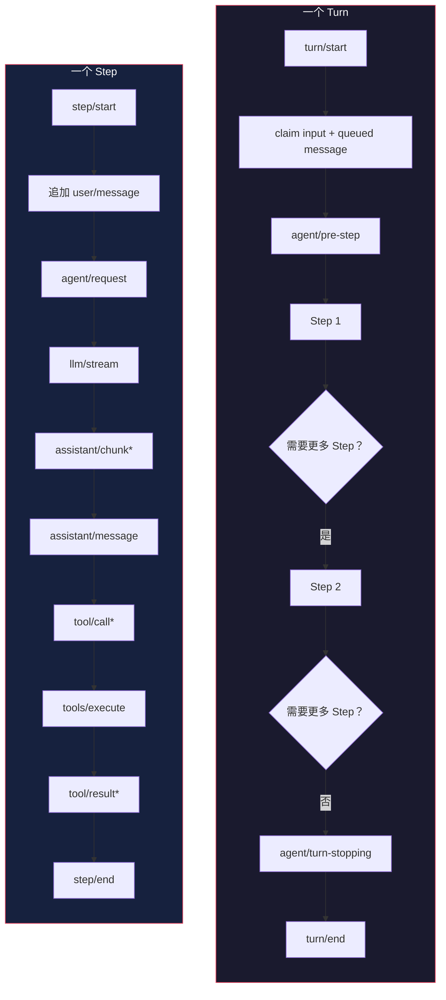

# Agent Loop 与 Turn 流程

> 基于 [deepseek-harness](https://github.com/deepseek-ai/deepseek-harness) 源码分析。

## 生活比喻：餐厅服务员的工作流程

一个服务员服务一桌客人的流程：

1. **客人入座**（turn/start）——开始服务
2. **点菜**（agent/pre-step）——确认客人要点什么
3. **下单到厨房**（agent/request → llm/stream）——把需求发给模型
4. **等菜**（assistant/chunk*）——模型流式返回
5. **上菜**（tool/call → tools/execute）——执行工具调用
6. **客人还要**（next step）——如果客人还有需求，重复 2-5
7. **结账**（turn/end）——这一轮结束

Agent Loop 就是这个流程的自动化版本。

## 核心概念

### Step vs Turn

- **Step**：一次模型请求 + 它调用的工具
- **Turn**：零或多个 Step，从用户输入开始，到模型不再需要工具为止

一个 Turn 可能包含多个 Step——模型调用工具后拿到结果，可能需要再调用一次工具，这就是第二个 Step。



## Turn 流程详解

```text
turn/start
  claim next-step input + 一条排队消息
  组装 prompt 段 + 工具 schema
  -> agent/pre-step                   reject | enter(messages)
     reject 或空 -> 关闭 turn（零 step）
     step/start
     追加 user/message
     从日志派生模型历史
     agent/request -> llm/stream -> assistant/chunk* -> assistant/message
     tool/call* -> tools/pre-execute -> tools/execute -> tools/post-execute -> tool/result*
     step/end
     工具欠另一个请求，或 next-step input 到达 -> claim -> next step
  -> agent/turn-stopping
turn/end
```

### 事件类型

| 事件 | 类型 | 说明 |
|------|------|------|
| `turn/start` | Session | 持久化，记录 turn 开始 |
| `agent/pre-step` | Agent | waterfall，可修改或拒绝输入 |
| `step/start` | Session | 持久化，记录 step 开始 |
| `agent/request` | Agent | waterfall，可修改请求 |
| `llm/stream` | Agent | waterfall，模型流式输出 |
| `assistant/chunk` | Session | 持久化，流式 chunk |
| `assistant/message` | Session | 持久化，完整消息 |
| `tool/call` | Session | 持久化，工具调用 |
| `tools/pre-execute` | Capability | waterfall，可修改工具参数 |
| `tools/execute` | Capability | 执行工具 |
| `tools/post-execute` | Capability | waterfall，可修改工具结果 |
| `tool/result` | Session | 持久化，工具结果 |
| `step/end` | Session | 持久化，记录 step 结束 |
| `agent/turn-stopping` | Agent | serial，决定是否继续 |
| `turn/end` | Session | 持久化，记录 turn 结束 |

## Agent Loop 驱动

`core/agent-loop` 是默认的 Agent 驱动，实现了 `Agent` 接口：

```typescript
class AgentLoop {
  async run(input: UserMessage) {
    // 1. 开始 turn
    this.emit('turn/start', { input })

    // 2. claim 输入
    const messages = this.claimInput(input)

    // 3. pre-step：允许插件修改或拒绝
    const result = await this.waterfall('agent/pre-step', messages)
    if (result.rejected) {
      this.emit('turn/end', { steps: 0 })
      return
    }

    // 4. 循环执行 step
    let stepCount = 0
    while (true) {
      stepCount++
      await this.executeStep(result.messages)

      // 5. 检查是否需要更多 step
      if (!this.needsMoreStep()) break
    }

    // 6. 结束 turn
    this.emit('turn/end', { steps: stepCount })
  }

  async executeStep(messages: Message[]) {
    this.emit('step/start')

    // 追加 user/message
    await this.appendMessages(messages)

    // 派生模型历史
    const history = this.deriveMessages()

    // 请求模型
    const request = await this.waterfall('agent/request', { history })

    // 流式获取响应
    const response = await this.stream(request)

    // 处理工具调用
    for (const toolCall of response.toolCalls) {
      await this.executeTool(toolCall)
    }

    this.emit('step/end')
  }
}
```

## 输入系统

输入通过 inbox 到达 Agent Loop。两种输入类型：

1. **唤醒输入**：立即唤醒 agent 执行
2. **注入上下文**：等待在 inbox 里，直到有唤醒输入才被处理

```typescript
// 唤醒输入
agent.input({ role: 'user', content: '帮我读一个文件' })

// 注入上下文（不唤醒）
agent.inject({ role: 'system', content: '当前目录: /home/user' })
```

## 优秀代码：waterfall 事件链

### 源码

```typescript
// agent/pre-step 事件处理（简化）
async function preStep(messages: Message[]): Promise<PreStepResult> {
  let result: PreStepResult = { messages, rejected: false }
  let index = 0

  const next = (msgs: Message[]) => {
    if (index >= listeners.length) return { messages: msgs, rejected: false }
    const listener = listeners[index++]
    return listener(msgs, next)
  }

  result = await next(messages)
  return result
}
```

### 好在哪

1. **waterfall 模式**——每个监听器可以修改消息或拒绝，也可以委托给下一个
2. **短路机制**——不调用 `next()` 就是拒绝，非常直观
3. **值传播**——修改后的消息通过 `next()` 传递给下一个监听器

### 模式

**Chain of Responsibility**：每个监听器决定是否继续，同时可以修改传递的值。

## 实战：自定义 Step 拦截

```typescript
// 注册一个 pre-step 监听器：过滤掉过长的消息
ctx.on('agent/pre-step', (messages, next) => {
  const filtered = messages.filter(m => m.content.length < 10000)
  return next(filtered)
})

// 注册一个 tools/execute 监听器：记录工具执行时间
ctx.on('tools/execute', async (tool, args, next) => {
  const start = Date.now()
  const result = await next(tool, args)
  console.log(`${tool.name} took ${Date.now() - start}ms`)
  return result
})

// 注册一个 agent/turn-stopping 监听器：限制 turn 数量
ctx.on('agent/turn-stopping', (agent) => {
  if (agent.stepCount > 10) {
    return { continue: false, reason: '超过最大 step 数' }
  }
})
```

## 对比：Agent Loop vs 其他 agent 框架

| 维度 | dsh Agent Loop | LangChain | AutoGen |
|------|---------------|-----------|---------|
| 事件模型 | 三种域（Session/Agent/Capability） | 回调 | 消息传递 |
| 扩展方式 | 插件监听事件 | 继承/组合 | 角色定义 |
| 持久化 | Session 日志是核心 | 可选 | 可选 |
| 工具执行 | 受保护管道（pre/execute/post） | 直接调用 | 直接调用 |
| 取消/恢复 | 内置（turn 边界） | 手动 | 手动 |

dsh 的 Agent Loop 设计核心是**事件驱动 + 持久化日志**——所有操作都是事件，所有事件都写入日志，可以从日志恢复任何状态。

## 总结

Agent Loop 是 dsh 的心脏——它驱动 turn/step 循环，通过事件系统与插件交互。核心设计：

- **Step/Turn 分层**——一个 turn 包含多个 step，每个 step 是一次模型请求
- **事件驱动**——所有操作都是事件，插件可以监听和拦截
- **waterfall 中间件**——pre-step、request、execute 都是 waterfall，插件可以修改或短路
- **持久化日志**——Session 事件写入日志，支持重放和恢复
