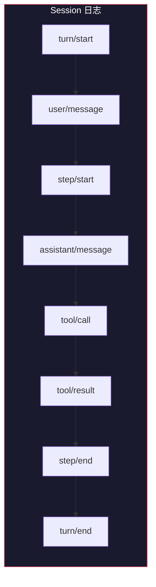
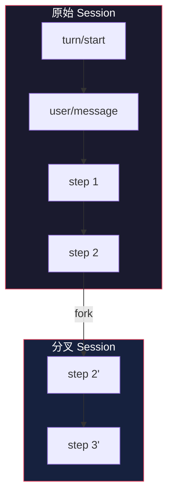

# Session 系统：持久化日志

> 基于 [deepseek-harness](https://github.com/deepseek-ai/deepseek-harness) 源码分析。

## 生活比喻：法院的庭审记录

法院的庭审记录有几个特点：

- **追加式**——只能写新记录，不能修改旧的
- **完整记录**——每一句话、每一个证据都记录在案
- **可回放**——任何时候都能从头到尾重新审一遍
- **可分叉**——可以从某个点分出新的审理（上诉）

Session 系统就是 agent 的庭审记录——记录每一次交互，支持回放和分叉。

## 核心设计：追加式日志

Session 日志是 **append-only** 的——只能追加新事件，不能修改旧事件。这是整个架构的核心约束。

```typescript
interface SessionEvent {
  id: string           // 事件 ID
  type: string         // 事件类型
  timestamp: number    // 时间戳
  data: any            // 事件数据
  parentId?: string    // 父事件（用于分叉）
}

class SessionLog {
  private events: SessionEvent[] = []

  // 追加事件（不能修改）
  append(event: Omit<SessionEvent, 'id'>): SessionEvent {
    const full = { ...event, id: generateId() }
    this.events.push(full)
    this.emit('session/event', full)  // 广播
    return full
  }

  // 只读查询
  query(filter?: EventFilter): SessionEvent[] {
    return this.events.filter(e => matches(e, filter))
  }
}
```

## 事件类型

Session 事件是持久化的事实，记录 agent 的所有操作：

| 事件类型 | 说明 |
|---------|------|
| `turn/start` | Turn 开始 |
| `user/message` | 用户输入 |
| `assistant/message` | 模型输出 |
| `assistant/chunk` | 流式 chunk |
| `tool/call` | 工具调用 |
| `tool/result` | 工具结果 |
| `step/start` | Step 开始 |
| `step/end` | Step 结束 |
| `turn/end` | Turn 结束 |



## deriveMessages：从日志派生模型历史

模型看到的历史不是直接传入的，而是从 Session 日志**派生**出来的：

```typescript
function deriveMessages(log: SessionLog): Message[] {
  const events = log.query()
  const messages: Message[] = []

  for (const event of events) {
    switch (event.type) {
      case 'user/message':
        messages.push({ role: 'user', content: event.data.content })
        break
      case 'assistant/message':
        messages.push({ role: 'assistant', content: event.data.content })
        break
      case 'tool/result':
        messages.push({
          role: 'tool',
          toolCallId: event.data.toolCallId,
          content: event.data.result
        })
        break
    }
  }

  return messages
}
```

**好在哪：**

- **单一数据源**——Session 日志是唯一的事实来源，不会出现日志和内存状态不一致
- **可重放**——从日志可以重建任何时刻的模型历史
- **可压缩**——可以对旧日志做 compaction，只保留摘要

## Session 分叉

Session 可以从某个点分叉（fork），创建新的分支：

```typescript
// 从当前 session 分叉
const child = sessions.fork(sourceSession, boundary, childSessionId)

// boundary 指定分叉点（某个事件 ID）
// child 是新的 session，继承 source 的历史
```

分叉的用途：

- **回退重试**——从某个 step 回退，重新执行
- **并行探索**——同时尝试多种方案
- **子任务**——subagent 在子 session 中执行



## 持久化

Session 日志可以持久化到不同后端：

```typescript
// 内存存储（默认）
ctx.sessions = new MemorySessionStore()

// 文件存储
ctx.sessions = new FileSessionStore('~/.dsh/sessions/')

// 数据库存储
ctx.sessions = new DatabaseSessionStore(connectionString)
```

持久化的好处：

- **跨重启存活**——agent 重启后可以继续之前的 session
- **历史查询**——可以查询过去的交互记录
- **审计追踪**——完整的操作日志，用于安全审计

## 优秀代码：事件派生

### 源码

```typescript
// 从日志派生模型历史（简化）
function deriveMessages(events: SessionEvent[]): Message[] {
  return events
    .filter(e => isModelVisible(e))
    .map(e => toMessage(e))
    .filter(Boolean) as Message[]
}

function isModelVisible(event: SessionEvent): boolean {
  return ['user/message', 'assistant/message', 'tool/result']
    .includes(event.type)
}
```

### 好在哪

1. **声明式过滤**——用 `isModelVisible` 函数声明哪些事件对模型可见
2. **函数式管道**——filter → map → filter，清晰的数据流
3. **单一职责**——`deriveMessages` 只负责从日志派生，不负责日志的存储

### 模式

**Event Sourcing**——所有状态都从事件派生，事件是唯一的事实来源。

### 骨架代码

```typescript
// 你的项目中：用同样的模式实现事件溯源
class EventStore<T extends { type: string }> {
  private events: T[] = []

  append(event: T): void {
    this.events.push(event)
  }

  // 从事件派生状态
  derive<R>(reducer: (events: T[]) => R): R {
    return reducer(this.events)
  }

  // 从事件派生视图
  view(filter: (e: T) => boolean): T[] {
    return this.events.filter(filter)
  }
}

// 使用
const store = new EventStore()
store.append({ type: 'user', content: 'hello' })
store.append({ type: 'assistant', content: 'hi' })

// 派生模型历史
const history = store.derive(events =>
  events.filter(e => e.type === 'user' || e.type === 'assistant')
)
```

## 对比：Session 日志 vs 其他方案

| 维度 | Session 日志 | 内存状态 | 数据库 |
|------|-------------|---------|--------|
| 一致性 | 单一数据源 | 可能不一致 | 需要同步 |
| 可重放 | 天然支持 | 不支持 | 需要额外实现 |
| 分叉 | 天然支持 | 复制状态 | 需要额外实现 |
| 查询 | 事件过滤 | 直接访问 | SQL 查询 |
| 性能 | 追加快，查询慢 | 最快 | 取决于索引 |

Session 日志的设计是 **Event Sourcing** 的实践——牺牲了查询性能，换来了可重放、可分叉、单一数据源的优势。

## 总结

Session 系统是 dsh 的记忆——追加式日志记录所有交互，从日志派生模型历史，支持分叉和持久化。核心设计：

- **追加式**——只能写新记录，不能修改旧的
- **单一数据源**——Session 日志是唯一的事实来源
- **可派生**——模型历史从日志派生，不单独存储
- **可分叉**——从任何点创建新分支，支持回退和并行探索
