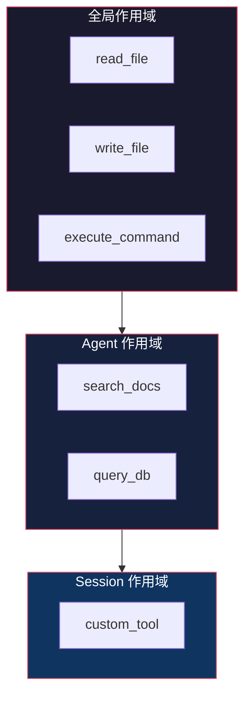
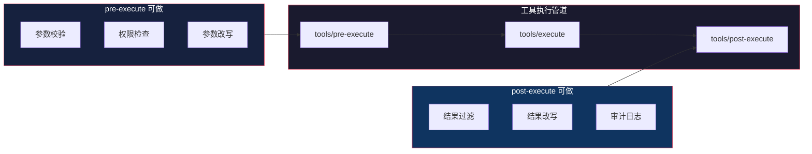

# 工具系统：注册、执行、防护

> 基于 [deepseek-harness](https://github.com/deepseek-ai/deepseek-harness) 源码分析。

## 生活比喻：公司的审批流程

员工（模型）要执行一个操作（工具调用），需要经过审批：

1. **提交申请**（tool/call）——模型请求调用工具
2. **部门审核**（tools/pre-execute）——检查参数是否合理
3. **执行**（tools/execute）——实际执行工具
4. **结果审核**（tools/post-execute）——检查结果是否安全
5. **归档**（tool/result）——记录结果

工具系统就是这个审批流程的自动化。

## 核心概念

### 工具注册

工具通过 `ctx.tools` 注册，定义 schema 和执行逻辑：

```typescript
ctx.tools.register('read_file', {
  description: 'Read a file from the filesystem',
  parameters: z.object({
    path: z.string().describe('File path to read'),
  }),
  execute: async ({ path }) => {
    return await fs.readFile(path, 'utf-8')
  }
})
```

工具 schema 会被自动组装到 prompt 中，让模型知道有哪些工具可用。

### 作用域工具

工具可以注册到不同的作用域——全局、agent 级别、session 级别：

```typescript
// 全局工具
ctx.tools.register('global_tool', schema)

// agent 级别工具（只对特定 agent 可见）
agent.ctx.tools.register('agent_tool', schema)

// session 级别工具
session.ctx.tools.register('session_tool', schema)
```



## 执行管道

工具执行经过三个阶段，每个阶段都是 waterfall 事件：



### pre-execute：执行前

```typescript
ctx.on('tools/pre-execute', async (tool, args, next) => {
  // 权限检查
  if (!hasPermission(tool.name)) {
    throw new Error('Permission denied')
  }

  // 参数校验
  const validated = tool.schema.parse(args)

  // 参数改写（比如添加默认值）
  const enriched = { ...validated, cwd: currentDir }

  return next(tool, enriched)
})
```

### execute：执行

```typescript
// 默认执行逻辑（简化）
async function execute(tool: Tool, args: any) {
  // 检查是否有自定义执行器
  const custom = this.customExecutors.get(tool.name)
  if (custom) return custom(args)

  // 使用工具自带的 execute
  return tool.execute(args)
}
```

### post-execute：执行后

```typescript
ctx.on('tools/post-execute', async (tool, args, result, next) => {
  // 结果过滤（比如移除敏感信息）
  const filtered = sanitize(result)

  // 审计日志
  auditLog(tool.name, args, filtered)

  return next(tool, args, filtered)
})
```

## 工具 Schema

工具 schema 用 Zod 定义，自动组装到 prompt 中：

```typescript
const readFileTool = {
  name: 'read_file',
  description: 'Read a file from the filesystem',
  parameters: z.object({
    path: z.string().describe('File path to read'),
    encoding: z.enum(['utf-8', 'base64']).optional()
      .describe('File encoding, defaults to utf-8'),
  }),
  execute: async ({ path, encoding = 'utf-8' }) => {
    return await fs.readFile(path, encoding)
  }
}
```

schema 会被转换成 JSON Schema 格式，发送给模型：

```json
{
  "name": "read_file",
  "description": "Read a file from the filesystem",
  "parameters": {
    "type": "object",
    "properties": {
      "path": {
        "type": "string",
        "description": "File path to read"
      },
      "encoding": {
        "type": "string",
        "enum": ["utf-8", "base64"],
        "description": "File encoding, defaults to utf-8"
      }
    },
    "required": ["path"]
  }
}
```

## 受保护执行

工具执行有安全防护机制：

### 沙箱

```typescript
// 工具在沙箱中执行
ctx.sandbox = {
  execute: async (command: string) => {
    // 在隔离环境中执行
    return await container.run(command)
  }
}
```

### 审批策略

```typescript
// 需要用户审批的工具
ctx.approval = {
  requiresApproval: (tool: string) => {
    return ['write_file', 'execute_command'].includes(tool)
  }
}
```

### 超时控制

```typescript
// 工具执行超时
const result = await Promise.race([
  tool.execute(args),
  new Promise((_, reject) =>
    setTimeout(() => reject(new Error('Timeout')), 30000)
  )
])
```

## 优秀代码：waterfall 执行管道

### 源码

```typescript
// 工具执行管道（简化）
async function executeTool(tool: Tool, args: any) {
  // pre-execute waterfall
  const preResult = await this.waterfall('tools/pre-execute', tool, args)
  if (preResult.blocked) return preResult.reason

  // execute
  const result = await this.runExecutor(preResult.tool, preResult.args)

  // post-execute waterfall
  const postResult = await this.waterfall('tools/post-execute',
    preResult.tool, preResult.args, result)

  return postResult.result
}
```

### 好在哪

1. **三阶段管道**——pre/execute/post 分离关注点
2. **waterfall 模式**——每个阶段都支持多个监听器链式处理
3. **可拦截**——pre 可以阻止执行，post 可以修改结果

### 模式

**Pipeline + Chain of Responsibility**：三阶段管道，每个阶段是责任链。

### 骨架代码

```typescript
// 你的项目中：用同样的模式实现工具管道
class ToolPipeline {
  private preHandlers: Function[] = []
  private postHandlers: Function[] = []

  pre(handler: Function) {
    this.preHandlers.push(handler)
  }

  post(handler: Function) {
    this.postHandlers.push(handler)
  }

  async execute(tool: string, args: any) {
    // pre-execute chain
    let currentArgs = args
    for (const handler of this.preHandlers) {
      const result = await handler(tool, currentArgs)
      if (result.blocked) return result.reason
      currentArgs = result.args
    }

    // execute
    let result = await this.runTool(tool, currentArgs)

    // post-execute chain
    for (const handler of this.postHandlers) {
      result = await handler(tool, currentArgs, result)
    }

    return result
  }
}
```

## 实战：自定义工具

```typescript
// 注册一个带审批的文件写入工具
ctx.tools.register('write_file', {
  description: 'Write content to a file',
  parameters: z.object({
    path: z.string(),
    content: z.string(),
  }),
  execute: async ({ path, content }) => {
    // 检查路径是否在允许范围内
    if (!path.startsWith('/workspace/')) {
      throw new Error('Path outside workspace')
    }

    await fs.writeFile(path, content)
    return `Written to ${path}`
  }
})

// 注册 pre-execute 监听器：自动添加 cwd
ctx.on('tools/pre-execute', (tool, args, next) => {
  if (tool.name === 'read_file' && !args.path.startsWith('/')) {
    args = { ...args, path: `${cwd}/${args.path}` }
  }
  return next(tool, args)
})

// 注册 post-execute 监听器：记录工具调用
ctx.on('tools/post-execute', (tool, args, result, next) => {
  console.log(`[${tool.name}] ${JSON.stringify(args)} -> ${result}`)
  return next(tool, args, result)
})
```

## 对比：工具系统 vs 其他方案

| 维度 | dsh 工具系统 | LangChain Tools | OpenAI Functions |
|------|-------------|----------------|-----------------|
| 注册方式 | Context 插件 | 类继承 | JSON 定义 |
| 执行管道 | 三阶段 waterfall | 直接调用 | 直接调用 |
| 作用域 | 全局/agent/session | 全局 | 全局 |
| 安全防护 | 沙箱 + 审批 | 手动 | 无 |
| Schema | Zod → JSON Schema | 手动 | 手动 |

dsh 工具系统的核心优势是**三阶段管道 + 作用域**——工具执行经过 pre/execute/post 三个阶段，每个阶段都可以拦截；工具可以注册到不同作用域，实现精细化控制。

## 总结

工具系统是 dsh 的手臂——注册工具、执行工具、防护工具。核心设计：

- **作用域注册**——全局/agent/session 三级作用域
- **三阶段管道**——pre/execute/post 分离关注点
- **waterfall 事件**——每个阶段支持链式处理
- **安全防护**——沙箱、审批、超时
