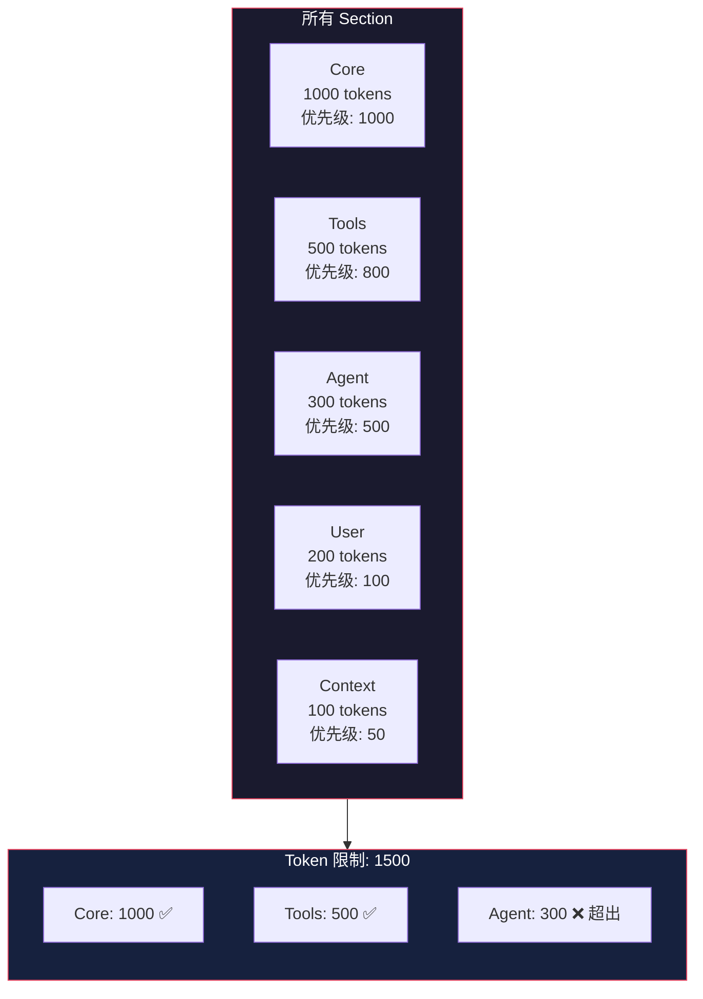

# Prompt 组装系统

> 基于 [deepseek-harness](https://github.com/deepseek-ai/deepseek-harness) 源码分析。

## 生活比喻：定制汉堡

你去汉堡店点餐：

- **面包**（system prompt 基础）——每个汉堡都有
- **肉饼**（核心指令）——汉堡的灵魂
- **蔬菜**（上下文信息）——根据你的需求加
- **酱料**（工具 schema）——让汉堡更有味道
- **包装**（格式化）——最终呈现给顾客

Prompt 组装就是这个过程——从各种来源收集组件，组装成最终的 prompt。

## 核心概念

### Prompt Section

Prompt 不是一个大字符串，而是由多个 **Section** 组成的：

```typescript
interface PromptSection {
  id: string           // 唯一标识
  priority: number     // 排序优先级
  content: string      // 内容
  tokenCount?: number  // token 数量
}

// 注册 prompt section
ctx.systemPrompt.register({
  id: 'file-system',
  priority: 100,
  content: 'You have access to a file system. Use read_file and write_file tools.'
})
```

### 组装流程

```mermaid
flowchart LR
    subgraph Sources["Section 来源"]
        direction TB
        S1["Core 插件"]
        S2["工具插件"]
        S3["Agent 预设"]
        S4["用户配置"]
    end

    subgraph Assembly["组装流程"]
        direction TB
        A1["收集所有 section"]
        A2["按 priority 排序"]
        A3["截断到 token 限制"]
        A4["拼接成最终 prompt"]
    end

    subgraph Output["最终 Prompt"]
        O1["system prompt"]
        O2["工具 schema"]
        O3["上下文信息"]
    end

    Sources --> Assembly --> Output

    style Sources fill:#1a1a2e,stroke:#e94560,color:#fff
    style Assembly fill:#16213e,stroke:#e94560,color:#fff
    style Output fill:#0f3460,stroke:#e94560,color:#fff
```



### 工具 Schema 注册

工具注册时，schema 自动变成 prompt section：

```typescript
ctx.tools.register('read_file', {
  description: 'Read a file',
  parameters: z.object({ path: z.string() }),
  execute: async ({ path }) => await fs.readFile(path, 'utf-8')
})

// 自动注册 prompt section：
// "You have a tool 'read_file': Read a file. Parameters: { path: string }"
```

## 优先级系统

不同来源的 section 有不同的优先级，决定它们在 prompt 中的位置：

| 来源 | 优先级 | 说明 |
|------|--------|------|
| Core 指令 | 最高 | 必须在最前面 |
| 工具 schema | 高 | 模型需要知道有哪些工具 |
| Agent 预设 | 中 | agent 的特定指令 |
| 用户配置 | 低 | 用户自定义内容 |
| 上下文注入 | 最低 | 动态注入的信息 |

```typescript
// 注册时指定优先级
ctx.systemPrompt.register({
  id: 'core-instructions',
  priority: 1000,  // 最高优先级
  content: 'You are a helpful assistant.'
})

ctx.systemPrompt.register({
  id: 'user-context',
  priority: 10,  // 低优先级
  content: `Current directory: ${cwd}`
})
```

## Token 管理

Prompt 有 token 限制，需要智能截断：

```typescript
class SystemPromptAssembler {
  assemble(sections: PromptSection[], maxTokens: number): string {
    // 1. 按优先级排序（高优先级在前）
    const sorted = sections.sort((a, b) => b.priority - a.priority)

    // 2. 从高优先级开始累加
    let totalTokens = 0
    const included: PromptSection[] = []

    for (const section of sorted) {
      if (totalTokens + (section.tokenCount || 0) > maxTokens) {
        break  // 超出限制，停止
      }
      included.push(section)
      totalTokens += section.tokenCount || 0
    }

    // 3. 拼接
    return included.map(s => s.content).join('\n\n')
  }
}
```



## 动态 Prompt

Prompt 可以是动态的——根据当前上下文实时生成：

```typescript
ctx.systemPrompt.register({
  id: 'current-context',
  priority: 50,
  // 动态生成内容
  getContent: () => {
    return `Current time: ${new Date().toISOString()}
Working directory: ${process.cwd()}
Git branch: ${getGitBranch()}`
  }
})
```

## 优秀代码：Section 排序与截断

### 源码

```typescript
// Prompt 组装（简化）
function assembleSections(sections: PromptSection[], maxTokens: number) {
  return sections
    .sort((a, b) => b.priority - a.priority)  // 高优先级在前
    .reduce<{ included: PromptSection[]; tokens: number }>(
      (acc, section) => {
        const tokens = section.tokenCount || 0
        if (acc.tokens + tokens <= maxTokens) {
          acc.included.push(section)
          acc.tokens += tokens
        }
        return acc
      },
      { included: [], tokens: 0 }
    )
    .included
}
```

### 好在哪

1. **声明式排序**——用 `sort` 按优先级排序，不需要手动维护顺序
2. **函数式累加**——用 `reduce` 实现截断逻辑，简洁清晰
3. **token 感知**——每个 section 有 tokenCount，精确控制总长度

### 模式

**Strategy + Template Method**——排序策略可替换，组装流程是模板。

### 骨架代码

```typescript
// 你的项目中：用同样的模式实现 prompt 组装
interface Section {
  id: string
  priority: number
  content: string
  tokens: number
}

function assemblePrompt(sections: Section[], maxTokens: number): string {
  return sections
    .sort((a, b) => b.priority - a.priority)
    .reduce<{ result: string[]; tokens: number }>(
      (acc, s) => {
        if (acc.tokens + s.tokens <= maxTokens) {
          acc.result.push(s.content)
          acc.tokens += s.tokens
        }
        return acc
      },
      { result: [], tokens: 0 }
    )
    .result.join('\n\n')
}

// 使用
const prompt = assemblePrompt([
  { id: 'core', priority: 100, content: 'You are helpful.', tokens: 10 },
  { id: 'tools', priority: 80, content: 'Tools: ...', tokens: 50 },
  { id: 'context', priority: 10, content: 'Current dir: ...', tokens: 5 },
], 100)
```

## 实战：自定义 Prompt Section

```typescript
// 注册一个 agent 预设的 prompt section
ctx.systemPrompt.register({
  id: 'coding-agent',
  priority: 500,
  content: `You are a coding assistant specialized in TypeScript.
When writing code:
1. Use TypeScript strict mode
2. Add proper types
3. Write tests for new functions`
})

// 注册一个动态的上下文 section
ctx.systemPrompt.register({
  id: 'file-context',
  priority: 100,
  getContent: () => {
    const files = getCurrentFiles()
    return `Currently open files:\n${files.map(f => `- ${f}`).join('\n')}`
  }
})

// 注册一个工具相关的 section
ctx.systemPrompt.register({
  id: 'tool-guidelines',
  priority: 800,
  content: `When using tools:
- Always read before writing
- Use relative paths when possible
- Check file existence before reading`
})
```

## 对比：Prompt 组装 vs 其他方案

| 维度 | dsh Prompt 组装 | LangChain | 直接拼接 |
|------|----------------|-----------|---------|
| 组装方式 | Section + 优先级 | PromptTemplate | 字符串拼接 |
| Token 管理 | 自动截断 | 手动 | 无 |
| 动态内容 | getContent 函数 | 变量替换 | 手动 |
| 可扩展性 | 插件注册 | 继承 | 硬编码 |

dsh 的 Prompt 组装系统核心优势是**Section 化 + 优先级 + token 感知**——prompt 由多个独立的 section 组成，按优先级排序，自动截断到 token 限制。

## 总结

Prompt 组装系统是 dsh 的大脑——从各种来源收集 section，按优先级排序，截断到 token 限制，组装成最终的 prompt。核心设计：

- **Section 化**——prompt 由多个独立的 section 组成
- **优先级排序**——高优先级的 section 排在前面
- **token 感知**——自动截断到 token 限制
- **动态生成**——section 内容可以是动态的
