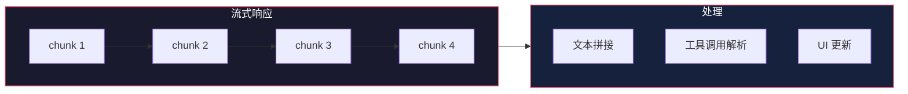

# LLM 适配器层

> 基于 [deepseek-harness](https://github.com/deepseek-ai/deepseek-harness) 源码分析。

## 生活比喻：万能充电器

你有一个万能充电器：

- **输入端**（适配器接口）——统一的 USB-C 接口
- **输出端**（具体实现）——可以接各种充电头（DeepSeek、OpenAI、Claude）
- **协议转换**（消息格式）——自动转换电压和协议

LLM 适配器层就是这个万能充电器——提供统一的接口，适配不同的模型提供商。

## 核心概念

### 适配器接口

```typescript
interface LLMAdapter {
  name: string

  // 流式请求
  stream(request: LLMRequest): AsyncIterable<LLMChunk>

  // 非流式请求
  complete(request: LLMRequest): Promise<LLMResponse>
}

interface LLMRequest {
  messages: Message[]
  tools?: ToolSchema[]
  temperature?: number
  maxTokens?: number
}

interface LLMChunk {
  type: 'text' | 'tool_call' | 'error'
  content: string
  toolCall?: ToolCall
}
```

### 注册适配器

```typescript
// 注册 DeepSeek 适配器
ctx.llm.registerAdapter('deepseek', {
  stream: async (request) => {
    const response = await fetch('https://api.deepseek.com/v1/chat', {
      method: 'POST',
      body: JSON.stringify({
        messages: request.messages,
        stream: true,
      })
    })

    // 返回异步迭代器
    return streamFromResponse(response)
  }
})

// 注册 OpenAI 适配器
ctx.llm.registerAdapter('openai', {
  stream: async (request) => {
    // OpenAI API 调用
  }
})
```

### 使用适配器

```typescript
// 通过 ctx.llm 使用，不需要知道具体是哪个适配器
const response = await ctx.llm.stream({
  messages: [
    { role: 'user', content: 'Hello' }
  ]
})

for await (const chunk of response) {
  if (chunk.type === 'text') {
    process.stdout.write(chunk.content)
  }
}
```

## 流式处理

LLM 响应是流式的——token 一个一个返回，不是等全部生成完：



```typescript
// 流式处理
async function processStream(stream: AsyncIterable<LLMChunk>) {
  let text = ''
  const toolCalls: ToolCall[] = []

  for await (const chunk of stream) {
    switch (chunk.type) {
      case 'text':
        text += chunk.content
        // 实时更新 UI
        updateUI(text)
        break
      case 'tool_call':
        toolCalls.push(chunk.toolCall!)
        break
      case 'error':
        handleError(chunk.content)
        break
    }
  }

  return { text, toolCalls }
}
```

## 消息格式转换

不同模型的消息格式不同，适配器负责转换：

```typescript
// dsh 内部格式
interface Message {
  role: 'user' | 'assistant' | 'system' | 'tool'
  content: string
  toolCalls?: ToolCall[]
  toolCallId?: string
}

// DeepSeek 格式
interface DeepSeekMessage {
  role: string
  content: string
  tool_calls?: Array<{
    id: string
    type: 'function'
    function: { name: string; arguments: string }
  }>
}

// 适配器做转换
class DeepSeekAdapter implements LLMAdapter {
  convertMessage(msg: Message): DeepSeekMessage {
    if (msg.role === 'tool') {
      return {
        role: 'tool',
        content: msg.content,
        tool_call_id: msg.toolCallId,
      }
    }
    return {
      role: msg.role,
      content: msg.content,
      tool_calls: msg.toolCalls?.map(tc => ({
        id: tc.id,
        type: 'function',
        function: {
          name: tc.name,
          arguments: JSON.stringify(tc.arguments),
        }
      }))
    }
  }
}
```

## 错误处理

适配器需要处理各种错误情况：

```typescript
class LLMAdapterWithErrorHandling {
  async *stream(request: LLMRequest): AsyncIterable<LLMChunk> {
    try {
      const response = await this.callAPI(request)

      for await (const chunk of response) {
        yield chunk
      }
    } catch (error) {
      if (error.status === 429) {
        // 限流：等待后重试
        await this.waitAndRetry(request)
      } else if (error.status === 500) {
        // 服务器错误：切换到备用模型
        yield* this.fallbackAdapter.stream(request)
      } else {
        // 其他错误：抛出
        yield { type: 'error', content: error.message }
      }
    }
  }
}
```

## 优秀代码：流式迭代器

### 源码

```typescript
// 流式响应处理（简化）
async function* streamFromResponse(
  response: Response
): AsyncIterable<LLMChunk> {
  const reader = response.body?.getReader()
  const decoder = new TextDecoder()
  let buffer = ''

  while (true) {
    const { done, value } = await reader!.read()
    if (done) break

    buffer += decoder.decode(value, { stream: true })
    const lines = buffer.split('\n')
    buffer = lines.pop() || ''  // 保留不完整的行

    for (const line of lines) {
      if (line.startsWith('data: ')) {
        const data = line.slice(6)
        if (data === '[DONE]') return

        const chunk = JSON.parse(data)
        yield parseChunk(chunk)
      }
    }
  }
}
```

### 好在哪

1. **异步迭代器**——用 `async function*` 实现流式处理，简洁优雅
2. **缓冲区处理**——正确处理不完整的行，避免 JSON 解析错误
3. **惰性求值**——`yield` 按需产出 chunk，不一次性加载所有数据

### 模式

**Iterator + Adapter**——异步迭代器适配 HTTP 流式响应。

### 骨架代码

```typescript
// 你的项目中：用同样的模式处理流式响应
async function* streamFromFetch(
  url: string,
  options?: RequestInit
): AsyncIterable<string> {
  const response = await fetch(url, options)
  const reader = response.body?.getReader()
  const decoder = new TextDecoder()
  let buffer = ''

  while (true) {
    const { done, value } = await reader!.read()
    if (done) break

    buffer += decoder.decode(value, { stream: true })
    const lines = buffer.split('\n')
    buffer = lines.pop() || ''

    for (const line of lines) {
      if (line.trim()) yield line
    }
  }
}

// 使用
for await (const line of streamFromFetch('https://api.example.com/stream')) {
  console.log(line)
}
```

## 实战：多模型切换

```typescript
// 注册多个适配器
ctx.llm.registerAdapter('deepseek', deepseekAdapter)
ctx.llm.registerAdapter('openai', openaiAdapter)
ctx.llm.registerAdapter('claude', claudeAdapter)

// 配置模型优先级
ctx.llm.configure({
  primary: 'deepseek',
  fallback: ['openai', 'claude'],
  timeout: 30000,
})

// 使用时自动切换
const response = await ctx.llm.stream({
  messages: [{ role: 'user', content: 'Hello' }]
})
// 先尝试 DeepSeek，失败则切换到 OpenAI，再失败切换到 Claude
```

## 对比：LLM 适配器 vs 其他方案

| 维度 | dsh 适配器层 | LangChain | 直接调用 |
|------|-------------|-----------|---------|
| 接口统一 | LLMAdapter | BaseLLM | 无 |
| 流式处理 | AsyncIterable | 回调 | 手动 |
| 错误处理 | 内置重试/降级 | 手动 | 手动 |
| 格式转换 | 适配器内部 | 输出解析器 | 手动 |

dsh 的 LLM 适配器层核心优势是**统一接口 + 流式处理 + 错误恢复**——所有模型用同一个接口，响应是流式的，失败时自动切换备用模型。

## 总结

LLM 适配器层是 dsh 的嘴巴——统一接口适配不同模型，流式处理实时响应，错误处理保证可用性。核心设计：

- **统一接口**——所有模型用同一个 LLMAdapter 接口
- **流式处理**——AsyncIterable 按需产出 chunk
- **格式转换**——适配器内部处理不同模型的消息格式
- **错误恢复**——限流重试、服务器错误降级
