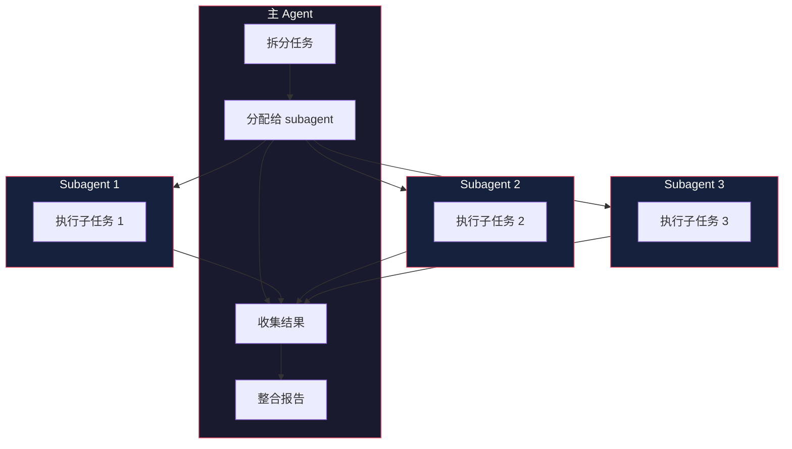

# Subagent 系统

> 基于 [deepseek-harness](https://github.com/deepseek-ai/deepseek-harness) 源码分析。

## 生活比喻：项目经理分配任务

项目经理（主 agent）接到一个大任务：

1. **拆分任务**——把大任务拆成小任务
2. **分配给组员**——每个组员（subagent）负责一块
3. **收集结果**——等组员完成后汇总
4. **整合报告**——把各部分结果整合成最终输出

Subagent 系统就是这个管理模式——主 agent 可以创建子 agent 来处理子任务。

## 核心概念

### Subagent 接口

```typescript
interface SubagentProvider {
  // 创建子 agent
  create(config: SubagentConfig): Promise<Agent>

  // 执行子任务
  run(agent: Agent, task: string): Promise<SubagentResult>
}

interface SubagentConfig {
  // 子 agent 的角色
  role: string

  // 可用工具
  tools?: string[]

  // 上下文
  context?: string
}

interface SubagentResult {
  // 子 agent 的输出
  output: string

  // 执行的步骤数
  steps: number

  // 使用的 token 数
  tokens: number
}
```

### 创建 Subagent

```typescript
// 通过 ctx.subagent 创建
const subagent = await ctx.subagent.create({
  role: 'code-reviewer',
  tools: ['read_file', 'search'],
  context: 'Review the following code for bugs'
})

// 执行子任务
const result = await ctx.subagent.run(subagent, 'Review src/index.ts')
```

## 任务委派模式

### 同步委派

主 agent 等待 subagent 完成后继续：

```typescript
async function mainAgent(task: string) {
  // 拆分任务
  const subtasks = splitTask(task)

  // 顺序执行子任务
  const results = []
  for (const subtask of subtasks) {
    const result = await ctx.subagent.run(subagent, subtask)
    results.push(result)
  }

  // 整合结果
  return combineResults(results)
}
```

### 异步委派

主 agent 继续执行，subagent 在后台运行：

```typescript
async function mainAgent(task: string) {
  // 启动 subagent（不等待）
  const handle = ctx.subagent.runInBackground(subagent, task)

  // 主 agent 继续干别的
  doOtherWork()

  // 需要结果时再等待
  const result = await handle.getResult()
  return result
}
```

### 并行委派

多个 subagent 同时执行：

```typescript
async function mainAgent(task: string) {
  const subtasks = splitTask(task)

  // 并行执行所有子任务
  const results = await Promise.all(
    subtasks.map(subtask =>
      ctx.subagent.run(subagent, subtask)
    )
  )

  return combineResults(results)
}
```



## Session 隔离

每个 subagent 有自己的 session，与主 agent 隔离：

```typescript
// 主 agent 的 session
const mainSession = ctx.sessions.current

// subagent 的 session（独立）
const subSession = await ctx.subagent.create({
  role: 'helper',
  sessionId: 'sub-session-1'  // 独立的 session ID
})

// subagent 的操作记录在自己的 session 中
// 不会污染主 agent 的 session
```

隔离的好处：

- **独立历史**——subagent 的操作不影响主 agent 的上下文
- **可重放**——可以从 subagent 的 session 重放整个过程
- **可分叉**——subagent 的 session 可以分叉尝试不同方案

## 工具继承

Subagent 可以继承主 agent 的工具，也可以有自己的工具集：

```typescript
// 继承主 agent 的所有工具
const sub1 = await ctx.subagent.create({
  role: 'helper',
  inheritTools: true
})

// 只有特定工具
const sub2 = await ctx.subagent.create({
  role: 'reader',
  tools: ['read_file', 'search']  // 只有读取工具，没有写入
})
```

## 优秀代码：异步句柄

### 源码

```typescript
// 异步执行句柄（简化）
class SubagentHandle {
  private promise: Promise<SubagentResult>
  private resolve!: (result: SubagentResult) => void
  private reject!: (error: Error) => void
  private status: 'running' | 'completed' | 'failed' = 'running'

  constructor(agent: Agent, task: string) {
    this.promise = new Promise((resolve, reject) => {
      this.resolve = resolve
      this.reject = reject
    })

    // 在后台执行
    this.execute(agent, task).then(
      result => {
        this.status = 'completed'
        this.resolve(result)
      },
      error => {
        this.status = 'failed'
        this.reject(error)
      }
    )
  }

  // 获取结果（等待完成）
  async getResult(): Promise<SubagentResult> {
    return this.promise
  }

  // 检查状态
  isCompleted(): boolean {
    return this.status === 'completed'
  }

  // 取消执行
  cancel(): void {
    this.agent.abort()
  }
}
```

### 好在哪

1. **Promise 封装**——用 Promise 包装异步执行，可以 await 获取结果
2. **状态管理**——running/completed/failed 三种状态，清晰明了
3. **可取消**——提供 cancel 方法，支持中途取消

### 模式

**Future + Handle**——异步执行返回句柄，句柄可以查询状态、获取结果、取消执行。

### 骨架代码

```typescript
// 你的项目中：用同样的模式管理异步任务
class AsyncTask<T> {
  private promise: Promise<T>
  private resolve!: (value: T) => void
  private reject!: (error: Error) => void
  private _status: 'pending' | 'fulfilled' | 'rejected' = 'pending'

  constructor(executor: () => Promise<T>) {
    this.promise = new Promise((resolve, reject) => {
      this.resolve = resolve
      this.reject = reject
    })

    executor().then(
      value => {
        this._status = 'fulfilled'
        this.resolve(value)
      },
      error => {
        this._status = 'rejected'
        this.reject(error)
      }
    )
  }

  get status() { return this._status }
  async wait() { return this.promise }
}

// 使用
const task = new AsyncTask(async () => {
  await delay(1000)
  return 'done'
})

console.log(task.status)  // 'pending'
const result = await task.wait()  // 等待完成
console.log(task.status)  // 'fulfilled'
```

## 实战：代码审查 Subagent

```typescript
// 创建代码审查 subagent
const reviewer = await ctx.subagent.create({
  role: 'code-reviewer',
  tools: ['read_file', 'search', 'list_files'],
  context: `You are a code reviewer. Focus on:
- Bug detection
- Performance issues
- Security vulnerabilities
- Code style`
})

// 审查文件
const result = await ctx.subagent.run(reviewer, `
Review the file src/utils.ts for:
1. Potential bugs
2. Performance issues
3. Security concerns
`)

console.log(result.output)
// "Found 3 issues:
//  1. Line 42: Potential null reference
//  2. Line 78: O(n²) loop could be optimized
//  3. Line 105: SQL injection risk"
```

## 对比：Subagent vs 其他方案

| 维度 | dsh Subagent | LangChain Agent | AutoGen |
|------|-------------|----------------|---------|
| 创建方式 | Context 插件 | 类实例化 | 角色定义 |
| Session 隔离 | 内置 | 手动 | 内置 |
| 工具继承 | 可配置 | 全局 | 角色绑定 |
| 异步执行 | Handle 模式 | 回调 | 消息传递 |

dsh 的 Subagent 系统核心优势是**Session 隔离 + 工具继承 + Handle 模式**——每个 subagent 有独立的 session，工具可以继承或限制，异步执行返回句柄可以管理。

## 总结

Subagent 系统是 dsh 的团队协作能力——主 agent 可以创建子 agent 处理子任务，子 agent 有独立的 session 和工具集。核心设计：

- **任务委派**——同步/异步/并行三种模式
- **Session 隔离**——每个 subagent 有独立的 session
- **工具继承**——可以继承主 agent 的工具，也可以限制
- **Handle 模式**——异步执行返回句柄，可以查询状态和取消
