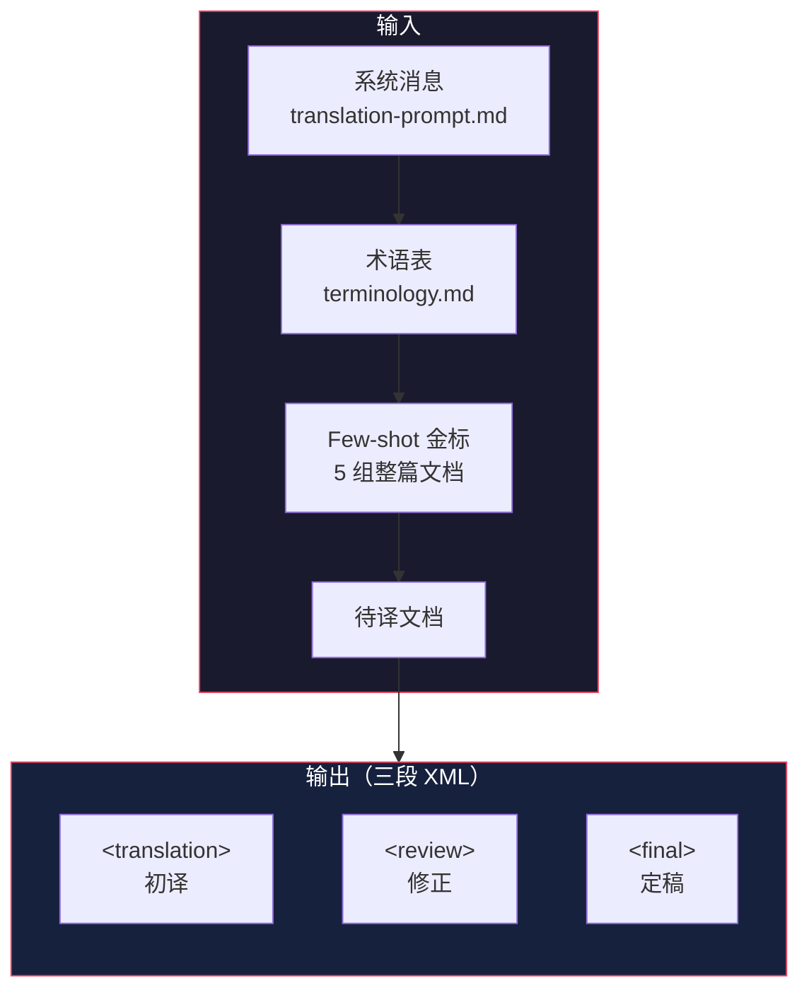

# Prompt 全集：翻译流水线的提示词工程

> 基于 [deepseek-harness](https://github.com/deepseek-ai/deepseek-harness) 源码分析。提取自 `docs/i18n/translation-prompt.md` 和 `scripts/translation-prompt.ts`。

## 概述

dsh 有一个自动化的文档翻译流水线，用于中英文档双向翻译。核心是一个精心设计的 **v4 翻译 prompt**，配合 few-shot 金标文档和术语表，实现高质量的技术文档翻译。

## Prompt 架构



## 系统消息（完整提取）

### 角色定义

```text
You are a senior technical translator specializing in LLM and agent development documentation.
Your task is to translate the complete source document from {{source_lang}} to {{target_lang}},
producing natural, professional technical prose.
```

### 核心原则

```text
Read each complete semantic unit, understand it, and restate it as a native technical author
would write it in the target language. Do not mechanically preserve source-language syntax.
Then verify the translation against the source clause by clause: preserve every proposition
and add none. Fluency never justifies losing or altering meaning, and completeness never
justifies unnatural word-for-word prose.
```

### 优先级体系（4 层）

```text
1. Preserve the source meaning and the required document structure, protected content, and formatting.
2. Follow the injected terminology table exactly.
3. Use the injected whole-document gold pairs to calibrate target-language voice and phrasing.
4. Apply the general writing guidance and illustrative examples in this prompt.

A lower-priority rule may refine but never override a higher-priority requirement.
```

**好在哪**：明确的优先级层次，避免规则冲突时的歧义。术语表 > 风格偏好，源义 > 流畅度。

### 结构保持规则

```text
- Output a complete translated document that maintains the same document frame as the source:
  heading hierarchy and order, list kinds and item counts, ordered-list starts, table rows
  and columns, link targets, and code blocks.
- Fenced code blocks must be byte-identical to the source, including info strings, whitespace,
  and ALL comments inside them. Do NOT translate or reformat any content inside code blocks.
  This is a hard rule with no exceptions.
- Inline code spans must be kept verbatim.
- Every relative link must point to the same target as in the source.
```

### 忠实度规则

```text
- Preserve every proposition in the source and add none.
- Preserve actors, objects, conditions, exceptions, negation, modality, causal relationships,
  and distinctions between concepts.
- Preserve the exact strength and orientation of contracts.
- Translate ideas rather than source-language idioms, but never use fluency as a reason
  to omit or alter meaning.
```

### 语气与风格

```text
- The translation must read as if originally written in the target language by a native
  technical author.
- Write in a professional, formal tone appropriate for developer documentation.
- Name an actor when the target language would otherwise obscure an actor.
- Prefer established target-language engineering terms over literal renderings.
- In Chinese, address the reader as 你, not 您.
```

### 中文特有规则

```text
- Use full-width Chinese punctuation in Chinese prose: ，。：；？！（）「」
- Put one half-width space between Chinese text and Latin words or numerals.
- Use enumeration commas (、) between parallel Chinese items.
- For RFC 2119 keywords (MUST, SHOULD, MAY), translate to 必须、应当、可以,
  preserve the SOURCE emphasis span exactly.
```

## 三段输出格式

```xml
<translation>
(First pass: the complete translation, written as natural target-language technical prose)
</translation>

<review>
(Second pass: actual corrections only, one correction per line with a category tag)
- [Tone] "旁挂记录" → "伴随记录"（生造词）
- [Sentence] 第 3 段补充逗号断句
- [Terminology: pending] source term → tentative rendering
- 无修正
</review>

<final>
(Complete final translation after corrections)
</final>
```

**好在哪**：

- **初译 → 修正 → 定稿**三阶段，强制模型自我审查
- `<review>` 段要求标注修正类别（Tone/Sentence/Punctuation/Terminology），结构化反馈
- `<final>` 是最终产物，流水线直接解析使用

## Few-shot 金标

流水线使用 **5 组整篇文档** 的中英对照作为 few-shot，不是句子级示例：

| 源文档 | 译文 |
|--------|------|
| `README.md` | `README.zh.md` |
| `docs/development.md` | `docs/development.zh.md` |
| `docs/i18n/README.md` | `docs/i18n/README.zh.md` |
| `docs/i18n/translation-rules.md` | `docs/i18n/translation-rules.zh.md` |
| `.agents/notes/.../*.md` | 对应 `.zh.md` |

注入方式：系统消息之后、待译文档之前，每组作为一轮示例对话。上下文不足时从后往前删减。

## 术语表

```text
{{terminology}}
```

渲染时将 `terminology.md` 整表填入。规则：

- 首次出现写"首次出现"列的值
- 后续出现只写括号前的部分
- "不要译作"列的翻译**禁止使用**
- 未收录的术语，使用目标语言的公认译法；无法确定时保留原文并标记 `[Terminology: pending]`

## 正误示例

Prompt 内嵌了 11 组正误示例，覆盖常见问题：

| 类型 | 错误 | 正确 |
|------|------|------|
| 口语动词 | 钉住 pnpm | 固定使用 pnpm |
| 长句断句 | 改动之前先读 | 在修改...之前，请先阅读 |
| 被动语态 | 被确认一致 | 一致性得到了确认 |
| 生造词 | 旁挂记录 | 伴随记录 |
| 破折号 | FIXME—— | FIXME： |
| 直译 | 不把译文和原文比较时 | 不对照原文阅读译文时 |
| 术语保留 | 类型化的服务 seam（扩展点） | 类型化的服务 seam |
| 黑话 | 进仓的 agent | 仓库内置的 agent |
| 意译 | 对于人工读者 | 面向开发者 |
| 代码注释 | 翻译代码注释 | 保持原文不翻译 |
| 语言切换 | 复制源文件切换行 | 翻转方向 |

## 流水线实现

`scripts/translation-prompt.ts` 实现了 prompt 的渲染和解析：

```typescript
// 渲染：替换占位符
function renderTranslationPrompt(document: string, input: TranslationPromptInput): string {
  const values = {
    source_lang: input.sourceLanguage,
    target_lang: targetLanguage,
    terminology: input.terminology,
  }
  return template.replace(PLACEHOLDER, (_, name) => values[name])
}

// 解析：提取三段 XML
function parseTranslationResponse(text: string): TranslationResponse {
  // 解析 <translation>, <review>, <final> 三段
  // 处理转义的 XML 标签
  // 验证顺序和完整性
}
```

## 优秀代码：三段解析器

### 源码

```typescript
function parseTranslationResponse(text: string): TranslationResponse {
  let body = text.trim()
  // 容忍 ```xml 包装
  const fenced = /^```(?:xml)?\n([\s\S]*?)\n```$/.exec(body)
  if (fenced?.[1] !== undefined) body = fenced[1].trim()

  const values: Partial<Record<Section, string>> = {}
  const lines = body.split('\n')
  let previousCloseEnd = 0

  for (const [index, section] of RESPONSE_SECTIONS.entries()) {
    const open = `<${section}>`
    const close = `</${section}>`
    // 验证每个 section 出现且只出现一次
    const openCount = lines.filter(line => line === open).length
    if (openCount !== 1) throw new Error(`duplicate or missing <${section}>`)

    // 验证顺序
    const openStart = body.search(new RegExp(`^<${section}>$`, 'm'))
    const closeStart = body.search(new RegExp(`^</${section}>$`, 'm'))
    if (closeStart < openStart) throw new Error('sections out of order')

    // 提取内容（处理转义）
    values[section] = unescapeResponseBody(body.slice(contentStart, contentEnd))
  }
  return values as TranslationResponse
}
```

### 好在哪

1. **容错设计**——容忍 ` ```xml ` 包装，不因模型多加一层 fence 而失败
2. **严格验证**——检查每个 section 出现次数、顺序、完整性
3. **转义处理**——正确处理 Markdown 中的 XML 标签转义

## 总结

dsh 的翻译 prompt 是一个精心设计的工程产物：

- **4 层优先级**——明确规则冲突时的处理顺序
- **三段输出**——初译 → 修正 → 定稿，强制自我审查
- **整篇 few-shot**——比句子级示例更能校准整体风格
- **术语表注入**——保证术语一致性
- **11 组正误示例**——覆盖常见翻译问题

这套 prompt 工程值得学习——不只是"请翻译这篇文章"，而是把翻译质量的每个维度都拆解成了可检查的规则。
