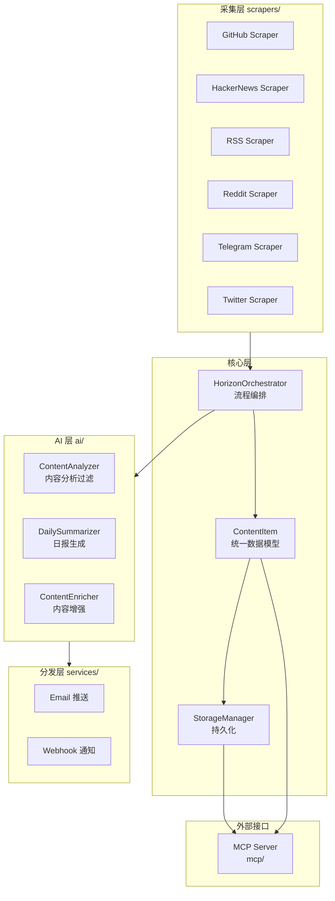

# Horizon 源码阅读（一）：架构总览——多源采集 + AI 分析 + 多渠道分发

> 基于 Horizon v0.x，源码地址 `source-read/horizon/`。

## 一句话说清楚 Horizon 是什么

Horizon 是一个 AI 驱动的信息聚合系统。从 GitHub Trending、Hacker News、RSS、Reddit、Twitter、Telegram 等十几个源采集内容，用 LLM 分析过滤、总结归类，最后通过邮件、Webhook 等渠道推送给用户。

## 整体架构



四层流水线：

1. **采集层**——多源并行抓取，每个源一个 Scraper 类
2. **核心层**——Orchestrator 编排流程，ContentItem 统一数据模型，StorageManager 持久化
3. **AI 层**——LLM 分析过滤、日报总结、内容增强
4. **分发层**——邮件 + Webhook 推送给用户

## 核心设计：统一的 ContentItem

所有数据源采集到的内容，第一步就是转成统一的 `ContentItem`：

```python
# src/models.py（简化）
@dataclass
class ContentItem:
    id: str              # 唯一标识（URL hash）
    title: str
    url: str
    source: str          # github / hackernews / rss / reddit / telegram ...
    summary: str
    content: str          # 提取出的正文
    published_at: datetime
    score: float          # 热度分数
    
    # AI 分析结果
    category: Optional[str]     # LLM 分类
    relevance_score: Optional[float]
    ai_summary: Optional[str]
    tags: List[str]
```

### 好在哪

1. **所有源一个模型**——GitHub repo、RSS 文章、推文，进来全是 `ContentItem`。下游的 AI 分析、存储、分发都不需要关心数据来源
2. **源头做标准化**——每个 Scraper 的职责是把原始数据转成 `ContentItem`，不是返回「原始 JSON」。标准化在边界完成，不污染内部
3. **AI 结果也是字段**——`category`、`ai_summary` 不是存在别处，就是 `ContentItem` 的字段。一条记录包含「原始内容 + AI 分析结果」

### 模式

**管道模式（Pipeline）**：Scraper → ContentItem → Analyzer → ContentItem（enriched） → Summarizer → 分发

### 骨架代码

```python
from dataclasses import dataclass, field
from datetime import datetime

@dataclass
class UnifiedItem:
    """你的项目中：多源数据的统一模型"""
    id: str
    title: str
    url: str
    source: str
    content: str
    created_at: datetime
    
    # AI 分析结果（可选，流程中逐步填充）
    category: Optional[str] = None
    summary: Optional[str] = None
    metadata: dict = field(default_factory=dict)
```

## 优秀代码：Orchestrator 的异步流水线

### 源码

```python
# src/orchestrator.py（简化）
class HorizonOrchestrator:
    def __init__(self, config: Config, storage: StorageManager):
        self.config = config
        self.storage = storage
        self.scrapers = self._init_scrapers()
        self.analyzer = ContentAnalyzer(config.ai)
        self.summarizer = DailySummarizer(config.ai)
    
    async def run(self, hours: int = None):
        # 第 1 步：并行采集
        items = await self._scrape_all()
        
        # 第 2 步：去重
        new_items = self.storage.filter_new(items)
        
        # 第 3 步：AI 分析（并行）
        analyzed = await self.analyzer.analyze_batch(new_items)
        
        # 第 4 步：存储
        self.storage.save_batch(analyzed)
        
        # 第 5 步：生成日报
        digest = await self.summarizer.generate_daily_digest(analyzed)
        
        # 第 6 步：分发
        await self._deliver(digest)
    
    async def _scrape_all(self) -> List[ContentItem]:
        tasks = [scraper.scrape() for scraper in self.scrapers]
        results = await asyncio.gather(*tasks, return_exceptions=True)
        
        all_items = []
        for i, result in enumerate(results):
            if isinstance(result, Exception):
                logger.error(f"Scraper {self.scrapers[i].name} failed: {result}")
            else:
                all_items.extend(result)
        return all_items
```

### 好在哪

1. **并行采集**——`asyncio.gather(*tasks)` 让 10 个源同时抓，不等任何单个源
2. **单个源挂了不影响全局**——`return_exceptions=True`，一个 Scraper 抛异常不炸掉整个流程
3. **流水线分阶段**——采集 → 去重 → 分析 → 存储 → 日报 → 分发，每阶段独立，方便单独测试

### 骨架代码

```python
import asyncio

async def parallel_fetch(fetchers: list, on_error=print):
    """你的项目中：并行调多个外部 API，单点失败不传播"""
    tasks = [f() for f in fetchers]
    results = await asyncio.gather(*tasks, return_exceptions=True)
    
    items = []
    for fetcher, result in zip(fetchers, results):
        if isinstance(result, Exception):
            on_error(f"{fetcher.__name__}: {result}")
        else:
            items.extend(result)
    return items
```

## 小结

Horizon 的三个核心设计：

1. **统一数据模型**——所有源在边界处转为 `ContentItem`，下游不关心来源
2. **异步并行流水线**——采集 → 分析 → 分发，每阶段并行，单点失败不传播
3. **AI 分析结果内嵌**——不另建表，`category`、`ai_summary` 就是 `ContentItem` 的字段

---

**下一篇：** [多源采集系统](02-scrapers.md)
**返回：** [源码阅读](../index.md)
