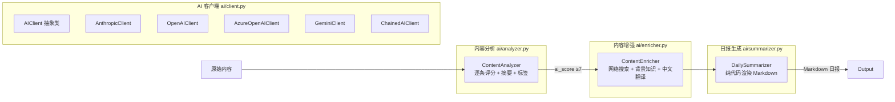

# Horizon 源码阅读（三）：AI 分析层——多 Provider 抽象 + 内容分析 + 日报生成

> 基于 Horizon v0.x，源码地址 `source-read/horizon/`。

## 整体架构

Horizon 的 AI 层由四个模块组成，形成一条从原始内容到最终日报的处理链路：



## 核心设计一：多 Provider 抽象

### 源码

```python
# src/ai/client.py
class AIClient(ABC):
    """所有 AI 客户端的抽象基类。"""

    @abstractmethod
    async def complete(
        self,
        system: str,
        user: str,
        temperature: float | None = None,
        max_tokens: int | None = None,
    ) -> str:
        """统一的完成接口：system prompt + user message → 文本响应。"""
        pass
```

Horizon 通过一个 `AIClient` 抽象类和两个工厂函数，支持 8 个 AI 提供商的自由切换：

| 客户端类 | 支持的 Provider |
|---------|---------------|
| `AnthropicClient` | Anthropic (Claude)、MiniMax（Anthropic 兼容模式） |
| `OpenAIClient` | OpenAI、阿里通义千问、豆包、MiniMax、DeepSeek、Ollama |
| `AzureOpenAIClient` | Azure OpenAI |
| `GeminiClient` | Google Gemini |

### `complete` 方法：统一接口的通用性

虽然 AI 提供商的 SDK 各不相同，但它们的核心功能是一致的：接收 system prompt 和 user message，返回文本。Horizon 抽象出来的 `complete(system, user) → str` 刚好就是这个「最小公共接口」。

```python
# AnthropicClient 的实现
async def complete(self, system, user, temperature=None, max_tokens=None):
    message = await self.client.messages.create(
        model=self.model,
        max_tokens=max_tokens,
        temperature=temperature,
        system=system,
        messages=[{"role": "user", "content": user}]
    )
    return message.content[0].text

# OpenAIClient 的实现
async def complete(self, system, user, temperature=None, max_tokens=None):
    response = await self.client.chat.completions.create(
        model=self.model,
        messages=[
            {"role": "system", "content": system},
            {"role": "user", "content": user},
        ],
        temperature=temperature,
        max_tokens=max_tokens,
    )
    return response.choices[0].message.content
```

### ChainedAIClient：自动故障转移

Horizon 的一个重要设计是支持 Provider Chain。你可以配 `provider_chain: "anthropic,openai,deepseek"`，这样当 Anthropic 的 API 返回 429（限流）或 5xx（服务不可用）时，自动 fallback 到备选 Provider。

```python
class ChainedAIClient(AIClient):
    """链式客户端：主 Provider 失败时自动 fallback。"""

    async def complete(self, system, user, temperature=None, max_tokens=None):
        for i in range(len(self.configs)):
            try:
                client = self._get_client(i)
                result = await client.complete(...)
                if result and result.strip():
                    return result
            except Exception as exc:
                if not self._should_fallback(exc):
                    raise  # 不可重试的错误直接抛出
                # 记录日志，尝试下一个 Provider
        raise RuntimeError("All providers failed")

    @staticmethod
    def _should_fallback(exc: Exception) -> bool:
        msg = str(exc).lower()
        if "429" in msg or "rate limit" in msg:
            return True
        if "401" in msg or "403" in msg or "quota" in msg or "exceeded" in msg:
            return True
        if "502" in msg or "503" in msg or "service unavailable" in msg:
            return True
        if "empty response" in msg:
            return True
        return False
```

### 好在哪

1. **Provider 切换不改代码**——从 Anthropic 切换到 DeepSeek，只需改配置文件中的 `provider` 字段，不需要改一行 Python 代码
2. **故障转移**——`provider_chain` 让系统有备用方案。如果主力 Provider 被限流，自动切换到备选，保证任务完成
3. **客户端惰性创建**——`ChainedAIClient` 在构造函数中不创建所有下游 Provider 的客户端，而是使用时才创建。这意味着即使你没配 DeepSeek 的 API Key，只要不走到那个 fallback，就不会报错

### 模式：抽象工厂 + 策略模式

```python
# 工厂函数
def create_ai_client(config: AIConfig) -> AIClient:
    if config.provider_chain:
        return _create_chained_client(config)   # ChainedAIClient
    return _create_single_client(config)         # 单个 Provider Client
```

这用的是**抽象工厂模式**：根据配置的类型（单 Provider / Provider Chain），工厂函数返回不同的 `AIClient` 实现。调用方不用关心返回的是哪个实现，只用 `complete()` 即可。

### 骨架代码：多 Provider 抽象

```python
from abc import ABC, abstractmethod

class LLMClient(ABC):
    """你的项目中：多 LLM Provider 抽象"""

    @abstractmethod
    async def complete(self, system: str, user: str) -> str:
        pass

class OpenAIClient(LLMClient):
    async def complete(self, system, user) -> str:
        # ... openai SDK 调用 ...

class ClaudeClient(LLMClient):
    async def complete(self, system, user) -> str:
        # ... anthropic SDK 调用 ...

def create_llm_client(config) -> LLMClient:
    if config.provider == "openai":
        return OpenAIClient(config)
    elif config.provider == "claude":
        return ClaudeClient(config)
    # ...
```

## 核心设计二：ContentAnalyzer——AI 分析和评分

### 源码

```python
# src/ai/analyzer.py（核心逻辑简化）
class ContentAnalyzer:
    def __init__(self, ai_client: AIClient):
        self.client = ai_client

    async def analyze_batch(self, items: List[ContentItem]) -> List[ContentItem]:
        semaphore = asyncio.Semaphore(concurrency)

        async def _process(item, index, task):
            async with semaphore:
                try:
                    await self._analyze_item(item)
                except Exception:
                    item.ai_score = 0.0
                    item.ai_reason = "Analysis failed"
                if throttle_sec > 0:
                    await asyncio.sleep(throttle_sec)
            return item

        coros = [_process(item, i) for i, item in enumerate(items)]
        analyzed = await asyncio.gather(*coros)
        return analyzed

    @retry(stop=stop_after_attempt(3), wait=wait_exponential(min=2, max=10))
    async def _analyze_item(self, item):
        response = await self.client.complete(
            system=CONTENT_ANALYSIS_SYSTEM,
            user=CONTENT_ANALYSIS_USER.format(
                title=item.title,
                source=item.source_type.value,
                author=item.author or "Unknown",
                url=str(item.url),
                content_section=content_section,
                discussion_section=discussion_section,
            ),
        )
        parsed = parse_json_response(response)
        result = AnalysisResult.model_validate(parsed)

        item.ai_score = result.score   # 0-10 重要性评分
        item.ai_reason = result.reason  # 评分理由
        item.ai_summary = result.summary  # 一句话摘要
        item.ai_tags = result.tags        # 标签
```

### 好在哪

1. **并发控制**——`Semaphore` 和 `analysis_concurrency` 配置项控制同时进行的分析数量，防止把 AI API 打爆
2. **自动重试**——`@retry` 装饰器，指数退避，网络抖动自动恢复
3. **单条失败不耽误全局**——catch Exception 后给默认值（`score=0`），继续处理其他条目
4. **Rate limiting**——`throttle_sec` 配置项控制请求间隔，应对某些 Provider 的 QPS 限制

## 核心设计三：ContentEnricher——第二遍 AI 分析

第二遍分析只针对高评分条目（`ai_score >= 7`），做更深度的处理：

```python
# src/ai/enricher.py（核心逻辑简化）
class ContentEnricher:
    async def _enrich_item(self, item):
        # Step 1：AI 识别需要解释的概念
        queries = await self._extract_concepts(item, content_text)
        # e.g., ["CXL memory pooling", "NUMA-aware scheduling"]

        # Step 2：DuckDuckGo 搜索这些概念
        web_context = ""
        for query in queries:
            results = await self._web_search(query)
            web_context += format_results(query, results)

        # Step 3：AI 基于搜索生成中英文双语背景知识
        response = await self.client.complete(
            system=CONTENT_ENRICHMENT_SYSTEM,
            user=CONTENT_ENRICHMENT_USER.format(
                title=item.title,
                content=content_text,
                web_context=web_context,
            ),
        )

        # 解析结果，填充到 item.metadata 中
        item.metadata["title_zh"] = result["title_zh"]
        item.metadata["background_en"] = result["background_en"]
        item.metadata["background_zh"] = result["background_zh"]
        # ...
```

### 好在哪

1. **「AI 识别 → 搜索 → AI 归纳」三步骤**——不是把整个文章扔给 AI 让它凭训练知识回答，而是先让 AI 识别「有哪些我不懂的概念」，再去搜索实时信息，最后让 AI 基于搜索结果生成背景知识。结果更准确、更新、有来源可查。

2. **双语输出**——每条内容都生成中英双语的标题、摘要、背景知识，日报可以在中英文之间一键切换。

3. **降级策略**——当完整增强失败时（如 JSON 解析失败），fallback 到纯翻译模式，至少保证中文用户能看到中文标题和摘要。

### 骨架代码：AI 增强管线

```python
async def enrich_with_web_search(title: str, content: str, llm_client):
    """AI + 网络搜索结合的内容增强。"""
    # 1. AI 提取需要搜索的概念
    concepts = await llm_client.complete(
        "identify 1-3 search queries for concepts...",
        f"Title: {title}\nContent: {content}",
    )
    # 2. 搜索
    web_results = []
    for q in json.loads(concepts).get("queries", []):
        web_results.extend(await web_search(q))

    # 3. AI 归纳
    enriched = await llm_client.complete(
        "generate background knowledge...",
        f"Content: {content}\nSearch: {web_results}",
    )
    return enriched
```

## 核心设计四：DailySummarizer——纯代码生成日报

与其他模块不同，`DailySummarizer` **完全不调用 AI API**。它的日报生成是纯代码驱动的 Markdown 渲染：

```python
# src/ai/summarizer.py（精简）
class DailySummarizer:
    async def generate_summary(self, items, date, total_fetched, language="en"):
        labels = LABELS.get(language, LABELS["en"])
        if not items:
            return self._generate_empty_summary(date, total_fetched, labels)

        header = f"# {labels['header']} - {date}\n\n" + "..."
        toc = self._generate_toc(items, language)
        body = "".join(self._format_item(item, labels, language, i) for i, item in enumerate(items))
        return header + toc + body
```

### 好在哪

1. **不浪费 token 在排版上**——日报的格式是固定的 Markdown 模板，完全用字符串拼接生成。把 token 花在「写什么」而不是「怎么排版」上。
2. **双语标签系统**——中英文的标题、提示语通过 `LABELS` 字典管理，扩展新语言只需新增一组 label。
3. **Pangu 间隔**——中文和英文之间自动插空格（`_pangu` 函数），排版细节到位。
4. **安全输出**——`_escape_markdown` 和 `_safe_url` 确保用户内容不会破坏 Markdown 结构或造成注入风险。

### 骨架代码：Markdown 日报生成

```python
from datetime import datetime

class DailyReport:
    """纯代码生成日报，不浪费 token 在排版上。"""

    LABELS = {
        "en": {"header": "Daily Report", "source": "Source"},
        "zh": {"header": "每日快报", "source": "来源"},
    }

    def generate(self, items, date, lang="zh"):
        labels = self.LABELS.get(lang, self.LABELS["en"])
        header = f"# {labels['header']} - {date}\n\n"
        body = "\n\n".join(self._format_item(i, labels, lang) for i in items)
        return header + body

    def _format_item(self, item, labels, lang):
        return f"## {item.title}\n\n{item.summary}\n\n---"
```

## 小结

1. **多 Provider 抽象**——`AIClient` 统一 8 个 AI 提供商，`ChainedAIClient` 支持自动故障转移，Provider 切换不改代码
2. **两阶段 AI 管线**——第一遍批量分析评分 + 打标签，第二遍只对高分内容做深度增强（背景搜索 + 双语翻译）
3. **纯代码生成日报**——`DailySummarizer` 不调用 AI，减少 token 消耗，中英文一键切换

---

**上一篇：** [多源采集系统](02-scrapers.md)
**下一篇：** [MCP Server 与存储层](04-mcp-storage.md)
