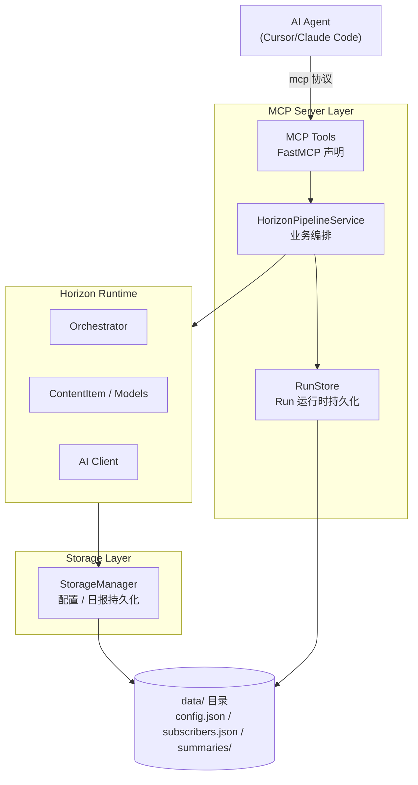

# Horizon 源码阅读（四）：MCP Server 与存储层——让 AI Agent 查你的知识库

> 基于 Horizon v0.x，源码地址 `source-read/horizon/`。

## 为什么需要 MCP Server

Horizon 的本地运行模式（`horizon run`）是一条流水线：采集 → 分析 → 生成日报 → 推送。这是典型的「一次性批处理」模式。

但如果你想让 Cursor、Claude Code 这些 AI Agent 工具能直接查询你的 Horizon 知识库呢？比如：

- 「上周有什么重要的 Rust 相关讨论？」
- 「我记不记得有一篇关于 CXL 内存池的文章？」
- 「把昨天的日报调出来给我看看」

这就需要 MCP（Model Context Protocol）Server。它把 Horizon 的 pipeline 以分阶段（stage）的方式暴露出来，让 AI Agent 可以逐步调用、随时查询中间结果。

## 整体架构



## 核心设计一：分阶段 Pipeline

不同于全部自动化的一条龙运行，MCP Server 把 Pipeline 拆成了 5 个独立阶段，每个阶段对应一个 MCP Tool：

| Tool | 阶段 | 输入 | 输出 |
|------|------|------|------|
| `hz_fetch_items` | 采集 | hours | raw_items (去重后) |
| `hz_score_items` | 评分 | run_id, source_stage | scored_items |
| `hz_filter_items` | 过滤 | run_id, threshold | filtered_items |
| `hz_enrich_items` | 增强 | run_id, source_stage | enriched_items |
| `hz_generate_summary` | 总结 | run_id, language | Markdown 日报 |

此外还有一个一站式接口：

| Tool | 说明 |
|------|------|
| `hz_run_pipeline` | 一步完成全流程 |

### 源码

```python
# src/mcp/server.py（精简）
from mcp.server.fastmcp import FastMCP

mcp = FastMCP(name="horizon-mcp")
service = HorizonPipelineService()

@mcp.tool()
async def hz_fetch_items(
    hours: int = 24,
    run_id: str | None = None,
    sources: list[str] | None = None,
) -> dict:
    """采集并去重内容到 raw 阶段。"""
    return await _run_tool("hz_fetch_items", lambda:
        service.fetch_items(hours=hours, run_id=run_id, sources=sources))

@mcp.tool()
async def hz_score_items(
    run_id: str,
    source_stage: str = "raw",
) -> dict:
    """评分一个阶段产生 scored 阶段。"""
    return await _run_tool("hz_score_items", lambda:
        service.score_items(run_id=run_id, source_stage=source_stage))

@mcp.tool()
async def hz_run_pipeline(
    hours: int = 24,
    languages: list[str] | None = None,
    enrich: bool = True,
    topic_dedup: bool = True,
) -> dict:
    """一站式：采集 → 评分 → 过滤 → 增强 → 总结。"""
    return await _run_tool("hz_run_pipeline", lambda:
        service.run_pipeline(hours=hours, languages=languages,
                             enrich=enrich, topic_dedup=topic_dedup))
```

### 好在哪

1. **分阶段可组合**——AI Agent 可以先调用 `hz_fetch_items` 看看采集到了什么，不满意就调参数再来一次，满意了再 `hz_score_items`。每一步的结果都是可见的，不是黑盒。

2. **查询类工具不修改状态**——`hz_list_runs`、`hz_get_run_stage`、`hz_get_run_summary` 只是读取已有数据，AI Agent 可以随时查历史数据。

3. **快照语义**——每个阶段的结果保存为独立的 JSON 文件（`raw_items.json`、`scored_items.json` 等），方便回溯和调试。

## 核心设计二：RunStore——中间结果的持久化

Pipeline 的中间结果保存在 `data/mcp-runs/{run_id}/` 目录下：

```
data/mcp-runs/
├── run-20250115T120000Z-a1b2c3d4/
│   ├── meta.json          # Run 元数据（配置、统计、时间线）
│   ├── raw_items.json     # 原始采集结果（去重后）
│   ├── scored_items.json  # AI 评分后
│   ├── filtered_items.json # 过滤后
│   ├── enriched_items.json # 增强后
│   └── summary-zh.md      # 中文日报
│   └── summary-en.md      # 英文日报
```

```python
# src/mcp/run_store.py（核心逻辑）
STAGES = {
    "raw": "raw_items.json",
    "scored": "scored_items.json",
    "filtered": "filtered_items.json",
    "enriched": "enriched_items.json",
}

class RunStore:
    def __init__(self, root: Path):
        self.root = root
        root.mkdir(parents=True, exist_ok=True)

    def create_run(self, run_id: str | None = None) -> str:
        run_id = run_id or f"run-{now}-{uuid4().hex[:8]}"
        run_dir = self.root / run_id
        run_dir.mkdir(parents=True, exist_ok=True)
        return run_id

    def save_items(self, run_id, stage, items):
        """持久化某个阶段的数据。"""
        path = self.run_dir(run_id) / STAGES[stage]
        _atomic_write_text(path, json.dumps(items))

    def load_items(self, run_id, stage):
        """加载某个阶段的数据。"""
        path = self.run_dir(run_id) / STAGES[stage]
        return json.loads(path.read_text(encoding="utf-8"))

    def update_meta(self, run_id, updates):
        """追加元数据（统计、配置等信息）。"""
        meta = self.read_json(run_id, "meta.json")
        meta.update(updates)
        self.write_json(run_id, "meta.json", meta)
        return meta
```

### 好在哪

1. **文件即数据库**——不需要外部的 PostgreSQL 或 Redis，直接存 JSON 文件。对于个人知识库场景，这个选择完全够用，而且降低了运维负担。

2. **原子写入**——`_atomic_write_text` 确保写入不会因为崩溃而损坏数据（先写入临时文件，再 rename）。

3. **路径安全**——`_run_path` 用 `path.is_relative_to(root)` 检查，防止 `run_id` 包含 `../` 逃逸到目录外。

4. **Run ID 格式可读**——`run-{日期}-{uuid 短后缀}` 格式，按创建时间降序排列，一目了然。

## 核心设计三：统一的返回格式

每个 MCP Tool 的返回值采用统一的 `_ok`/`_err` 格式：

```python
# src/mcp/server.py
def _ok(tool: str, data: dict, duration_ms: float | None = None) -> dict:
    return {
        "ok": True,
        "tool": tool,
        "data": data,
        "meta": {
            "timestamp": datetime.now(timezone.utc).isoformat(),
            "duration_ms": round(duration_ms, 2) if duration_ms else None,
        },
    }

def _err(tool: str, error: Exception, duration_ms: float | None = None) -> dict:
    if isinstance(error, HorizonMcpError):
        code = error.code
        message = error.message
    else:
        code = "HZ_INTERNAL_ERROR"
        message = str(error)

    return {
        "ok": False,
        "tool": tool,
        "error": {"code": code, "message": message},
        "meta": {"timestamp": datetime.now(timezone.utc).isoformat()},
    }
```

### 好在哪

1. **AI Agent 友好**——统一格式意味着 AI Agent 不需要针对每个工具写不同的错误处理逻辑。检查 `ok` 字段就知道是否成功。

2. **错误码 + 错误信息**——`HorizonMcpError` 有 `code`、`message`、`details` 三个字段，结构化的错误信息让 AI Agent 可以做出区分响应（例如 `HZ_STAGE_NOT_FOUND` → 提醒用户先跑 `hz_fetch_items`）。

3. **自动埋点**——`_record_metrics` 自动记录每次调用的成功/失败次数、耗时、错误码分布。`hz_get_metrics` 可以查看健康状态。

### 骨架代码：MCP Tool 骨架

```python
from mcp.server.fastmcp import FastMCP

mcp = FastMCP("my-mcp-server")

@mcp.tool()
async def my_tool(param: str = "default") -> dict:
    """工具描述（AI Agent 会读到这段 docstring 来理解工具用途）。"""
    try:
        data = await do_work(param)
        return {"ok": True, "data": data}
    except Exception as e:
        return {"ok": False, "error": str(e)}

@mcp.resource("my://resource")
def my_resource() -> dict:
    """资源描述。"""
    return {"data": "static info"}

if __name__ == "__main__":
    mcp.run()
```

## 核心设计四：Resources——可读的知识库接口

除了 Tools，Horizon 还暴露了一批 MCP Resources，让 AI Agent 可以直接读取数据：

| Resource | 内容 |
|---------|------|
| `horizon://server/info` | 服务器元信息 |
| `horizon://metrics` | 调用指标 |
| `horizon://runs` | 最近 Run 列表 |
| `horizon://runs/{run_id}/meta` | 特定 Run 的元数据 |
| `horizon://runs/{run_id}/items/{stage}` | 特定阶段的数据 |
| `horizon://runs/{run_id}/summary/{language}` | 特定语言的日报 |
| `horizon://config/effective` | 生效的配置 |

```python
@mcp.resource("horizon://runs/{run_id}/items/{stage}")
def r_run_items(run_id: str, stage: str) -> dict:
    return _resource_result(
        f"horizon://runs/{run_id}/items/{stage}",
        lambda: service.get_run_stage(run_id=run_id, stage=stage),
    )
```

### 好在哪

Resources 和 Tools 的区别：**Tools 做事情，Resources 读数据**。AI Agent 可以先通过 Resources 浏览知识库的内容和状态，再决定调用哪个 Tool。这个过程不需要「运行」任何东西，只是读文件。

## 核心设计五：StorageManager——日常存储

`StorageManager` 管的是非 Pipeline 的持久化——配置、订阅者、日报文件：

```python
# src/storage/manager.py（精简）
class StorageManager:
    def __init__(self, data_dir: str = "data"):
        self.data_dir = Path(data_dir)
        self.config_path = self.data_dir / "config.json"
        self.summaries_dir = self.data_dir / "summaries"
        self.summaries_dir.mkdir(parents=True, exist_ok=True)

    def load_config(self) -> Config:
        with open(self.config_path, "r") as f:
            data = json.load(f)
        data = _expand_env_vars(data)  # ${VAR} 注入
        return Config.model_validate(data)

    def save_daily_summary(self, date, markdown, language="en") -> Path:
        path = self.summaries_dir / f"horizon-{date}-{language}.md"
        _atomic_write_text(path, markdown)
        return path
```

### 环境变量注入

```python
_ENV_VAR_PATTERN = re.compile(r"\$\{([A-Za-z_][A-Za-z0-9_]*)\}")

def _expand_env_vars(value):
    """递归展开 JSON 中所有字符串的 ${VAR} 引用。"""
    if isinstance(value, str):
        return _ENV_VAR_PATTERN.sub(
            lambda m: os.environ.get(m.group(1), m.group(0)), value,
        )
    if isinstance(value, dict):
        return {k: _expand_env_vars(v) for k, v in value.items()}
    if isinstance(value, list):
        return [_expand_env_vars(v) for v in value]
    return value
```

这个设计非常实用：AI 的 `base_url`、RSS feed 的 token、webhook 的 URL——这些需要环境变量注入的地方，统一用 `${VAR}` 语法，在 `load_config` 时一次性展开。配置文件本身可以不包含任何敏感信息，可以安全地提交到 GitHub。

## 整体设计权衡

**为什么 MCP 层要重新实现一遍 pipeline 逻辑，而不是直接复用 `Orchestrator.run()`？**

因为使用场景不同：

| 场景 | 本地运行 | MCP Server |
|------|---------|------------|
| 调用方 | 终端用户（cron） | AI Agent |
| 执行模式 | 全自动一条龙 | 分阶段可组合 |
| 中间结果 | 不保留 | 作为 Run 持久化 |
| 交互模式 | 等待完成 | 逐步推进，随时查询 |

Horizon 的做法是：`Orchestrator` 中的核心方法（`fetch_all_sources`、`merge_cross_source_duplicates`、`filter_items`）加了 `This is a stable stage helper for MCP` 的注释，MCP Service 层调用这些核心方法，再在外面包一层 Run 的生命周期管理。

## 小结

1. **MCP Server**——把 Horizon Pipeline 拆成 5 个独立 Tool + 1 个一站式接口，AI Agent 可以逐步调用、随时查询中间结果
2. **RunStore**——每个 Run 的中间结果以 JSON 文件形式持久化，文件即数据库，零运维
3. **StorageManager**——统一管理配置、日报、订阅者，`${VAR}` 环境变量注入确保配置文件可提交到 GitHub
4. **统一返回格式**——`_ok`/`_err` + 错误码 + 自动埋点，对 AI Agent 友好

---

**上一篇：** [AI 分析层](03-ai-layer.md)
**返回：** [源码阅读](../index.md)
