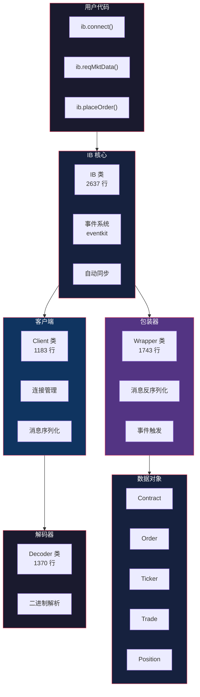

# ib_async 架构全景

> 基于 [ib_async](https://github.com/ib-api-reloaded/ib_async) 源码分析。Python 3.10+，基于 asyncio + eventkit。

## 一句话概括

ib_async 是 Interactive Brokers (IBKR) 的 Python 异步客户端库，用 asyncio 事件循环替代了官方 ibapi 的回调地狱，用 eventkit 实现了事件驱动的自动同步。

## 整体架构



## 核心模块

| 模块 | 行数 | 职责 |
|------|------|------|
| `ib.py` | 2637 | 核心 API，事件系统，自动同步 |
| `wrapper.py` | 1743 | IBKR API 回调处理，事件触发 |
| `decoder.py` | 1370 | 二进制消息解码 |
| `client.py` | 1183 | TCP 连接，消息序列化和发送 |
| `util.py` | 615 | 工具函数（模糊匹配、调度等） |
| `contract.py` | 651 | 合约定义（股票、期权、期货等） |
| `objects.py` | 594 | 数据对象（Trade、Position、Ticker 等） |
| `order.py` | 556 | 订单类型定义 |
| `ticker.py` | 503 | 实时行情数据 |

## 数据流

```mermaid
flowchart LR
    subgraph TWS["TWS/Gateway"]
        T1["IBKR 服务器"]
    end

    subgraph Client["Client"]
        C1["socket 读取"]
        C2["消息拆包"]
    end

    subgraph Decoder["Decoder"]
        D1["二进制解析"]
        D2["对象构造"]
    end

    subgraph Wrapper["Wrapper"]
        W1["回调分发"]
        W2["状态更新"]
    end

    subgraph IB["IB"]
        I1["事件触发"]
        I2["自动同步"]
    end

    TWS -->|TCP| Client --> Decoder --> Wrapper --> IB

    style TWS fill:#1a1a2e,stroke:#e94560,color:#fff
    style Client fill:#16213e,stroke:#e94560,color:#fff
    style Decoder fill:#0f3460,stroke:#e94560,color:#fff
    style Wrapper fill:#533483,stroke:#e94560,color:#fff
    style IB fill:#1a1a2e,stroke:#e94560,color:#fff
```



## 核心设计：事件驱动 + 自动同步

ib_async 的核心创新是**自动同步**——IB 类内部维护所有状态（订单、持仓、账户数据），通过事件系统通知用户代码：

```python
# 连接后自动同步所有订单和持仓
ib.connect('127.0.0.1', 7497)

# 状态已经同步好了，直接访问
positions = ib.positions()      # 当前持仓
orders = ib.openOrders()        # 未成交订单
account = ib.accountSummary()   # 账户摘要

# 事件驱动：新订单时触发
ib.orderEvent += lambda trade: print(f'订单更新: {trade}')

# 事件驱动：新行情时触发
ib.pendingTickersEvent += lambda tickers: print(f'行情更新: {tickers}')
```

## 事件系统（eventkit）

ib_async 使用 eventkit 库实现事件系统，每个事件是一个 `Event` 对象，支持 `+=` 订阅：

```python
# 事件列表
ib.connectedEvent          # 连接成功
ib.disconnectedEvent       # 断开连接
ib.orderEvent              # 订单状态变化
ib.pendingTickersEvent     # 行情更新
ib.positionEvent           # 持仓变化
ib.accountValueEvent       # 账户值变化
ib.errorEvent              # 错误
```

## 优秀代码：IB 类的核心循环

### 源码

```python
# ib.py（简化）
class IB:
    def __init__(self):
        self.events = Event.Group(
            connectedEvent=Event(),
            disconnectedEvent=Event(),
            orderEvent=Event(),
            pendingTickersEvent=Event(),
            # ...
        )
        self._client = Client()
        self._wrapper = Wrapper(self)

    def connect(self, host, port, clientId=1):
        self._client.connect(host, port, clientId)
        # 连接后自动同步
        self._client.reqCurrentTime()
        self._client.reqOpenOrders()
        self._client.reqPositions()
        self._client.reqAccountUpdates()

    def reqMktData(self, contract, genericTickList=''):
        # 请求行情，返回 Ticker 对象
        ticker = self._wrapper.startTicker(contract)
        self._client.reqMktData(contract, genericTickList)
        return ticker

    def placeOrder(self, contract, order):
        # 下单，返回 Trade 对象
        trade = self._wrapper.startTrade(contract, order)
        self._client.placeOrder(trade.order.orderId, contract, order)
        return trade
```

### 好在哪

1. **事件驱动**——所有状态变化通过事件通知，不需要轮询
2. **自动同步**——连接后自动拉取所有状态，用户直接访问
3. **返回对象**——`reqMktData` 返回 Ticker，`placeOrder` 返回 Trade，状态自动更新

### 模式

**Observer + Facade**——事件系统是 Observer，IB 类是 Facade，隐藏了 Client/Wrapper/Decoder 的复杂性。

### 骨架代码

```python
# 你的项目中：用同样的模式封装异步 API
class AsyncClient:
    def __init__(self):
        self.events = Event.Group(
            connected=Event(),
            data=Event(),
            error=Event(),
        )
        self._state = {}

    async def connect(self, url):
        await self._ws.connect(url)
        self.events.connected.emit()
        # 连接后自动同步状态
        await self._sync_state()

    def on(self, event_name, callback):
        getattr(self.events, event_name) += callback

    async def _sync_state(self):
        # 拉取初始状态
        data = await self._ws.request('get_state')
        self._state.update(data)
        self.events.data.emit(data)
```

## 连接管理

```python
# 基本连接
ib.connect('127.0.0.1', 7497, clientId=1)

# 断线重连
ib.connect('127.0.0.1', 7497, clientId=1, timeout=60)

# 断开
ib.disconnect()

# 检查连接状态
if ib.isConnected():
    print('已连接')
```

## 总结

ib_async 的架构核心是 **事件驱动 + 自动同步**：

- **IB 类**是 Facade，隐藏了 Client/Wrapper/Decoder 的复杂性
- **eventkit** 实现事件系统，支持 `+=` 订阅
- **自动同步**——连接后自动拉取所有状态，用户直接访问
- **返回对象**——API 调用返回可观察对象，状态自动更新

这和官方 ibapi 的回调风格完全不同——ib_async 让你写同步风格的代码，底层却是异步的。
