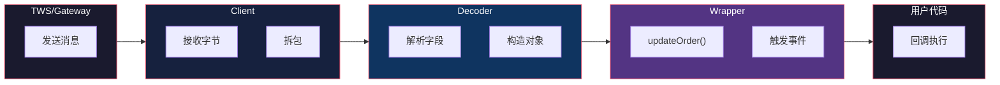

# 事件系统：eventkit 驱动的自动同步

> 基于 [ib_async](https://github.com/ib-api-reloaded/ib_async) 源码分析。

## 生活比喻：快递柜的短信通知

你不需要每隔 5 分钟去快递柜看有没有新快递——快递到了，短信自动发给你。ib_async 的事件系统就是这个"短信通知"——状态变化时自动触发回调，不需要轮询。

## eventkit 基础

ib_async 使用 [eventkit](https://github.com/erdewit/eventkit) 库实现事件系统。核心是 `Event` 类：

```python
from eventkit import Event

# 创建事件
event = Event()

# 订阅（+= 语法）
event += lambda data: print(f'收到: {data}')

# 触发
event.emit('hello')  # 输出: 收到: hello
```

## IB 类的事件

IB 类定义了所有事件：

```python
class IB:
    events = Event.Group(
        connectedEvent=Event(),       # 连接成功
        disconnectedEvent=Event(),    # 断开连接
        orderEvent=Event(),           # 订单状态变化
        pendingTickersEvent=Event(),  # 行情更新
        positionEvent=Event(),        # 持仓变化
        accountValueEvent=Event(),    # 账户值变化
        accountSummaryEvent=Event(),  # 账户摘要
        errorEvent=Event(),           # 错误
        # ... 更多事件
    )
```

## 订阅方式

```python
# 方式一：+= 语法
ib.orderEvent += my_handler

# 方式二：装饰器
@ib.orderEvent
def on_order(trade):
    print(f'订单更新: {trade}')

# 方式三：lambda
ib.orderEvent += lambda trade: print(trade)

# 取消订阅
ib.orderEvent -= my_handler
```

## 事件触发流程



## Wrapper 的回调处理

Wrapper 类实现了 IBKR API 的所有回调接口，每个回调内部触发对应的事件：

```python
# wrapper.py（简化）
class Wrapper:
    def orderStatus(self, orderId, status, filled, remaining, ...):
        # 1. 更新内部状态
        trade = self.trades[orderId]
        trade.orderStatus = OrderStatus(status, filled, remaining)

        # 2. 触发事件
        self.ib.orderEvent.emit(trade)

    def tickPrice(self, reqId, tickType, price, ...):
        # 1. 更新 Ticker
        ticker = self.tickers[reqId]
        ticker.prices[tickType] = price

        # 2. 触发行情事件
        self.ib.pendingTickersEvent.emit(ticker)

    def position(self, account, contract, position, avgCost):
        # 1. 更新持仓
        pos = Position(account, contract, position, avgCost)
        self.positions[(account, contract)] = pos

        # 2. 触发持仓事件
        self.ib.positionEvent.emit(pos)
```

## 自动同步机制

连接后，IB 类自动请求同步所有状态：

```python
def connect(self, host, port, clientId=1):
    # 建立 TCP 连接
    self._client.connect(host, port, clientId)

    # 自动请求同步
    self._client.reqCurrentTime()
    self._client.reqOpenOrders()      # 同步未成交订单
    self._client.reqPositions()       # 同步持仓
    self._client.reqAccountUpdates()  # 同步账户数据
    self._client.reqExecutions()      # 同步成交记录
```

同步过程中，TWS 会逐条发送历史数据，每条都触发对应的事件。同步完成后，所有状态都在内存中，用户直接访问。

## 实战：行情订阅

```python
# 订阅行情
ticker = ib.reqMktData(contract, '', False, False)

# 实时更新
ib.pendingTickersEvent += lambda tickers: print(
    f'{tickers[0].contract.symbol}: '
    f'bid={tickers[0].bid}, ask={tickers[0].ask}'
)

# 也可以直接访问 Ticker 对象（状态自动更新）
print(f'最新价: {ticker.last}')
print(f'买一: {ticker.bid}')
print(f'卖一: {ticker.ask}')
```

## 实战：订单监控

```python
# 下单
trade = ib.placeOrder(contract, order)

# 事件监控
ib.orderEvent += lambda t: print(
    f'订单 {t.order.orderId}: {t.orderStatus.status}'
)

# 也可以直接访问 Trade 对象（状态自动更新）
print(f'订单状态: {trade.orderStatus.status}')
print(f'已成交: {trade.orderStatus.filled}')
print(f'剩余: {trade.orderStatus.remaining}')

# 等待成交
ib.waitOnUpdate()
```

## 优秀代码：Event.Group

### 源码

```python
# eventkit 的 Event.Group（简化）
class Event:
    class Group:
        def __init__(self, **events):
            self.__dict__.update(events)

        def __setattr__(self, name, value):
            # 禁止覆盖已有事件
            if name in self.__dict__:
                raise AttributeError(f'Cannot overwrite event {name}')
            self.__dict__[name] = value
```

### 好在哪

1. **命名空间**——事件通过属性访问，`ib.orderEvent` 而非字典 key
2. **类型安全**——IDE 可以自动补全事件名
3. **不可覆盖**——防止意外覆盖已有事件

### 模式

**Observer + Event Bus**——每个事件是独立的 Observer，Group 是 Event Bus。

### 骨架代码

```python
# 你的项目中：用同样的模式实现事件系统
class EventEmitter:
    def __init__(self):
        self._handlers = {}

    def on(self, event, handler):
        if event not in self._handlers:
            self._handlers[event] = []
        self._handlers[event].append(handler)

    def emit(self, event, *args, **kwargs):
        for handler in self._handlers.get(event, []):
            handler(*args, **kwargs)

    def off(self, event, handler):
        if event in self._handlers:
            self._handlers[event].remove(handler)

# 使用
emitter = EventEmitter()
emitter.on('data', lambda d: print(d))
emitter.emit('data', 'hello')
```

## 对比：eventkit vs 其他事件库

| 维度 | eventkit | Pyee | Blinker | RxPY |
|------|----------|------|---------|------|
| 语法 | `+=` 订阅 | `on()` 订阅 | `connect()` | `subscribe()` |
| 异步支持 | 内置 | 需要扩展 | 无 | 内置 |
| 背压 | 无 | 无 | 无 | 支持 |
| Group 支持 | 内置 | 无 | 无 | 无 |
| 依赖 | 轻量 | 轻量 | 轻量 | 重 |

eventkit 的优势是**轻量 + `+=` 语法 + Group 支持**——API 简洁，适合 IBKR 这种多事件场景。

## 总结

ib_async 的事件系统是整个库的核心——所有状态变化通过事件通知，用户不需要轮询。核心设计：

- **eventkit**——轻量事件库，`+=` 语法订阅
- **Wrapper 回调**——IBKR API 回调触发事件
- **自动同步**——连接后自动拉取所有状态
- **对象状态自动更新**——Ticker/Trade/Position 的状态随事件自动更新
