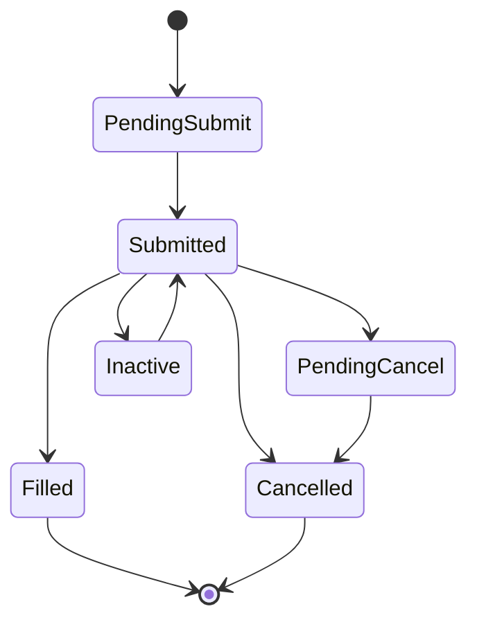

# 合约与订单系统

> 基于 [ib_async](https://github.com/ib-api-reloaded/ib_async) 源码分析。

## 生活比喻：菜市场买菜

买菜需要两样东西：

- **买什么**（Contract）——白菜、猪肉、鸡蛋，每种商品有不同的规格
- **怎么买**（Order）——买多少、什么价格、什么时间

ib_async 的合约和订单系统就是这个逻辑——Contract 定义"交易什么"，Order 定义"怎么交易"。

## Contract：合约定义

Contract 描述一个可交易的金融工具：

```python
from ib_async import Contract, Stock, Forex, Future, Option

# 股票
stock = Stock('AAPL', 'SMART', 'USD')

# 外汇
forex = Forex('EURUSD')

# 期货
future = Future('ES', '202412', 'CME')

# 期权
option = Option('AAPL', '20241220', 150, 'C', 'SMART')
```

### Contract 类结构

```python
# contract.py（简化）
class Contract:
    def __init__(self, **kwargs):
        self.conId = 0           # 合约 ID（TWS 分配）
        self.symbol = ''         # 代码
        self.secType = ''        # 类型：STK/OPT/FUT/FOREX
        self.exchange = ''       # 交易所
        self.currency = ''       # 货币
        self.localSymbol = ''    # 本地代码
        self.multiplier = ''     # 乘数

class Stock(Contract):
    def __init__(self, symbol, exchange='SMART', currency='USD'):
        super().__init__(
            symbol=symbol,
            secType='STK',
            exchange=exchange,
            currency=currency,
        )

class Forex(Contract):
    def __init__(self, pair):
        symbol = pair[:3]
        currency = pair[3:]
        super().__init__(
            symbol=symbol,
            secType='FOREX',
            exchange='IDEALPRO',
            currency=currency,
        )
```

### 合约详情查询

```python
# 查询合约详情
details = ib.reqContractDetails(contract)
# 返回 ContractDetails 列表，包含完整信息

# 模糊匹配
contracts = ib.qualifyContracts(Stock('AAPL'))
# 返回匹配的合约列表，自动填充 conId
```

## Order：订单定义

Order 描述一个交易指令：

```python
from ib_async import Order, MarketOrder, LimitOrder, StopOrder

# 市价单
order = MarketOrder('BUY', 100)  # 买入 100 股

# 限价单
order = LimitOrder('BUY', 100, 150.0)  # 买入 100 股，限价 150

# 止损单
order = StopOrder('SELL', 100, 145.0)  # 卖出 100 股，止损价 145
```

### Order 类结构

```python
# order.py（简化）
class Order:
    def __init__(self, **kwargs):
        self.orderId = 0          # 订单 ID
        self.action = ''          # BUY/SELL
        self.totalQuantity = 0    # 数量
        self.orderType = ''       # MKT/LMT/STP
        self.lmtPrice = 0.0       # 限价
        self.auxPrice = 0.0       # 止损价
        self.tif = 'GTC'          # 有效期：GTC/DAY/GTD
        self.outsideRth = False   # 盘前盘后
        self.hidden = False       # 隐藏单

class MarketOrder(Order):
    def __init__(self, action, quantity):
        super().__init__(
            action=action,
            totalQuantity=quantity,
            orderType='MKT',
        )

class LimitOrder(Order):
    def __init__(self, action, quantity, price):
        super().__init__(
            action=action,
            totalQuantity=quantity,
            orderType='LMT',
            lmtPrice=price,
        )
```

## 下单流程

```python
# 1. 定义合约
contract = Stock('AAPL', 'SMART', 'USD')

# 2. 定义订单
order = LimitOrder('BUY', 100, 150.0)

# 3. 下单
trade = ib.placeOrder(contract, order)

# 4. 返回 Trade 对象（状态自动更新）
print(trade.orderStatus.status)  # Submitted
print(trade.orderStatus.filled)  # 0

# 5. 等待成交
ib.waitOnUpdate()
print(trade.orderStatus.status)  # Filled
```

## Trade 对象

Trade 是下单后返回的对象，包含订单和状态：

```python
# objects.py（简化）
class Trade:
    def __init__(self, contract, order):
        self.contract = contract
        self.order = order
        self.orderStatus = OrderStatus()
        self.fills = []           # 成交记录
        self.log = []             # 状态变更日志

class OrderStatus:
    def __init__(self):
        self.status = ''          # PendingSubmit/Submitted/Filled/Cancelled
        self.filled = 0           # 已成交数量
        self.remaining = 0        # 剩余数量
        self.avgFillPrice = 0.0   # 平均成交价
        self.lastFillPrice = 0.0  # 最后成交价
```

## 订单状态机



| 状态 | 说明 |
|------|------|
| PendingSubmit | 订单已创建，未发送 |
| Submitted | 已提交到交易所 |
| PendingCancel | 请求取消中 |
| Filled | 全部成交 |
| Cancelled | 已取消 |
| Inactive | 条件未满足（如止损单） |

## 订单组合

ib_async 支持组合订单（如一篮子交易）：

```python
from ib_async import Order, Contract

# 一篮子订单
contracts = [Stock('AAPL'), Stock('GOOG'), Stock('MSFT')]
order = MarketOrder('BUY', 100)

# 批量下单
trades = []
for contract in contracts:
    trade = ib.placeOrder(contract, order)
    trades.append(trade)

# 等待所有成交
for trade in trades:
    while trade.orderStatus.status != 'Filled':
        ib.waitOnUpdate()
```

## 优秀代码：模糊匹配

### 源码

```python
# util.py（简化）
def fuzzyMatch(query, candidates):
    """模糊匹配合约代码"""
    query = query.upper()
    results = []
    for c in candidates:
        symbol = c.symbol.upper()
        local = c.localSymbol.upper()
        # 优先匹配 symbol，其次 localSymbol
        if symbol.startswith(query) or local.startswith(query):
            results.append(c)
    return results
```

### 好在哪

1. **简单高效**——startswith 匹配，不需要复杂算法
2. **双字段匹配**——同时匹配 symbol 和 localSymbol
3. **大小写不敏感**——统一转大写比较

### 模式

**Strategy**——匹配算法可以替换为更复杂的策略（如 Levenshtein 距离）。

### 骨架代码

```python
# 你的项目中：用同样的模式实现模糊搜索
def fuzzy_search(query: str, items: list, key=lambda x: x) -> list:
    """简单的前缀模糊搜索"""
    query = query.lower()
    return [
        item for item in items
        if key(item).lower().startswith(query)
    ]

# 使用
stocks = [Stock('AAPL'), Stock('AMZN'), Stock('GOOG')]
results = fuzzy_search('a', stocks, key=lambda s: s.symbol)
# 返回 [Stock('AAPL'), Stock('AMZN')]
```

## 对比：ib_async vs 官方 ibapi

| 维度 | ib_async | ibapi |
|------|----------|-------|
| 合约定义 | Python 类（Stock/Forex/Future） | 手动构造 Contract 对象 |
| 订单定义 | 工厂方法（MarketOrder/LimitOrder） | 手动设置 Order 属性 |
| 模糊匹配 | 内置 qualifyContracts | 无 |
| 状态跟踪 | Trade 对象自动更新 | 需要手动查询 |

ib_async 的合约和订单系统是**声明式**的——用工厂方法创建对象，属性自动填充；官方 ibapi 是**命令式**的——手动设置每个字段。

## 总结

合约和订单系统是 ib_async 的业务层——Contract 定义"交易什么"，Order 定义"怎么交易"。核心设计：

- **工厂方法**——Stock/Forex/Future/Option 简化合约创建
- **声明式订单**——MarketOrder/LimitOrder/StopOrder 简化订单创建
- **自动填充**——qualifyContracts 自动查询和填充合约详情
- **状态跟踪**——Trade 对象自动更新订单状态
