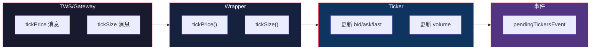

# Ticker 与行情数据

> 基于 [ib_async](https://github.com/ib-api-reloaded/ib_async) 源码分析。

## 生活比喻：股票行情屏

你去证券公司，大屏幕上实时显示各股票的价格——最新价、买一卖一、涨跌幅。TWS 就是这个大屏幕，Ticker 就是屏幕上的每一行数据。

## Ticker 类

Ticker 是行情数据的容器，包含一个合约的所有实时行情：

```python
# ticker.py（简化）
class Ticker:
    def __init__(self, contract):
        self.contract = contract
        self.time = None           # 最后更新时间
        self.bid = 0.0             # 买一价
        self.ask = 0.0             # 卖一价
        self.last = 0.0            # 最新价
        self.volume = 0            # 成交量
        self.high = 0.0            # 最高价
        self.low = 0.0             # 最低价
        self.close = 0.0           # 收盘价
        self.open = 0.0            # 开盘价
        self.bidSize = 0           # 买一量
        self.askSize = 0           # 卖一量
        self.lastSize = 0          # 最新成交量
        self.vwap = 0.0            # 成交量加权平均价
        self.ticks = []            # 原始 tick 数据
```

## 订阅行情

```python
# 订阅行情
contract = Stock('AAPL', 'SMART', 'USD')
ticker = ib.reqMktData(contract, '', False, False)

# ticker 对象会自动更新
print(f'买一: {ticker.bid}')
print(f'卖一: {ticker.ask}')
print(f'最新: {ticker.last}')
print(f'成交量: {ticker.volume}')
```

## 行情更新流程



## Tick 类型

IBKR API 定义了多种 tick 类型：

```python
# Wrapper 中的 tickPrice 回调
def tickPrice(self, reqId, tickType, price, attrib):
    ticker = self.tickers[reqId]
    if tickType == 1:    # Bid
        ticker.bid = price
    elif tickType == 2:  # Ask
        ticker.ask = price
    elif tickType == 4:  # Last
        ticker.last = price
    elif tickType == 6:  # High
        ticker.high = price
    elif tickType == 7:  # Low
        ticker.low = price
    elif tickType == 9:  # Close
        ticker.close = price
    elif tickType == 14: # Open
        ticker.open = price

    ticker.ticks.append((tickType, price, attrib))
    self.ib.pendingTickersEvent.emit(ticker)
```

## 行情事件

```python
# 方式一：事件订阅
ib.pendingTickersEvent += on_tickers

def on_tickers(tickers):
    for ticker in tickers:
        print(f'{ticker.contract.symbol}: '
              f'bid={ticker.bid} ask={ticker.ask} '
              f'last={ticker.last} vol={ticker.volume}')

# 方式二：轮询 ticker 对象
while True:
    ib.waitOnUpdate()
    print(f'AAPL: {ticker.last}')
```

## 通用 Tick 数据

除了基本行情，还可以请求额外数据：

```python
# 请求期权隐含波动率
ticker = ib.reqMktData(contract, '100', False, False)
# 100 = 期权隐含波动率

# 请求成交量数据
ticker = ib.reqMktData(contract, '233', False, False)
# 233 = 成交量

# 请求所有通用 tick
ticker = ib.reqMktData(contract, '100,101,104,106,165,221,225,233,236,258', False, False)
```

## 深度行情

请求市场深度（Level 2 数据）：

```python
# 请求深度行情
depth = ib.reqMktDepth(contract, 5, False, False)
# 5 = 档数

# 深度数据通过 marketDepth 事件更新
def on_depth(reqId, position, operation, side, price, size):
    print(f'档位 {position}: '
          f'{"买" if side == 0 else "卖"} '
          f'价格={price} 数量={size}')

ib.marketDepthEvent += on_depth
```

## 历史行情

请求历史 K 线数据：

```python
# 请求历史行情
bars = ib.reqHistoricalData(
    contract,
    endDateTime='',           # 空表示当前时间
    durationStr='1 D',        # 1 天
    barSizeSetting='1 min',   # 1 分钟
    whatToShow='TRADES',      # 成交数据
    useRTH=True,              # 仅常规交易时间
    formatDate=1,             # 日期格式
)

# bars 是 BarData 列表
for bar in bars:
    print(f'{bar.date}: O={bar.open} H={bar.high} '
          f'L={bar.low} C={bar.close} V={bar.volume}')
```

## 优秀代码：Ticker 批量更新

### 源码

```python
# wrapper.py（简化）
class Wrapper:
    def tickSnapshotEnd(self, reqId):
        # 行情快照结束
        ticker = self.tickers.get(reqId)
        if ticker:
            self.ib.pendingTickersEvent.emit([ticker])

    def tickByTickAllLast(self, reqId, tickType, time, price, size, ...):
        # 逐笔成交
        ticker = self.tickers.get(reqId)
        if ticker:
            ticker.last = price
            ticker.lastSize = size
            ticker.time = time
            self.ib.pendingTickersEvent.emit([ticker])
```

### 好在哪

1. **批量事件**——`pendingTickersEvent` 传递 ticker 列表，减少事件触发次数
2. **统一接口**——不同 tick 类型（价格、数量、深度）都更新同一个 Ticker 对象
3. **自动更新**——Ticker 对象的状态随事件自动更新，不需要手动查询

### 模式

**Observer + Value Object**——Ticker 是 Value Object，通过事件自动更新。

### 骨架代码

```python
# 你的项目中：用同样的模式实现行情容器
class MarketData:
    def __init__(self, symbol):
        self.symbol = symbol
        self.bid = 0.0
        self.ask = 0.0
        self.last = 0.0
        self.volume = 0
        self._on_update = None

    def on_update(self, callback):
        self._on_update = callback

    def update(self, field, value):
        setattr(self, field, value)
        if self._on_update:
            self._on_update(self)

# 使用
data = MarketData('AAPL')
data.on_update(lambda d: print(f'{d.symbol}: {d.last}'))
data.update('last', 150.0)
```

## 对比：Ticker vs 其他行情库

| 维度 | ib_async Ticker | yfinance | ccxt |
|------|----------------|----------|------|
| 实时行情 | 支持（WebSocket） | 不支持 | 支持 |
| 历史行情 | 支持 | 支持 | 支持 |
| 深度行情 | 支持 | 不支持 | 部分支持 |
| 自动更新 | 内置 | 不适用 | 不支持 |
| 交易所 | IBKR 全部 | 有限 | 有限 |

ib_async 的 Ticker 是**实时行情容器**——订阅后自动更新，事件驱动通知。yfinance 是历史数据库，ccxt 是交易所统一接口。

## 总结

Ticker 是 ib_async 的行情层——订阅行情后自动更新，事件驱动通知。核心设计：

- **Ticker 容器**——包含一个合约的所有行情数据
- **自动更新**——Tick 数据自动更新 Ticker 属性
- **事件驱动**——`pendingTickersEvent` 通知行情更新
- **多种数据**——基本行情、通用 tick、深度行情、历史 K 线
