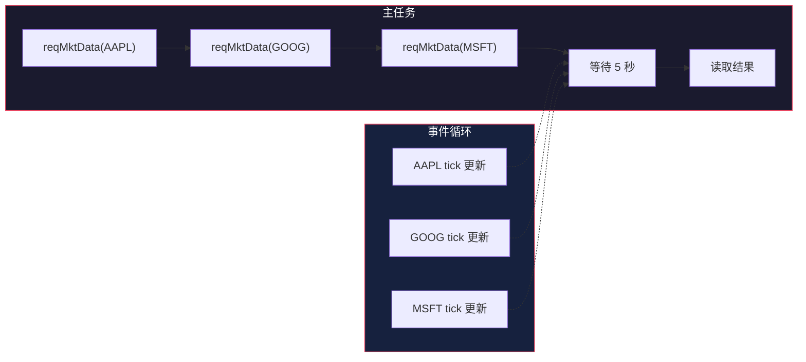

# 异步模式：asyncio + eventkit

> 基于 [ib_async](https://github.com/ib-api-reloaded/ib_async) 源码分析。

## 生活比喻：餐厅的异步服务

你去餐厅点菜：

- **同步模式**：点完菜站在厨房门口等，菜做好了才去坐下
- **异步模式**：点完菜回座位，菜好了服务员端过来

ib_async 的异步模式就是第二种——发起请求后不阻塞，结果准备好了自动通知。

## asyncio 事件循环

ib_async 基于 Python 的 asyncio 事件循环，所有 IO 操作都是非阻塞的：

```python
import asyncio
from ib_async import IB

async def main():
    ib = IB()
    await ib.connectAsync('127.0.0.1', 7497, clientId=1)

    # 异步请求行情
    ticker = ib.reqMktData(contract, '', False, False)

    # 不阻塞，可以做其他事情
    await asyncio.sleep(5)

    # 行情已经更新好了
    print(f'AAPL: {ticker.last}')

    ib.disconnect()

asyncio.run(main())
```

## 同步 vs 异步 API

ib_async 提供两套 API——同步版本和异步版本：

```python
# 同步版本（阻塞等待）
ib.connect('127.0.0.1', 7497)
positions = ib.positions()

# 异步版本（非阻塞）
await ib.connectAsync('127.0.0.1', 7497)
positions = ib.positions()  # 已经同步好了，直接访问
```

实际上，同步版本内部也是用 asyncio 实现的：

```python
# ib.py（简化）
class IB:
    def connect(self, host, port, clientId=1, timeout=20):
        """同步连接（内部用 asyncio）"""
        self.connectAsync(host, port, clientId)
        # 等待连接完成
        self.waitOnUpdate(timeout)

    async def connectAsync(self, host, port, clientId=1):
        """异步连接"""
        await self._client.connectAsync(host, port, clientId)
        # 自动同步
        await self._syncAll()
```

## waitOnUpdate：事件循环的核心

`waitOnUpdate()` 是 ib_async 的核心方法——等待下一个事件更新：

```python
# ib.py（简化）
class IB:
    def waitOnUpdate(self, timeout=None):
        """等待下一个事件更新"""
        # 运行事件循环，直到有事件触发
        self._runLoop(timeout)

    def _runLoop(self, timeout):
        """运行事件循环"""
        deadline = time.time() + timeout if timeout else None
        while True:
            # 检查是否有待处理的事件
            if self._pendingEvents:
                break
            # 运行一小段事件循环
            self._loop.run_until_complete(asyncio.sleep(0.1))
            # 检查超时
            if deadline and time.time() > deadline:
                break
```

## 并发请求

asyncio 允许同时发起多个请求：

```python
async def fetch_multiple():
    ib = IB()
    await ib.connectAsync('127.0.0.1', 7497)

    # 同时订阅多个合约的行情
    contracts = [Stock('AAPL'), Stock('GOOG'), Stock('MSFT')]
    tickers = [ib.reqMktData(c, '', False, False) for c in contracts]

    # 等待数据到达
    await asyncio.sleep(5)

    # 所有数据都已经更新好了
    for ticker in tickers:
        print(f'{ticker.contract.symbol}: {ticker.last}')
```



## 事件驱动 vs 轮询

```python
# 方式一：事件驱动（推荐）
ib.pendingTickersEvent += lambda tickers: print(tickers[0].last)

# 方式二：轮询（不推荐）
while True:
    ib.waitOnUpdate(0.1)
    print(ticker.last)
```

事件驱动更高效——只在数据变化时执行回调，不需要空转。

## 异步迭代器

ib_async 支持异步迭代器模式：

```python
async def stream_ticks(ib, contract):
    """异步迭代器：逐个获取 tick"""
    ticker = ib.reqMktData(contract, '', False, False)

    while True:
        # 等待下一个更新
        await ib.waitOnUpdateAsync()
        yield ticker
```

## 实战：异步交易系统

```python
import asyncio
from ib_async import IB, Stock, MarketOrder

async def trading_system():
    ib = IB()
    await ib.connectAsync('127.0.0.1', 7497)

    # 设置事件处理器
    ib.orderEvent += lambda trade: print(
        f'订单 {trade.order.orderId}: {trade.orderStatus.status}'
    )

    ib.pendingTickersEvent += lambda tickers: print(
        f'行情: {tickers[0].contract.symbol} = {tickers[0].last}'
    )

    # 订阅行情
    contract = Stock('AAPL', 'SMART', 'USD')
    ticker = ib.reqMktData(contract, '', False, False)

    # 等待行情稳定
    await asyncio.sleep(10)

    # 下单
    if ticker.last > 150:
        order = MarketOrder('BUY', 100)
        trade = ib.placeOrder(contract, order)

        # 等待成交
        while trade.orderStatus.status != 'Filled':
            await ib.waitOnUpdateAsync()
        print(f'成交: {trade.orderStatus.avgFillPrice}')

    ib.disconnect()

asyncio.run(trading_system())
```

## 优秀代码：异步上下文管理器

### 源码

```python
# ib.py（简化）
class IB:
    async def __aenter__(self):
        """异步上下文管理器入口"""
        await self.connectAsync()
        return self

    async def __aexit__(self, *args):
        """异步上下文管理器出口"""
        self.disconnect()

# 使用 async with
async def main():
    async with IB() as ib:
        await ib.connectAsync('127.0.0.1', 7497)
        # 自动管理连接生命周期
    # 离开 with 块时自动断开
```

### 好在哪

1. **自动管理**——连接和断开自动处理，不会忘记断开
2. **异常安全**——即使发生异常也会断开连接
3. **简洁**——不需要手动 try/finally

### 模式

**Context Manager + RAII**——资源获取即初始化，离开作用域即释放。

### 骨架代码

```python
# 你的项目中：用同样的模式管理异步资源
class AsyncConnection:
    async def __aenter__(self):
        await self.connect()
        return self

    async def __aexit__(self, *args):
        await self.disconnect()

# 使用
async with AsyncConnection('ws://...') as conn:
    await conn.send('hello')
# 自动断开
```

## 对比：ib_async vs 其他异步库

| 维度 | ib_async | aiohttp | websockets |
|------|----------|---------|------------|
| 协议 | IBKR 二进制 | HTTP | WebSocket |
| 事件循环 | asyncio | asyncio | asyncio |
| 事件系统 | eventkit | 无 | 无 |
| 自动同步 | 内置 | 无 | 无 |
| 上下文管理 | 支持 | 支持 | 支持 |

ib_async 的异步模式是**事件驱动 + 自动同步**——用 asyncio 做非阻塞 IO，用 eventkit 做事件通知，连接后自动同步所有状态。

## 总结

ib_async 的异步模式是整个库的基础——基于 asyncio 事件循环，用 eventkit 实现事件驱动。核心设计：

- **asyncio 事件循环**——所有 IO 非阻塞
- **waitOnUpdate**——等待下一个事件更新
- **事件驱动**——数据变化时触发回调，不需要轮询
- **异步上下文管理器**——自动管理连接生命周期
