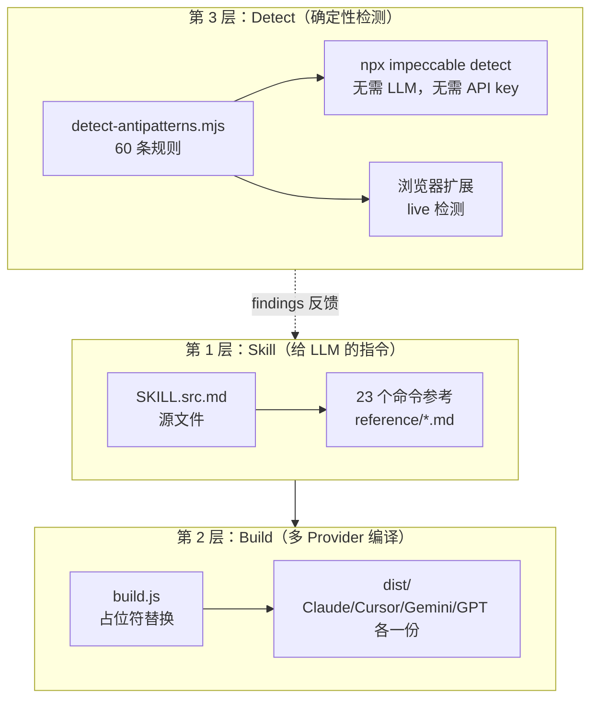

# Impeccable 源码阅读（一）：让 AI 生成的前端设计不再"AI 味"

> 基于 [yorukot/impeccable](https://github.com/yorukot/superfile) 更正：[pbakaus/impeccable](https://github.com/pbakaus/impeccable)，Apache-2.0，JS/Node。

## 一句话说清楚

Impeccable 是一个给 AI 编程 Agent（Claude Code、Cursor 等）用的**前端设计 skill**——1 个 skill、23 个命令、60 条确定性检测规则。它解决的问题很具体：所有 LLM 训练数据里的 SaaS 模板都长一个样——Inter 字体、紫蓝渐变、卡片套卡片、灰色文字放在彩色背景上、每个标题上面一个圆角方形图标。Impeccable 的目标是让 AI 生成的前端设计"不再像 AI 生成的"。

## 三层架构



**关键设计决策：检测和生成是分离的。**

- 生成（Skill 层）：LLM 读指令 → 写代码
- 检测（Detect 层）：确定性规则扫描 HTML/CSS → 输出 findings
- 两者之间没有 LLM 调用——检测是纯代码逻辑，不需要 API key

这意味着即使 LLM 的"设计品味"有问题，检测层也能**用确定性规则**发现并报告。

## 23 个命令的四个类别

| 类别 | 命令 | 做什么 |
|---|---|---|
| **Build** | init, document, extract, shape, craft | 从 0 到 1：初始化设计上下文、生成 DESIGN.md、提取设计 token |
| **Evaluate** | critique, audit | 评估：UX 评审（主观）、技术审计（客观） |
| **Refine** | polish, bolder, quieter, distill, harden, onboard | 精修：最终打磨、加粗/变安静、精简、加固、引导流程 |
| **Enhance** | animate, colorize, typeset, layout, delight, overdrive | 增强：动效、配色、字体、布局、愉悦感、技术炫技 |
| **Fix** | clarify, adapt, optimize | 修复：UX 文案、响应式适配、性能 |
| **Iterate** | live | 浏览器内实时变体迭代 |

命令路由逻辑：

```
/impeccable <command> <target>
    → 如果 command 明确：加载 reference/<command>.md
    → 如果没有参数：读 routing.md，展示上下文菜单
    → 否则：当一般设计任务处理
```

## Mode 系统：Persuade / Operate / Read / Experience

这是 Impeccable 最精妙的设计之一——**同一个产品，不同页面的设计目标不同**：

| Mode | 含义 | 例子 | 设计重点 |
|---|---|---|---|
| **Persuade** | 访客做决定并行动 | 落地页、营销页 | 赢得注意力和行动 |
| **Operate** | 访客完成任务 | App UI、仪表盘 | 可扫描性、一致性 |
| **Read** | 访客理解某件事 | 文档、文章 | 结构清晰，值得停留 |
| **Experience** | 访客沉浸在作品中 | 作品集、画廊 | 作品本身引领，界面退后 |

**关键洞察：Mode 是按页面（surface）而非按产品（product）的。** 一个工具产品的落地页是 Persuade，它的文档页面是 Read。Mode 不存在 PRODUCT.md 里——它只存在于每个 surface 的 brief 中。

## Platform 系统：web / ios / android / adaptive

和 Mode 正交的第二个轴——交付目标：

- **web**：默认。无额外规则。
- **ios**：加载 `reference/ios.md`（Apple HIG 精炼版）
- **android**：加载 `reference/android.md`（Material Design 3 精炼版）
- **adaptive**：同时加载两个（Flutter、React Native 等跨平台框架）

## 优秀代码：多 Provider 构建系统

### 源码

```javascript
// scripts/build.js（简化）
const PROVIDERS = [
    { name: 'claude',     configFile: 'CLAUDE.md',       commandPrefix: '/' },
    { name: 'cursor',     configFile: '.cursorrules',    commandPrefix: '/' },
    { name: 'gemini',     configFile: 'GEMINI.md',       commandPrefix: '/' },
    { name: 'gpt',        configFile: 'AGENTS.md',       commandPrefix: '/' },
    { name: 'windsurf',   configFile: '.windsurfrules',  commandPrefix: '/' },
];

function buildForProvider(provider, srcContent) {
    return srcContent
        .replace(/\{\{model\}\}/g, provider.name)
        .replace(/\{\{config_file\}\}/g, provider.configFile)
        .replace(/\{\{command_prefix\}\}/g, provider.commandPrefix)
        .replace(/\{\{available_commands\}\}/g, IMPECCABLE_SUB_COMMANDS.join('\n'));
}
```

### 好在哪

**一份源文件，五份输出。** SKILL.src.md 是唯一的编辑面——写一次，自动编译成 Claude/Cursor/Gemini/GPT/Windsurf 各自能读的格式。占位符（`{{model}}`、`{{config_file}}`）是编译期的字符串替换，不是运行时模板。

### 模式

Source-First Build——编辑源文件，生成所有 provider 输出。不是"每个 provider 维护一份副本"。

### 骨架代码

```javascript
const providers = [
    { name: 'a', config: 'A.md', prefix: '/' },
    { name: 'b', config: 'B.md', prefix: '$' },
];

function build(src, provider) {
    return src
        .replaceAll('{{model}}', provider.name)
        .replaceAll('{{config_file}}', provider.config)
        .replaceAll('{{prefix}}', provider.prefix);
}

for (const p of providers) {
    fs.writeFileSync(`dist/${p.name}.md`, build(source, p));
}
```

## 优秀代码：Staleness 检测（工件过期发现）

Impeccable 会向用户项目写文件（PRODUCT.md、DESIGN.md），所以老版本写的文件在新版本下可能"过期"。它分两层检测：

```javascript
// skill/scripts/lib/staleness.mjs（简化）

// Tier 1：boot 时做（轻量，不扫描目录、不跑 git）
function collectBootFindings(projectDir) {
    const findings = [];
    const product = readMarkdown(projectDir / 'PRODUCT.md');

    // 检查已废弃的字段
    for (const section of PRODUCT_DEPRECATED_SECTIONS) {
        if (product.includes(section.name)) {
            findings.push({
                id: 'deprecated-field',
                artifact: 'PRODUCT.md',
                severity: 'mention',  // 提一次，不阻塞
                summary: `${section.name} 已废弃：${section.reason}`,
                fix: null,
            });
        }
    }

    // 检查 schema 版本标记
    if (!product.includes('impeccable:product-schema')) {
        findings.push({
            id: 'missing-stamp',
            severity: 'auto',  // 下次写文件时静默修复
            summary: 'PRODUCT.md 缺少 schema 版本标记',
            fix: 'add-stamp',
        });
    }
    return findings;
}

// Tier 2：按需做（重量级，doctor 命令触发）
// git log、per-workspace 扫描、hook 脚本解析...
```

### 好在哪

**两层检测，性能契约明确。** Tier 1 只能用 boot 时已经加载到内存的东西——不做目录遍历、不跑 git。Tier 2 是按需的重活（`doctor` 命令触发）。Findings 是数据对象 `{ id, artifact, severity, summary, fix }`——boot 指令、文本报告、`--json` 输出都渲染同一套数据。

`severity` 说的是"应该怎么办"，不是"有多严重"：
- `auto`：下次写文件时静默修复，不打扰用户
- `mention`：提一次，继续干活
- `route`：指定哪个命令负责修复

## 小结

Impeccable 的架构有三个值得学的设计决策：

1. **生成和检测分离**——LLM 负责生成，确定性规则负责检测。检测不需要 API key。
2. **Mode 按 surface 不按 product**——同一产品的不同页面有不同设计目标。
3. **Source-first 构建**——一份源文件，多 provider 输出。编辑面只有一个。

下一篇看 60 条反模式检测规则——怎么用确定性代码检测"AI 味"设计。
