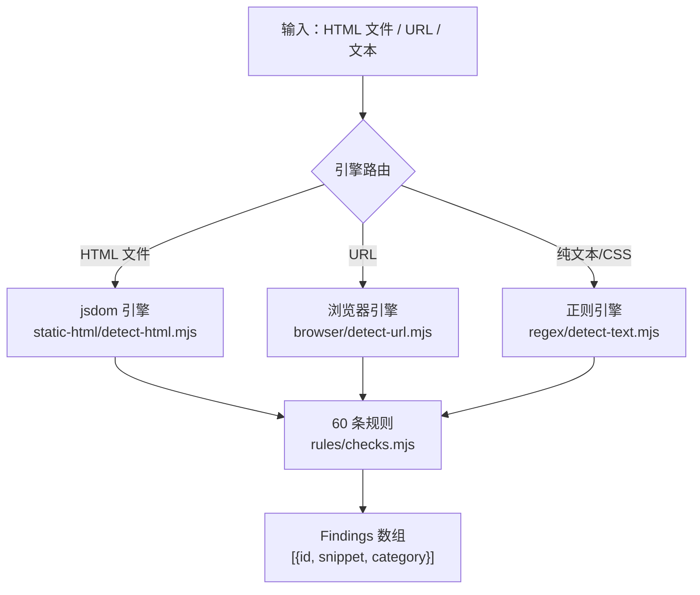

# Impeccable 源码阅读（二）：60 条规则，用代码检测"AI 味"设计

> 基于 [pbakaus/impeccable](https://github.com/pbakaus/impeccable)，Apache-2.0。

## 问题：怎么不靠 LLM 判断一个页面是不是"AI 味"

LLM 生成的前端设计有一些共同的"指纹"——不需要 LLM 判断，用确定性代码就能检测：

- 所有字体都是 Inter
- 紫到蓝的渐变背景
- 卡片套卡片（card-in-card）
- 灰色文字放在彩色背景上
- 每个标题上面一个圆角方形图标
- 侧边固定的 tab 导航
- 低对比度文本

Impeccable 的 detect 引擎有 **60 条这样的规则**，全部是确定性代码——正则匹配、CSS 计算、DOM 遍历。不需要 LLM，不需要 API key。

## 引擎架构



三个引擎对应三种输入场景，但**共享同一套规则逻辑**。

## 规则结构：每条规则三件套

```javascript
// cli/engine/registry/antipatterns.mjs（简化）
export const ANTIPATTERNS = [
    {
        id: 'inter-everything',
        category: 'slop',           // 'slop' = AI 味，'quality' = 真实设计问题
        name: 'Inter for everything',
        description: 'All text uses Inter font',
        skillSection: 'typography',
        skillGuideline: 'Choose fonts with personality...',
    },
    {
        id: 'purple-blue-gradient',
        category: 'slop',
        name: 'Purple-to-blue gradient',
        description: 'Background gradient from purple to blue',
        skillSection: 'color',
    },
    {
        id: 'low-contrast',
        category: 'quality',
        name: 'Low contrast text',
        description: 'Text contrast ratio below 4.5:1',
        skillSection: 'accessibility',
    },
    // ... 60 条
];
```

每条规则有一个对应的 **check 函数**：

```javascript
// cli/engine/rules/checks.mjs（简化）

// 纯函数：不碰 DOM，接收解析好的数据，返回 findings
export function checkTypography(opts) {
    const { fonts, bodyFont } = opts;
    const findings = [];

    // 规则：所有文本都用 Inter
    if (bodyFont === 'Inter' && fonts.size === 1) {
        findings.push({ id: 'inter-everything', snippet: 'body { font-family: Inter }' });
    }
    return findings;
}

// 规则：低对比度
export function checkContrast(opts) {
    const { elements } = opts;
    const findings = [];
    for (const el of elements) {
        const ratio = contrastRatio(el.fgColor, el.bgColor);
        if (ratio < 4.5) {
            findings.push({ id: 'low-contrast', snippet: el.text.slice(0, 50) });
        }
    }
    return findings;
}
```

**关键设计：纯函数 + 两个适配器。**

```javascript
// 浏览器适配器（真实 DOM，getComputedStyle）
function checkElementContrastDOM(el) {
    const style = getComputedStyle(el);
    const fg = parseRgb(style.color);
    const bg = parseRgb(style.backgroundColor);
    return checkContrast({ elements: [{ fgColor: fg, bgColor: bg, text: el.textContent }] });
}

// jsdom 适配器（没有布局，用 parseFloat）
function checkElementContrastJsdom(el, tag, window) {
    const style = el.style;
    const fg = parseRgb(style.color);
    const bg = parseRgb(style.backgroundColor);  // jsdom 不做布局，直接读 style
    return checkContrast({ elements: [{ fgColor: fg, bgColor: bg, text: el.textContent }] });
}
```

同一个规则逻辑（`checkContrast`），两个适配器分别处理浏览器环境和 jsdom 环境。jsdom 不做布局——`getBoundingClientRect()` 返回 0×0，所以用 `parseFloat(style.width)` 代替。

## TDD 工作流：非协商

CLAUDE.md 里明确写了规则开发的顺序——**不可协商**：

```
1. Fixture：tests/fixtures/antipatterns/{rule-id}.html
   两列：should-flag（应该触发）和 should-pass（不应触发）
   至少 4 个 flag case + 5 个 false-positive case

2. 失败的测试：先写测试，看它失败
   用 snippet-substring 模式匹配

3. 规则条目：ANTIPATTERNS 数组加一条

4. 纯 check 函数：checkXxx(opts) → [{id, snippet}]
   不碰 DOM

5. 两个适配器：
   checkElementXxxDOM(el) — 浏览器
   checkElementXxx(el, tag, window) — jsdom

6. 在真实页面验证：localhost + 首页（确认无误报）
```

## 优秀代码：jsdom 的 CSS 解析限制处理

### 源码

```javascript
// cli/engine/engines/static-html/detect-html.mjs（简化）

// jsdom 不分解 background 简写——需要手动解析
function resolveBackground(style) {
    const bg = style.background;
    if (!bg) return { color: null, gradient: null };

    // "linear-gradient(135deg, #667eea 0%, #764ba2 100%)"
    if (bg.includes('gradient')) {
        return { color: null, gradient: parseGradientColors(bg) };
    }
    // "#f5f5f5" 或 "rgb(245, 245, 245)"
    return { color: parseRgb(bg), gradient: null };
}

// jsdom 不标准化颜色值——hex 和 rgb 都要处理
function parseGradientColors(bg) {
    const colors = [];
    // 匹配 #hex
    for (const m of bg.matchAll(/#[0-9a-fA-F]{3,8}/g)) {
        colors.push(hexToRgb(m[0]));
    }
    // 匹配 rgb(r, g, b)
    for (const m of bg.matchAll(/rgb\((\d+),\s*(\d+),\s*(\d+)\)/g)) {
        colors.push({ r: +m[1], g: +m[2], b: +m[3] });
    }
    return colors;
}
```

### 好在哪

**jsdom 不是浏览器——很多浏览器 API 不存在或行为不同。** 代码没有假设"jsdom 和浏览器一样"，而是明确处理了三个差异：
1. `background` 简写不分解（需要手动解析 gradient vs color）
2. 颜色值不标准化（hex 和 rgb 混合出现）
3. 没有布局（`getBoundingClientRect()` 返回 0）

### 骨架代码

```javascript
// 任何 jsdom 项目都适用的模式
function getComputedColor(el, prop) {
    // 不要假设 el.style[prop] 是标准化的
    const raw = el.style[prop];
    if (raw.startsWith('#')) return hexToRgb(raw);
    if (raw.startsWith('rgb')) return parseRgb(raw);
    return null;
}
```

## 优秀代码：规则的 category 分类

### 源码

```javascript
// 60 条规则分两类
{
    id: 'inter-everything',
    category: 'slop',      // AI 味——所有 LLM 都这么生成
},
{
    id: 'low-contrast',
    category: 'quality',   // 真实设计问题——人类也会犯
}
```

### 好在哪

**"slop"和"quality"的区分不是技术分类，是语义分类。** "所有字体都是 Inter"不是设计错误——它是**训练数据偏差的症状**。"低对比度文本"是真正的设计/无障碍问题。两者的修复建议完全不同：slop 建议"换一种有性格的字体"，quality 建议"提高对比度到 4.5:1"。

这个分类也影响了 skill 层——`skillSection` 字段把检测结果路由到 SKILL.src.md 的对应章节，让 LLM 在修复时知道"这是 AI 味问题"还是"这是质量问题"。

## 小结

检测引擎的三个设计决策：

1. **纯函数 + 双适配器**——规则逻辑不碰 DOM，浏览器和 jsdom 各有适配器
2. **TDD 不可协商**——fixture 先于代码，失败测试先于实现
3. **slop vs quality**——区分"AI 训练偏差"和"真实设计问题"

下一篇看 Prompt 系统——SKILL.src.md 和 23 个命令参考文件怎么教 LLM 做出"不像 AI"的设计。
