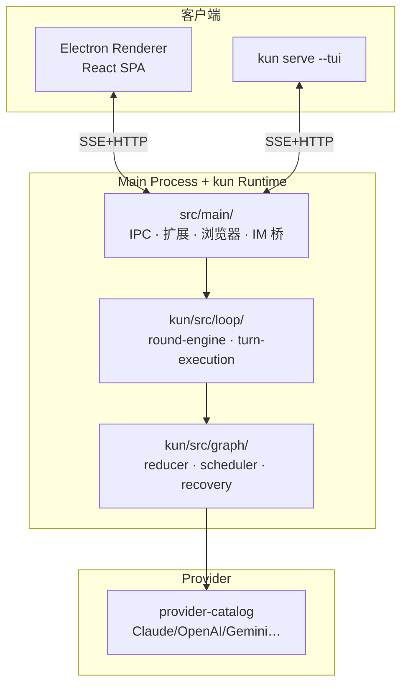

# Kun 源码阅读（一）：GUI+TUI 共享一个运行时

> 基于 [KunAgent/Kun](https://github.com/KunAgent/Kun)，TypeScript/Electron。

## 一句话

Kun 是一个本地优先的 AI Agent 工作台——桌面 GUI + 终端 TUI 共用一套 `kun serve` 运行时。Agent 核心循环跑在 Electron main process 中，不是 renderer 里，不是云端。

## 三层架构



选 Electron 不是因为 UI——Agent 需要本地文件系统、shell、子进程、托盘、键盘快捷键、IM WebSocket 长连接。这些浏览器沙箱做不了。

## 优秀代码：SSE IPC——TUI 和 GUI 共享协议

### 源码

```typescript
// src/main/runtime-sse-ipc.ts（简化）
class SSEManager {
    private clients = new Map<string, EventEmitter>();

    addClient(id: string): EventEmitter {
        const client = new EventEmitter();
        client.once('close', () => this.clients.delete(id));
        this.clients.set(id, client);
        return client;
    }

    broadcast(event: RuntimeEvent): void {
        for (const client of this.clients.values()) {
            client.emit(event.type, event.data);
        }
    }
}
```

### 好在哪

TUI 只需 `EventSource`——Node.js 原生支持。上行 HTTP POST——Agent 命令总是"发一次、等结果"。连接断开自动清理——不需要心跳。比 WebSocket 简单一个数量级。

### 模式

SSE Push + HTTP POST Pull。

### 骨架代码

```typescript
class SSEManager {
    private clients = new Map();
    add(id: string) { const c = new EventEmitter(); c.once('close', () => this.clients.delete(id)); this.clients.set(id, c); return c; }
    broadcast(e: string, d: any) { this.clients.forEach(c => c.emit(e, d)); }
}
```

## 优秀代码：进程守护——滑动窗口重启

### 源码

```typescript
// src/main/kun-process.ts（简化）
private shouldRestart(): boolean {
    if (Date.now() - this.lastRestartTime > 60_000) this.restartCount = 0;
    return this.restartCount < 3;
}

private async waitForHealth(): Promise<void> {
    for (let i = 0; i < 30; i++) {
        try { if ((await fetch(`http://localhost:${this.port}/health`)).ok) return; } catch {}
        await sleep(500);
    }
    throw new Error('runtime failed to start');
}
```

### 好在哪

滑动窗口限制——1 分钟内最多 3 次重启，不是总共 3 次。`waitForHealth()` 轮询确认 HTTP 服务就绪——不假设进程启动 = 可用。

### 骨架代码

```typescript
class ProcessGuard {
    private failures = 0; private ts = 0;
    tryRestart(limit = 3, windowMs = 60_000): boolean {
        if (Date.now() - this.ts > windowMs) { this.failures = 0; this.ts = Date.now(); }
        return this.failures++ < limit;
    }
}
```

## 优秀代码：Settings 四层优先级

### 源码

```typescript
// src/shared/app-settings-kun.ts（简化）
get(key: string): any {
    for (const layer of ['session', 'user', 'project', 'default'] as const) {
        const v = this.layers.get(layer)?.[key];
        if (v !== undefined) return v;
    }
}
```

### 好在哪

session > user > project > default——四个生命周期。project 可 commit 共享；user 保留个人偏好；session 关闭即失效。不是"一个 config.json 全搞定"。

### 骨架代码

```typescript
class LayeredConfig {
    private layers = new Map<string, Record<string, any>>();
    get(k: string) { for (const l of ['session','user','project','default']) { const v = this.layers.get(l)?.[k]; if (v !== undefined) return v; } }
}
```

## 小结

三个架构决策：Electron 为 Agent 提供沙箱外能力；一份运行时服务两个前端；SSE 比 WebSocket 更简单。三组代码模式：SSE IPC、滑动窗口守护、四层配置。

下一篇看 Agent Loop——model-round-engine 怎么跑完一圈。
