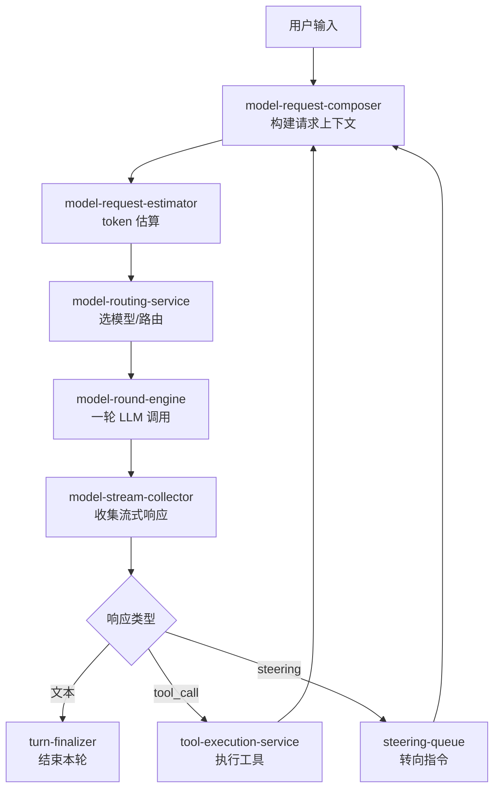

# Kun 源码阅读（二）：Agent Loop——model-round-engine 怎么跑完一圈

> 基于 [KunAgent/Kun](https://github.com/KunAgent/Kun)。

## 核心问题：一个 turn 怎么从用户输入变成 Agent 回复

Kun 的 Agent loop 不是简单的 `while(true) { askLLM(); executeTools(); }`。它是一个**带路由、带预算、带转向**的复杂引擎。



## model-round-engine：一圈的逻辑

```typescript
// kun/src/loop/model-round-engine.ts（简化）
type ModelRoundStreamResult =
    | { kind: 'completed'; snapshot: ModelStreamSnapshot }  // 文本完成
    | { kind: 'tool_calls'; snapshot: ModelStreamSnapshot }  // 工具调用
    | { kind: 'aborted' }                                    // 被中止
    | { kind: 'failed' };                                    // 失败

interface ModelRoundEngineInput {
    threadId: string;
    turnId: string;
    signal: AbortSignal;                   // 中止信号
    request: ModelRequest;                 // 模型请求
    maxToolCallsPerStep: number;           // 每步最多工具调用数
    maxToolArgumentStringBytes?: number;   // 工具参数上限
    onRouteSelected?: (route) => Promise<void>;  // 路由选定回调
}
```

一圈 Engine 只调用一次 LLM。如果 LLM 返回 tool_calls，由工具执行层处理完后再调一圈 Engine——循环由上层控制，Engine 本身只管"发送 → 收集 → 返回结果"。

## model-stream-collector：流式收集器

LLM 的响应是分 chunk 到达的。Collector 把 chunk 拼接成完整的文本或 tool_call：

```typescript
// kun/src/loop/model-stream-collector.ts（简化）
const ASSISTANT_DELTA_EVENT_MAX_BYTES = 4 * 1024;   // 每 chunk 最多 4KB
const ASSISTANT_DELTA_EVENT_MAX_DELAY_MS = 40;        // 最长 40ms 间隔

class ModelStreamCollector {
    private textBuffer = '';
    private toolCallBuffer: Map<string, PartialToolCall> = new Map();

    async collect(stream: AsyncIterable<ModelChunk>): Promise<ModelStreamSnapshot> {
        for await (const chunk of stream) {
            if (chunk.type === 'text_delta') {
                this.textBuffer += chunk.text;
                this.emitDelta(chunk.text);  // 实时推送到 GUI/TUI
            } else if (chunk.type === 'tool_call_delta') {
                this.mergeToolCall(chunk);
            }
        }
        return { text: this.textBuffer, toolCalls: [...this.toolCallBuffer.values()] };
    }
}
```

**关键设计：实时 delta 推送。** 不是等全文返回再显示——每收到 4KB 或 40ms 间隔就推送到 GUI/TUI。用户看到的是流式输出，不是"等 5 秒然后全部出现"。

## 优秀代码：token-economy——Token 预算管理

### 源码

```typescript
// kun/src/loop/token-economy.ts（简化）
class TokenEconomy {
    private budget: number;
    private spent = 0;

    constructor(totalBudget: number) {
        this.budget = totalBudget;
    }

    canAfford(tokens: number): boolean {
        return this.spent + tokens <= this.budget;
    }

    spend(tokens: number): void {
        this.spent += tokens;
    }

    remaining(): number {
        return this.budget - this.spent;
    }

    // 预留工具结果占用的 token
    reserveForToolResults(estimatedTokens: number): number {
        const reserve = Math.min(estimatedTokens, this.remaining() * 0.3);
        this.spend += reserve;
        return reserve;
    }
}
```

### 好在哪

`reserveForToolResults()` 预留 30% 剩余预算给工具结果——防止 LLM 的回复用完所有 token，工具结果写不进上下文。这个 30% 不是拍脑袋——是根据"LLM 回复平均占 70%、工具结果占 30%"的经验比例。

### 模式

Budget with Reserve——给不确定的后续消费预留空间。

### 骨架代码

```typescript
class Budget {
    spent = 0;
    constructor(private total: number) {}
    canSpend(n: number) { return this.spent + n <= this.total; }
    spend(n: number) { this.spent += n; }
    reserveForLate(ratio = 0.3) { const r = Math.min(this.total * ratio, this.remaining()); this.spent += r; return r; }
    remaining() { return this.total - this.spent; }
}
```

## 优秀代码：steering-queue——运行时转向

### 源码

```typescript
// kun/src/loop/steering-queue.ts（简化）
type SteeringCommand = 'pause' | 'resume' | 'stop' | 'replan';

class SteeringQueue {
    private queue: SteeringCommand[] = [];

    push(cmd: SteeringCommand): void {
        // 某些命令覆盖前面的（stop 覆盖一切, resume 覆盖 pause）
        if (cmd === 'stop') {
            this.queue = ['stop'];
            return;
        }
        if (cmd === 'resume' && this.queue.includes('pause')) {
            this.queue = this.queue.filter(c => c !== 'pause');
            return;
        }
        this.queue.push(cmd);
    }

    drain(): SteeringCommand[] {
        const drained = [...this.queue];
        this.queue = [];
        return drained;
    }
}
```

### 好在哪

**命令覆盖逻辑**：stop 覆盖一切（不需要先 pause 再 stop），resume 覆盖 pause（不需要单独删 pause）。每个 turn 执行前 `drain()` 取出所有命令并清空——不会重复执行。

### 骨架代码

```typescript
class SteeringQueue<T> {
    private q: T[] = [];
    push(cmd: T, override?: T[]) { /* 覆盖逻辑 */ }
    drain(): T[] { const d = [...this.q]; this.q = []; return d; }
}
```

## 小结

Agent Loop 的三个核心模块：

| 模块 | 职责 | 关键设计 |
|---|---|---|
| `model-round-engine` | 一圈 LLM 调用 | 只调一次，不循环 |
| `model-stream-collector` | 流式收集 chunk | 4KB/40ms 实时推送 |
| `token-economy` | Token 预算 | 30% 预留工具结果 |

下一篇看 Graph 系统——reducer + scheduler + recovery，Kun 怎么做复杂任务的工作流编排。
