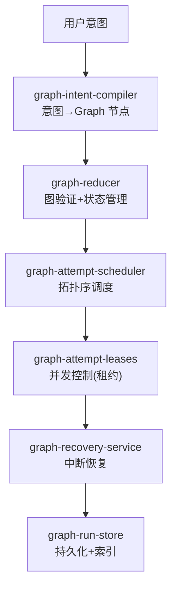

# Kun 源码阅读（三）：Graph 系统——复杂任务的工作流引擎

> 基于 [KunAgent/Kun](https://github.com/KunAgent/Kun)。

## 一句话说清楚

Kun 的 Agent Graph 不是 LangGraph——是自研的 DAG 工作流引擎。包含意图编译（intent→graph）、调度器（拓扑序并行）、reducer（状态合并）、恢复服务（中断续跑）。



## graph-intent-compiler：意图→图

```typescript
// kun/src/graph/graph-intent-compiler.ts（简化）
class IntentCompiler {
    compile(userIntent: string, context: GraphContext): WorkflowGraph {
        const plan = this.llm.plan(userIntent, context);  // LLM 规划
        const nodes: GraphNode[] = plan.steps.map((step, i) => ({
            id: step.id,
            type: this.resolveNodeType(step),  // ai | code | http | image | approval
            instruction: step.instruction,
            dependencies: this.resolveDeps(step, plan.steps),
        }));
        return { nodes, edges: this.buildEdges(nodes) };
    }
}
```

## graph-reducer：图验证 + 状态合并

```typescript
// kun/src/graph/graph-reducer.ts（简化）
class GraphReducer {
    reduce(action: GraphAction, state: GraphState): GraphState {
        switch (action.type) {
            case 'NODE_COMPLETED':
                return { ...state, completed: [...state.completed, action.nodeId] };
            case 'NODE_FAILED':
                return this.handleFailure(action, state);
            case 'PLAN_UPDATED':
                return this.rebuildGraph(action.newPlan, state);
        }
    }
}
```

**Redux 风格的单向数据流**：所有图状态变更通过 reducer 集中处理，每个 action 产生一个新 state。不是到处 mutate。

## graph-attempt-scheduler：拓扑序 + 并发

### 源码

```typescript
// kun/src/graph/graph-attempt-scheduler.ts（简化）
class AttemptScheduler {
    schedule(graph: WorkflowGraph, state: GraphState): Attempt[] {
        // 找到所有依赖已满足且未执行的节点
        const ready = graph.nodes.filter(n =>
            !state.completed.includes(n.id) &&
            n.dependencies.every(d => state.completed.includes(d))
        );
        // 同一优先级并行
        return ready.map(n => ({
            nodeId: n.id,
            lease: this.acquireLease(n.id),  // 租约防止重复执行
        }));
    }
}
```

**关键设计——graph-attempt-leases：租约防止重复执行。**

```typescript
class AttemptLeases {
    private leases = new Map<string, string>(); // nodeId → attemptId

    acquire(nodeId: string, attemptId: string): boolean {
        if (this.leases.has(nodeId)) return false;  // 已被别人拿了
        this.leases.set(nodeId, attemptId);
        return true;
    }

    release(nodeId: string, attemptId: string): void {
        if (this.leases.get(nodeId) === attemptId) this.leases.delete(nodeId);
    }
}
```

### 好在哪

多 Agent 场景下，两个 Agent 可能同时尝试执行同一个节点。租约确保**只有一个 Agent 能拿到执行权**。不需要分布式锁——内存级 Map 够用。

### 骨架代码

```typescript
class LeaseManager {
    private leases = new Map<string, string>();
    acquire(nodeId: string, attemptId: string): boolean {
        if (this.leases.has(nodeId)) return false;
        this.leases.set(nodeId, attemptId);
        return true;
    }
    release(nodeId: string, attemptId: string): void {
        if (this.leases.get(nodeId) === attemptId) this.leases.delete(nodeId);
    }
}
```

## graph-recovery-service：中断续跑

```typescript
// kun/src/graph/graph-recovery-service.ts（简化）
class RecoveryService {
    async recover(runId: string): Promise<GraphRun | null> {
        const run = await this.store.load(runId);
        if (!run || run.status === 'completed') return null;

        // 重建执行上下文
        const ctx = await this.rebuildContext(run);

        // 找到未完成的节点，从断点继续
        await this.scheduler.resume(run.graph, run.state, ctx);
        return run;
    }
}
```

Graph 执行中如果 Kun 被关闭（进程退出、系统关机），下次启动时恢复服务加载上次的 run 状态，从中断的节点继续。不是"从头再来"。

## 小结

Graph 系统的四个关键设计：

| 模块 | 做什么 | 关键设计 |
|---|---|---|
| `intent-compiler` | 意图→DAG | LLM 规划 + 依赖推导 |
| `reducer` | 状态合并 | Redux 风格单向数据流 |
| `attempt-scheduler` | 调度 | 拓扑序 + 租约防重 |
| `recovery-service` | 中断恢复 | 持久化 + 上下文重建 |

下一篇看委派系统——Kun 怎么把任务分给子 Agent。
