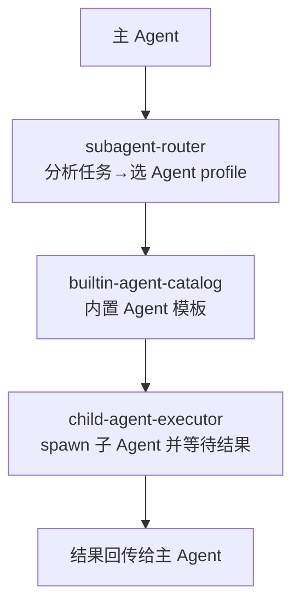

# Kun 源码阅读（四）：委派系统——把任务分给子 Agent

> 基于 [KunAgent/Kun](https://github.com/KunAgent/Kun)。

## 什么时候需要子 Agent

简单问答 → Direct 模式。复杂任务（跨文件、多步骤、需要不同专长） → 主 Agent 委托子 Agent 分工。



## subagent-router：任务→Agent 匹配

### 源码

```typescript
// kun/src/delegation/subagent-router.ts（简化）
interface AgentProfile {
    id: string;
    name: string;
    description: string;
    skills: string[];
    systemPrompt: string;
    tools: string[];
}

class SubagentRouter {
    constructor(private profiles: AgentProfile[]) {}

    route(task: string): AgentProfile[] {
        // 关键词 + 语义匹配找到适合的 Agent
        return this.profiles
            .filter(p => p.skills.some(s => task.toLowerCase().includes(s.toLowerCase())))
            .sort((a, b) => this.relevanceScore(b, task) - this.relevanceScore(a, task));
    }

    private relevanceScore(profile: AgentProfile, task: string): number {
        const matches = profile.skills.filter(s => task.includes(s)).length;
        return matches / profile.skills.length;
    }
}
```

### 好在哪

**技能匹配而非名称匹配。** 不是"任务中有'写代码'→分配给'Engineer Agent'"——而是计算技能匹配度。每个 Agent profile 有一个 skills 数组，router 算匹配分数，取最高分的。

### 模式

Skill-Based Routing。

### 骨架代码

```typescript
class Router<T extends { skills: string[] }> {
    route(task: string, candidates: T[]): T[] {
        return candidates
            .filter(c => c.skills.some(s => task.includes(s)))
            .sort((a, b) => this.score(b, task) - this.score(a, task));
    }
    private score(c: T, t: string): number {
        return c.skills.filter(s => t.includes(s)).length / c.skills.length;
    }
}
```

## child-agent-executor：spawn + wait

```typescript
// kun/src/delegation/child-agent-executor.ts（简化）
class ChildAgentExecutor {
    async execute(profile: AgentProfile, task: string, context: ExecutionContext): Promise<AgentResult> {
        // 创建隔离的执行上下文
        const childContext = context.fork({
            systemPrompt: profile.systemPrompt,
            tools: this.resolveTools(profile.tools),
        });

        // 独立的消息历史（不污染主 Agent 的上下文）
        const messages = [{ role: 'user', content: task }];

        // 运行 Agent loop
        const result = await this.runLoop(messages, childContext);

        return {
            agentId: profile.id,
            output: result.output,
            toolCalls: result.toolCalls,
            tokenUsage: result.tokenUsage,
        };
    }
}
```

**关键设计：fork 上下文。** 子 Agent 拿到的是主 Agent 上下文的 fork——有独立的 messages 数组，不污染主 Agent 的对话历史。子 Agent 的 token 消耗独立计算。

## builtin-agent-catalog：内置 Agent 模板

```typescript
// kun/src/delegation/builtin-agent-catalog.ts（简化）
const BUILTIN_AGENTS: AgentProfile[] = [
    { id: 'code-reviewer',  skills: ['review', 'code', 'refactor'],    tools: ['read_file', 'grep'] },
    { id: 'test-writer',    skills: ['test', 'unit test', 'coverage'],  tools: ['read_file', 'write_file', 'shell'] },
    { id: 'researcher',     skills: ['search', 'research', 'analyze'],  tools: ['web_search', 'web_fetch'] },
    { id: 'code-explorer',  skills: ['find', 'search', 'understand'],   tools: ['read_file', 'grep', 'list_dir'] },
];
```

每个内置 Agent 有自己的工具权限——code-reviewer 不能写文件，test-writer 可以。权限最小化——子 Agent 只需要完成任务所需的最小工具集。

## 小结

| 组件 | 做什么 |
|---|---|
| `subagent-router` | 技能匹配选 Agent |
| `child-agent-executor` | fork 上下文 + 独立运行 |
| `builtin-agent-catalog` | 内置模板 + 权限最小化 |

下一篇看 Memory & Context——token-economy、context-profile、history-hygiene。
