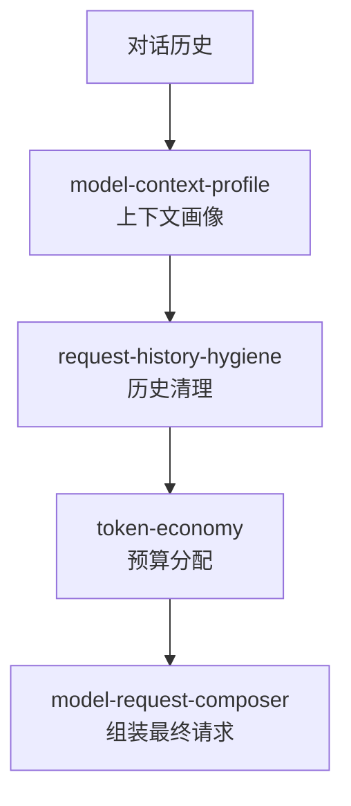

# Kun 源码阅读（五）：Memory & Context——20KB 的 token-economy 怎么管理上下文

> 基于 [KunAgent/Kun](https://github.com/KunAgent/Kun)。

## 问题：Agent 的上下文窗口是有限的

Token 预算 = 钱。用超了 = 回复质量下降。Kun 的 `token-economy.ts`（20KB）和 `model-context-profile.ts`（22KB）专门解决这个问题。



## token-economy：Token 预算管理

```typescript
// kun/src/loop/token-economy.ts（简化）
class TokenEconomy {
    private budget: number;
    private spent = 0;
    private allocations = new Map<string, number>();

    canAfford(tokens: number): boolean {
        return this.spent + tokens <= this.budget;
    }

    allocate(category: string, tokens: number): boolean {
        if (!this.canAfford(tokens)) return false;
        this.spent += tokens;
        this.allocations.set(category, (this.allocations.get(category) || 0) + tokens);
        return true;
    }

    // 30% 留给工具结果
    reserveForToolResults(): number {
        const reserve = Math.floor(this.budget * 0.3);
        this.spent += reserve;
        return reserve;
    }

    summary(): string {
        const parts = [...this.allocations.entries()]
            .map(([cat, tokens]) => `${cat}: ${tokens}`)
            .join(', ');
        return `Budget ${this.spent}/${this.budget} (${parts})`;
    }
}
```

### 好在哪

**分类追踪**：不只是"花了多少"，而是每个类别（system、history、tools、user）各自花了多少。debug 时可以看"工具结果是不是吃掉了太多 token"。

### 骨架代码

```typescript
class Budget {
    spent = 0; private allocs = new Map<string, number>();
    constructor(private total: number) {}
    spend(cat: string, n: number): boolean {
        if (this.spent + n > this.total) return false;
        this.spent += n; this.allocs.set(cat, (this.allocs.get(cat)||0)+n);
        return true;
    }
    reserveForLate(ratio = 0.3): number { const r = Math.floor(this.total * ratio); this.spent += r; return r; }
}
```

## request-history-hygiene：历史消息清理

```typescript
// kun/src/loop/request-history-hygiene.ts（简化）
class RequestHistoryHygiene {
    clean(messages: Message[], budget: TokenEconomy): Message[] {
        // 1. 保留 system prompt
        const system = messages.filter(m => m.role === 'system');

        // 2. 从末尾（最新消息）往前累加 token
        const recent: Message[] = [];
        for (const msg of [...messages].reverse()) {
            if (msg.role === 'system') continue;
            const tokens = this.estimateTokens(msg);
            if (!budget.canAfford(tokens)) break;
            budget.allocate('history', tokens);
            recent.unshift(msg);
        }

        // 3. 最近的 user turn 必须保留（不能从 assistant 中间截断）
        const firstUser = recent.findIndex(m => m.role === 'user');
        if (firstUser > 0) recent.splice(0, firstUser);

        return [...system, ...recent];
    }
}
```

### 好在哪

**从末尾往前累加 + user turn 边界对齐。** 不是从头截断——最新的消息最重要。必须从 user turn 开始——不会从 tool result 或 assistant 消息的中间截断。

## 小结

| 模块 | 职责 |
|---|---|
| `token-economy` | 分类追踪 token 消费 |
| `model-context-profile` | 上下文画像（模型+项目） |
| `request-history-hygiene` | 历史清理+user turn 对齐 |

下一篇看 Tool 系统——tool-execution-service + tool-call-repair + storm-breaker。
