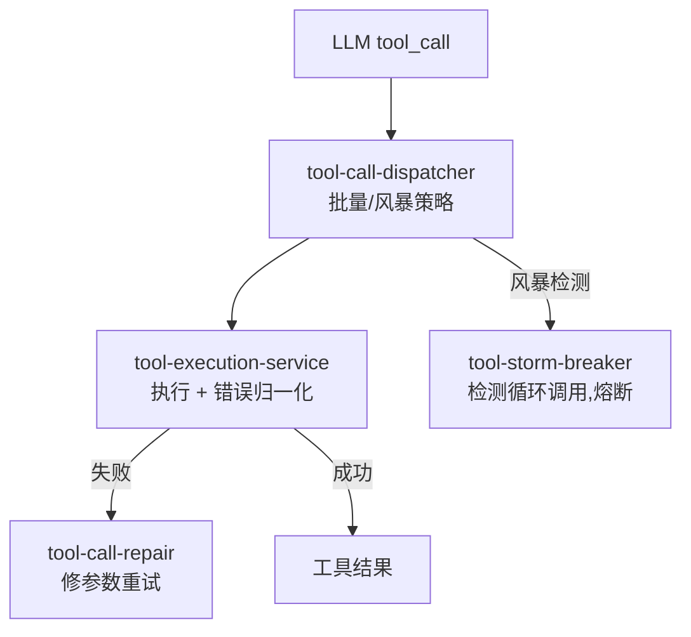

# Kun 源码阅读（六）：Tool 系统——执行、修复、风暴断路器

> 基于 [KunAgent/Kun](https://github.com/KunAgent/Kun)。

## 一句话

LLM 的 tool_call 不是"调到了就成功"——参数可能不对、格式可能出错、可能触发无限循环。Kun 的 Tool 系统分三层：执行、修复、保护。



## tool-call-repair：LLM 参数不对时自动修

```typescript
// kun/src/loop/tool-call-repair.ts（简化）
class ToolCallRepair {
    repair(call: ToolCall, error: string, context: RepairContext): ToolCall {
        // 常见修复策略：
        if (error.includes('not found') && call.name.includes('_')) {
            call.name = call.name.replace(/_/g, '-');           // snake_case → kebab-case
        }
        if (error.includes('missing required parameter')) {
            call.arguments = this.inferDefaultArgs(call, context);  // 补默认参数
        }
        if (error.includes('invalid JSON')) {
            call.arguments = this.repairJSON(call.rawArguments);    // 修 JSON 格式
        }
        return call;
    }
}
```

### 好在哪

不是"失败了就告诉 LLM 重试"——是**先尝试自动修复，修不好才让 LLM 重试**。三种修复是 LLM 最容易犯的三类错误：命名约定不匹配、漏参数、JSON 格式错误。

## tool-storm-breaker：熔断器

```typescript
// kun/src/loop/tool-storm-breaker.ts（简化）
class ToolStormBreaker {
    private callHistory: Array<{ tool: string; timestamp: number }> = [];
    private readonly windowMs = 10_000;  // 10 秒窗口
    private readonly maxCalls = 20;      // 最多 20 次

    check(toolName: string): 'allow' | 'warn' | 'block' {
        // 清理过期记录
        const cutoff = Date.now() - this.windowMs;
        this.callHistory = this.callHistory.filter(h => h.timestamp > cutoff);

        // 同一工具 10 秒内调用超过 20 次 → 熔断
        const count = this.callHistory.filter(h => h.tool === toolName).length;
        if (count > this.maxCalls) return 'block';
        if (count > this.maxCalls * 0.8) return 'warn';

        this.callHistory.push({ tool: toolName, timestamp: Date.now() });
        return 'allow';
    }
}
```

### 好在哪

LLM 有时会陷入"调工具→失败→再调→再失败"的循环（storm）。Storm Breaker 用**滑动窗口计数**检测——同一工具 10 秒内超过 20 次即熔断。不是阻止工具调用——是阻止无意义的循环。

## tool-result-image：工具结果中的图片处理

```typescript
// kun/src/loop/tool-result-image.ts（简化）
// BrowserUse 的截图结果可能超过 1MB——需要截断后持久化
function prepareBrowserUseToolResultForPersistence(result: ToolResult): ToolResult {
    if (result.imageBase64 && result.imageBase64.length > MAX_IMAGE_BYTES) {
        return {
            ...result,
            imageBase64: result.imageBase64.slice(0, MAX_IMAGE_BYTES),  // 截断
            imageTruncated: true,
        };
    }
    return result;
}
```

## 小结

| 模块 | 职责 | 关键设计 |
|---|---|---|
| `tool-execution-service` | 执行+错误归一化 | InflightTracker 防并发重复 |
| `tool-call-repair` | 参数修复 | 三种自动修复策略 |
| `tool-storm-breaker` | 熔断 | 滑动窗口 10s/20 次 |
| `tool-result-image` | 图片结果处理 | 超大截图截断 |

下一篇看 Browser Use——68KB 的管理器怎么让 Agent 操控浏览器。
