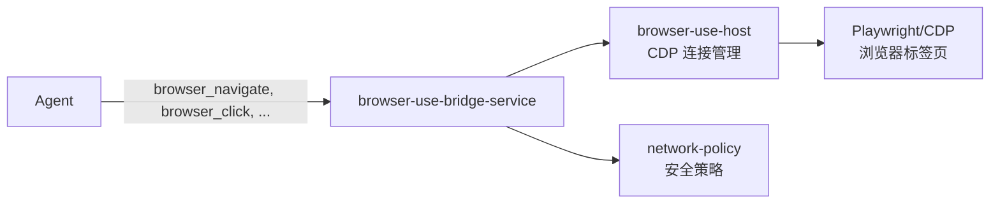

# Kun 源码阅读（七）：Browser Use——68KB 的浏览器自动化管理器

> 基于 [KunAgent/Kun](https://github.com/KunAgent/Kun)。

## 一句话

Kun 的 Agent 可以操控浏览器——打开网页、点击按钮、输入文字、截图。这一切由 `browser-use-manager.ts`（68KB）驱动，是 Kun main process 中最大的单文件。



## browser-use-manager：核心调度

```typescript
// src/main/browser-use/browser-use-manager.ts（简化）
class BrowserUseManager {
    private browsers = new Map<string, BrowserContext>();

    async navigate(url: string, opts: NavigationOptions): Promise<NavResult> {
        const ctx = await this.getOrCreateContext(opts.threadId);

        // 检查网络策略
        if (!this.networkPolicy.canAccess(url)) {
            throw new BrowserAccessDenied(url);
        }

        const page = await ctx.newPage();
        await page.goto(url, { waitUntil: 'domcontentloaded' });

        // 注入 Agent 需要的辅助脚本
        await this.injectHelpers(page);

        return { pageId: this.registerPage(page), url };
    }

    async click(pageId: string, selector: string): Promise<ClickResult> {
        const page = this.getPage(pageId);
        await page.click(selector);
        const screenshot = await page.screenshot({ type: 'png' });
        return { screenshot: screenshot.toString('base64') };
    }
}
```

### 好在哪

**每个 Agent thread 独立的浏览器上下文。** Agent A 和 Agent B 不会共享 cookie、localStorage、session。一个 Agent 的浏览器操作完全隔离——不会意外登出另一个 Agent 的账号。

## network-policy：安全边界

```typescript
// src/main/browser-use/network-policy.ts（简化）
class NetworkPolicy {
    private allowedDomains: string[] = [];
    private blockedDomains: string[] = ['localhost', '127.0.0.1', '0.0.0.0'];
    private allowedPorts: number[] = [80, 443, 8080, 8443];

    canAccess(url: string): boolean {
        const parsed = new URL(url);

        // 禁止访问内网
        if (this.isPrivate(parsed.hostname)) return false;

        // 端口白名单
        if (parsed.port && !this.allowedPorts.includes(parseInt(parsed.port))) return false;

        // 域名黑名单
        if (this.blockedDomains.some(d => parsed.hostname.includes(d))) return false;

        return true;
    }
}
```

### 好在哪

**默认拒绝内网访问。** Agent 不能访问 `localhost`、`127.0.0.1`——防止 Agent 被 prompt injection 诱导访问内部服务。端口白名单限制非标准端口。

## 工具注册

```typescript
// src/main/browser-use/register-browser-use-ipc.ts
const BROWSER_TOOLS = [
    { name: 'browser_navigate',  description: 'Navigate to a URL' },
    { name: 'browser_click',     description: 'Click an element' },
    { name: 'browser_type',      description: 'Type text into an input' },
    { name: 'browser_screenshot', description: 'Take a screenshot' },
    { name: 'browser_scroll',    description: 'Scroll the page' },
    { name: 'browser_evaluate',  description: 'Execute JavaScript' },
];
```

六个工具覆盖了浏览器自动化的主要场景——导航、点击、输入、截图、滚动、执行 JS。

## 小结

| 组件 | 做什么 |
|---|---|
| `browser-use-manager` | 浏览器生命周期+TAB管理 |
| `browser-use-bridge-service` | Agent ↔ 浏览器桥接 |
| `network-policy` | 安全边界——禁止内网+端口白名单 |
| `browser-use-host` | CDP 连接管理 |

下一篇看 Extensions 系统——Kun 的插件 SDK 怎么做到类型安全的扩展开发。
