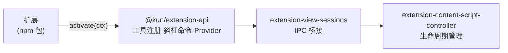

# Kun 源码阅读（八）：Extensions——类型安全的插件 SDK

> 基于 [KunAgent/Kun](https://github.com/KunAgent/Kun)。

## 一句话

Kun 的扩展系统不是"加载一个 JS 文件"——是用 NPM workspace 发布类型安全的 SDK，扩展作者只需 `npm install @kun/extension-api` 就能获得完整类型提示。扩展运行在 Electron 的渲染进程中，通过 IPC 与管理器通信。



## Extension API 设计

```typescript
// packages/extension-api/src/index.ts（简化）
export interface KunExtension {
    id: string;
    activate(context: ExtensionContext): void | Promise<void>;
    deactivate(): void | Promise<void>;
}

export interface ExtensionContext {
    registerTool(tool: ToolDefinition): Disposable;
    registerSlashCommand(cmd: SlashCommand): Disposable;
    registerProvider(provider: ProviderDefinition): Disposable;
    get workspace(): WorkspaceAPI;
    get settings(): SettingsAPI;
}

export interface Disposable {
    dispose(): void;
}
```

### 好在哪

**`Disposable` 模式**：扩展注册的所有资源（工具、命令、Provider）在扩展卸载时通过 `dispose()` 批量清理。不会出现"扩展已卸载但斜杠命令还在菜单里"。

**类型安全**：扩展作者使用 `@kun/extension-api` 包后，TypeScript 编译器检查所有调用。不是"随便传 JSON 就行"——有严格的类型约束。

## extension-consent-service：权限管理

```typescript
// src/main/extensions/extension-consent-service.ts（简化）
class ExtensionConsentService {
    private consents = new Map<string, Set<string>>();

    async requestPermission(extId: string, permission: string): Promise<boolean> {
        // 用户已授权过 → 直接通过
        if (this.consents.get(extId)?.has(permission)) return true;

        // 弹出授权对话框
        const granted = await this.showConsentDialog(extId, permission);
        if (granted) {
            if (!this.consents.has(extId)) this.consents.set(extId, new Set());
            this.consents.get(extId)!.add(permission);
        }
        return granted;
    }
}
```

### 好在哪

**运行时权限弹窗**：扩展首次请求敏感权限（文件系统、网络、shell）时弹出授权对话框——用户明确授权后才允许。这和 VS Code 的扩展权限模型一致。不是"安装时一次性授权所有"。

## extension-content-script-controller：生命周期管理

```typescript
// src/main/extensions/extension-content-script-controller.ts（简化）
class ContentScriptController {
    private scripts = new Map<string, RunningScript>();

    inject(extId: string, script: string, target: ContentScriptTarget): void {
        const id = `${extId}:${target.id}`;
        this.scripts.set(id, { extId, script, target, active: true });
        this.ipc.send(target.rendererId, 'extension:inject', { id, script });
    }

    remove(extId: string): void {
        for (const [id, s] of this.scripts) {
            if (s.extId === extId) {
                this.ipc.send(s.target.rendererId, 'extension:remove', { id });
                this.scripts.delete(id);
            }
        }
    }
}
```

## 小结

| 模块 | 做什么 |
|---|---|
| `extension-api` | SDK 类型定义 |
| `extension-consent-service` | 运行时权限弹窗 |
| `extension-content-script-controller` | 注入脚本生命周期 |
| `extension-view-sessions` | 扩展 WebView IPC 管理 |

下一篇看 IM 桥接——飞书、微信、Telegram 怎么和 Kun 互通。
