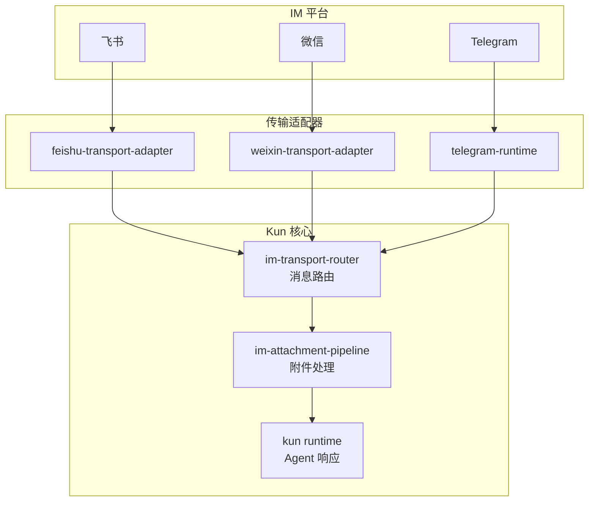

# Kun 源码阅读（九）：IM 桥接——飞书、微信、Telegram 怎么和 Agent 互通

> 基于 [KunAgent/Kun](https://github.com/KunAgent/Kun)。

## 一句话

Kun 不只是桌面应用——Agent 可以通过飞书、微信、Telegram 接收任务和回复结果。每个 IM 平台有自己的传输适配器，统一转换为 Kun 的内部消息格式。



## 统一消息格式

```typescript
// 所有 IM 消息被标准化为统一格式
interface UnifiedMessage {
    platform: 'feishu' | 'wechat' | 'telegram';
    senderId: string;
    chatId: string;
    content: string;
    attachments: Attachment[];
    threadId?: string;         // 群聊中的话题 ID
    replyTo?: string;          // 回复的目标消息 ID
}
```

## 飞书适配器

```typescript
// src/main/feishu-transport-adapter.ts（简化）
class FeishuTransportAdapter {
    private client: LarkClient;

    async onMessage(raw: LarkMessage): Promise<void> {
        const unified: UnifiedMessage = {
            platform: 'feishu',
            senderId: raw.sender.open_id,
            chatId: raw.message.chat_id,
            content: this.extractContent(raw),
            attachments: await this.processAttachments(raw),
            threadId: raw.message.thread_id,
        };

        // 推送到 Kun runtime
        await this.router.handle(unified);
    }

    async sendReply(msg: AgentReply): Promise<void> {
        await this.client.im.message.create({
            receive_id: msg.chatId,
            msg_type: 'text',
            content: JSON.stringify({ text: msg.content }),
        });
    }
}
```

### 好在哪

**平台差异被适配器吸收。** Agent 不需要知道用户的输入来自微信还是飞书——它只收到 `UnifiedMessage`。Agent 也不需要知道回复要发到哪个平台——它只返回 `AgentReply`，router 根据来源平台转发到正确的适配器。

## im-transport-router

```typescript
// src/main/im-transport-router.ts（简化）
class IMTransportRouter {
    private adapters = new Map<string, TransportAdapter>();

    register(platform: string, adapter: TransportAdapter): void {
        this.adapters.set(platform, adapter);
    }

    async handle(msg: UnifiedMessage): Promise<void> {
        // 推送到 Agent runtime
        const reply = await this.runtime.processMessage(msg);

        // 根据来源平台回发
        const adapter = this.adapters.get(msg.platform);
        if (adapter) await adapter.sendReply(reply);
    }
}
```

## im-attachment-pipeline

```typescript
// src/main/im-attachment-pipeline.ts（简化）
class AttachmentPipeline {
    async process(attachments: Attachment[]): Promise<ProcessedAttachment[]> {
        return Promise.all(attachments.map(async (att) => {
            if (att.mimeType.startsWith('image/')) {
                return this.processImage(att);     // OCR + 描述生成
            }
            if (att.mimeType === 'application/pdf') {
                return this.processPDF(att);       // 提取文本
            }
            return att;  // 其他类型原样传递
        }));
    }
}
```

用户在微信里发了一张截图 → attachment-pipeline 自动做 OCR → Agent 收到的消息里已经包含提取的文字。

## 小结

| 模块 | 做什么 |
|---|---|
| `feishu-transport-adapter` | 飞书 ↔ UnifiedMessage |
| `weixin-transport-adapter` | 微信 ↔ UnifiedMessage |
| `telegram-runtime` | Telegram ↔ UnifiedMessage |
| `im-transport-router` | 消息路由+回复分发 |
| `im-attachment-pipeline` | 附件处理（OCR/PDF） |

下一篇看全仓库优秀代码模式精选。
