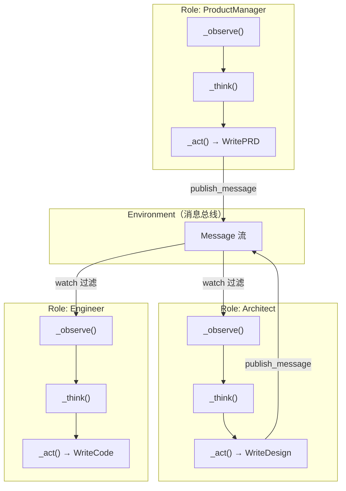
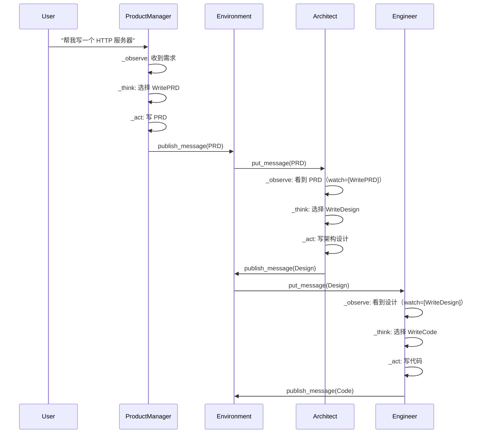

# MetaGPT 源码阅读（一）：Role、Action、Environment 三角

> 基于 MetaGPT 最新版本，[github.com/geekan/MetaGPT](https://github.com/geekan/MetaGPT)，MIT 协议，45k+ Stars，22 万行 Python。

## 一句话说清楚 MetaGPT

MetaGPT 是一个**多 Agent 协作框架**。核心理念：`Code = SOP(Team)`——给 LLM 分配软件公司的角色（产品经理、架构师、工程师），让他们按标准操作流程协作。

和单 Agent 框架（如 nanobot）的区别：nanobot 是「一个人在干活，有工具帮忙」，MetaGPT 是「一个团队在干活，有 SOP 指挥」。

## 三条主线：Role、Action、Environment



三条主线：

1. **Role** — Agent。知道自己是谁（profile）、要干什么（goal）、拥有什么能力（actions）。通过 **observe → think → act** 的循环工作。
2. **Action** — 一个 Role 能做的事。WritePRD、WriteDesign、WriteCode、RunCode…每个 Action 有自己的 LLM 调用、prompt 前缀、输入输出。
3. **Environment** — 消息总线。Role 之间不直接通信——通过 Environment 发布消息，其他 Role 通过 watch 机制订阅感兴趣的消息。

## Role：MetaGPT 的心脏

```python
# metagpt/roles/role.py
class Role(BaseRole, SerializationMixin, ContextMixin, BaseModel):
    name: str = ""
    profile: str = ""
    goal: str = ""
    actions: list[Action] = []        # 拥有的能力
    rc: RoleContext = ...             # 运行时上下文
    react_mode: RoleReactMode = ...   # 决策策略
```

每个 Role 是一个 Pydantic BaseModel——这意味着它有类型校验、序列化、默认值。配置天然是声明式的。

### Role 的三个核心方法

```python
async def _observe(self) -> int:
    """从 msg_buffer 读取新消息，按 watch 过滤感兴趣的消息"""
    news = self.rc.msg_buffer.pop_all()
    self.rc.news = [
        n for n in news 
        if n.cause_by in self.rc.watch  # 只收"关注列表"里的消息
        and n not in old_messages       # 去重
    ]
    self.rc.memory.add_batch(self.rc.news)
    return len(self.rc.news)

async def _think(self) -> bool:
    """决定下一步做什么——选一个 Action"""
    if len(self.actions) == 1:
        self._set_state(0)       # 只有一个 action → 直接选它
        return True
    
    # 用 LLM 选择下一个 state（也就是下一个 action）
    prompt = self._get_prefix() + STATE_TEMPLATE.format(
        history=self.rc.history, states="\n".join(self.states), ...
    )
    next_state = await self.llm.aask(prompt)
    self._set_state(int(next_state))
    return True

async def _act(self) -> Message:
    """执行选中的 Action"""
    response = await self.rc.todo.run(self.rc.history)
    msg = AIMessage(content=response.content, cause_by=self.rc.todo, sent_from=self)
    self.rc.memory.add(msg)
    return msg
```

这是 ReAct 模式的标准实现——_think 决定要做什么，_act 执行它。子类 Role（Engineer、ProductManager）通常只覆盖 _act 的实现细节，不需要改循环逻辑。

### 三种 react 模式

```python
class RoleReactMode(str, Enum):
    REACT = "react"            # think → act → think → act ... 动态选择
    BY_ORDER = "by_order"      # action1 → action2 → action3 ... 顺序执行
    PLAN_AND_ACT = "plan_and_act"  # 先规划再执行
```

```python
async def react(self) -> Message:
    if self.rc.react_mode == RoleReactMode.REACT:
        rsp = await self._react()         # think-act 循环
    elif self.rc.react_mode == RoleReactMode.PLAN_AND_ACT:
        rsp = await self._plan_and_act()  # 先规划 → 按计划逐步执行
```

## Action：不是函数，是 Pydantic Model

```python
# metagpt/actions/action.py
class Action(SerializationMixin, ContextMixin, BaseModel):
    name: str = ""
    prefix: str = ""      # system message 前缀
    desc: str = ""        # 描述（给 skill manager 用）
    node: ActionNode = None  # 输入/输出 Schema
```

Action 是 Pydantic 模型——不是普通 Python 函数。它自带 LLM 调用、prompt 管理、输入输出 Schema 定义。一个 WriteCode Action 看起来像这样：

```python
class WriteCode(Action):
    name: str = "WriteCode"
    i_context: CodingContext = None   # 输入上下文（需求、设计文档）
    
    async def run(self, history, *args, **kwargs) -> ActionOutput:
        prompt = self._build_prompt(history)
        rsp = await self.llm.aask(prompt)
        return ActionOutput(content=rsp, instruct_content=parsed_code)
```

### ActionNode：结构化输出

ActionNode 是 MetaGPT 里最精妙的设计——它定义 Action 的输入/输出 Schema，让 LLM 返回**结构化数据**而不是自由文本：

```python
# 一个 ActionNode 例子：要求 LLM 返回 JSON
WRITE_PRD_NODE = ActionNode(
    key="Programming Language", 
    expected_type=str,
    instruction="Which programming language?",
    example="Python"
)
```

当 Action 的 `node` 字段不为 None 时，`run()` 会强制 LLM 按这个 Schema 填充字段——保证输出是机器可解析的。

## Environment：消息总线

```python
# metagpt/environment/base_env.py
class Environment(ExtEnv):
    members: dict[str, Role] = {}   # role_name → Role
    roles: dict[str, Role] = {}     # role profile → Role
    
    def publish_message(self, msg: Message):
        """广播消息给所有 Role"""
        for role in self.roles.values():
            if msg.sent_from != role.name:  # 不给自己发
                role.put_message(msg)
```

Role 不直接引用其他 Role。所有通信通过 Environment 中转——这和 nanobot 的 MessageBus 是同一种解耦思路。

## 一次完整的协作流程

从「帮我写一个 HTTP 服务器」到代码产出：



每个 Role 只关心自己能处理的输入（通过 `watch` 订阅），产出后发布到环境。下游 Role 看到自己关注的消息就自动触发。

## 小结

MetaGPT 的架构核心是三个类的组合：

| 类 | 角色 | 类比 |
|---|---|---|
| Role | 公司员工 | 知道自己是谁、会干什么、接到任务后怎么做 |
| Action | 员工技能 | 写 PRD、写代码、跑测试——每项技能自带 prompt |
| Environment | 办公室消息板 | 员工不直接互相喊话，通过消息板传递 |

理解了这个三角，后面看 Engineer 为什么 512 行、看 SoftwareEnv 怎么模拟软件公司、看 ActionNode 怎么做结构化输出，就有坐标系了。

下一篇讲 Role 系统的内部运作——三种 react 模式的区别、RoleContext 的状态管理、以及 Engineer 为什么是 MetaGPT 里最复杂的 Role。
