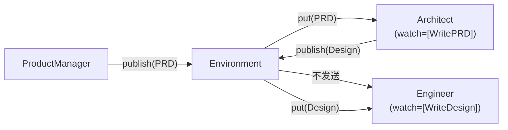

# MetaGPT 源码阅读（三）：Environment 与消息系统——多 Agent 如何协作

> 基于 MetaGPT 最新版本。

## 问题：10 个 Agent 怎么互相对话

最 naive 的方案：每个 Agent 拿到其他 9 个 Agent 的引用，直接调方法。但这样 Agent 之间是硬耦合——加一个新 Agent 要改所有地方的代码。

MetaGPT 的解法：**Environment 是消息总线**。Agent 不直接通信，所有消息通过 Environment 中转。一个 Agent 发布消息，Environment 负责分发给关注这条消息的其他 Agent。



## Message：唯一的通信原语

```python
# metagpt/schema.py
class Message(BaseModel):
    id: str = ""                    # 唯一标识（去重用）
    content: str = ""               # 消息内容
    instruct_content: Any = None    # 结构化内容（代码 AST、JSON 等）
    role: str = "user"              # user / assistant
    cause_by: str = ""              # 由哪个 Action 产生的
    sent_from: str = ""             # 由哪个 Role 发送的
    send_to: set[str] = {"all"}     # 发送给谁
```

三个关键字段决定了消息的路由：

**`cause_by` — 消息的类型标签**

```python
# ProductManager 写 PRD
msg = Message(content=prd_text, cause_by=WritePRD, sent_from="Alice")
# ↑ cause_by 是 Action 类型，不是内容摘要

# Architect 关注 PRD
architect.watch = {WritePRD}   # "我只关心 WritePRD 产生的消息"
```

`cause_by` 不是自由文本标签——它是 Action 类型的引用。Engineer 的 `watch` 里可能有 `{WriteDesign, WriteTasks, FixBug}`，意思是"我关心架构师的设计文档、项目经理的任务分配、以及需要修的 bug"。

**`sent_from` — 谁发的**

用于防止自己收到自己的消息，也用于调试追踪。

**`send_to` — 路由目标**

```python
# 发给所有人（默认）
msg.send_to = {"all"}

# 指定接收者
msg.send_to = {"Engineer", "QaEngineer"}

# 发给自己（内部消息，不经过 Environment）
msg.send_to = {MESSAGE_ROUTE_TO_SELF}
```

## Environment：消息总线的实现

### 基础 Environment：纯消息中转

```python
# metagpt/environment/base_env.py
class Environment(ExtEnv):
    members: dict[str, Role] = {}
    roles: dict[str, Role] = {}
    
    def publish_message(self, msg: Message):
        for role in self.roles.values():
            if msg.sent_from != role.name:
                role.put_message(msg)   # 推送到每个 Role 的 msg_buffer
```

最基础的实现：一条消息，发给所有 Role。Role 自己在 `_observe` 里按 `watch` 过滤。

### SoftwareEnv：模拟软件公司的完整环境

MetaGPT 真正的"多 Agent 软件公司"在 `SoftwareEnv` 中实现：

```python
# metagpt/environment/software/software_env.py
class SoftwareEnv(Environment):
    """模拟一个软件公司：有 PM、Architect、Engineer、QA"""
    
    def __init__(self, **kwargs):
        super().__init__(**kwargs)
        self.add_roles([
            ProductManager(),
            Architect(),
            Engineer(),
            QaEngineer(),
        ])
```

`add_roles` 不只是放进去——它会设置每个 Role 的 `rc.env` 引用，让 Role 知道自己在哪个 Environment 里。然后 Role 的 `_get_prefix()` 方法就能用到环境信息：

```python
def _get_prefix(self):
    if self.rc.env and self.rc.env.desc:
        other_role_names = ", ".join([r for r in all_roles if r != self.name])
        env_desc = f"You are in {self.rc.env.desc} with roles({other_role_names})."
        prefix += env_desc
    return prefix
```

这使得每个 Role 的系统 prompt 里包含了"你正在和谁一起工作"——产品经理知道架构师和工程师存在，工程师知道有 QA 会审查自己的代码。

## 消息的完整旅程

从 ProductManager 写完 PRD 到 Engineer 开始写代码：

```
1. PM._act() → WritePRD.run() → 返回 PRD 文本
2. PM._act() → AIMessage(content=PRD, cause_by=WritePRD, sent_from="Alice")
3. PM.publish_message(msg)
   └→ Environment.publish_message(msg)
       └→ for role in self.roles:
           └→ role.put_message(msg)  # 推送到每个 Role 的 msg_buffer
4. Engineer._observe()
   ├→ news = self.rc.msg_buffer.pop_all()
   ├→ 过滤: n for n in news if n.cause_by in self.rc.watch
   │   └→ WritePRD ∈ Engineer.watch? 
   │       → Engineer 不 watch WritePRD！  ← 关键：Engineer 不关心 PRD
   │       → 这条消息被丢弃
   └→ Architect._observe()
       └→ WritePRD ∈ Architect.watch? → YES
           → 消息存入 Architect.memory
5. Architect._think() → 选择 WriteDesign
6. Architect._act() → WriteDesign.run() → 返回设计文档
7. Architect.publish_message(msg)
   └→ ...Engineer._observe()
       └→ WriteDesign ∈ Engineer.watch? → YES
           → 消息存入 Engineer.memory
8. Engineer._think() → 选择 WriteCode
9. Engineer._act() → 开始写代码
```

**关键理解**：Engineer 看不到 PRD——它只能看到架构师产出的设计文档。这模拟了真实软件公司的信息流——产品经理不直接给工程师布置任务，通过架构师转译。

## Memory：不只是列表

```python
class Memory(BaseModel):
    storage: list[Message] = []
    index: DefaultDict[str, list[Message]] = {}  # cause_by → messages
    
    def add(self, message: Message):
        if message in self.storage:
            return                        # 去重
        self.storage.append(message)
        if message.cause_by:
            self.index[message.cause_by].append(message)  # 建索引
    
    def get_by_action(self, action: Type[Action]) -> list[Message]:
        """按 Action 类型检索消息"""
        return self.index.get(action.__name__, [])
```

Memory 不只是 `list[Message]`——它是一个**带索引的存储**。`index` 按 `cause_by` 字段建索引，所以 `memory.get_by_action(WriteDesign)` 能在 O(1) 时间内找到所有架构设计文档。

`RoleContext.important_memory` 属性就是利用索引实现的：

```python
@property
def important_memory(self) -> list[Message]:
    """只返回 watch 列表中的 Action 产生的消息"""
    return self.memory.get_by_actions(self.watch)
```

## MessageQueue：异步追加

```python
class MessageQueue(BaseModel):
    queue: list[Message] = []
    
    def push(self, message: Message):
        self.queue.append(message)
    
    def pop_all(self) -> list[Message]:
        """弹出所有消息并清空队列"""
        result = list(self.queue)
        self.queue.clear()
        return result
```

`MessageQueue` 是 `msg_buffer` 的底层实现——和 nanobot 的 `asyncio.Queue` 类似，但 MetaGPT 用的是同步列表。这是因为 MetaGPT 的 Role 之间是**串行协作**（A 完成才到 B），不需要异步队列。

## 和 nanobot MessageBus 的对比

| | MetaGPT Environment | nanobot MessageBus |
|---|---|---|
| 通信方式 | 同步 push → 批量 pop | 异步 `asyncio.Queue` |
| 消息过滤 | `watch` + `cause_by` | metadata 标记 |
| 路由策略 | 广播 → Role 自行过滤 | Channel 按名称路由 |
| 并发模型 | 串行（A 完成 → B 开始） | 并发（多个 session 同时处理） |
| 去重 | Memory.storage 检查 | session key 检查 |

MetaGPT 的"串行"是有意为之——模拟软件公司的流水线（PRD → 设计 → 编码 → 测试）。nanobot 的"并发"也是有意为之——多个用户同时在 Telegram/Discord 上聊天。**架构选择反映业务假设。**

## 小结

消息系统的三个设计层次：

| 层次 | 组件 | 职责 |
|---|---|---|
| 消息定义 | `Message` | cause_by（类型）、send_to（路由）、content（内容） |
| 消息分发 | `Environment` | 广播 → 每个 Role 的 msg_buffer |
| 消息消费 | `Role._observe()` | watch 过滤 → memory 存储 → 去重 |

最值得学的设计：
- **cause_by 作为消息类型系统**——不是字符串标签，是 Action 类型引用
- **watch 订阅模式**——每个 Role 声明它关心什么，不轮询所有消息
- **Memory 的 action 索引**——按消息类型检索，O(1) 查找
- **message buffer 和 memory 分离**——接收和存储是独立阶段

下一篇是最后一篇——从 MetaGPT 的源码中提炼出值得学习的 8 个设计模式和编码实践。
