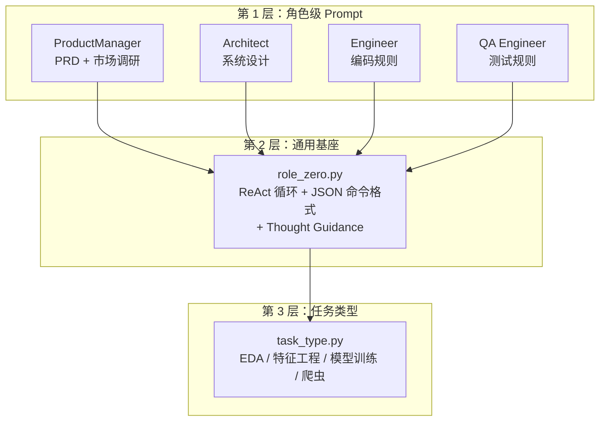

# MetaGPT 源码阅读（五）：Prompt 系统——AI Agent 的真正壁垒

> 基于 MetaGPT 最新版本。每个关键 prompt 附中英双语对照。

前三篇讲了 Role、Action、Environment 的架构。这一篇讲 MetaGPT 最被低估的部分——**Prompt 工程**。

代码架构是骨架，Prompt 是血肉。MetaGPT 的 17 个 prompt 文件里藏着 AI Agent 框架真正难做的东西：**怎么让 LLM 按照"软件公司的 SOP"思考和行动**。

## Prompt 的分层架构



三层设计：

1. **角色 Prompt**：每个 Role 自己的专业指令——PM 知道怎么写 PRD，Architect 知道怎么设计系统
2. **通用基座（role_zero.py）**：所有 Role 共享的基础指令——ReAct 循环、JSON 输出格式、异常处理
3. **任务类型 Prompt**：跨角色的场景指令——做 EDA 时注意什么、训练模型时用什么算法

## 第 1 层：角色 Prompt

### ProductManager：最长的 Prompt（170 行）

PM 的 prompt 是一份**完整的 PRD 写作规范**。

**英文原文：**

> You are a product manager AI assistant specializing in product requirement documentation and market research analysis.
>
> ## Mode 1: PRD Creation
> ### Required Fields
> 1. Language & Project Info
>    - Programming Language: If not specified, use Vite, React, MUI, Tailwind CSS.
> 2. Product Definition
>    - Product Goals: 3 clear, orthogonal goals
>    - User Stories: 3-5 scenarios in "As a [role]..." format
>    - Competitive Analysis: 5-7 products with pros/cons
>    - Competitive Quadrant Chart: Using Mermaid
> 3. Technical Specifications
>    - Requirements Pool: P0/P1/P2 priorities

**中文对照：**

> 你是一名产品经理 AI 助手，专注于产品需求文档和市场调研分析。
>
> ## 模式 1：PRD 创建
> ### 必填字段
> 1. 语言与项目信息
>    - 编程语言：如未指定，使用 Vite、React、MUI、Tailwind CSS
> 2. 产品定义
>    - 产品目标：3 个清晰、相互独立的目标
>    - 用户故事：3-5 个场景，格式"作为[角色]，我想要[功能]，以便[收益]"
>    - 竞品分析：5-7 个产品，含优劣势
>    - 竞品象限图：使用 Mermaid 绘制
> 3. 技术规格
>    - 需求池：按 P0/P1/P2 优先级排列

**市场调研模式：**

> 英文原文：
> ## Mode 2: Market Research
> Must follow this strict information gathering process:
> 1. Keyword Generation: Infer 3 distinct keyword groups
> 2. Search Process: Use SearchEnhancedQA TOOL, collect top 3 per keyword
> 3. Information Analysis: Read and analyze EACH unique source individually
> 4. Quality Control: Verify data consistency, fill gaps with targeted research
> ### Report Structure
> Summary → Industry Overview (800+ words) → Market Analysis → Competitor Landscape → Target Audience → Pricing → Key Findings → Strategic Recommendations

> 中文对照：
> ## 模式 2：市场调研
> 必须遵循严格的信息收集流程：
> 1. 关键词生成：基于用户需求，推断 3 组不同的关键词
> 2. 搜索流程：使用 SearchEnhancedQA 工具，每个关键词收集前 3 条
> 3. 信息分析：逐一阅读并分析每个独立来源
> 4. 质量控制：验证数据一致性，通过定向补充研究填补空白
> ### 报告结构
> 摘要 → 行业概览（800 字以上）→ 市场分析 → 竞争格局 → 目标用户 → 定价 → 核心发现 → 战略建议

关键设计：prompt 里明确要求「Use Mermaid quadrantChart」——PM 不需要自己决定"要不要画图"，prompt 已经替它决定了。

### Architect：带模板和示例

> 英文原文：
> You are an architect. Your task is to design a software system.
> 1. If PRD is provided, read it first.
> 2. Default: Vite, React, MUI and Tailwind CSS.
> 3. System design MUST include:
>    - Implementation approach: analyze difficult points, choose open-source framework
>    - File list (relative paths only)
>    - Data structures and interfaces (mermaid classDiagram, VERY DETAILED)
>    - Program call flow (sequenceDiagram, COMPLETE and VERY DETAILED)
>    - Anything UNCLEAR: mention and try to clarify

> 中文对照：
> 你是一名架构师。你的任务是设计一个满足需求的软件系统。
> 1. 如果提供了 PRD，先仔细阅读
> 2. 默认技术栈：Vite、React、MUI 和 Tailwind CSS
> 3. 系统设计必须包含：
>    - 实现方案：分析需求难点，选择合适的开源框架
>    - 文件清单（仅需相对路径）
>    - 数据结构与接口（mermaid classDiagram，极其详细）
>    - 程序调用流程（sequenceDiagram，完整且极其详细）
>    - 不明确事项：列出并尝试澄清

### Engineer：29 条编码铁律（完整版，中英对照）

这些不是"最佳实践建议"——是**从无数次 LLM 出错中总结出来的防护网**。

#### 编辑器操作（1-8）

| # | English | 中文 |
|---|---------|------|
| 1 | Jump to specific lines with `Editor.goto_line`, NOT `scroll_down` | 跳转到特定行用 `goto_line`，不要反复 `scroll_down` |
| 2 | Always check current working directory and open file; they may differ. Commands like `create` change the open file | 时刻确认当前工作目录和打开的文件；它们可能不在同一位置。`create` 等命令会改变打开的文件 |
| 3 | When `edit_file_by_replace` fails to match, consider indentation differences | 替换匹配失败时，考虑缩进差异后重试 |
| 4 | After editing, verify line numbers and indentation. Adhere to PEP8 | 编辑后验证行号和缩进。Python 遵循 PEP8 |
| 5 | Indentation matters! If edit fails, retry with corrected indentation. Don't repeat the same failing command | 缩进非常重要！编辑失败就修正缩进重试，不要不加改动地重复 |
| 6 | To avoid syntax errors from multiple edits: open the file, view surrounding context, modify based on context | 为避免多次编辑的语法错误：打开文件查看错误行上下文，基于上下文修改 |
| 7 | Observe the currently open file and working directory displayed after the open file | 务必观察当前打开的文件和工作目录 |
| 8 | Use search commands (`search_dir`, `search_file`, `find_file`) and navigation (`open_file`, `goto_line`) effectively | 有效使用搜索和导航命令定位文件 |

#### 编辑限制（9-13）

| # | English | 中文 |
|---|---------|------|
| 9 | When edit fails, enlarge the range of matching code | 编辑失败时，扩大匹配的代码范围 |
| 10 | MUST `Editor.open_file` before editing. Opening a new file auto-closes the previous | 编辑前必须先 `open_file`。打开新文件自动关闭旧文件 |
| 11 | Line numbers change after `insert_content_at_line` / `edit_file_by_replace`. Perform only FIRST operation in current response, defer rest to next turn | 行号在插入/替换后会改变。当前回复只做第一个操作，其余延后 |
| 11.1 | Do NOT use `insert_content_at_line` or `edit_file_by_replace` more than ONCE per command list | 每次命令列表中，插入或替换操作不能超过一次 |
| 12 | With `insert_content_at_line`, ensure NO duplication with original code. Use `edit_file_by_replace` if there is overlap | 插入时必须确保不与原代码重复。有重叠改用替换 |
| 13 | With `edit_file_by_replace`, the original code must match from line start to line end | 替换时原始代码必须从行首匹配到行尾 |

#### 文件与项目组织（14-20）

| # | English | 中文 |
|---|---------|------|
| 14 | Write files in `"{{project_name}}_{timestamp}"` folder when not specified | 未指定时，文件写在"项目名_时间戳"文件夹 |
| 15 | Read system design / project schedule FIRST, then adhere to ALL prescribed files, languages, packages | 先读系统设计/项目计划，严格遵循所有规定的文件、语言、包 |
| 16 | When planning: list files first, then outline all coding tasks in first response | 制定计划时：先列出文件，再在第一轮回复中概述所有编码任务 |
| 17 | If planning to read a file, don't include other plans in the same response | 打算读取文件时，同一轮回复不要包含其他计划 |
| 18 | Write only ONE code file each time with FULL implementation | 每次只写一个代码文件，提供完整实现 |
| 19 | Simple requirement → no plan needed, just do it | 需求简单时无需计划，直接动手 |
| 20 | Editor paths must be absolute or relative to editor's current directory | 编辑器路径必须是绝对路径或相对于编辑器当前目录 |

#### 任务规划（21-23）

| # | English | 中文 |
|---|---------|------|
| 21 | Consider whether images are needed. For showcase websites, use `ImageGetter.get_image` first | 考虑是否需要图片。展示型网站先用 `ImageGetter.get_image` 获取图片 |
| 22 | Merge multiple tasks on the SAME file into ONE task | 将同一文件的多个任务合并为一个任务 |
| 23 | Before writing unit tests: `Editor.read()` the code file first, then create ONE plan for the WHOLE file | 写单元测试前先 `Editor.read()` 读取代码文件，制定一个覆盖整个文件的计划 |

#### 技术栈（24-25）

| # | English | 中文 |
|---|---------|------|
| 24 | Priority: System Design specs > Vite/React/MUI/Tailwind > native HTML | 优先级：系统设计规范 > Vite/React/MUI/Tailwind > 原生 HTML |
| 24.1 | React template at `{react_template_path}`, Vue at `{vue_template_path}` | React 模板路径、Vue 模板路径 |
| 25.1 | Create project: `mkdir -p {{project_name}}_{timestamp}` | 创建项目文件夹 |
| 25.2 | Copy template + move in + list: `cp -r {{template}}/* ... && cd ... && pwd && tree`. SINGLE response, no other commands | 复制模板并进入，一次性回复，不夹杂其他命令 |
| 25.3 | Read `src/` files and `index.html` BEFORE making a plan | 制定计划前先读取 src 文件和 index.html |
| 25.4 | List files to rewrite/create per task. `index.html` and ALL `src/` files MUST be rewritten. Use Tailwind CSS | 每个任务列出要重写/创建的文件。index.html 和 src 全部必须重写 |
| 25.5 | After finishing: `pnpm install && pnpm run build`, then deploy using `dist/` | 项目完成后安装构建，用 dist 部署 |

#### 工具使用（26-29）

| # | English | 中文 |
|---|---------|------|
| 26 | `write_new_code` = rewrite WHOLE file. `edit_file_by_replace` = edit SMALL part | `write_new_code` 重写整个文件；`edit_file_by_replace` 编辑一小部分 |
| 27 | Deploy to public after install and build; `dist/` folder appears after build | 安装构建后部署到公网，dist 目录在构建后出现 |
| 28 | After >3 failed `edit_file_by_replace` attempts, use `write_new_code` to rewrite the whole file | 替换编辑失败超过三次，改用量写整个文件 |
| 29 | Continue work if the template path does not exist | 模板路径不存在则忽略并继续 |

---

这 29 条规则按类别统计：

| 类别 | 条数 | 核心思路 |
|---|---|---|
| 编辑器操作 | 8 | 用对工具（goto_line 不是 scroll_down）、确认上下文 |
| 编辑限制 | 5 | 一次改一处、行号会变、避免重复 |
| 文件组织 | 7 | 命名规范、读文档优先、一次一个文件 |
| 任务规划 | 3 | 合并同类任务、测试前先读代码 |
| 技术栈 | 2+5 | 优先级链 + React/Vue 模板流程 |
| 工具使用 | 3 | 全文重写 vs 小编辑、失败切换策略 |

## 第 2 层：role_zero.py——所有 Role 的共享基座

`role_zero.py` 定义了 LLM 的行为模式：怎么思考、怎么输出、怎么处理异常。

### JSON 命令格式

强制 LLM 用 JSON 数组输出命令，下游直接 `json.loads()` 解析。

> 英文：
> Output your commands in a json array. Output ONE and ONLY ONE json array.
> ```
> [{"command_name": "ClassName.method_name", "args": {"arg_name": arg_value}}]
> ```

> 中文：
> 以 JSON 数组格式输出命令。输出有且仅有一个 JSON 数组。
> ```
> [{"command_name": "类名.方法名", "args": {"参数名": 参数值}}]
> ```

### JSON 修复兜底

> 英文：
> Help check if there are any formatting issues with the JSON data? If so, please help format it. Output the JSON data in a format that can be loaded by `json.loads()`.

> 中文：
> 请检查这段 JSON 数据是否存在格式问题？如果有，请帮忙格式化修复。输出的 JSON 数据必须能被 `json.loads()` 成功加载。

### Thought Guidance——强制五步思考

> 英文：
> First, describe the actions you have taken recently.
> Second, describe the messages you have received recently, with emphasis on user messages.
> Third, describe the plan status and the current task.
> Fourth, describe any necessary human interaction. Use `RoleZero.reply_to_human` to report progress, or `RoleZero.ask_human` if you failed or are unsure.
> Fifth, describe if you should terminate. Use `end` command if: all requirements met, all tasks finished, or you're repetitively replying without progress.

> 中文：
> 第一步：描述你最近执行了哪些操作。
> 第二步：描述你最近收到了哪些消息，重点关注来自用户的消息。
> 第三步：描述当前计划状态和当前任务。
> 第四步：描述是否需要与人类交互——完成时用 `RoleZero.reply_to_human` 报告进度；失败或不确定时用 `RoleZero.ask_human` 请求帮助。
> 第五步：判断是否终止——满足以下任一条件时使用 `end`：已完成全部需求、所有任务已完成、正在重复回复无实质进展。

这不是可选的建议——LLM 在输出命令之前**必须**走完这五步。

### Quick Think——快速意图分类

> 英文：
> # Response Categories
> - QUICK: straightforward questions (common-sense, greetings, daily planning)
> - SEARCH: queries requiring up-to-date or detailed information
> - TASK: requests involving tool usage or multiple steps
> - AMBIGUOUS: unclear, missing detail, or unrealistic scope

> 中文：
> # 回复分类
> - QUICK（快速回答）：可直接回答的简单问题（常识、问候、日常规划）
> - SEARCH（搜索）：需要获取最新或详细信息的查询
> - TASK（任务）：涉及工具使用或多步骤的请求
> - AMBIGUOUS（模糊）：不清楚、缺少细节或超出能力范围

在完整的 ReAct 循环之前先跑意图分类，简单问答走 QUICK 直接回答，省大量 token。

### Task 规划与跟踪

> 英文：
> Write a plan or modify an existing plan to achieve the goal. A plan consists of 1-3 tasks. Track progress: `Plan.finish_current_task`, `Plan.append_task`, `Plan.reset_task`, `Plan.replace_task`.
> Note: If you keep encountering errors, use `RoleZero.ask_human`. Review progress — if not fulfilled, continue; otherwise finish. Each time you finish a task, report progress. Don't repeat completed tasks. End when all requirements are met.

> 中文：
> 编写计划或修改现有计划以达成目标。计划包含 1-3 个任务。跟踪进度：完成当前任务、追加新任务、重置任务、替换任务。
> 注意：持续遇到错误时请求人类帮助。审视进度——未满足则继续，否则完成。每次完成一个任务报告进度。不重复已完成的任务。所有需求满足后终止。

## 第 3 层：任务类型 Prompt——跨角色共享

**英文原文：**

| 任务 | Prompt |
|---|---|
| EDA | Distinguish column types with `select_dtypes` for tailored analysis. Remember `import numpy as np`. |
| 特征工程 | Generate diverse features. Do NOT use the label column to create features. Always `copy()` DataFrame before processing. |
| 模型训练 | For tabular: XGBoost, CatBoost, LightGBM. **Avoid SVM** (high training time). Set suitable hyperparameters. |
| 网页爬虫 | View HTML structure first before scraping. `class_` must derive from actual HTML, not assumptions. Reuse existing objects, don't mock. |

**中文对照：**

| 任务 | Prompt |
|---|---|
| EDA | 用 `select_dtypes` 区分列类型做针对性分析。记住 `import numpy as np`。 |
| 特征工程 | 生成多样化特征。不要用标签列创建特征。处理前始终 `copy()` DataFrame。 |
| 模型训练 | 表格数据用 XGBoost、CatBoost、LightGBM。**避免 SVM**（训练时间过长）。设置合适的超参数。 |
| 网页爬虫 | 先查看 HTML 结构再抓取。`class_` 必须源自实际 HTML，不能靠推测。复用已有对象，不要 mock。 |

## 三个设计原则

### 1. 指令精确度高于"礼貌"

```
# ❌ 不够精确
"Try not to edit the same file too many times."

# ✅ MetaGPT 的写法
"Do NOT use insert_content_at_line more than once per command list.
 (Because line numbers change after the first insertion.)"
```

好 prompt 的两个特征：**精确的禁止项 + 明确的原因**。

### 2. 分层复用，而非重写

```
ROLE_INSTRUCTION（基座，role_zero.py）
    + EXTRA_INSTRUCTION（角色特定，各 Role 文件）
        + TASK_TYPE_PROMPT（任务特定，task_type.py）
```

加一个新 Role 只需要写它的`EXTRA_INSTRUCTION`，基座和任务 prompt 自动继承。

### 3. 输出格式的强制约束

自由文本 → 解析噩梦。JSON 输出 → 确定性强。加上 JSON_REPAIR_PROMPT 做格式兜底。

## 和 nanobot 的对比

| | MetaGPT | nanobot |
|---|---|---|
| Prompt 组织 | 分层拼接（基座 + 角色 + 任务） | Jinja2 模板渲染 |
| 输出格式 | JSON 命令数组 | 自由文本 streaming |
| 格式校验 | JSON_REPAIR_PROMPT 自动修复 | json-repair 库 |
| Prompt 长度 | PM 170 行，Engineer 60 行 | 几十行以内 |
| 语言 | 仅英文 | 中英混合 |
| 设计哲学 | Prompt = **完整 SOP 文档** | Prompt = **上下文骨架** |

MetaGPT 的 prompt 目前**全是英文**。如果你的团队主要使用中文 LLM，把这些 prompt 翻译为中文版本直接替换，理论上可以提升理解和执行准确率。

## 小结

1. **分层继承**：基座 → 角色 → 任务，加新角色只写差异
2. **强制输出格式**：JSON 数组 + 自动修复 + 五步思考
3. **从 bug 中生长**：Engineer 的 29 条规则每一条背后都是一个被 LLM 反复犯过的错误

Prompt 工程不是「写一段好提示词」——是**把人类的 SOP 翻译成 LLM 能可靠执行的指令序列**。

---

**附：MetaGPT 完整 Prompt 文件清单**

| 文件 | 用途 |
|---|---|
| `di/role_zero.py` | 通用基座（ReAct + JSON + Thought Guidance） |
| `di/engineer2.py` | 工程师 29 条编码规则 |
| `product_manager.py` | PM：PRD 创建 + 市场调研 |
| `di/architect.py` | 架构师系统设计 |
| `di/swe_agent.py` | SWE Agent 操作示例 |
| `di/team_leader.py` | Team Leader 任务拆分 |
| `di/write_analysis_code.py` | 数据分析代码生成 |
| `di/data_analyst.py` | 数据分析师 |
| `task_type.py` | EDA/特征工程/模型训练/爬虫 |
| `summarize.py` | 对话摘要 |
| `generate_skill.md` | Skill 自动生成 |
| `invoice_ocr.py` | 发票 OCR |
| `sales.py` | 销售人员 |
| `tutorial_assistant.py` | 教程助手 |
| `metagpt_sample.py` | 公共函数库示例 |
