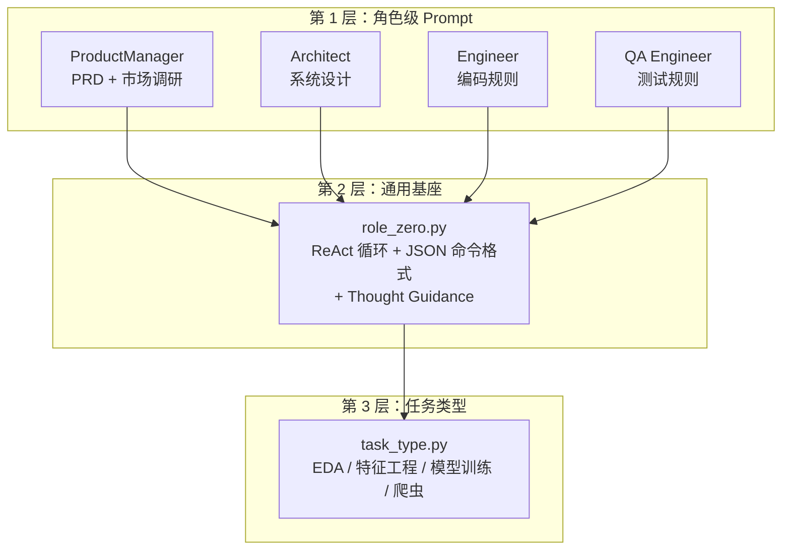

# MetaGPT 源码阅读（五）：Prompt 系统——AI Agent 的真正壁垒

> 基于 MetaGPT 最新版本。

前三篇讲了 Role、Action、Environment 的架构。这一篇讲 MetaGPT 最被低估的部分——**Prompt 工程**。

代码架构是骨架，Prompt 是血肉。MetaGPT 的 17 个 prompt 文件里藏着 AI Agent 框架真正难做的东西：**怎么让 LLM 按照"软件公司的 SOP"思考和行动**。

## Prompt 的分层架构



三层设计：

1. **角色 Prompt**：每个 Role 自己的专业指令——PM 知道怎么写 PRD，Architect 知道怎么设计系统
2. **通用基座（role_zero.py）**：所有 Role 共享的基础指令——ReAct 循环、JSON 输出格式、异常处理
3. **任务类型 Prompt**：跨角色的场景指令——做 EDA 时注意什么、训练模型时用什么算法

## 第 1 层：角色 Prompt——"你是谁、你会什么"

### ProductManager：最长的 Prompt（170 行）

PM 的 prompt 不只是一句「你是产品经理」——它是**一份完整的 PRD 写作规范**：

```
## Mode 1: PRD Creation
### Required Fields
1. Language & Project Info
   - Programming Language: If not specified, use Vite, React, MUI, Tailwind CSS.
2. Product Definition
   - Product Goals: 3 clear, orthogonal goals
   - User Stories: 3-5 scenarios in "As a [role]..." format
   - Competitive Analysis: 5-7 products with pros/cons
   - Competitive Quadrant Chart: Using Mermaid  ← 明确图表格式
3. Technical Specifications
   - Requirements Pool: P0/P1/P2 priorities
```

关键设计：「Use Mermaid quadrantChart」不是建议，是指令。PM 不需要自己决定「要不要画图」——prompt 已经替它决定了。

### Architect：带模板和示例

```python
ARCHITECT_INSTRUCTION = """
You are an architect. Your task is to design a software system.

Note:
1. If PRD is provided, read it first.
2. Default: Vite, React, MUI and Tailwind CSS.
3. System design MUST include:
   - Implementation approach
   - File list (relative paths only)
   - Data structures and interfaces (mermaid classDiagram)
   - Program call flow (sequenceDiagram, COMPLETE and VERY DETAILED)
   - Anything UNCLEAR
"""
```

注意「COMPLETE and VERY DETAILED」——这是 prompt 级别的约束。不是靠"提高 temperature"让 LLM 多写，而是在指令里明确要求。

### Engineer：24 条编码铁律

```python
EXTRA_INSTRUCTION = """
Note:
1. If you open a file at line 1, use Editor.goto_line to jump, NOT scroll_down.
2. Always check current working directory before file operations.
3. When editing, ensure PEP8 compliance.
...
10. Use Editor.open_file before editing — never edit an unopened file.
11. Do NOT use Editor.insert_content_at_line more than once per command list.
...
22. Merge multiple tasks on the same file into a single task.
24. Priority: System Design specs > Vite/React/MUI/Tailwind > native HTML
"""
```

这些规则不是"最佳实践建议"——它们是**从无数次 LLM 出错中总结出来的防护网**。比如规则 11（「不要在一次命令列表里多次 insert_content_at_line」）就是针对一个具体 bug：第一次插入改变了行号，第二次插入用旧行号就插错了位置。这不是 LLM 的问题，是工具设计的问题——但用 prompt 来规避。

## 第 2 层：role_zero.py——所有 Role 的共享基座

`role_zero.py` 是 MetaGPT prompt 系统的真正核心。它定义了 **LLM 的行为模式**：怎么思考、怎么输出、怎么处理异常。

### JSON 命令格式——不是自由文本

```
# Your commands in a json array:
```json
[
    {
        "command_name": "ClassName.method_name",
        "args": {"arg_name": arg_value}
    }
]
```
Output ONE and ONLY ONE json array.
```

强制 LLM 用 JSON 数组输出命令，而不是自由文本。这个设计让下游的 Action 解析变得确定性强——`json.loads()` 一把梭，不需要从「好的，让我来帮你写代码...」中提取有效内容。

### JSON 修复——兜底机制

```python
JSON_REPAIR_PROMPT = """
## json data
{json_data}

## json decode error
{json_decode_error}

Help check if there are any formatting issues with the JSON data?
Output the fixed JSON.
"""
```

如果 LLM 的 JSON 输出格式有问题（少了引号、多了逗号），就把原始输出 + 错误信息再喂给 LLM 修一遍。这不是一种优雅的方案——但它能兜住 90% 的格式错误。

### Thought Guidance——强制 LLM 五步思考

```python
THOUGHT_GUIDANCE = """
First, describe the actions you have taken recently.
Second, describe the messages you have received recently.
Third, describe the plan status and the current task.
Fourth, describe any necessary human interaction.
Fifth, describe if you should terminate.
"""
```

这不是可选的建议——是硬编码的思考流程。LLM 在输出命令之前**必须**走完这五步。它防止了 LLM 跳过规划直接"瞎做"。

### Quick Think——快速意图分类

```python
QUICK_THINK_SYSTEM_PROMPT = """
# Response Categories
## QUICK: straightforward questions that can be answered directly.
## SEARCH: queries requiring up-to-date or detailed information.
## TASK: requests involving tool usage or multiple steps.
## AMBIGUOUS: unclear, missing detail, or unrealistic scope.

Determine the previous message's intent.
Output: Thought: ... \n Response Category: [QUICK/SEARCH/TASK/AMBIGUOUS]
"""
```

在调用完整的 ReAct 循环之前，先跑一个轻量的意图分类。如果是简单问答（「Python 里 list 和 tuple 的区别」），走 QUICK 路径直接回答，不走行动循环。这省了大量 token。

## 第 3 层：任务类型 Prompt——跨角色共享

```python
# task_type.py
EDA_PROMPT = """
Distinguish column types with select_dtypes for tailored analysis.
Remember to `import numpy as np` before using Numpy functions.
"""

FEATURE_ENGINEERING_PROMPT = """
Generate as diverse features as possible.
Do NOT use the label column to create features.
Always copy the DataFrame before processing.
"""

MODEL_TRAIN_PROMPT = """
For tabular datasets: XGBoost, CatBoost, LightGBM...
Avoid SVM because of high training time.
Set suitable hyperparameters, make metrics as high as possible.
"""
```

不同 Role 接到不同任务类型时，动态注入对应的任务 prompt。PM 不需要知道 EDA 的注意事项，DataAnalyst 也不需要知道 PRD 的结构。

## 这套 Prompt 系统的三个设计原则

### 1. 指令的精确度远高于"礼貌"

看 Engineer 的 prompt 第 11 条：

```
Do NOT use Editor.insert_content_at_line or Editor.edit_file_by_replace
more than once per command list.
```

这不是「建议」，是硬约束。而且它解释了为什么（「因为行号会变」）。好 prompt 的两个特征：**精确的禁止项 + 明确的原因**。

### 2. 分层复用，而非重写

```
ROLE_INSTRUCTION（基座，role_zero.py）
    + EXTRA_INSTRUCTION（角色特定，各 Role 文件）
        + TASK_TYPE_PROMPT（任务特定，task_type.py）
```

每个 Role 的最终 prompt 是三层拼接的结果，不是每个 Role 重写一套。加一个新 Role 只需要写它的 `EXTRA_INSTRUCTION`，基座和任务 prompt 自动继承。

### 3. 输出格式的强制约束

```
Output ONE and ONLY ONE json array.
DON'T output multiple json arrays with thoughts between them.
Your output JSON data section MUST start with **```json [**
```

自由文本输出 → 解析噩梦。JSON 输出 → 确定性强。加上 `JSON_REPAIR_PROMPT` 做格式兜底，形成了一个完整的「格式化输出 + 自动修复」闭环。

## 和 nanobot 的 prompt 设计的对比

| | MetaGPT | nanobot |
|---|---|---|
| Prompt 组织 | 分层拼接（基座 + 角色 + 任务） | 模板文件（Jinja2 渲染） |
| 输出格式 | JSON 命令数组 | 自由文本（streaming） |
| 格式校验 | JSON_REPAIR_PROMPT 自动修复 | json-repair 库 |
| Prompt 长度 | PM 170 行，Engineer 60 行 | 几十行以内，模板组合 |
| 设计哲学 | Prompt 是**完整的 SOP 文档** | Prompt 是**上下文骨架** |

MetaGPT 的 prompt 更"重"——它把软件工程的流程管理直接编码进了 prompt。PM 的 prompt 不只是在说「你要写 PRD」，而是在说「PRD 应该包含这些章节、每章这么写、图表用 Mermaid 的 quadrantChart」。

nanobot 的 prompt 更"轻"——它依赖 Skill 系统和模板文件来灵活组合，而不是把 SOP 写进一个巨大的 prompt 字符串里。

## 小结

MetaGPT 的 prompt 系统值得学的三个点：

1. **分层继承**：基座 prompt → 角色 prompt → 任务 prompt，加新角色只需要写差异部分
2. **强制输出格式**：JSON 命令数组 + 自动修复 + Thought Guidance 五步思考流程
3. **从 bug 中生长**：Engineer 的 24 条规则不是凭空设计的——每一条背后都是一个被 LLM 反复犯过的错误

Prompt 工程不是「写一段好提示词」——是**把人类的 SOP 翻译成 LLM 能可靠执行的指令序列**。MetaGPT 的 17 个 prompt 文件，本质上是一套用自然语言编写的、给 LLM 看的软件工程方法论。
