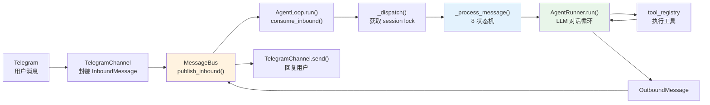
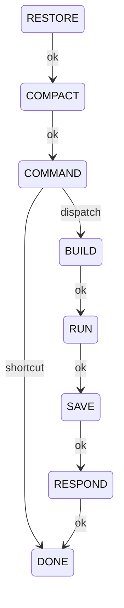

# nanobot 源码阅读（一）：架构总览——MessageBus + AgentLoop 状态机

> 基于 nanobot v0.2.1，源码地址 [github.com/HKUDS/nanobot](https://github.com/HKUDS/nanobot)。

## 一句话说清楚 nanobot 是什么

nanobot 是一个开源的轻量级 Python AI Agent 框架——你可以在 CLI 里和它聊天，也可以通过 Telegram、Discord、Slack、微信等 15+ 个平台接入它。它连接 LLM（Anthropic、OpenAI、Azure、Bedrock 等），执行工具调用（文件读写、shell 执行、网页搜索、cron 定时任务），并把结果返回给你。

架构上有三个核心设计决策：

1. **MessageBus 解耦**：Channel 和 Agent 核心之间通过异步队列通信，互不知道对方的存在
2. **AgentLoop 状态机**：每个消息处理经过 8 个明确的状态，每个状态只做一件事
3. **Per-session 序列化 + 跨 session 并发**：同一会话的消息串行处理，不同会话之间并发

这篇文章从消息流讲起，把这三件事串起来。

## 一次对话的完整旅程

用户在 Telegram 里发 "帮我查一下今天的天气"，到收到回复，中间经过了什么？



这个流程里的每一环都可以独立替换——换个 Channel，Agent 代码不用改；换个 Provider，Channel 代码不用动。解耦点就在 `MessageBus`。

## MessageBus：两个 Queue 解耦一切

```python
# nanobot/bus/queue.py
class MessageBus:
    def __init__(self):
        self.inbound: asyncio.Queue[InboundMessage] = asyncio.Queue()
        self.outbound: asyncio.Queue[OutboundMessage] = asyncio.Queue()
```

就这么简单——两个 `asyncio.Queue`。Channel 往 `inbound` 推消息，AgentLoop 从 `inbound` 消费；AgentLoop 把回复推到 `outbound`，Channel 从 `outbound` 消费。没有回调、没有事件注册、没有直接引用。

两个核心数据类也是纯 dataclass：

```python
# nanobot/bus/events.py
@dataclass
class InboundMessage:
    channel: str          # telegram, discord, slack ...
    sender_id: str        # 用户标识
    chat_id: str          # 聊天/频道标识
    content: str          # 消息文本
    media: list[str]      # 媒体 URL
    metadata: dict        # channel 特定数据
    session_key_override: str | None  # 线程级 session 覆盖

@dataclass
class OutboundMessage:
    channel: str
    chat_id: str
    content: str
    metadata: dict        # 可携带 _progress、_stream_delta 等标记
```

设计要点：`metadata` 字典是 channel 和 agent 之间传递"带外信息"的唯一通道。streaming 标记（`_wants_stream`、`_stream_delta`）、进度通知（`_progress`）、command 标记都通过 metadata 传递，不污染 message body。

## AgentLoop.run()：主循环

```python
# nanobot/agent/loop.py
async def run(self) -> None:
    self._running = True
    await self._connect_mcp()  # 连接 MCP 工具服务器

    while self._running:
        msg = await asyncio.wait_for(
            self.bus.consume_inbound(), timeout=1.0
        )
        # 1. 处理 runtime 控制消息（MCP reload 等）
        # 2. 处理优先级命令（/stop、/new 等）
        # 3. 处理 cron 延期的消息
        # 4. 如果 session 已有活跃任务 → 注入 pending queue
        # 5. 否则 → 创建新 Task 执行 _dispatch()
```

注意第 4 点——这是 nanobot 处理"同一 session 多条消息"的关键机制。如果用户在一个 session 里连续发消息，第二条不会创建新的并发 Task（那会导致竞态），而是注入到第一条的 `pending_queue` 里，在当前 turn 中间被消费。

```python
# 关键判断：session 已有活跃任务时，不创建新 Task
if effective_key in self._pending_queues:
    self._pending_queues[effective_key].put_nowait(pending_msg)
    continue

# 否则创建新 Task
task = asyncio.create_task(self._dispatch(msg))
```

## _dispatch()：Per-session 锁 + 并发控制

```python
async def _dispatch(self, msg: InboundMessage) -> None:
    session_key = self._effective_session_key(msg)
    lock = self._session_locks.setdefault(session_key, asyncio.Lock())
    gate = self._concurrency_gate  # asyncio.Semaphore，默认 3

    async with lock, gate:
        pending = asyncio.Queue(maxsize=20)
        self._pending_queues[session_key] = pending
        response = await self._process_message(msg, pending_queue=pending)
        # ...
        await self.bus.publish_outbound(response)
```

两层并发控制：

- **`asyncio.Lock`**（per session）——同一 session 的消息严格串行，防止竞态写入 session 文件
- **`asyncio.Semaphore`**（全局，默认 3）——限制同时调用的 LLM API 数量，防止 API rate limit

还有一个巧妙的 cleanup：`finally` 块里把 pending queue 里没被消费的消息重新 publish 到 bus——所以中途 `/stop` 掉一个 turn 不会丢消息。

## AgentLoop 的 8 状态机

这是 nanobot 架构中最核心的设计。每个消息被 `_process_message()` 处理时，经历 8 个状态：



实现上是一个基于状态转移表的简单状态机：

```python
# nanobot/agent/loop.py
_TRANSITIONS: dict[tuple[TurnState, str], TurnState] = {
    (TurnState.RESTORE, "ok"):       TurnState.COMPACT,
    (TurnState.COMPACT, "ok"):       TurnState.COMMAND,
    (TurnState.COMMAND, "dispatch"): TurnState.BUILD,
    (TurnState.COMMAND, "shortcut"): TurnState.DONE,
    (TurnState.BUILD, "ok"):         TurnState.RUN,
    (TurnState.RUN, "ok"):           TurnState.SAVE,
    (TurnState.SAVE, "ok"):          TurnState.RESPOND,
    (TurnState.RESPOND, "ok"):       TurnState.DONE,
}

# 驱动循环
while ctx.state is not TurnState.DONE:
    handler_name = f"_state_{ctx.state.name.lower()}"
    handler = getattr(self, handler_name)
    event = await handler(ctx)
    ctx.state = self._TRANSITIONS[(ctx.state, event)]
```

每个状态看一个方法：

### RESTORE — 恢复中断的上下文

```python
async def _state_restore(self, ctx: TurnContext) -> str:
    # 1. 处理媒体文件（图片→文本描述、文档→提取文本）
    # 2. 从 session metadata 恢复上次 /stop 中断时的 checkpoint
    # 3. 恢复"只写了 user message 但没来得及回复"的 pending 状态
    return "ok"
```

### COMPACT — Token 预算检查

```python
async def _state_compact(self, ctx: TurnContext) -> str:
    # 检查 session TTL，必要时触发 AutoCompact
    # 如果历史消息太长，触发 memory consolidation
    ctx.session, pending = self.auto_compact.prepare_session(ctx.session, ctx.session_key)
    ctx.pending_summary = pending
    return "ok"
```

### COMMAND — 命令优先检查

```python
async def _state_command(self, ctx: TurnContext) -> str:
    # 检查消息是否是 slash 命令（/model、/new、/goal 等）
    # 如果是命令且处理完毕 → "shortcut"（跳到 DONE，不调 LLM）
    # 如果不是命令 → "dispatch"（继续 BUILD）
```

### BUILD — 构建 LLM 上下文

```python
async def _state_build(self, ctx: TurnContext) -> str:
    # 1. 从 session 加载历史消息（token budget 截断）
    # 2. 加载 system prompt（BOOTSTRAP、SOUL.md、USER.md、skills）
    # 3. 构建 initial_messages（system + history + current message）
    # 4. 持久化 user message 到 session
    # 5. 建立 progress/retry 回调
    return "ok"
```

### RUN — 运行 AgentRunner

```python
async def _state_run(self, ctx: TurnContext) -> str:
    result = await self._run_agent_loop(
        ctx.initial_messages,
        session=ctx.session,
        pending_queue=ctx.pending_queue,
        # ...
    )
    ctx.final_content, ctx.tools_used, ctx.all_messages, ctx.stop_reason, ctx.had_injections = result
    return "ok"
```

### SAVE — 持久化 turn 结果

```python
async def _state_save(self, ctx: TurnContext) -> str:
    # 1. 将本 turn 的 assistant/tool 消息写入 session
    # 2. 截断超长 tool result
    # 3. 触发后台 consolidation
    # 4. 清理 pending user turn / runtime checkpoint 标记
    return "ok"
```

### RESPOND — 组装回复

```python
async def _state_respond(self, ctx: TurnContext) -> str:
    # 将 final_content 封装为 OutboundMessage
    ctx.outbound = self._assemble_outbound(...)
    return "ok"
```

### DONE — 结束

循环退出，`ctx.outbound` 被返回到 `_dispatch()` 发布到 MessageBus。

## TurnContext：连接所有状态的纽带

```python
@dataclass
class TurnContext:
    msg: InboundMessage
    session_key: str
    state: TurnState
    turn_id: str
    session: Session | None = None       # session 对象
    history: list[dict]                   # 加载的历史消息
    initial_messages: list[dict]          # 发给 LLM 的消息
    final_content: str | None = None      # LLM 最终回复
    tools_used: list[str]                 # 本 turn 使用的工具
    all_messages: list[dict]              # 完整的 LLM 交互记录
    stop_reason: str                      # "completed" | "max_iterations" | "error"
    outbound: OutboundMessage | None = None  # 要发送的回复
    trace: list[StateTraceEntry]          # 性能 trace
```

`TurnContext` 是每个消息处理的"工作台"——所有状态方法通过它共享数据。它不是全局变量，是局部创建的 dataclass。

## 为什么用状态机而不是顺序调用

你可能会问：为什么不直接写一串 await？

```python
# 伪代码：如果不是状态机，会是这样
async def process_message(msg):
    ctx = TurnContext(msg)
    await restore(ctx)
    await compact(ctx)
    if is_command(msg):
        return await handle_command(ctx)
    await build(ctx)
    await run(ctx)
    await save(ctx)
    return await respond(ctx)
```

用状态机有两个理由：

1. **可观测性**——每个状态的耗时、事件、错误都被 `StateTraceEntry` 记录，出问题时能立刻知道卡在哪个状态
2. **可扩展性**——后续版本可以插入新状态（比如加一个 `VALIDATE` 状态）而不改主循环逻辑

## _dispatch() 的 rejected message 处理

一个容易被忽略的设计：如果 pending queue 满了或者 task 取消，pending 的消息不会被丢弃：

```python
finally:
    # Drain pending queue — 没被消费的消息重新 publish 到 bus
    queue = self._pending_queues.pop(session_key, None)
    if queue is not None:
        while True:
            item = queue.get_nowait()
            await self.bus.publish_inbound(item)
```

这个行为保证了 **no message loss**——即使当前 turn 因为 `/stop` 被打断，队列里的后续消息也会作为新的 InboundMessage 被重新调度。

## 小结

nanobot 的架构可以概括为三层：

| 层 | 职责 | 解耦点 |
|---|---|---|
| Channel 层 | 接收/发送消息，平台适配 | MessageBus |
| AgentLoop 层 | 消息路由、状态管理、session 控制 | 状态机 |
| AgentRunner 层 | LLM 交互、工具执行 | ToolRegistry |

理解了这个三层模型和 8 状态机，后面看 Provider 系统、Tool 系统、Memory 系统就都有坐标系了。下一篇讲 Provider 系统——nanobot 怎么用一套接口支持 Anthropic、OpenAI、Azure、Bedrock 等十几个 LLM 后端，以及 `fallback_models` 降级机制是怎么实现的。
