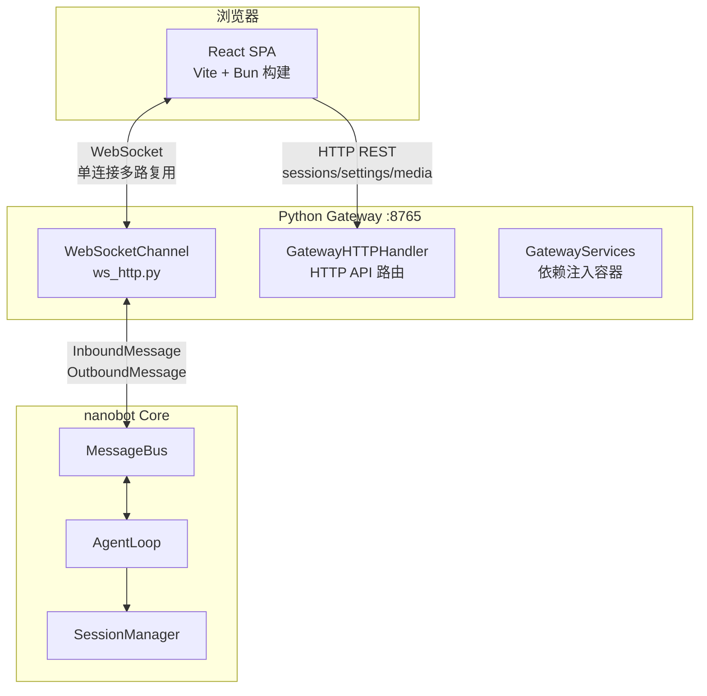

# nanobot 源码阅读（六）：WebUI 与 Gateway——前后端通信的多路复用

> 基于 nanobot v0.2.1。

## 问题：一个 WebSocket 连接，怎么同时传聊天、文件、进度、配置

nanobot 的 WebUI 是一个 React SPA（`webui/` 目录，Vite + Bun 构建），打包后嵌入 Python wheel。前端和后端（Python CLI gateway）之间只有一个 WebSocket 连接，但需要传递多种类型的数据：

- 聊天消息（流式文本）
- 工具进度通知
- 文件编辑活动
- Token 用量统计
- Session 列表
- 模型切换事件
- 配置读写

nanobot 的解法是：**在 WebSocket 通道上用 `metadata` 字段做多路复用**，每种消息类型用不同的 metadata key 标记。

## 架构全景



两个通信通道：
1. **WebSocket**：实时数据——聊天消息、流式文本、进度通知、文件编辑事件
2. **HTTP REST**：非实时数据——历史 transcript 加载、settings 读写、media 文件下载、session 列表

两者共享同一个端口（默认 8765），由 `websockets` 库的 HTTP 路由统一分发。

## GatewayServices：依赖注入容器

```python
# nanobot/webui/gateway_services.py
@dataclass(frozen=True)
class GatewayServices:
    http: GatewayHTTPHandler
    tokens: GatewayTokenStore
    media: WebUIMediaGateway
    transcripts: WebUITranscriptRecorder
    workspaces: WebUIWorkspaceController
    session_manager: Any | None
    cron_service: Any | None
    cron_pending_job_ids: Callable[[str], set[str]] | None
```

这是一个 frozen dataclass——创建后不可变，避免了 WebSocket channel 和 HTTP handler 之间共享可变状态的隐患。每个组件有明确的职责：

| 组件 | 职责 |
|---|---|
| `GatewayHTTPHandler` | REST API 路由：`/api/sessions`、`/api/settings`、`/webui/*` 等 |
| `GatewayTokenStore` | WebUI 访问令牌签发与验证 |
| `WebUIMediaGateway` | 媒体文件上传/下载/缩略图 |
| `WebUITranscriptRecorder` | 对话 transcript 记录 |
| `WebUIWorkspaceController` | workspace 创建/切换/scope 管理 |

## WebSocket 多路复用协议

WebSocket 通道本质上就是 WebSocketChannel——它和其他 channel（Telegram、Discord 等）继承同一个 `BaseChannel`，区别在于它能理解更丰富的 metadata：

```python
# 聊天消息流式传输
OutboundMessage(
    channel="websocket",
    chat_id=session_key,
    content="这是回复的第 N 个 token...",
    metadata={"_stream_delta": True, "_stream_id": "..."}
)

# 工具进度通知
OutboundMessage(
    channel="websocket",
    chat_id=session_key,
    content="正在执行 web_search...",
    metadata={"_progress": True}
)

# 文件编辑事件
OutboundMessage(
    channel="websocket",
    chat_id=session_key,
    content="",
    metadata={"_file_edit_events": [
        {"kind": "start", "path": "src/main.rs", ...},
        {"kind": "end",   "path": "src/main.rs", ...},
    ]}
)

# 模型切换通知
OutboundMessage(
    channel="websocket",
    chat_id=session_key,
    content="",
    metadata={"_runtime_model_updated": True, ...}
)
```

前端收到 WebSocket 消息后，根据 `metadata` 中的 key 分发到不同的 UI 组件。

## 流式文本的 segment 机制

一次 agent 回复可能跨越多轮 tool 调用——LLM 先思考，调用 tool，再思考，再回复。前端需要区分"这个 delta 属于哪个阶段"：

```python
# nanobot/agent/loop.py
def _current_stream_id() -> str:
    return f"{stream_base_id}:{stream_segment}"

async def on_stream(delta: str):
    meta["_stream_id"] = _current_stream_id()
    # ▸ 同一个 segment 的 delta 被前端追加到同一个 bubble

async def on_stream_end(*, resuming: bool = False):
    meta["_stream_end"] = True
    meta["_resuming"] = resuming
    # ▸ resuming=True → tool 调用即将开始
    # ▸ resuming=False → 最终回复完成
    stream_segment += 1  # 下一个 delta 属于新 segment
```

前端据此决定：
- 同一个 `_stream_id` 的 delta → 追加到当前 bubble
- `_stream_end` + `_resuming=True` → 显示"正在执行工具..."加载状态
- `_stream_end` + `_resuming=False` → 回复完成

## HTTP API 路由

`GatewayHTTPHandler` 处理所有非 WebSocket 的 HTTP 请求：

```
GET  /webui/*               → 静态文件服务（React SPA）
GET  /api/bootstrap          → 初始化数据（模型列表、channel 状态等）
GET  /api/sessions           → 会话列表
GET  /api/sessions/:id       → 会话 transcript
POST /api/settings           → 更新配置
POST /api/settings/restart   → 重启 gateway
GET  /api/media/:path        → 媒体文件下载
POST /api/workspaces         → workspace 管理
POST /auth/login             → 获取访问 token
```

这些 API 不通过 MessageBus——它们直接读取 SessionManager、Config 等 Python 对象，是同步的 HTTP 请求/响应模式。

## 安全：Token 认证

```python
# nanobot/webui/gateway_tokens.py
class GatewayTokenStore:
    def issue(self) -> str:
        """生成临时访问 token"""
    def validate(self, token: str) -> bool:
        """验证 token 是否有效"""
```

WebSocket 连接和 HTTP API 都需要 token——在首次访问 WebUI 时通过 `/auth/login` 获取，后续请求在 header 中携带。这防止了未授权的外部访问（尤其是部署在公网时）。

## 构建与部署

前端是独立的 `webui/` 目录：

```
webui/
├── src/           # React + TypeScript 源码
├── public/        # 静态资源
├── package.json   # Bun 依赖
└── vite.config.ts # Vite 配置（dev 时 proxy 到 Python gateway）
```

`bun run build` 产物输出到 `nanobot/web/dist/`——这个目录被 `pyproject.toml` 的 `[tool.hatch.build]` 包含，打包进 wheel。用户安装后，gateway 直接从 wheel 内部提供静态文件。

开发时，`bun run dev` 启动 Vite dev server，通过 proxy 把 `/api`、`/webui`、`/auth` 和 WebSocket 请求转发到 Python gateway（端口 8765）——前后端独立开发，互不干扰。

## 小结

WebUI 系统的设计要点：

| 机制 | 作用 |
|---|---|
| WebSocket 多路复用 | 单连接传输聊天、进度、文件事件、模型切换 |
| `metadata` 键分发 | 不同消息类型用不同 metadata key 标记 |
| stream segment ID | 区隔 tool 调用前后的文本片段 |
| HTTP REST API | 非实时数据（session、settings、media） |
| `GatewayServices` | frozen dataclass 依赖注入，避免共享可变状态 |
| Token 认证 | WebSocket + HTTP 统一鉴权 |

---

## 系列回顾

六篇文章覆盖了 nanobot 的核心架构：

1. **架构总览** — MessageBus 解耦 + AgentLoop 8 状态机
2. **Provider 系统** — 统一接口 + FallbackProvider + 热切换
3. **Tool 系统** — 自动发现 + 参数校验 + 并发执行 + 安全边界
4. **Session/Memory** — JSONL 持久化 + Dream 记忆巩固 + Checkpoint 恢复
5. **Channel 系统** — BaseChannel 最小接口 + 可选能力发现 + Delta 合并
6. **WebUI/Gateway** — WebSocket 多路复用 + HTTP REST + Token 认证

nanobot 的架构值得学习的地方：
- **最小接口设计**：Provider 只需要 `chat()`，Channel 只需要 `start/stop/send`
- **插件化自动发现**：Tool 和 Channel 都是 `pkgutil` 扫描 + `entry_points` 扩展
- **降级无处不在**：FallbackProvider 的 circuit breaker、consolidation 的 raw_archive、`os.replace()` 的原子写入
- **边界清晰**：MessageBus 解耦 Channel 和 AgentLoop，metadata 字典传带外信息而不污染 body
