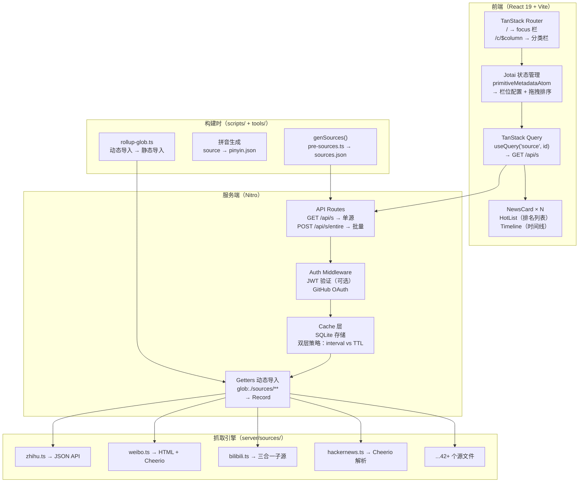
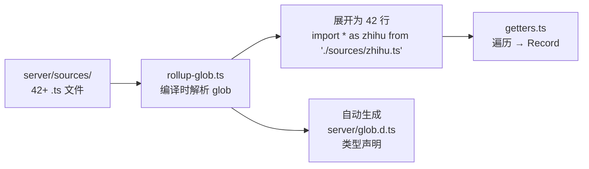
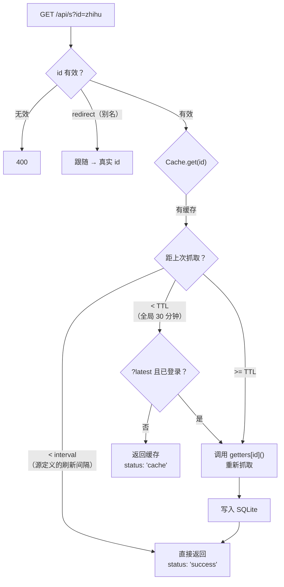
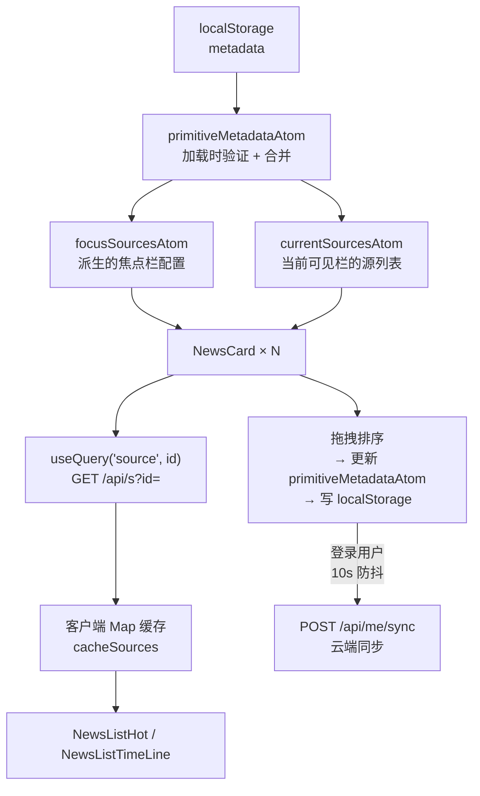

# （一）项目概览与架构全景

> 基于 newsnow v0.0.40，MIT 协议，20.7K Star。

## 这个项目解决什么问题

打开今日头条——算法推的。打开微博——热搜是别人觉得重要的。打开知乎——热榜和你关注的话题可能毫无关系。

NewsNow 做的事情很纯粹：**把 42+ 个信息源的热点拉到同一个页面，用干净的卡片布局展示，让你自己决定看什么**。不登录也能用，登录后可以定制要看哪些源、拖拽排序、跨设备同步。

20.7K Star 不是因为它用了什么新技术——用到的技术栈（React、Nitro、SQLite、Cheerio）没一个是新的——而是因为它把一个明确的需求实现了极致体验。

## 整体架构



架构的三个关键特征：

1. **前后端共享类型**——`shared/` 目录下的 types 和 sources 配置同时被 React 和 Nitro 引用
2. **构建时代码生成**——源配置（`sources.json`）、拼音索引（`pinyin.json`）、动态导入（`glob.d.ts`）全在编译期搞定
3. **双层缓存**——interval 控制新鲜度，TTL 控制 API 压力，登录用户可穿透

## 核心技术栈

| 层 | 技术 | 作用 |
|----|------|------|
| 前端框架 | React 19 | UI 渲染 |
| 路由 | TanStack Router | 栏位切换 |
| 状态 | Jotai | 栏位配置、焦点源、搜索状态 |
| 数据请求 | TanStack Query | 缓存、去重、自动刷新 |
| 样式 | UnoCSS | 原子化 CSS |
| 拖拽 | @atlaskit/pragmatic-drag-and-drop | 卡片排序 |
| 搜索 | cmdk | ⌘K 命令面板 + 拼音搜索 |
| 服务端 | Nitro | API、中间件、数据库 |
| 抓取 | Cheerio + ofetch | HTML 解析 + HTTP 请求 |
| 数据库 | SQLite（db0 抽象层） | 缓存 + 用户数据 |
| 构建 | Vite + 自定义 Rollup 插件 | glob 导入、代码生成 |

## 抓取引擎：42 个源、三种模式

这是项目最核心的模块——`server/sources/` 下每个源一个 `.ts` 文件。

### defineSource 模式

```typescript
// server/utils/source.ts
export function defineSource(
  sourceGetter: () => Promise<NewsItem[]>
): SourceGetter

export function defineSource(
  record: Record<SourceID, SourceGetter>
): Record<SourceID, SourceGetter>
```

实际使用（以知乎为例）：

```typescript
// server/sources/zhihu.ts
export default defineSource({
  zhihu: async () => {
    const url = "https://www.zhihu.com/api/v3/feed/topstory/hot-list-web?limit=20"
    const res: Res = await myFetch(url)
    return res.data.map((k) => ({
      id: k.target.link.url.match(/(\d+)$/)?.[1] ?? k.target.link.url,
      title: k.target.title_area.text,
      extra: {
        info: k.target.metrics_area.text,    // 热度数据
        hover: k.target.excerpt_area.text,    // 悬停显示摘要
      },
      url: k.target.link.url,
    }))
  },
})
```

`defineSource` 只是类型标注——运行时直接透传。它的价值在于**编译期**：TypeScript 强制每个源返回的 `NewsItem` 必须包含 `id`、`title`、`url`。

### 三种抓取策略

| 策略 | 适用源 | 示例 |
|------|--------|------|
| JSON API 直接请求 | 有公开 API 的平台 | 知乎、B站、豆瓣、掘金、少数派 |
| HTML + Cheerio 解析 | 无 API、需从页面提取 | Hacker News、GitHub Trending、微博、36氪、Product Hunt |
| RSS/XML 解析 | 有 RSS 源的站点 | Solidot、Product Hunt 降级方案 |

**JSON API 模式**（最理想）——直接 `myFetch(url)` 拿到结构化数据，映射到 `NewsItem`。B站一个文件处理三个子源：

```typescript
// server/sources/bilibili.ts
export default defineSource({
  "bilibili-hot-search": async () => { /* 热搜 API */ },
  "bilibili-hot-video":  async () => { /* 热门视频 API */ },
  "bilibili-ranking":    async () => { /* 排行榜 API */ },
})
```

**Cheerio 模式**（最灵活）——从 HTML 里提取标题、链接、排名：

```typescript
// server/sources/hackernews.ts
import * as cheerio from "cheerio"

export default defineSource(async () => {
  const html = await myFetch("https://news.ycombinator.com")
  const $ = cheerio.load(html)
  const news: NewsItem[] = []
  $(".athing").each((_, el) => {
    const a = $(el).find(".titleline a").first()
    news.push({
      id: $(el).attr("id")!,
      title: a.text(),
      url: a.attr("href")!,
    })
  })
  return news
})
```

### 文件到 ID 的映射——glob 导入 + 构建插件

`server/sources/` 下有 42+ 个文件，不可能手动 import。NewsNow 用了一个自定义 Rollup 插件做**编译期 glob 展开**：

```typescript
// server/getters.ts
// 这行在源码里是 glob 语法，构建时被插件展开为 42 行 import
const modules = await import.meta.glob("./sources/*.ts")

// 构建后等价于：
// export * as zhihu from "./sources/zhihu.ts"
// export * as weibo from "./sources/weibo.ts"
// ...

// 遍历所有已导入的模块，构建 getter 索引
export const getters: Record<SourceID, SourceGetter> = {}
for (const [path, mod] of Object.entries(modules)) {
  const exports = mod as Record<string, SourceGetter>
  for (const [key, getter] of Object.entries(exports)) {
    if (key !== "default") {
      getters[key] = getter   // "zhihu" → zhihu.ts 的 getter 函数
    }
  }
}
```

`tools/rollup-glob.ts` 这个自定义插件在 Rollup 构建阶段把 `glob:./sources/*.ts` 展开为确定的文件导入，同时自动生成 `server/glob.d.ts` 类型声明——**开发时有类型提示，构建时零运行时开销**。



## 缓存策略：两层时间窗口

这是 API 性能的核心——`server/api/s/index.ts`。



两层窗口：

| 窗口 | 时间 | 作用 |
|------|------|------|
| interval | 由源定义（2min ~ 1h） | 控制数据新鲜度——这个时间内认为数据是"新鲜的" |
| TTL | 全局 30 分钟 | 控制 API 压力——30 分钟内同一个源不会再发起外部请求 |

**关键：interval 之内连源都不碰——直接返回缓存。interval 到 TTL 之间，普通用户拿缓存，登录用户可以穿透。** 这个设计保护了上游 42 个源不被频繁请求，同时给了重度用户一个"我要最新"的入口。

缓存存在 SQLite（`server/database/cache.ts`）：

```typescript
class Cache {
  async get(key: string): Promise<CacheInfo | undefined> {
    const row = await db.select("SELECT * FROM cache WHERE id = ?", [key])
    return row ? { id: row.id, updated: row.updated, items: JSON.parse(row.data) } : undefined
  }
  async set(key: string, items: NewsItem[]) {
    await db.execute(
      "INSERT OR REPLACE INTO cache (id, updated, data) VALUES (?, ?, ?)",
      [key, Date.now(), JSON.stringify(items)]
    )
  }
}
```

## 源配置系统：human-friendly → machine-friendly

源的定义分为两层：

### 第一层：pre-sources.ts（人写的）

```typescript
// shared/pre-sources.ts
export const originSources = {
  "wallstreetcn": {
    name: "华尔街见闻", color: "blue", column: "finance",
    sub: {
      quick: { type: "realtime", interval: Time.Fast, title: "快讯" },
      news: { title: "最新", interval: Time.Common },
      hot: { type: "hottest", interval: Time.Common, title: "最热" },
    },
  },
}
```

`sub` 是这套配置的精髓——一个平台有多个榜单（华尔街见闻有快讯/最新/最热），共享同一个 `name` 和 `color`，只在 `title` 和 `interval` 上有差异。

### 第二层：sources.json（机器读的）

构建脚本 `scripts/source.ts` 调用 `genSources()` 展开 `sub` → `sources.json`：

```json
{
  "wallstreetcn":        { "redirect": "wallstreetcn-quick" },
  "wallstreetcn-quick":  { "name": "华尔街见闻", "title": "快讯", "type": "realtime", ... },
  "wallstreetcn-news":   { "name": "华尔街见闻", "title": "最新", ... },
  "wallstreetcn-hot":    { "name": "华尔街见闻", "title": "最热", "type": "hottest", ... }
}
```

第一个子源自动成为父 ID 的 redirect 目标——访问 `wallstreetcn` 实际拿到的是 `wallstreetcn-quick` 的数据。这个设计让 URL 保持语义清晰（`/sources/wallstreetcn` 而不是 `/sources/wallstreetcn-quick`），同时后端路由到最合适的子源。

### 拼音索引——支持中文搜索

```bash
scripts/source.ts 还生成 shared/pinyin.json:
# {
#   "华尔街见闻": "huaerjiejianwen",
#   "微博": "weibo",
#   ...
# }
```

前端搜索框（`cmdk`）支持中文拼音搜索——输入 "hws" 匹配 "华尔街见闻"。

## 前端架构：Jotai + TanStack Query 的状态流



两个设计决策值得注意：

1. **原子化状态**——`primitiveMetadataAtom` 是唯一真相来源，其他 atom 都是派生。拖拽排序、源开关、栏位切换全通过修改这一个 atom 实现，React 自动重渲染下游。

2. **双层缓存**——`TanStack Query` 管理服务端数据（stale time、refetch），`Map<SourceID, SourceResponse>` 做客户端内存缓存。同一页面上如果有 github 和 github-trending-today 两个卡片，只发一次 API 请求。

## 部署：一项目、多环境

```typescript
// nitro.config.ts 根据环境自动切换
export default defineNitroConfig({
  // 本地开发 / Docker
  preset: "node-server",
  database: { default: { connector: "better-sqlite3" } },

  // Cloudflare Pages
  // preset: "cloudflare-pages",
  // database: { default: { connector: "cloudflare-d1" } },

  // Vercel
  // preset: "vercel-edge",
})
```

一个配置切换四种部署方式——Nitro 的 preset 机制屏蔽了运行环境的差异。SQLite 的实现也从 `better-sqlite3`（Node）切换到 Cloudflare D1（Cloudflare Pages），但上层 API 不变。

## 设计总结

NewsNow 不是那种"用了新技术所以值得看"的项目——它用的是 React、Cheerio、SQLite 这些十几年的老技术。但它在工程层面做对了四件事：

| 设计 | 做了什么 | 为什么对 |
|------|----------|----------|
| 构建时代码生成 | glob 导入、sources.json、拼音索引全在编译期完成 | 运行时零开销，类型全链路 |
| 双层缓存 | interval 控制新鲜度，TTL 防止冲击上游 | 既保护 42 个源不被刷爆，又让用户能拿最新数据 |
| sub + redirect 配置 | 一个平台多个榜单用 sub 表达，构建时展开 | 配置简洁，运行时类型安全 |
| 原子化状态 | 一个 atom 管理全部栏位配置，派生其他一切 | 状态流向单一，拖拽排序改一行就生效 |

下一篇深入源配置系统——`sub` 怎么展开、`redirect` 怎么跟随、`genSources()` 的完整逻辑。
