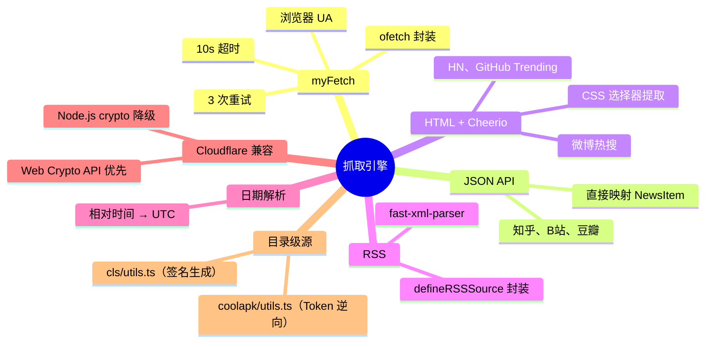

# （三）抓取引擎：42 个源、三种策略、一套工具

> 基于 newsnow v0.0.40。

## 抓取引擎的职责

42 个新闻源，每个有自己的数据格式——JSON API、HTML 页面、RSS XML。抓取引擎的职责是：**把所有这些格式统一成 `NewsItem[]`**。

```typescript
// 每个源的抓取函数最终都返回这个
type SourceGetter = () => Promise<NewsItem[]>
```

## 基础设施：myFetch

所有源的 HTTP 请求都走 `myFetch`（`server/utils/fetch.ts`）：

```typescript
import { ofetch } from "ofetch"

export const myFetch = ofetch.create({
  timeout: 10000,                           // 10 秒超时
  retry: 3,                                 // 失败重试 3 次
  retryDelay: 1000,                         // 重试间隔 1 秒
  headers: {
    "User-Agent": "Mozilla/5.0 (Macintosh; Intel Mac OS X 10_15_7) ...",
    "Accept": "text/html,application/json,...",
  },
})
```

`ofetch` 是 Nuxt 团队的 HTTP 库——比 `fetch` 多了自动重试、超时控制、自动 JSON 解析。`myFetch` 只是给它配了一个浏览器 User-Agent 和 10 秒超时。

为什么用浏览器 UA？因为很多中国新闻网站的 API 会拒绝默认的 `node-fetch` UA（返回 403）。模拟浏览器是最简单的绕过方式。

## 策略一：JSON API — 最理想的数据源

有公开 API 的平台是最好的——直接拿到结构化数据。

### 标准 JSON API：知乎

```typescript
// server/sources/zhihu.ts
interface Res {
  data: {
    target: {
      link: { url: string }
      title_area: { text: string }
      excerpt_area: { text: string }
      metrics_area: { text: string }
    }
  }[]
}

export default defineSource({
  zhihu: async () => {
    const url = "https://www.zhihu.com/api/v3/feed/topstory/hot-list-web?limit=20"
    const res: Res = await myFetch(url)

    return res.data.map((k) => ({
      id: k.target.link.url.match(/(\d+)$/)?.[1] ?? k.target.link.url,
      title: k.target.title_area.text,
      url: k.target.link.url,
      extra: {
        info: k.target.metrics_area.text,     // "1000 万热度"
        hover: k.target.excerpt_area.text,    // 悬停显示摘要
      },
    }))
  },
})
```

`id` 从 URL 中提取数字后缀——知乎文章的 URL 形如 `https://zhuanlan.zhihu.com/p/123456789`，最后的数字就是唯一 ID。如果没有数字则用完整 URL 兜底。

### 多子源 JSON API：B站

```typescript
// server/sources/bilibili.ts
export default defineSource({
  "bilibili-hot-search": async () => {
    const res = await myFetch("https://api.bilibili.com/x/web-interface/wbi/search/square?limit=50")
    return res.data.trending.list.map((k: any) => ({
      id: k.keyword,
      title: k.keyword,
      url: `https://search.bilibili.com/all?keyword=${encodeURIComponent(k.keyword)}`,
      extra: { icon: k.icon || undefined },
    }))
  },

  "bilibili-hot-video": async () => {
    const res = await myFetch("https://api.bilibili.com/x/web-interface/popular?ps=50")
    return res.data.list.map((v: any) => ({
      id: v.aid,
      title: v.title,
      url: v.short_link_v2 || `https://www.bilibili.com/video/${v.bvid}`,
      extra: {
        info: `${v.owner.name} · ${formatStat(v.stat.view)}播放`,
      },
    }))
  },

  "bilibili-ranking": async () => {
    // 第三个 API——排行榜
    const res = await myFetch("https://api.bilibili.com/x/web-interface/ranking/v2?rid=0")
    return res.data.list.map((v: any) => ({
      id: v.aid, title: v.title,
      url: `https://www.bilibili.com/video/${v.bvid}`,
      extra: {
        info: `${v.owner.name} · ${v.pts}分`,
      },
    }))
  },
})
```

三个子源各有自己的 API 端点——但它们共享同一个文件。这是约定：**同一个站的多个榜单放同一个文件**，减少文件数量和依赖碎片。

### 带认证的 JSON API：财联社

```typescript
// server/sources/cls/utils.ts
function getSearchParams() {
  const time = Math.floor(Date.now() / 1000)
  const raw = `appName=CailianpressWap&clientType=web&time=${time}`
  const sign = createHash("sha1").update(raw).digest("hex")
  return { time: String(time), sign }
}

// server/sources/cls/index.ts
const baseUrl = "https://www.cls.cn/api"
const params = getSearchParams()
const url = `${baseUrl}/sw?app=CailianpressWap&os=web&sv=8.5.5&sign=${params.sign}&time=${params.time}`
```

财联社的 API 需要签名——用 SHA-1 对参数哈希。这段代码是从网页端逆向出来的逻辑。`cls/utils.ts` 负责生成签名，`cls/index.ts` 负责抓三个榜单（电报/深度/热门）。

## 策略二：HTML + Cheerio — 没有 API 时的方案

有些平台没有公开 API，或者 API 返回的不是纯数据。这时候上 Cheerio——服务端的 jQuery。

### Hacker News

```typescript
// server/sources/hackernews.ts
import * as cheerio from "cheerio"

export default defineSource(async () => {
  const html = await myFetch("https://news.ycombinator.com")
  const $ = cheerio.load(html)
  const news: NewsItem[] = []

  $(".athing").each((_, el) => {
    const a = $(el).find(".titleline a").first()
    news.push({
      id: $(el).attr("id")!,
      title: a.text(),
      url: a.attr("href")!,
      extra: {
        info: $(el).next().find(".score").text(),  // "123 points"
      },
    })
  })

  return news
})
```

HN 的 HTML 结构很稳定——`.athing` 是新闻条目，`.titleline a` 是标题链接，下一个兄弟元素的 `.score` 是分数。Cheerio 用 jQuery 选择器写抓取逻辑，比正则表达式可靠得多。

### GitHub Trending

```typescript
// server/sources/github.ts
export default defineSource({
  "github-trending-today": async () => {
    const html = await myFetch("https://github.com/trending")
    const $ = cheerio.load(html)
    const news: NewsItem[] = []

    $("article.Box-row").each((_, el) => {
      const h2 = $(el).find("h2").first()
      const [owner, repo] = h2.text().replace(/\s/g, "").split("/")
      const description = $(el).find("p").first().text().trim()

      news.push({
        id: `${owner}/${repo}`,
        title: `${owner} / ${repo}`,
        url: `https://github.com/${owner}/${repo}`,
        extra: {
          info: $(el).find(".d-inline-block").first().text().trim()  // 今日 star 数
        },
      })
    })

    return news
  },
})
```

GitHub Trending 也没有 API——靠 Cheerio 解析页面。`article.Box-row` 是趋势列表的容器，`h2` 里的文本格式是 `owner / repo`，用 `/` 分割得到 owner 和 repo 名。

### 微博热搜

```typescript
// server/sources/weibo.ts
export default defineSource(async () => {
  const html = await myFetch("https://weibo.com/ajax/side/hotSearch")
  const res = JSON.parse(html)  // 实际上返回的是 JSON
  return res.data.realtime.map((k: any) => ({
    id: k.word_scheme || k.word,
    title: k.word,
    url: `https://s.weibo.com/weibo?q=${encodeURIComponent(k.word)}`,
    extra: {
      info: k.num ? `${Math.round(k.num / 10000)}万` : undefined,
    },
  }))
})
```

微博这个其实是个 JSON API——只是伪装成 HTML 路径（`/ajax/side/hotSearch`）。`myFetch` 返回的文本用 `JSON.parse` 解析即可。

## 策略三：RSS/XML — 标准化但受限

```typescript
// server/utils/source.ts
export function defineRSSSource(url: string): SourceGetter {
  return async () => {
    const xml = await myFetch(url)
    const parser = new XMLParser({ ignoreAttributes: false })
    const feed = parser.parse(xml)

    return feed.rss.channel.item.map((item: any) => ({
      id: item.guid || item.link,
      title: item.title,
      url: item.link,
      pubDate: item.pubDate,
    }))
  }
}
```

RSS 源的优点是格式标准——`title`、`link`、`pubDate`、`guid` 所有 RSS 都有。缺点是源在变少——很多网站已经不再维护 RSS 输出了。

```typescript
// server/sources/solidot.ts
export default defineSource(
  defineRSSSource("https://www.solidot.org/index.rss")
)
```

一行代码搞定一个源。

## 工具函数：日期解析

中国新闻网站经常用相对时间——"3 分钟前"、"今天 08:30"、"昨天"、"周一"。

```typescript
// server/utils/date.ts
function parseRelativeDate(dateStr: string): Date {
  const now = new Date()

  if (dateStr.includes("分钟前")) {
    const minutes = parseInt(dateStr)
    return new Date(now.getTime() - minutes * 60 * 1000)
  }
  if (dateStr.includes("小时前")) {
    const hours = parseInt(dateStr)
    return new Date(now.getTime() - hours * 3600 * 1000)
  }
  if (dateStr.startsWith("今天")) {
    const time = dateStr.replace("今天", "").trim()
    return setTimeOnDate(now, time)
  }
  if (dateStr.includes("昨天")) {
    const yesterday = new Date(now.getTime() - 86400000)
    return setTimeOnDate(yesterday, dateStr.replace("昨天", "").trim())
  }
  // ... 更多模式
}
```

这套解析器让所有源的 `pubDate` 统一为 UTC 时间戳——前端展示时再转回相对时间。

## 工具函数：Cloudflare 兼容

NewsNow 部署在 Cloudflare Pages 上——部分 Node.js API 不可用。

```typescript
// server/utils/crypto.ts
export async function md5(message: string) {
  // 优先用 Web Crypto API（Cloudflare Workers 支持）
  if (typeof crypto !== "undefined" && crypto.subtle) {
    const hash = await crypto.subtle.digest("MD5", encoder.encode(message))
    return Array.from(new Uint8Array(hash))
      .map(b => b.toString(16).padStart(2, "0")).join("")
  }
  // 降级到 Node.js crypto
  return createHash("md5").update(message).digest("hex")
}
```

两层实现——优先 Web Crypto API，降级 Node.js `crypto`。确保同一份代码在本地、Docker、Cloudflare Pages 上都跑得通。

## 目录级源：当单文件不够用

大多数源一个 `.ts` 文件就够。财联社和酷安需要独立的工具函数文件：

```
server/sources/cls/
├── index.ts    # 三个抓取函数（telegraph, depth, hot）
└── utils.ts    # SHA-1 签名生成

server/sources/coolapk/
├── index.ts    # 热门动态抓取
└── utils.ts    # 逆向的 App Token 生成
```

酷安的 API 需要设备 ID + 时间戳哈希的 App Token。这段逻辑是从 RSSHub 移植过来的——一个开源社区的逆向成果在项目之间流动。

## glob 导入系统：自动发现源

`server/getters.ts` 不需要手动列出 42 个源文件：

```typescript
// 这行 glob 在构建时被 rollup-glob.ts 展开
const modules = import.meta.glob("./sources/*.ts")

// 遍历所有已导入的模块，构建函数索引
export const getters: Record<string, SourceGetter> = {}
for (const [path, mod] of Object.entries(modules)) {
  const exports = mod as Record<string, any>
  for (const [key, getter] of Object.entries(exports)) {
    if (key !== "default") {
      getters[key] = getter
    }
  }
}
```

加一个新源不需要改任何其他文件——创建一个新的 `server/sources/xxx.ts`，构建系统自动发现。

## 小结

抓取引擎的设计哲学：**给 42 个不同的数据源一个统一的函数签名，其余交给每个文件自己处理**。



下一篇看 API 层和缓存——`/api/s` 怎么协调缓存和抓取、`waitUntil` 怎么在 Cloudflare Workers 上做异步写入。
