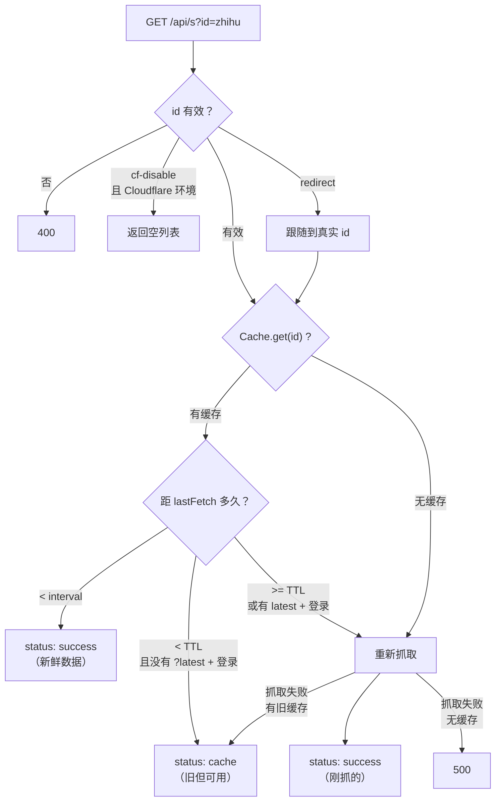
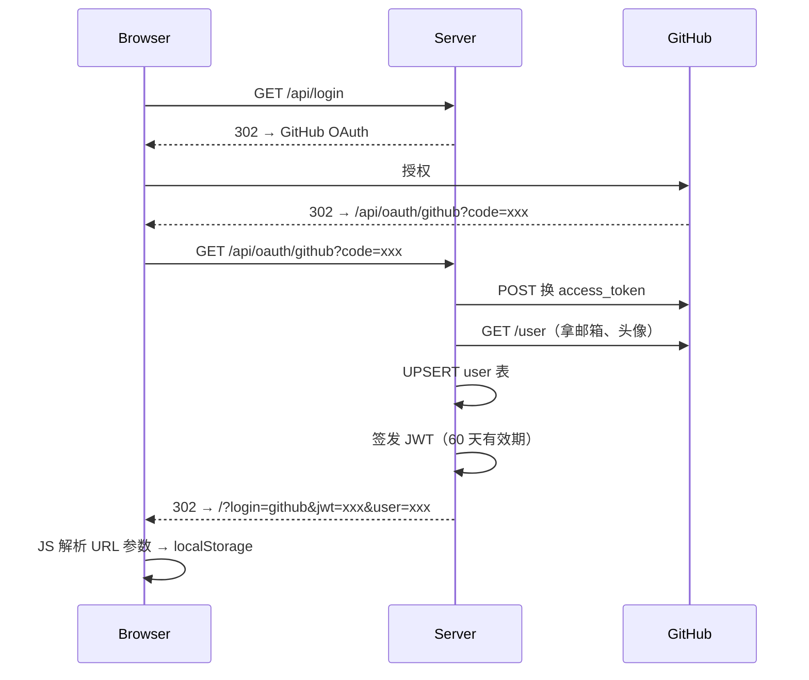
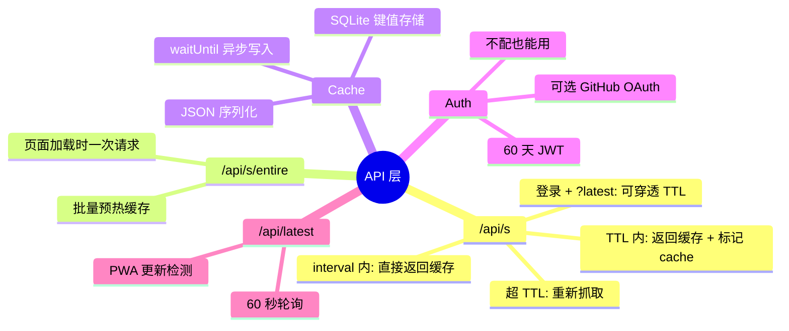

# （四）API 层、缓存策略与认证

> 基于 newsnow v0.0.40。

## API 设计的最小化原则

NewsNow 只有 6 个 API 端点：

| 方法 | 路径 | 用途 |
|------|------|------|
| GET | `/api/s` | 获取单个源的新闻 |
| POST | `/api/s/entire` | 批量获取所有可见源（页面加载时预热缓存） |
| GET | `/api/latest` | 返回当前版本号（PWA 更新检测） |
| GET | `/api/login` | 跳转 GitHub OAuth |
| GET | `/api/oauth/github` | OAuth 回调 |
| GET | `/api/me` | 获取用户状态 |
| POST | `/api/me/sync` | 同步用户栏位配置 |

核心端点就两个——`/api/s` 和 `/api/s/entire`。其他都是辅助。

## `/api/s`：缓存与抓取的协调器

这是整个项目最复杂的函数——约 120 行的缓存状态机。

```typescript
// server/api/s/index.ts（简化）
export default defineEventHandler(async (event) => {
  const query = getQuery(event)
  const id = query.id as string

  // 1. 验证源 ID
  if (!(id in sources)) throw createError({ statusCode: 400 })
  const source = sources[id]

  // 2. 如果源被标记为 cf-disable，在 Cloudflare 环境返回空
  if (import.meta.env.CF && source.disable === "cf") {
    return { status: "success", id, items: [], updatedTime: Date.now() }
  }

  // 3. 处理 redirect
  let realId = id
  while (sources[realId]?.redirect) {
    realId = sources[realId].redirect!
  }

  // 4. 检查缓存
  const cached = await Cache.get(realId)
  if (cached) {
    const elapsed = Date.now() - cached.updated
    const interval = source.interval || Interval

    if (elapsed < interval) {
      // 还在 interval 内——数据是新鲜的，直接返回
      return { status: "success", id: realId, items: cached.items, updatedTime: cached.updated }
    }
    if (elapsed < TTL && !(query.latest && isLoggedIn(event))) {
      // 不在 interval 但在 TTL 内——返回缓存，标记为 cache
      return { status: "cache", id: realId, items: cached.items, updatedTime: cached.updated }
    }
  }

  // 5. 缓存失效或不存在——重新抓取
  try {
    const getter = getters[realId]
    const items = (await getter()).slice(0, 30)

    // 异步写入缓存（不阻塞响应）
    event.waitUntil(Cache.set(realId, items))

    return { status: "success", id: realId, items, updatedTime: Date.now() }
  } catch (e) {
    // 6. 抓取失败但有旧缓存——降级返回旧数据
    if (cached) {
      return { status: "cache", id: realId, items: cached.items, updatedTime: cached.updated }
    }
    throw createError({ statusCode: 500, statusMessage: `无法获取 ${realId}` })
  }
})
```

### 状态机图解



### 三个时间概念

```
   0                       interval                  TTL (30 min)
   ├──────────────────────────┤──────────────────────────┤
   │                          │                          │
   │  直接返回缓存              │  普通用户返回缓存         │  重新抓取
   │  status: "success"        │  ?latest+登录可穿透      │  （所有人）
   │  （新鲜数据）              │  status: "cache"         │
   │                          │                          │
```

- **interval**：由源配置定义（微博 2min，GitHub 60min）。此时间内数据被认为是"绝对新鲜"的
- **TTL**：全局常量 30 分钟。超过 interval 但未超 TTL，缓存仍可用，但标记 `status: "cache"`
- **登录穿透**：`?latest=true` + 有效 JWT → 在 TTL 窗口内也能触发新鲜抓取

### 为什么这样设计

如果每个用户访问都触发一次抓取 → 42 个源每秒被请求 N 次 → IP 被封。

如果缓存 30 分钟不动 → 用户看到的内容是过时的 → 失去实时性。

两层窗口是妥协：**interval 保证每个源不会被过度请求，TTL 提供兜底，登录穿透给重度用户**。

### waitUntil：Cloudflare Workers 的异步写入

```typescript
event.waitUntil(Cache.set(realId, items))
```

在 Cloudflare Pages / Workers 环境，主响应返回后 CPU 时间就终止了。`waitUntil` 告诉运行时："这个 Promise 还没完，等我执行完再回收"——这样缓存写入不阻塞 API 响应，用户拿到的响应更快。

## POST /api/s/entire：批量预热

```typescript
// server/api/s/entire.post.ts
export default defineEventHandler(async (event) => {
  const body = await readBody(event)
  const ids = body.ids as string[]   // 前端传的所有可见源 ID

  const cached = await Cache.getEntire(ids)
  // 对已有缓存的源直接返回，没有缓存的返回 null
  // 前端拿到结果后，null 的源按需请求 /api/s
})
```

前端加载页面时，一次性把可见的所有源传给这个端点——**不是重新抓取，只是批量查缓存**。有缓存的直接返回（省去了 N 次 `/api/s` 请求），没缓存的由前端卡片逐一来拉。

## Cache 实现：SQLite 上的键值存储

```typescript
// server/database/cache.ts
class Cache {
  static async init() {
    await db.execute(`CREATE TABLE IF NOT EXISTS cache (
      id      TEXT PRIMARY KEY,
      updated INTEGER NOT NULL,
      data    TEXT NOT NULL
    )`)
  }

  static async set(key: string, items: NewsItem[]) {
    await db.execute(
      "INSERT OR REPLACE INTO cache (id, updated, data) VALUES (?, ?, ?)",
      [key, Date.now(), JSON.stringify(items)]
    )
  }

  static async get(key: string) {
    const row = await db.select("SELECT * FROM cache WHERE id = ?", [key])
    if (!row) return undefined
    return {
      id: row.id,
      updated: row.updated,
      items: JSON.parse(row.data) as NewsItem[]
    }
  }

  static async getEntire(keys: string[]) {
    const placeholders = keys.map(() => "?").join(",")
    const rows = await db.select(
      `SELECT * FROM cache WHERE id IN (${placeholders})`, keys
    )
    return rows.map(row => ({
      id: row.id,
      updated: row.updated,
      items: JSON.parse(row.data) as NewsItem[]
    }))
  }
}
```

三列一张表——`id`（源标识）、`updated`（时间戳）、`data`（JSON 字符串）。没有索引、没有关联、没有复杂的 SQL。SQLite 在这里就做了一件事：**持久化键值对**。

## 认证：可选的 GitHub OAuth

```typescript
// server/middleware/auth.ts
export default defineEventHandler(async (event) => {
  // 如果没配 JWT_SECRET 和 GitHub OAuth → 登录功能禁用
  if (!process.env.JWT_SECRET || !process.env.G_CLIENT_ID) {
    event.context.disabledLogin = true
    return  // 所有 API 还能用，只是 /api/me 不可用
  }

  // 只在 /api/s 和 /api/me 上验证 JWT
  if (["/api/s", "/api/me"].some(p => event.path.startsWith(p))) {
    const auth = getHeader(event, "Authorization")
    if (auth && auth.startsWith("Bearer ")) {
      try {
        const { payload } = await jwtVerify(auth.replace("Bearer ", ""), secret)
        event.context.user = { id: payload.sub!, type: payload.type as string }
      } catch {
        if (event.path === "/api/me") throw createError({ statusCode: 401 })
        // /api/s 认证失败不报错——退化到未登录模式
      }
    }
  }
})
```

认证是**可选的**——不配 OAuth 的环境下所有功能正常，只是没有"收藏/同步"功能。这降低了部署门槛：90% 的用户不需要 OAuth，跑起来就能用；想用同步功能的用户再配 GitHub App。

### OAuth 流程



JWT 存在 localStorage，每次 API 请求带在 `Authorization` header 里。

## 用户数据：只有栏位配置

```typescript
// server/database/user.ts
class UserTable {
  async setData(userId: string, data: PrimitiveMetadata) {
    await db.execute(
      "UPDATE user SET data = ? WHERE id = ?",
      [JSON.stringify(data), userId]
    )
  }

  async getData(userId: string): Promise<PrimitiveMetadata | null> {
    const row = await db.select("SELECT data FROM user WHERE id = ?", [userId])
    return row ? JSON.parse(row.data) : null
  }
}
```

用户数据只存**栏位配置**——哪些源在 focus 栏、顺序是什么。不存浏览历史、不存个人偏好——需求还没到那一步，做了就是过度设计。

## `/api/latest`：PWA 的版本心跳

```typescript
// server/api/latest.ts
export default defineEventHandler(() => {
  const { version } = require("../../package.json")
  return { version }
})
```

前端每 60 秒调一次这个端点——如果返回值和自己 `package.json` 里的 `version` 不一致，弹出更新提示。

## 小结

API 层的设计很克制——**端点数量最小化、缓存策略透明化、认证功能可选化**。



下一篇看前端——Jotai 原子化状态、TanStack Query 数据流、拖拽排序、cmdk 搜索。
