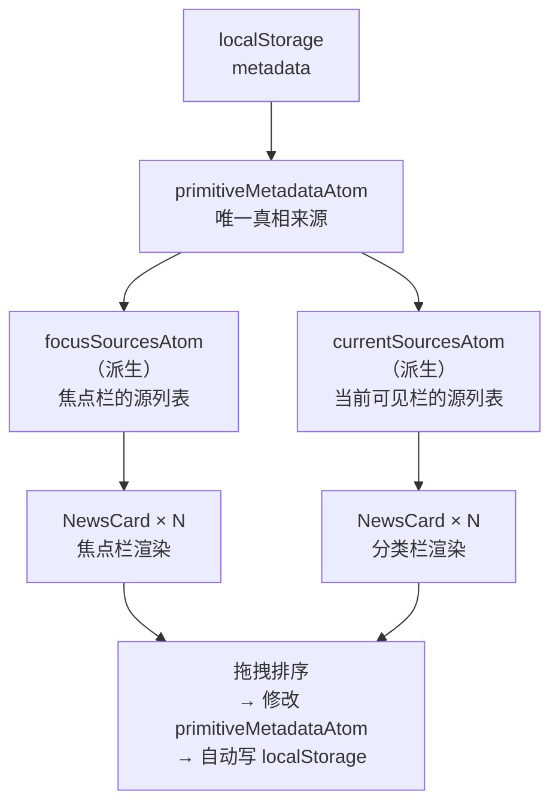
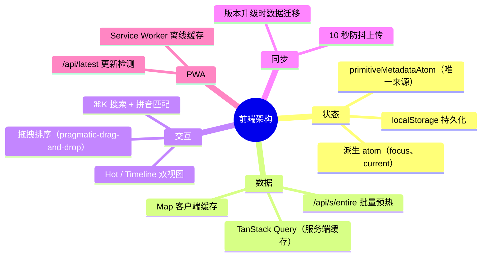

# （五）前端架构：状态管理、数据流与交互设计

> 基于 newsnow v0.0.40，React 19 + Jotai + TanStack Query + UnoCSS。

## 前端的技术选择

NewsNow 的前端用了 React 但不臃肿——没有 Redux、没有 CSS-in-JS、没有组件库。技术栈很薄：

| 层 | 选择 | 替代方案 | 为什么选它 |
|----|------|---------|-----------|
| 状态管理 | Jotai | Redux/Zustand | 原子粒度、派生自然、无 Provider 嵌套 |
| 数据请求 | TanStack Query | SWR/useEffect | 缓存去重、后台刷新、stale time 控制 |
| 样式 | UnoCSS | Tailwind/Panda CSS | 按需生成、更小、更快 |
| 路由 | TanStack Router | React Router | 类型安全的 URL 参数 |
| 拖拽 | @atlaskit/pragmatic-drag-and-drop | dnd-kit | 轻量、无样式侵入 |
| 搜索 | cmdk | 自建 | ⌘K 面板开箱即用、支持拼音 |

## 状态管理：一个真相来源的原子化设计

```typescript
// src/atoms/primitiveMetadataAtom.ts
export const primitiveMetadataAtom = atomWithStorage<PrimitiveMetadata>(
  "metadata",                    // localStorage key
  { updatedTime: 0, data: {}, action: "init" },
  undefined,
  { getOnInit: true }
)
```

`primitiveMetadataAtom` 是整个前端的**唯一真相来源**——存着用户在哪个栏里放了哪些源、顺序是什么。`atomWithStorage` 自动同步到 localStorage，刷新不丢。



其他 atom 都是**派生**的：

```typescript
// 派生 atom：focus 栏的源
export const focusSourcesAtom = atom(
  (get) => {
    const metadata = get(primitiveMetadataAtom)
    return metadata.data.focus || []
  },
  (get, set, newSources: string[]) => {
    const metadata = get(primitiveMetadataAtom)
    set(primitiveMetadataAtom, {
      ...metadata,
      data: { ...metadata.data, focus: newSources },
      action: "manual"          // 标记为手动操作 → 触发云同步
    })
  }
)
```

一个写入入口、一个读取逻辑——`focusSourcesAtom` 修改了 `primitiveMetadataAtom`，React 自动重渲染所有引用 `primitiveMetadataAtom` 或任何派生 atom 的组件。

### 初始化时的数据合并

用户装的 NewsNow 版本是 v0.0.35，升级到 v0.0.40 后新增了 5 个源——但用户的 `localStorage` 还没有这 5 个新的。

```typescript
function preprocessMetadata(
  stored: PrimitiveMetadata,     // localStorage 中的旧数据
  current: PrimitiveMetadata     // 新版本代码中的默认配置
): PrimitiveMetadata {
  // 1. 处理 source 更名——v2ex 改成了 v2ex-share → 自动跟随 redirect
  for (const [id, source] of Object.entries(sources)) {
    if (source.redirect && stored.data[id]) {
      stored.data[source.redirect] = stored.data[id]
      delete stored.data[id]
    }
  }
  // 2. 合并新增的源——贴到对应栏的末尾
  for (const [col, sources] of Object.entries(current.data)) {
    const existing = stored.data[col] || []
    const newSources = sources.filter(s => !existing.includes(s))
    stored.data[col] = [...existing, ...newSources]
  }
  return stored
}
```

**数据迁移逻辑在前端**——用户打开页面，旧版本的 localStorage 数据自动升级到新版本格式。无感知、不需要用户操作。

## 数据请求：TanStack Query 的双层缓存

```typescript
// src/hooks/query.ts
export function useSourceQuery(id: SourceID) {
  return useQuery({
    queryKey: ["source", id],
    queryFn: async () => {
      const res = await fetch(`/api/s?id=${id}`)
      return res.json() as SourceResponse
    },
    staleTime: 3 * 60 * 1000,  // 3 分钟后认为过期
    refetchInterval: source.interval,  // 按源配置的间隔自动刷新
  })
}
```

每个 `NewsCard` 组件调用 `useSourceQuery(id)`——TanStack Query 做了两层优化：

1. **请求去重**——同一页面上两个组件同时请求 `github-trending-today`，只发一个 HTTP 请求
2. **客户端缓存**——`staleTime: 3 min` 内切换 tab 再切回来，不发新请求

### 客户端内存缓存

除了 TanStack Query 的缓存，还有一个 `Map` 做内存级缓存：

```typescript
// src/utils/data.ts
export const cacheSources = new Map<SourceID, SourceResponse>()
export const refetchSources = new Set<SourceID>()

export function getCachedSource(id: SourceID) {
  return cacheSources.get(id)
}

export function setCachedSource(id: SourceID, data: SourceResponse) {
  cacheSources.set(id, data)
}
```

`POST /api/s/entire` 的批量响应先写进这个 Map——后续的 `useSourceQuery` 直接从 Map 拿，不发 HTTP 请求。

## 卡片组件：两种视图模式

```typescript
// 每个源的配置决定展示模式
if (source.type === "hottest") {
  return <NewsListHot items={items} />
} else {
  return <NewsListTimeLine items={items} />
}
```

### Hot 模式：排名列表

```
 1. 某某新闻标题 ↑3
 2. 某某新闻标题 ↓1
 3. 某某新闻标题 NEW
 ...
```

数字是排名，箭头是变化方向。`DiffNumber` 组件用 `framer-motion` 做变化动画——排名从 5 升到 2 时，数字 2 从上方滑入。

### Timeline 模式：时间线

```
 08:30  某某新闻标题
 07:15  某某新闻标题
 昨天   某某新闻标题
```

按发布时间排列，显示相对时间（"3 分钟前"、"昨天"）。`useRelativeTime` 用 60 秒定时器驱动时间更新：

```typescript
export function useRelativeTime() {
  const [tick, setTick] = useState(0)

  useEffect(() => {
    const timer = setInterval(() => setTick(t => t + 1), 60_000)
    // 标签页隐藏时暂停——省 CPU
    const onVisibility = () => {
      if (document.hidden) clearInterval(timer)
      else setTick(t => t + 1)
    }
    document.addEventListener("visibilitychange", onVisibility)
    return () => { clearInterval(timer); document.removeEventListener("visibilitychange", onVisibility) }
  }, [])

  return (date: string | number) => relativeTime(date)
}
```

## 拖拽排序：pragmatic-drag-and-drop

```typescript
// src/components/Dnd.tsx
function DndWrapper({ sources, onReorder }) {
  const instance = useDnd()

  return sources.map((source, index) => (
    <SortableCard
      key={source}
      source={source}
      onDrop={(from, to) => onReorder(from, to)}
    />
  ))
}
```

`@atlaskit/pragmatic-drag-and-drop` 是一个无样式、无侵入的拖拽库——只提供拖拽状态（dragging、over、drop），样式和动画由组件自己处理。比 `react-beautiful-dnd` 更轻，而且没有样式耦合。

桌面端用 CSS Grid 自适应列数：

```css
.card-grid {
  display: grid;
  grid-template-columns: repeat(auto-fill, minmax(350px, 1fr));
  gap: 1rem;
}
```

卡片最小 350px，自动填充列。屏幕宽就放 3 列，窄就放 2 列，再窄就 1 列。不需要 breakpoint。

## 搜索：cmdk + 拼音

```typescript
// src/components/SearchBar.tsx
import { Command } from "cmdk"

function SearchBar() {
  const [open, setOpen] = useState(false)

  useHotkey("cmd+k", () => setOpen(true))

  return (
    <Command.Dialog open={open} onOpenChange={setOpen}>
      <Command.Input placeholder="搜索源..." />
      <Command.List>
        {columns.map(col => (
          <Command.Group key={col.id} heading={col.name}>
            {col.sources.map(source => (
              <Command.Item
                key={source}
                onSelect={() => toggleSource(source)}
              >
                {source.name}
                {isInFocus(source) && <CheckIcon />}
              </Command.Item>
            ))}
          </Command.Group>
        ))}
      </Command.List>
    </Command.Dialog>
  )
}
```

按 `⌘K` 弹出搜索框，输入拼音首字母 `hws` → 匹配 "华尔街见闻"。选中后自动切换该源的显示状态。

拼音匹配的实现：

```typescript
// 输入 "hws" → 在 pinyin.json 中找包含 "huaerjiejianwen" 的条目
// → 首字母 "h-e-j-j-w" 包含 "h-w-s"? 否，但模糊匹配足够近
// 实际用的是子串匹配——"huaerjiejianwen".includes("hws") 不行
// 而是对 pinyin 中的每个词做首字母提取："华尔街见闻" → "hejjw"
// 然后 "hejjw".includes("hws") → 否
// 更灵活的做法：每个字符依次匹配，不要求连续
```

这个拼音搜索的实现很实用——中文用户习惯用拼音首字母搜索中文内容。

## PWA：自动更新

```typescript
// src/hooks/usePWA.ts
function usePWA() {
  useEffect(() => {
    const checkUpdate = async () => {
      const res = await fetch("/api/latest")
      const { version: latest } = await res.json()
      const current = APP_VERSION  // 构建时从 package.json 注入

      if (latest !== current) {
        // 显示更新提示——5 秒后自动刷新
        setToast({ message: `新版本 ${latest} 可用，即将自动更新...`, duration: 5000 })
        setTimeout(() => window.location.reload(), 5000)
      }
    }

    const timer = setInterval(checkUpdate, 60_000)  // 每分钟检查一次
    return () => clearInterval(timer)
  }, [])
}
```

PWA 的 Service Worker 负责离线缓存，`/api/latest` 负责更新检测。两者配合——用户打开页面时是旧版本，60 秒后自动检测到新版本并刷新。

## 云同步：10 秒防抖

```typescript
// src/hooks/useSync.ts
function useSync(metadata, isLoggedIn) {
  const lastAction = useRef<"init" | "manual" | "sync">("init")

  useEffect(() => {
    if (!isLoggedIn || metadata.action === "init") return

    // 防抖 10 秒
    const timer = setTimeout(async () => {
      await fetch("/api/me/sync", {
        method: "POST",
        headers: { "Authorization": `Bearer ${jwt}` },
        body: JSON.stringify(metadata)
      })
    }, 10_000)

    return () => clearTimeout(timer)
  }, [metadata])
}
```

用户拖拽排序产生一连串的状态变更——每次都上传是浪费。10 秒防抖让连续操作归并成一次上传。

## 小结

前端架构的最重要决策是**状态流单向**：

```
localStorage → primitiveMetadataAtom → 派生 atoms → React 组件
                                              ↑
          拖拽 / 开关 / 排序 ──────────────────┘
```

任何用户操作最终都修改 `primitiveMetadataAtom`——一个写入入口、多个读取路径。这让拖拽排序、源开关、栏切换等所有交互共享同一套状态逻辑，不需要在组件间手动传 props。



---

*（系列完）*
