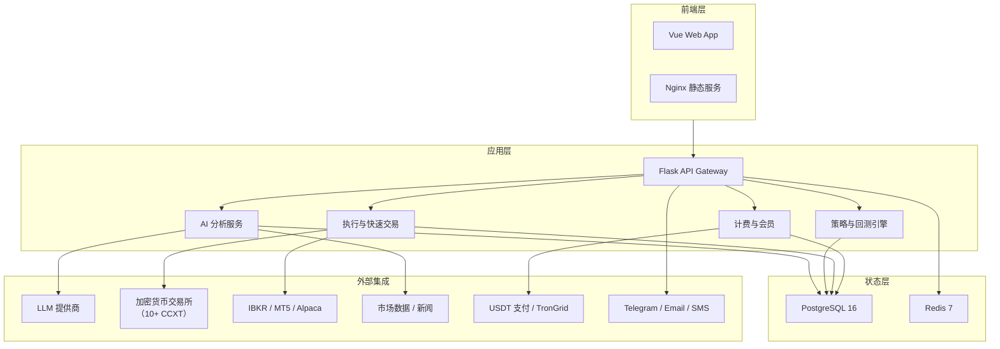

# QuantDinger 源码阅读（一）：项目概览与架构全景

> 读完这篇文章你会得到：一个跑得起来的自托管量化交易操作系统，从数据拉取到 AI 分析到实盘执行的完整架构理解，以及为什么这个项目值得深入读源码。

## 这是什么

QuantDinger 解决一个问题：**个人量化交易需要一个完整的操作系统，而不是一堆散装工具的拼凑**。

传统个人量化的技术栈通常是：TradingView 看图 + Jupyter 跑策略 + ChatGPT 辅助分析 + 手动写交易所 API 脚本。这些工具各自独立，状态不通——回测代码和实盘代码不是同一套，AI 分析的结果手动抄到策略代码里，出了问题不知道是哪一环。

QuantDinger 的做法是：一个 Docker 栈包含全套——数据源、图表、指标 IDE、AI 分析、回测、多券商实盘、Agent Gateway。所有状态共享同一个 PostgreSQL，所有过程可审计。**Apache 2.0 开源，本地部署，你自己掌控密钥和数据。**

核心特性：

- 五层闭环量化引擎：**Idea → Indicator → Strategy → Backtest → Optimize → Execute → Monitor**
- 双策略运行时：向量化信号策略（IndicatorStrategy）和事件驱动脚本策略（ScriptStrategy）
- 多市场数据覆盖：A 股/港股/美股/加密货币/外汇/期货/MOEX
- 10+ 加密货币交易所（CCXT 抽象）+ IBKR + MT5 + Alpaca 统一执行层
- AI Agent 原生支持：Agent Gateway API + PyPI 发布的 MCP Server，Cursor/Claude Code 可直接操控
- 商业化基础设施：多用户 RBAC、credits/membership/USDT 计费、AWS Marketplace AMI

## 架构全景



设计原则非常明确：**数据摄取、策略计算、订单执行三者解耦**。研究代码和实盘代码共享同一套运行时和数据层，但实盘路径需要通过明确的状态升级才能生效——不会出现「跑着跑着研究代码就开始下真实订单」的情况。

## 服务拓扑

QuantDinger 通过 Docker Compose 部署，5 个核心服务：

```
docker-compose.yml
├── postgres        # PostgreSQL 16-alpine，系统状态唯一来源
│   └── init.sql    # 幂等 schema 引导脚本
├── redis           # Redis 7-alpine，缓存 + worker 协调
├── backend         # Flask + Gunicorn，从本地源码构建
│   └── backend_api_python/.env  # 99% 的运行时配置在这里
├── frontend        # 预构建 Vue SPA（从 GHCR 拉取），Nginx 静态服务
│   └── 不需要 Node.js，不需要本地构建
└── mcp_server      # 可选，通过 profile 启用
    └── uvx quantdinger-mcp  # 对 AI 客户端暴露 MCP 工具
```

关键设计决策：

**为什么前端是预构建镜像而不是源码构建？** 主仓库只包含后端和 Docker 栈。前端 Vue 源码在独立的私有仓库 `QuantDinger-Vue`，打 `v*` tag 时自动构建并推送到 `ghcr.io`。普通用户不需要 Node.js 环境就能启动完整界面。

**为什么 99% 的配置在 `backend_api_python/.env` 里？** 而不是散落在 `docker-compose.yml` 中的 environment 段。因为整个应用——从数据库连接池、LLM API key、到 USDT 支付开关——都是后端进程在消费。集中在 `.env` 里方便版本管理、多环境切换（dev/prod），也避免了 Compose 文件的 `environment` 段过于臃肿。

**启动时的安全检查**：如果 `SECRET_KEY` 还是 `env.example` 里的默认值（`changeme_please_replace_with_a_secure_random_string`），后端**直接拒绝启动**。这是一个 hard stop，设计意图很清晰——防止有人因为图省事把默认密码部署到公网。

## 代码仓库结构

```
QuantDinger/
├── backend_api_python/        # ← 核心：Flask 应用
│   ├── app/
│   │   ├── __init__.py        #   应用工厂 create_app() + 启动钩子
│   │   ├── config/            #   数据库连接 / API keys / 数据源配置
│   │   ├── data_sources/      #   多市场 K 线数据源（下文详述）
│   │   ├── data_providers/    #   情绪分析 / 新闻 / 热力图
│   │   ├── routes/            #   REST API 路由
│   │   │   └── agent_v1/      #   Agent Gateway（AI 客户端专用）
│   │   ├── services/          #   业务逻辑层
│   │   │   ├── live_trading/  #   多交易所实盘执行
│   │   │   ├── experiment/    #   策略实验优化
│   │   │   ├── alpaca_trading/
│   │   │   ├── ibkr_trading/
│   │   │   └── mt5_trading/
│   │   └── utils/             #   数据库连接 / 认证 / 技术指标
│   ├── migrations/            #   SQL 初始化脚本
│   ├── tests/                 #   pytest 测试
│   └── run.py                 #   入口点
├── mcp_server/                #   MCP Server（发布到 PyPI）
│   └── src/quantdinger_mcp/
├── docs/                      #   多语言文档 + Agent 集成指南
├── scripts/                   #   版本管理 / 密钥生成
├── docker-compose.yml         #   主部署文件
├── docker-compose.ghcr.yml    #   纯 GHCR 镜像版（不本地构建）
└── install.sh                 #   一行安装脚本
```

与 Sequoia-X 的「小而精」不同，QuantDinger 定位是「完整产品」——有商业化的计费系统、多语言文档、AWS Marketplace AMI。读它的源码，更像是读一个小型 SaaS 产品的实现，而不是一个个人工具。

## 快速启动

```bash
# 一行安装
$ curl -fsSL https://raw.githubusercontent.com/brokermr810/QuantDinger/main/install.sh | bash

# 然后打开 http://localhost:8888
# 默认账号：quantdinger / 123456（首次登录后改密码）
```

或者走手动路径（适合想改源码的人）：

```bash
$ git clone https://github.com/brokermr810/QuantDinger.git
$ cd QuantDinger
$ cp backend_api_python/env.example backend_api_python/.env
$ ./scripts/generate-secret-key.sh    # 自动生成 SECRET_KEY
$ docker compose pull
$ docker compose up -d
```

这两种方式本质上是一样的——`install.sh` 不过是自动化了上面的步骤，加上一些目录创建和权限检查。

启动后 Docker 里跑着什么：

```bash
$ docker compose ps
NAME                      STATUS              PORTS
quantdinger-db            healthy             127.0.0.1:5432->5432/tcp
quantdinger-redis         running             6379/tcp
quantdinger-backend       running             127.0.0.1:5000->5000/tcp
quantdinger-frontend      running             0.0.0.0:8888->80/tcp
```

`quantdinger-db` 的状态是 `healthy` 而不是 `running`——Compose 的 `healthcheck` 配置在起作用：`pg_isready` 通过后才标记 healthy，而 `backend` 在 `depends_on: condition: service_healthy` 之后才启动。这个细节和我们在容器化系列里讨论的 `depends_on + healthcheck` 完全一致。

## 源码层次：从 `create_app()` 看启动流程

`backend_api_python/app/__init__.py` 的 `create_app()` 是理解整个系统的最佳起点。它在应用启动时执行了以下初始化：

```python
def create_app(config_name='default'):
    app = Flask(__name__)
    # 1. JSON 序列化安全——NaN/Inf → null，datetime → UTC ISO
    app.json_provider_class = SafeJSONProvider

    # 2. CORS 配置——支持 Web + Capacitor 移动端
    # 3. ib_insync 异步补丁——IBKR 连接稳定性的关键
    # 4. 数据库初始化 + 默认 admin 用户创建
    # 5. 注册路由

    # 6. 启动后台服务（在 app context 内）：
    with app.app_context():
        start_pending_order_worker()    # 待执行订单处理
        start_portfolio_monitor()        # 投资组合监控
        start_usdt_order_worker()        # USDT 支付订单轮询
        start_ai_calibration_worker()    # AI 置信度自校准
        start_reflection_worker()        # AI 决策反思
        restore_running_strategies()     # 恢复上次运行中的策略
```

注意 `restore_running_strategies()`——这是一个设计精巧的容灾机制。服务器重启后，它会从数据库中找到所有状态为 `running` 的策略，逐一重新启动执行线程。如果某个策略因为 API key 失效等原因恢复失败，它会自动把状态标记为 `stopped`，防止进入「僵尸状态」——数据库里显示 running，实际没有线程在跑。

每个后台 worker 都遵循 `ENABLE_XXX` 环境变量控制 + 独立 try/except 包裹的模式。任何一个 worker 的启动失败都不会阻止应用启动，日志会记录失败原因，运维人员可以根据日志修复配置后重启。

## 阅读路线

QuantDinger 的代码量大（仅 `app/` 下就有 100+ 个 Python 文件），建议按以下路径阅读：

```
① 项目概览（本文）
  ↓
② 数据库设计：从 Schema 看系统架构——理解数据模型再看代码
  ↓
③ 数据层：多市场数据是怎么拉取的、怎么缓存、怎么限流的
  ↓
④ 策略引擎：两种策略运行时有什么不同、回测怎么跑的、实验优化怎么做
  ↓
⑤ 券商执行层：10+ 交易所是怎么统一抽象的、实盘订单的生命周期
  ↓
⑥ AI 集成：Agent Gateway 的 API 设计、MCP Server 的实现、LLM 服务层
  ↓
⑦ 基础设施：Docker 部署细节、认证计费、安全设计
```

## 下一步

了解了全貌，下一篇先看数据库——理解数据模型之后再深入代码细节会更顺。

→ [（二）数据库设计：从 Schema 看系统架构](02-database.md)
