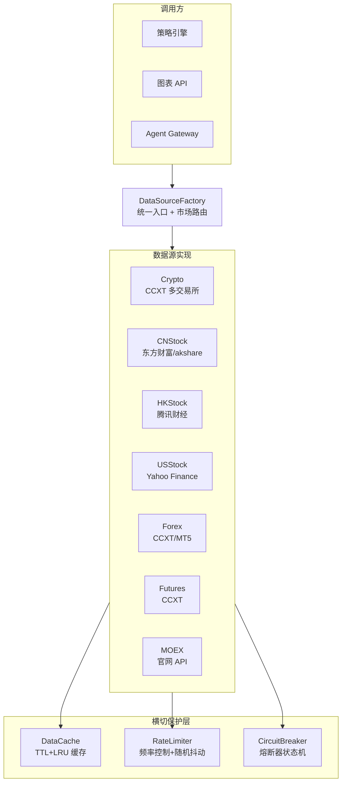
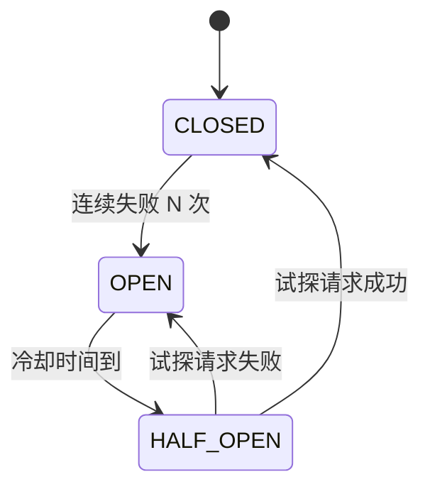

# QuantDinger 源码阅读（二）：数据层——多市场数据源与缓存策略

> 上一篇了解了 QuantDinger 的整体架构。这一篇深入到数据层——七个市场的数据是怎么统一抽象的、K 线缓存是怎么设计的、限流和熔断是怎么保护数据源的。

## 设计目标

QuantDinger 的数据层需要解决三个相互矛盾的需求：

1. **覆盖广**——7 个市场（加密货币、美股、A 股、港股、外汇、期货、MOEX），每个市场的接口差异巨大
2. **调用安全**——避免被交易所/数据源限流封禁，在连续失败时自动熔断
3. **响应快**——相同参数的 K 线请求不应该重复调用外部接口

解法是三层架构：**工厂模式统一入口 → 基类抽象公共逻辑 → 缓存+限流+熔断三个横切组件保护数据通路**。



## 基类设计：BaseDataSource

`data_sources/base.py` 定义了整个数据层的契约。核心是**3 个必须实现的方法 + 3 个基类提供的工具方法**：

### 抽象方法（子类必须实现）

```python
class BaseDataSource(ABC):
    @abstractmethod
    def get_kline(self, symbol, timeframe, limit,
                  before_time=None, after_time=None):
        """获取 K 线数据——所有数据源的统一入口"""
        pass

    def get_ticker(self, symbol):
        """获取实时报价——可选实现，默认抛 NotImplementedError"""
        raise NotImplementedError
```

`get_kline` 的签名设计得比较通用：

- `symbol`：字符串，各市场自行解析（加密货币如 `BTC/USDT`，股票如 `AAPL`）
- `timeframe`：统一的时间周期字符串（`1m`/`5m`/`15m`/`30m`/`1H`/`4H`/`1D`/`1W`）
- `limit`：期望返回的 K 线条数
- `before_time`/`after_time`：时间窗口边界（Unix 秒），用于回测时精确控制数据范围
- 返回值统一为 `[{"time": int, "open": float, ...}]`

这个统一接口是数据层最重要的设计决策。所有市场、所有调用方都通过同一个 `(market, symbol, timeframe, limit)` 四元组获取 K 线，上层策略代码不需要知道数据来自哪个市场。

### 工具方法（基类提供）

```python
def filter_and_limit(self, klines, limit, before_time, after_time, truncate):
    """排序 → 时间过滤 → 截取最新 N 条"""
    # 先按时间排序
    klines.sort(key=lambda x: x['time'])
    # 时间窗口过滤
    if before_time:
        klines = [k for k in klines if k['time'] < before_time]
    if after_time is not None:
        klines = [k for k in klines if k['time'] >= after_time]
    # 取最新的 limit 条
    if truncate and len(klines) > limit:
        klines = klines[-limit:]
    return klines
```

`truncate=False` 的设计值得一提——回测场景需要完整的时间窗口（`[after_time, before_time)` 内的所有 K 线），按 `limit` 截断会丢失左边界数据。这个细节如果不处理好，回测结果会不准确。

`format_kline` 负责标准化精度——`open/high/low/close` 四舍五入到 4 位小数，`volume` 到 2 位。防止各数据源返回的浮点精度不一致，导致跨市场策略的数值比较出问题。

`log_result` 里还有一个精巧的延迟判断：日线数据在周末/节假日后可能滞后 3-4 天，它自动放宽告警阈值到 5 天，避免周一早上的无意义告警噪音。

## 工厂模式：DataSourceFactory

`data_sources/factory.py` 的 `DataSourceFactory` 是数据层的路由器。调用方不直接实例化具体数据源，而是通过工厂获取：

```python
# 策略引擎调用——不关心数据来自哪个市场
klines = DataSourceFactory.get_kline(
    market="Crypto",      # 市场类型决定用哪个数据源
    symbol="BTC/USDT",
    timeframe="1H",
    limit=100,
    exchange_id="binance",  # 加密货币特有——指定交易所
    market_type="swap"      # 现货 or 合约
)
```

### 市场别名映射

工厂内部维护了一个别名表，容错用户输入的不规范命名：

```python
_MARKET_ALIASES = {
    "crypto": "Crypto",
    "fx": "Forex",
    "usstock": "USStock",
    "cnstock": "CNStock",
    "rustock": "MOEX",
    # ... 别名 → 规范名
}
```

还有一个容易出错的设计细节：**空字符串市场参数向后兼容 Crypto**。这是历史遗留——早期版本只有加密货币市场，很多调用方没传 market 参数。现在空 market 会触发 deprecation 警告，但不会直接报错（防止破坏现有调用）。设计注释明确写了："This fallback is deprecated and will become a hard error."

### 缓存策略：单例 + 懒加载

```python
@classmethod
def get_source(cls, market):
    market = cls.normalize_market(market or "")
    if market not in cls._sources:
        cls._sources[market] = cls._create_source(market)
    return cls._sources[market]
```

每个市场的 DataSource 实例在第一次请求时创建，之后缓存复用。对于加密货币，还有进一步的 `_resolve_source` 方法——根据 `exchange_id` 和 `market_type`（spot/swap）返回绑定到特定交易所的实例，确保实盘策略读取 K 线的交易所和执行订单的交易所是同一个。

### 七个数据源的创建

`_create_source` 是一个简单的 if-elif 链——不需要反射、不需要注册装饰器。直接、可读、易于调试：

```python
@classmethod
def _create_source(cls, market):
    if market == 'Crypto':
        from app.data_sources.crypto import CryptoDataSource
        return CryptoDataSource()
    elif market == 'CNStock':
        from app.data_sources.cn_stock import CNStockDataSource
        return CNStockDataSource()
    # ... 7 个市场
```

没有过度设计——工厂就是工厂，不需要插件系统或自动发现机制。7 个市场是明确的业务需求，不是无限扩展的抽象。

## 缓存系统：DataCache

`data_sources/cache_manager.py` 实现了一个 TTL + LRU 的内存缓存：

```python
@dataclass
class CacheEntry:
    data: Any
    timestamp: float      # 写入时间
    ttl: float            # 存活时间
    hit_count: int = 0    # 命中次数（用于统计，不参与淘汰）
```

核心特性：

- **TTL 过期**：默认 10 分钟，K 线数据超过 TTL 后标为过期，下次请求重新拉取
- **LRU 淘汰**：用 `OrderedDict` 维护访问顺序，容量满了淘汰最久未使用的条目
- **线程安全**：`threading.Lock` 保护所有读写操作
- **按数据类型分区**：`DataCacheManager` 管理多个 `DataCache` 实例（K 线一个、ticker 一个、指标数据一个），各自独立 TTL 和容量

```python
class DataCacheManager:
    _caches = {}

    @classmethod
    def get_cache(cls, name="kline", ttl=600, max_size=1000):
        if name not in cls._caches:
            cls._caches[name] = DataCache(name, ttl, max_size)
        return cls._caches[name]
```

设计选择：内存缓存而非 Redis。理由是 K 线数据的 TTL 只有 10 分钟——如果数据过期了，重新从外部 API 拉就行了。对于跨请求共享的缓存（如多 worker 之间的状态协调），Redis 已经是系统的一部分，但那走的是应用层逻辑，不走数据缓存层。

## 限流器：RateLimiter

`data_sources/rate_limiter.py` 解决了爬取外部数据源最头疼的问题——被限流封禁。它实现了三层防护：

### 1. 请求频率控制

```python
class RateLimiter:
    def wait(self):
        # 1. 确保距离上次请求过了 min_interval
        if elapsed < self.min_interval:
            time.sleep(self.min_interval - elapsed)
        # 2. 额外加随机抖动
        jitter = random.uniform(self.jitter_min, self.jitter_max)
        time.sleep(jitter)
```

**两次请求之间保证最小间隔 + 随机扰动**。这是反爬最基础也最有效的策略——固定间隔容易被识别为机器行为，随机抖动模拟人类操作的不确定性。

### 2. 针对不同数据源使用不同限流参数

```python
# 东方财富——反爬较严
_eastmoney_limiter = RateLimiter(min_interval=2.0, jitter_min=1.0, jitter_max=3.0)

# 腾讯财经——相对宽松
_tencent_limiter = RateLimiter(min_interval=1.0, jitter_min=0.5, jitter_max=1.5)
```

**不同数据源的反爬策略不同**——没有用一套参数一刀切。东方财富的限流策略比腾讯财经严格一倍。

### 3. 指数退避重试

```python
@retry_with_backoff(max_attempts=3, base_delay=2.0, max_delay=30.0)
def fetch_data():
    ...
# 第 1 次失败：等 2s
# 第 2 次失败：等 4s
# 第 3 次失败：放弃
```

每次重试的延迟 = `base_delay * (exponential_base ^ (attempt - 1)) * random(0.8, 1.2)`。`±20%` 的随机抖动确保多个并发请求不会在同一时刻重试（避免「惊群」效应）。

## 熔断器：CircuitBreaker

`data_sources/circuit_breaker.py` 实现了标准的三态熔断器：



核心逻辑在 `is_available()` 方法：

```python
def is_available(self, source):
    if state == CLOSED:     # 正常——允许请求
        return True
    if state == OPEN:       # 熔断中——检查冷却时间
        if 冷却时间已过:
            进入 HALF_OPEN
            return True
        else:
            return False    # 跳过这个数据源
    if state == HALF_OPEN:  # 试探中——限制请求次数
        return 尝试次数未达上限
```

为什么需要熔断器？假设某个数据源挂了一整夜。如果没有熔断，每次请求都会超时等 30 秒，一个策略扫描 500 只股票就要浪费数个小时。熔断器让系统在连续失败后直接跳过该源，等冷却时间到了再试探性地发一个请求看看恢复了没有。

全局配置了两个熔断器实例——实时行情用更严格的策略（失败 2 次就熔断，冷却 3 分钟），因为实时数据对时效性要求高，不宜在失败的源上浪费等待时间。

## 其他横切组件

### 随机 User-Agent 轮换

```python
USER_AGENTS = [
    'Mozilla/5.0 (Windows NT 10.0; Win64; x64) Chrome/120.0.0.0 ...',
    'Mozilla/5.0 (Macintosh; Intel Mac OS X 10_15_7) Chrome/120.0.0.0 ...',
    # ... 12 种组合（Chrome/Firefox/Safari/Edge × Windows/Mac/Linux）
]
```

每次 HTTP 请求随机选一个 UA，配合限流器的随机抖动，让请求模式尽可能不像爬虫。

### 港股数据源的腾讯财经接口

```python
# 在 hk_stock.py 中，腾讯财经的接口不需要认证
# GET https://web.ifzq.gtimg.cn/...
# 返回 JSON 格式的 K 线数据
```

A 股用东方财富（akshare），港股用腾讯财经，美股用 Yahoo Finance，加密货币用 CCXT 库统一封装。每个市场的具体实现细节不同，但都收敛到 `get_kline(symbol, timeframe, limit, before_time, after_time)` → `[{time, open, high, low, close, volume}]` 的统一返回格式。

## 数据层小结

QuantDinger 的数据层设计体现了「统一接口 + 差异化实现 + 横切保护」的三层架构：

| 层次 | 组件 | 职责 |
|------|------|------|
| 统一入口 | DataSourceFactory | 市场路由、别名容错、实例缓存 |
| 具体实现 | 7 个 DataSource | 各自对接外部 API，收敛到统一返回格式 |
| 横切保护 | DataCache / RateLimiter / CircuitBreaker | 缓存提速、限流防封、熔断止损 |

值得学习的设计细节：
- **空 market 向后兼容但不静默**——deprecation 警告而非静默降级
- **不同数据源不同限流参数**——不对所有外部 API 一视同仁
- **`truncate=False`**——回测场景的精确控制，防止数据截断导致结果偏差
- **单例 + 懒加载**——工厂缓存实例，减少重复创建开销

## 下一步

数据层解决了「怎么拿到数据」。有了数据，就可以进入正题——策略怎么写、怎么回测、怎么从研究升级到实盘。

→ [（三）策略引擎：双运行时、回测与实验优化](03-strategy-engine.md)
