# QuantDinger 源码阅读（二）：数据库设计——30 张表全景解析

> 上一篇看完了 QuantDinger 的整体架构。在深入各层代码之前，先理解数据模型——从 1232 行的 `init.sql` 逐一拆解 30 张表的设计意图和精妙细节。

## 表全景

```
认证域（6 张）
├── qd_users               用户
├── qd_oauth_links         第三方登录关联
├── qd_oauth_states        OAuth CSRF 防护
├── qd_verification_codes  邮箱验证码
├── qd_login_attempts      登录防爆破
└── qd_security_logs       安全审计日志

计费域（3 张）
├── qd_credits_log         积分变动日志
├── qd_membership_orders   会员订单
└── qd_usdt_orders         链上支付订单

策略域（7 张）
├── qd_strategies_trading  策略定义
├── qd_strategy_positions  当前持仓
├── qd_strategy_trades     历史成交
├── qd_grid_cells          网格交易阶梯
├── pending_orders          待执行订单队列
├── qd_strategy_notifications  信号通知
└── qd_strategy_logs       策略运行日志

回测域（3 张）
├── qd_backtest_runs       回测任务
├── qd_backtest_trades     回测逐笔成交
└── qd_backtest_equity_points  回测净值曲线

指标域（3 张）
├── qd_indicator_codes     指标代码库
├── qd_indicator_purchases 购买记录
└── qd_indicator_comments  评论与评分

Agent Gateway 域（4 张）
├── qd_agent_tokens        Agent 令牌
├── qd_agent_jobs          异步任务
├── qd_agent_audit         审计日志
└── qd_agent_paper_orders  Paper 模拟订单

市场与交易域（5 张）
├── qd_market_symbols      市场标的种子数据
├── qd_watchlist           用户自选
├── qd_analysis_tasks      AI 分析任务
├── qd_analysis_memory     AI 分析记忆
└── qd_quick_trades        快速手动交易

持仓监控域（3 张）
├── qd_exchange_credentials    交易所密钥
├── qd_manual_positions        手动持仓
├── qd_position_alerts         持仓告警
└── qd_position_monitors       持仓监控配置
```

## 迁移策略

1200+ 行的 `init.sql` 是系统唯一的 schema 来源。核心模式就两种：

```sql
-- ① 新表：CREATE TABLE IF NOT EXISTS（幂等）
CREATE TABLE IF NOT EXISTS qd_users (...);

-- ② 渐进式加列：DO $$ 块查询 information_schema
DO $$
BEGIN
    IF NOT EXISTS (
        SELECT 1 FROM information_schema.columns
        WHERE table_name = 'qd_users' AND column_name = 'timezone'
    ) THEN
        ALTER TABLE qd_users ADD COLUMN timezone VARCHAR(64) DEFAULT '';
    END IF;
END $$;
```

不管数据库当前是什么状态——全新空库、旧版本升级、手动恢复备份——执行 `init.sql` 后的结果一定是完整的。不需要 `alembic upgrade head`，不需要处理迁移冲突，PostgreSQL 容器首次启动时自动执行 `/docker-entrypoint-initdb.d/01-init.sql`。

代价是 SQL 文件更长（同样的 `DO $$` 模式重复了十几次）。收益是零运维——在新版 Docker 镜像里更新了 `init.sql`，用户拉镜像重启，新列就自动加上了。

## 实体关系总图

```mermaid
flowchart TB
    subgraph Auth["认证域"]
        Users["qd_users"]
        OAuth["qd_oauth_links"]
        OAuthStates["qd_oauth_states"]
        VCode["qd_verification_codes"]
        LoginAttempts["qd_login_attempts"]
        SecLogs["qd_security_logs"]
    end

    subgraph Billing["计费域"]
        CreditsLog["qd_credits_log"]
        Membership["qd_membership_orders"]
        USDT["qd_usdt_orders"]
    end

    subgraph Strategy["策略域"]
        Strategies["qd_strategies_trading"]
        Positions["qd_strategy_positions"]
        Trades["qd_strategy_trades"]
        GridCells["qd_grid_cells"]
        PendingOrders["pending_orders"]
        Notifications["qd_strategy_notifications"]
        StrategyLogs["qd_strategy_logs"]
    end

    subgraph Backtest["回测域"]
        BTRuns["qd_backtest_runs"]
        BTTrades["qd_backtest_trades"]
        BTEquity["qd_backtest_equity_points"]
    end

    subgraph Indicator["指标域"]
        Indicators["qd_indicator_codes"]
        Purchases["qd_indicator_purchases"]
        Comments["qd_indicator_comments"]
    end

    subgraph Agent["Agent Gateway 域"]
        Tokens["qd_agent_tokens"]
        Jobs["qd_agent_jobs"]
        Audit["qd_agent_audit"]
        PaperOrders["qd_agent_paper_orders"]
    end

    subgraph Market["市场与交易域"]
        Symbols["qd_market_symbols"]
        Watchlist["qd_watchlist"]
        AnalysisTasks["qd_analysis_tasks"]
        AnalysisMem["qd_analysis_memory"]
        QuickTrades["qd_quick_trades"]
    end

    subgraph Monitor["持仓监控域"]
        Credentials["qd_exchange_credentials"]
        ManualPos["qd_manual_positions"]
        Alerts["qd_position_alerts"]
        Monitors["qd_position_monitors"]
    end

    Users --> OAuth
    Users --> Strategies
    Users --> PendingOrders
    Users --> AgentTokens
    Users --> QuickTrades
    Users --> Credentials
    Strategies --> Positions
    Strategies --> Trades
    Strategies --> GridCells
    Strategies --> PendingOrders
    Strategies --> Notifications
    Strategies --> StrategyLogs
    BTRuns --> BTTrades
    BTRuns --> BTEquity
    Indicators --> Purchases
    Indicators --> Comments
    AgentTokens --> AgentJobs
    AgentTokens --> AgentAudit
    AgentTokens --> PaperOrders
```



## 逐域拆解

### 一、认证域（6 张表）

#### qd_users——一个表扛起 SaaS 多租户

```sql
CREATE TABLE IF NOT EXISTS qd_users (
    id SERIAL PRIMARY KEY,
    username VARCHAR(50) UNIQUE NOT NULL,
    password_hash VARCHAR(255) NOT NULL,
    email VARCHAR(100) UNIQUE,
    role VARCHAR(20) DEFAULT 'user',          -- admin/manager/user/viewer
    status VARCHAR(20) DEFAULT 'active',       -- active/disabled/pending
    credits DECIMAL(20,2) DEFAULT 0,          -- 积分余额
    vip_expires_at TIMESTAMP,                  -- VIP 过期时间
    vip_plan VARCHAR(20) DEFAULT '',           -- monthly/yearly/lifetime
    vip_is_lifetime BOOLEAN DEFAULT FALSE,
    token_version INTEGER DEFAULT 1,           -- 单设备登录控制
    password_changed_at TIMESTAMP,             -- NULL = 仍在使用初始密码
    notification_settings TEXT DEFAULT '',     -- JSON: telegram_chat_id 等
    chart_templates TEXT DEFAULT '',           -- JSON: 指标布局/样式
    timezone VARCHAR(64) DEFAULT '',
    referred_by INTEGER,                       -- 邀请人 ID
    last_login_at TIMESTAMP,
    created_at TIMESTAMP DEFAULT NOW(),
    updated_at TIMESTAMP DEFAULT NOW()
);
```

一张表融合了认证（password_hash、role）、计费（credits、vip_expires_at）、偏好（timezone、notification_settings、chart_templates）和会话管理（token_version）。

**`token_version`——极简全设备登出**：JWT payload 里嵌入签发时的 token_version。用户在新设备登录后这个字段自增 1，旧设备的所有 JWT 因为版本号不匹配直接失效。不需要 Redis 黑名单，不需要维护 session 表，一个整数字段实现全设备强制下线。

**`password_changed_at`——初始密码提醒**：默认管理员创建时此字段为 NULL，中间件检测到 NULL 就提示「请修改初始密码」。用户改过一次之后就不再打扰。

**`referred_by`——邀请裂变**：自引用外键。配合 `idx_users_referred_by` 索引，可以查询某个用户的完整邀请树。积分奖励、VIP 赠送等逻辑都依赖这个字段。

#### qd_oauth_links——第三方登录绑定

```sql
CREATE TABLE IF NOT EXISTS qd_oauth_links (
    user_id INTEGER REFERENCES qd_users(id) ON DELETE CASCADE,
    provider VARCHAR(20) NOT NULL,              -- 'google' / 'github'
    provider_user_id VARCHAR(100) NOT NULL,
    provider_email VARCHAR(100),
    provider_name VARCHAR(100),
    provider_avatar VARCHAR(255),
    access_token TEXT,                          -- OAuth access token
    refresh_token TEXT,                         -- OAuth refresh token
    UNIQUE(provider, provider_user_id)
);
```

一个用户可以绑定多个第三方账号（GitHub + Google），但同一个第三方账号只能绑定一个 QuantDinger 用户（`UNIQUE(provider, provider_user_id)`）。`ON DELETE CASCADE` 确保用户被删时 OAuth 关联也清掉——不会残留孤立的第三方绑定记录。

access_token 和 refresh_token 存明文 TEXT 而非加密——因为这些 token 的权限范围仅限于 OAuth provider 授予的基础信息（邮箱、头像），安全性要求低于交易所 API Key。

#### qd_oauth_states——CSRF 防护

```sql
CREATE TABLE IF NOT EXISTS qd_oauth_states (
    state VARCHAR(128) PRIMARY KEY,
    provider VARCHAR(20) NOT NULL,
    redirect TEXT,
    expires_at TIMESTAMP NOT NULL
);
CREATE INDEX IF NOT EXISTS idx_oauth_states_expires ON qd_oauth_states(expires_at);
```

OAuth 流程的标准 CSRF 防护：发起登录时生成随机 state，存在这里；回调时验证 state 匹配且未过期。**为什么不用 Redis？** 因为 state 是需要持久化的——OAuth 流程可能跨越数分钟，Redis 的 TTL 过期和数据丢失风险不适合这个场景。数据库表 + 过期索引更可靠。

#### qd_verification_codes——邮箱验证码

```sql
CREATE TABLE IF NOT EXISTS qd_verification_codes (
    email VARCHAR(100) NOT NULL,
    code VARCHAR(10) NOT NULL,
    type VARCHAR(20) NOT NULL,          -- register/login/reset_password/change_email
    expires_at TIMESTAMP NOT NULL,
    used_at TIMESTAMP,
    ip_address VARCHAR(45),
    attempts INTEGER DEFAULT 0,         -- 失败尝试次数（反暴力破解）
    last_attempt_at TIMESTAMP
);
```

验证码表同时承载了**频率限制**——`attempts` 字段记录同一个 code 的失败尝试次数。连续输错超过阈值（如 5 次），这个 code 作废，需要重新发送。`ip_address` 用于跨 code 的频率限制——同一个 IP 短时间内请求过多 code，直接拒绝。

#### qd_login_attempts——登录防爆破

```sql
CREATE TABLE IF NOT EXISTS qd_login_attempts (
    identifier VARCHAR(100) NOT NULL,        -- IP 地址或用户名
    identifier_type VARCHAR(10) NOT NULL,     -- 'ip' 或 'account'
    attempt_time TIMESTAMP DEFAULT NOW(),
    success BOOLEAN DEFAULT FALSE,
    ip_address VARCHAR(45),
    user_agent TEXT
);
```

两种维度的防爆破策略：按 IP（某 IP 连续失败 N 次锁定）和按账号（某账号连续失败 N 次锁定）。`identifier_type` 区分这两种场景。查询时取近 N 分钟的失败记录数，超过阈值触发临时封锁。

#### qd_security_logs——安全审计

```sql
CREATE TABLE IF NOT EXISTS qd_security_logs (
    user_id INTEGER,
    action VARCHAR(50) NOT NULL,    -- login/logout/register/reset_password/oauth_login
    ip_address VARCHAR(45),
    user_agent TEXT,
    details TEXT,                   -- JSON 补充信息
    created_at TIMESTAMP DEFAULT NOW()
);
```

与 Agent 审计日志（`qd_agent_audit`）分开——这张表记录人类用户的安全事件，Agent 表记录 AI 客户端的操作。分表让两类审计的查询模式互不干扰。

---

### 二、计费域（3 张表）

#### qd_credits_log——积分流水

```sql
CREATE TABLE IF NOT EXISTS qd_credits_log (
    user_id INTEGER NOT NULL REFERENCES qd_users(id) ON DELETE CASCADE,
    action VARCHAR(50) NOT NULL,             -- recharge/consume/refund/admin_adjust/vip_grant
    amount DECIMAL(20,2) NOT NULL,           -- 正数增加，负数减少
    balance_after DECIMAL(20,2) NOT NULL,    -- 变动后余额
    feature VARCHAR(50) DEFAULT '',           -- 消费功能：ai_analysis/strategy_run/backtest
    reference_id VARCHAR(100) DEFAULT '',     -- 关联订单号/分析任务 ID
    remark TEXT DEFAULT '',
    operator_id INTEGER                      -- 操作人（管理员调整时记录）
);
```

**`balance_after` 而非实时计算**：不依赖 `SELECT SUM(amount)` 来算余额——流水多了 SUM 会很慢。每次变动时直接写入变动后的余额值，查余额只需 `ORDER BY id DESC LIMIT 1`。这是事件溯源模式中的「快照」优化。

**`operator_id` 的审计链**：管理员手动调整积分时记录操作人。事后可以追溯「谁、什么时候、因为什么、把谁的积分从多少改到多少」。

#### qd_membership_orders——会员订阅订单

```sql
CREATE TABLE IF NOT EXISTS qd_membership_orders (
    user_id INTEGER NOT NULL REFERENCES qd_users(id) ON DELETE CASCADE,
    plan VARCHAR(20) NOT NULL,               -- monthly/yearly/lifetime
    price_usd DECIMAL(10,2) DEFAULT 0,
    status VARCHAR(20) DEFAULT 'paid',       -- paid/pending/failed/refunded
    paid_at TIMESTAMP
);
```

简约设计——只记录订单，不管理订阅状态机。订阅的生效时间（VIP 权益）直接写在 `qd_users.vip_expires_at` 和 `qd_users.vip_plan` 里。订单表是「发生了什么」，用户表是「当前状态」。两个关注点分开。

#### qd_usdt_orders——链上支付

```sql
CREATE TABLE IF NOT EXISTS qd_usdt_orders (
    user_id INTEGER NOT NULL REFERENCES qd_users(id) ON DELETE CASCADE,
    plan VARCHAR(20) NOT NULL,
    chain VARCHAR(20) NOT NULL DEFAULT 'TRC20',    -- TRC20/BEP20/ERC20/SOL
    currency VARCHAR(10) NOT NULL DEFAULT 'USDT',
    amount_usdt DECIMAL(20,8) NOT NULL DEFAULT 0,   -- 应付金额（含尾数）
    amount_suffix DECIMAL(20,8) NOT NULL DEFAULT 0, -- 唯一尾数
    address VARCHAR(120) NOT NULL DEFAULT '',        -- 固定收款地址
    payment_uri TEXT NOT NULL DEFAULT '',             -- 完整支付链接
    status VARCHAR(20) NOT NULL DEFAULT 'pending',   -- pending/paid/confirmed/expired
    tx_hash VARCHAR(120) DEFAULT '',
    expires_at TIMESTAMP
);

-- 部分唯一索引：同一链上活跃订单的金额不能重复
CREATE UNIQUE INDEX IF NOT EXISTS idx_usdt_orders_amount_active
  ON qd_usdt_orders(chain, amount_usdt)
  WHERE status IN ('pending', 'paid');
```

这是整个 Schema 中最巧妙的设计——**amount-suffix 匹配**。

传统方案：每个订单生成唯一收款地址（HD 钱包 xpub 派生）→ 用户付款 → 归集到主钱包（消耗 gas）。复杂度高、成本高。

QuantDinger 的方案：所有订单共用同一个收款地址，靠**金额尾数**区分。用户应付 20 USDT：
- 生成唯一尾数 0.001234
- 实际应付 20.001234 USDT
- 链上监控到 20.001234 → 匹配到该订单

不需要归集（钱直接进主钱包），不需要管理 HD 派生路径，不需要 gas 费。`WHERE status IN ('pending', 'paid')` 的部分索引确保活跃订单金额尾数不冲突，已过期/已取消的尾数自动释放。

---

### 三、策略域（7 张表）

#### qd_strategies_trading——策略定义

```sql
CREATE TABLE IF NOT EXISTS qd_strategies_trading (
    id SERIAL PRIMARY KEY,
    user_id INTEGER NOT NULL DEFAULT 1 REFERENCES qd_users(id) ON DELETE CASCADE,
    strategy_name VARCHAR(255) NOT NULL,
    strategy_type VARCHAR(50) DEFAULT 'IndicatorStrategy',  -- IndicatorStrategy/ScriptStrategy
    strategy_mode VARCHAR(20) DEFAULT 'signal',             -- signal/script
    market_category VARCHAR(50) DEFAULT 'Crypto',
    status VARCHAR(20) DEFAULT 'stopped',                   -- ← 策略状态机
    symbol VARCHAR(50),
    timeframe VARCHAR(10),
    market_type VARCHAR(20) DEFAULT 'swap',                 -- swap/spot
    leverage INTEGER DEFAULT 1,
    initial_capital DECIMAL(20,8) DEFAULT 1000,
    decide_interval INTEGER DEFAULT 300,                    -- 决策间隔（秒）
    exchange_config TEXT,       -- JSON: 交易所配置
    indicator_config TEXT,      -- JSON: 指标参数
    trading_config TEXT,        -- JSON: 交易参数（仓位、止损等）
    ai_model_config TEXT,       -- JSON: AI 模型选择
    notification_config TEXT,   -- JSON: 通知渠道配置
    strategy_code TEXT DEFAULT '',      -- ScriptStrategy 的代码
    strategy_group_id VARCHAR(100) DEFAULT '', -- 策略组（截面策略）
    last_rebalance_at TIMESTAMP,  -- 上次调仓时间
    created_at TIMESTAMP DEFAULT NOW(),
    updated_at TIMESTAMP DEFAULT NOW()
);
```

**TEXT vs JSONB 的选择**：`exchange_config`、`indicator_config`、`trading_config` 等配置字段用的是 TEXT 而非 JSONB。因为这些字段是「整体读写」——每次读都是读整块配置，不需要按 JSON 路径查询，不需要对配置内容建索引。TEXT 比 JSONB 少一层解析开销，Python 端的 `json.dumps/loads` 也比 PostgreSQL 的 JSON 操作符灵活。但 `status`、`symbol`、`timeframe` 等查询条件字段保持在列级——它们需要索引、需要 WHERE 直接引用。

**status 状态机**：

```
stopped → running → stopped (手动停止)
                  → stopped (自动: API key 失效/连续失败)
                  → stopped (server 重启恢复失败)
```

状态转换在 Python 代码层，数据库只存当前值。不用触发器实现业务状态机——简单可靠。

**`strategy_group_id` + `last_rebalance_at`**：截面策略（cross-sectional）的调仓逻辑。同一组策略共享一个 group_id，调仓时一起操作，`last_rebalance_at` 防止短时间内重复调仓。

#### qd_strategy_positions——当前持仓

```sql
CREATE TABLE IF NOT EXISTS qd_strategy_positions (
    user_id INTEGER NOT NULL DEFAULT 1 REFERENCES qd_users(id) ON DELETE CASCADE,
    strategy_id INTEGER REFERENCES qd_strategies_trading(id) ON DELETE CASCADE,
    symbol VARCHAR(50),
    side VARCHAR(10),                   -- long/short
    size DECIMAL(20,8),
    entry_price DECIMAL(20,8),
    current_price DECIMAL(20,8),
    highest_price DECIMAL(20,8) DEFAULT 0,   -- 持仓期间最高价（回撤计算）
    lowest_price DECIMAL(20,8) DEFAULT 0,    -- 持仓期间最低价
    unrealized_pnl DECIMAL(20,8) DEFAULT 0,
    pnl_percent DECIMAL(10,4) DEFAULT 0,
    equity DECIMAL(20,8) DEFAULT 0,
    UNIQUE(strategy_id, symbol, side)
);
```

一个策略在一个标的上同一方向只能有一个持仓（`UNIQUE(strategy_id, symbol, side)`）。`highest_price` 和 `lowest_price` 是持仓期间跟踪的极值——用于计算最大回撤（从最高点跌了多少）以及触发跟踪止损。这些字段由 `PendingOrderWorker` 的 `_sync_positions` 定期刷新。

#### qd_strategy_trades——历史成交

```sql
CREATE TABLE IF NOT EXISTS qd_strategy_trades (
    user_id INTEGER NOT NULL DEFAULT 1 REFERENCES qd_users(id) ON DELETE CASCADE,
    strategy_id INTEGER REFERENCES qd_strategies_trading(id) ON DELETE CASCADE,
    symbol VARCHAR(50),
    type VARCHAR(30),                   -- open_long / close_long / open_short / close_short
    price DECIMAL(20,8),
    amount DECIMAL(20,8),
    value DECIMAL(20,8),
    commission DECIMAL(20,8) DEFAULT 0,
    commission_ccy VARCHAR(20) DEFAULT '',
    profit DECIMAL(20,8) DEFAULT 0,
    close_reason VARCHAR(64) DEFAULT '',          -- 平仓原因
    matched_entry_price DECIMAL(20,8) DEFAULT 0,  -- 匹配的开仓价
    grid_matched_profit DECIMAL(20,8) DEFAULT 0,  -- 网格配对盈亏
    created_at TIMESTAMP DEFAULT NOW()
);
```

**`close_reason`** 记录了每笔平仓的具体原因——信号平仓、止损触发、止盈触发、手动平仓、网格配对平仓。这是复盘策略表现的关键字段：「这个策略亏钱是因为信号差还是止损设置太紧？」

**`matched_entry_price` + `grid_matched_profit`** 是网格交易专用字段——网格的每次平仓都对应一次开仓，需要配对计算真实盈亏。`close_reason` 为空的历史记录说明这是早期版本的数据（通过 `ADD COLUMN IF NOT EXISTS` 后补的列）。

#### qd_grid_cells——网格交易阶梯

```sql
CREATE TABLE IF NOT EXISTS qd_grid_cells (
    strategy_id INTEGER NOT NULL REFERENCES qd_strategies_trading(id) ON DELETE CASCADE,
    symbol VARCHAR(50) NOT NULL,
    cell_index INTEGER NOT NULL,                -- 网格层级编号
    lower_price DECIMAL(20,8) NOT NULL,         -- 该格下限
    upper_price DECIMAL(20,8) NOT NULL,         -- 该格上限
    state VARCHAR(24) NOT NULL DEFAULT 'idle',   -- idle/working/filled
    leg_size DECIMAL(20,8) DEFAULT 0,           -- 该格下单量
    leg_entry_price DECIMAL(20,8) DEFAULT 0,
    working_order_id VARCHAR(64) DEFAULT '',     -- 当前挂单 ID
    extra JSONB DEFAULT '{}'::jsonb,             -- 扩展信息
    CONSTRAINT uniq_grid_cell UNIQUE(strategy_id, symbol, cell_index)
);
```

网格策略把价格区间分成 N 个格子（cell），每个格子独立挂限价单。价格触及某个格子的区间 → 执行该格的买卖。`state` 的状态机是 `idle → working（已挂单）→ filled（已成交）`。`extra JSONB` 存格子的额外配置——因为不同网格策略的参数差异很大（等差网格、等比网格、动态网格），JSONB 的灵活性在这里是必需的。

#### pending_orders——策略与执行的解耦点

```sql
CREATE TABLE IF NOT EXISTS pending_orders (
    user_id INTEGER NOT NULL DEFAULT 1 REFERENCES qd_users(id) ON DELETE CASCADE,
    strategy_id INTEGER REFERENCES qd_strategies_trading(id) ON DELETE SET NULL,
    symbol VARCHAR(50) NOT NULL,
    signal_type VARCHAR(30) NOT NULL,        -- open_long / close_short ...
    signal_ts BIGINT,                        -- 信号生成时间戳
    market_type VARCHAR(20) DEFAULT 'swap',
    order_type VARCHAR(20) DEFAULT 'market',
    amount DECIMAL(20,8) DEFAULT 0,
    price DECIMAL(20,8) DEFAULT 0,
    status VARCHAR(20) DEFAULT 'pending',    -- pending/dispatched/filled/failed
    priority INTEGER DEFAULT 0,              -- 优先级（越高越先执行）
    attempts INTEGER DEFAULT 0,
    max_attempts INTEGER DEFAULT 10,
    last_error TEXT DEFAULT '',
    exchange_id VARCHAR(50) DEFAULT '',
    exchange_order_id VARCHAR(100) DEFAULT '',
    filled DECIMAL(20,8) DEFAULT 0,
    avg_price DECIMAL(20,8) DEFAULT 0,
    executed_at TIMESTAMP,
    sent_at TIMESTAMP,
    processed_at TIMESTAMP
);
```

这是策略线程和 `PendingOrderWorker` 之间的「消息队列」——用数据库表实现而非 Redis Pub/Sub。三个时间戳（`created_at`、`sent_at`、`executed_at`）构成完整的订单生命周期时间线。

`ON DELETE SET NULL` 的含义：策略删了，订单记录保留（审计用途），`strategy_id` 变成 NULL。`priority` 支持订单的优先级调度——平仓止损单的优先级高于开仓单。

#### qd_strategy_notifications——信号推送

```sql
CREATE TABLE IF NOT EXISTS qd_strategy_notifications (
    user_id INTEGER NOT NULL DEFAULT 1 REFERENCES qd_users(id) ON DELETE CASCADE,
    strategy_id INTEGER REFERENCES qd_strategies_trading(id) ON DELETE CASCADE,
    symbol VARCHAR(50) DEFAULT '',
    signal_type VARCHAR(30) DEFAULT '',
    channels VARCHAR(255) DEFAULT '',        -- 通知渠道：telegram/email/sms/webhook
    title VARCHAR(255) DEFAULT '',
    message TEXT DEFAULT '',
    payload_json TEXT DEFAULT '',             -- 原始信号数据
    is_read INTEGER DEFAULT 0
);
```

信号推送不是因为策略代码里调了通知函数——而是 `TradingExecutor` 在生成订单的同时 INSERT 一条通知记录。后台的 `NotificationService` 轮询未读记录，根据 `channels` 字段分发到各渠道。通知和策略执行解耦，「通知发失败了」不影响「订单已生成」。

#### qd_strategy_logs——策略运行时日志

```sql
CREATE TABLE IF NOT EXISTS qd_strategy_logs (
    strategy_id INTEGER NOT NULL REFERENCES qd_strategies_trading(id) ON DELETE CASCADE,
    level VARCHAR(20) DEFAULT 'info',
    message TEXT NOT NULL,
    timestamp TIMESTAMP DEFAULT NOW()
);
```

和 stdout 日志不同——这表中的日志是**按策略维度可查询的**。用户在 Dashboard 上查看某个策略的运行日志，查的是这张表而不是 Docker 容器的 stdout。`ON DELETE CASCADE` 确保策略删除后关联日志也被清掉（不残留无主日志）。

---

### 四、回测域（3 张表）

#### qd_backtest_runs——回测任务

```sql
CREATE TABLE IF NOT EXISTS qd_backtest_runs (
    user_id INTEGER NOT NULL DEFAULT 1 REFERENCES qd_users(id) ON DELETE CASCADE,
    indicator_id INTEGER,
    strategy_id INTEGER,
    run_type VARCHAR(50) DEFAULT 'indicator',   -- indicator/strategy
    market VARCHAR(50) NOT NULL DEFAULT '',
    symbol VARCHAR(50) NOT NULL DEFAULT '',
    timeframe VARCHAR(10) NOT NULL DEFAULT '',
    start_date VARCHAR(20) NOT NULL DEFAULT '',
    end_date VARCHAR(20) NOT NULL DEFAULT '',
    initial_capital DECIMAL(20,8) DEFAULT 10000,
    commission DECIMAL(10,6) DEFAULT 0.001,
    slippage DECIMAL(10,6) DEFAULT 0,
    leverage INTEGER DEFAULT 1,
    trade_direction VARCHAR(20) DEFAULT 'long', -- long/short/both
    config_snapshot TEXT DEFAULT '',             -- ← 回测时的完整配置快照
    code_hash VARCHAR(128) DEFAULT '',           -- 策略代码 SHA-256
    status VARCHAR(20) DEFAULT 'success',
    result_json TEXT DEFAULT '',
    created_at TIMESTAMP DEFAULT NOW()
);
```

**`config_snapshot`** 是调试利器——回测结果不对时，不需要回忆「当时用的什么参数」，快照里有完整配置。参数后来改了也不影响追溯。

**`code_hash`** 是策略代码的 SHA-256。两次回测如果 code_hash 相同、参数相同，结果应该一模一样。如果不一样，说明有 bug——要么是代码热更新了没重新部署，要么是数据源返回了不一致的数据。

#### qd_backtest_trades + qd_backtest_equity_points

```sql
CREATE TABLE IF NOT EXISTS qd_backtest_trades (
    run_id INTEGER NOT NULL,
    trade_index INTEGER DEFAULT 0,
    trade_time VARCHAR(64) DEFAULT '',
    trade_type VARCHAR(64) DEFAULT '',
    side VARCHAR(32) DEFAULT '',
    price DOUBLE PRECISION DEFAULT 0,
    amount DOUBLE PRECISION DEFAULT 0,
    profit DOUBLE PRECISION DEFAULT 0,
    balance DOUBLE PRECISION DEFAULT 0,       -- 该笔交易后的余额
    reason VARCHAR(64) DEFAULT ''
);

CREATE TABLE IF NOT EXISTS qd_backtest_equity_points (
    run_id INTEGER NOT NULL,
    point_index INTEGER DEFAULT 0,
    point_time VARCHAR(64) DEFAULT '',
    point_value DOUBLE PRECISION DEFAULT 0     -- 该时间点的净值
);
```

三表分拆：runs（概要）、trades（逐笔成交）、equity_points（净值曲线）。分开是因为查询模式完全不同——列表页只查 runs，点进去才查 trades 和 equity_points。如果把净值和成交放在 runs 的 JSONB 里，列表查询拖着一个大字段会显著变慢。

---

### 五、指标域（3 张表）

#### qd_indicator_codes——指标代码库

```sql
CREATE TABLE IF NOT EXISTS qd_indicator_codes (
    user_id INTEGER NOT NULL DEFAULT 1 REFERENCES qd_users(id) ON DELETE CASCADE,
    name VARCHAR(255) NOT NULL,
    code TEXT,
    description TEXT DEFAULT '',
    publish_to_community INTEGER DEFAULT 0,      -- 是否发布到社区
    pricing_type VARCHAR(20) DEFAULT 'free',     -- free/paid
    price NUMERIC(10,2) DEFAULT 0,
    is_encrypted INTEGER DEFAULT 0,
    vip_free BOOLEAN DEFAULT FALSE,              -- VIP 免积分使用
    preview_image VARCHAR(500) DEFAULT '',
    source_indicator_id INTEGER,                 -- 市场原始指标的 ID
    source_language VARCHAR(16) DEFAULT NULL,
    name_i18n JSONB DEFAULT NULL,                -- 多语言名称
    description_i18n JSONB DEFAULT NULL,         -- 多语言描述
    purchase_count INTEGER DEFAULT 0,
    avg_rating DECIMAL(3,2) DEFAULT 0,
    rating_count INTEGER DEFAULT 0,
    view_count INTEGER DEFAULT 0,
    review_status VARCHAR(20) DEFAULT 'approved', -- 审核状态
    review_note TEXT DEFAULT ''
);
```

**`source_indicator_id`——社区分叉的上游追踪**：用户购买了社区指标后，本地保存副本（用于实际执行）。如果原作者更新了指标，通过 `source_indicator_id` 追溯到原始指标来拉取最新版本。这是「fork + upstream sync」模式的数据库层实现。

**多语言 i18n**：`name_i18n` 和 `description_i18n` 的 JSONB 结构为 `{"en-US": "MA Cross", "zh-CN": "均线交叉"}`。查询时按 `Accept-Language` 匹配对应语言键，未命中回退到 `name`/`description` 原文。比维护翻译表轻量得多——不需要 JOIN，不需要额外的语言维度。

**审核流程**：`review_status`（pending/approved/rejected）+ `review_note`（驳回原因）+ `reviewed_at` + `reviewed_by`。社区市场的质量门控——防止恶意代码或低质指标污染市场。

#### qd_indicator_purchases——购买记录

```sql
CREATE TABLE IF NOT EXISTS qd_indicator_purchases (
    indicator_id INTEGER NOT NULL REFERENCES qd_indicator_codes(id) ON DELETE CASCADE,
    buyer_id INTEGER NOT NULL REFERENCES qd_users(id) ON DELETE CASCADE,
    seller_id INTEGER NOT NULL REFERENCES qd_users(id),
    price DECIMAL(10,2) NOT NULL DEFAULT 0,
    UNIQUE(indicator_id, buyer_id)
);
```

`UNIQUE(indicator_id, buyer_id)` 保证同一人对同一指标只能购买一次。`seller_id` 单独记录——用于分成结算。

#### qd_indicator_comments——评论

```sql
CREATE TABLE IF NOT EXISTS qd_indicator_comments (
    indicator_id INTEGER NOT NULL REFERENCES qd_indicator_codes(id) ON DELETE CASCADE,
    user_id INTEGER NOT NULL REFERENCES qd_users(id) ON DELETE CASCADE,
    rating INTEGER DEFAULT 5 CHECK (rating >= 1 AND rating <= 5),
    content TEXT DEFAULT '',
    parent_id INTEGER REFERENCES qd_indicator_comments(id) ON DELETE CASCADE,
    is_deleted INTEGER DEFAULT 0                -- 软删除
);
```

自引用外键 `parent_id` 实现嵌套回复——不需要 `ltree` 或递归 CTE，一层嵌套对评论场景完全够用。软删除（`is_deleted`）而非物理删除——保留评论树结构，被删的评论显示「该评论已删除」而不是塌掉整棵子树。

---

### 六、Agent Gateway 域（4 张表）

```sql
-- ① Token 管理
qd_agent_tokens (
    user_id INTEGER NOT NULL REFERENCES qd_users(id) ON DELETE CASCADE,
    name VARCHAR(80) NOT NULL,
    token_prefix VARCHAR(24) NOT NULL,        -- "qd_agent_AbCdEf12"（仅用于展示）
    token_hash VARCHAR(128) NOT NULL,         -- SHA-256(token) hex
    scopes TEXT NOT NULL DEFAULT 'R',          -- R,W,B,N,C,T
    markets TEXT NOT NULL DEFAULT '*',         -- 允许的市场，'*'=全部
    instruments TEXT NOT NULL DEFAULT '*',     -- 允许的标的，'*'=全部
    paper_only BOOLEAN NOT NULL DEFAULT TRUE,  -- ← 默认禁止实盘
    rate_limit_per_min INTEGER NOT NULL DEFAULT 60,
    status VARCHAR(20) NOT NULL DEFAULT 'active'
);
CREATE UNIQUE INDEX IF NOT EXISTS idx_agent_tokens_hash ON qd_agent_tokens(token_hash);

-- ② 异步任务
qd_agent_jobs (
    job_id VARCHAR(40) NOT NULL UNIQUE,        -- UUID4 hex
    user_id INTEGER NOT NULL REFERENCES qd_users(id) ON DELETE CASCADE,
    kind VARCHAR(40) NOT NULL,                 -- backtest/experiment_pipeline/ai_optimize
    status VARCHAR(20) NOT NULL DEFAULT 'queued',
    request JSONB NOT NULL DEFAULT '{}'::jsonb,
    result JSONB,
    progress JSONB,                            -- 进度信息（百分比/当前步骤）
    idempotency_key VARCHAR(120),
    started_at TIMESTAMP,
    finished_at TIMESTAMP
);
-- 幂等键部分索引
CREATE UNIQUE INDEX IF NOT EXISTS idx_agent_jobs_idem
    ON qd_agent_jobs(agent_token_id, kind, idempotency_key)
    WHERE idempotency_key IS NOT NULL;

-- ③ 审计日志（append-only）
qd_agent_audit (
    user_id INTEGER NOT NULL,
    agent_token_id INTEGER,
    route VARCHAR(160) NOT NULL,
    method VARCHAR(8) NOT NULL,
    scope_class VARCHAR(4) NOT NULL,           -- R/W/B/N/C/T
    status_code INTEGER NOT NULL,
    request_summary JSONB,                     -- 已脱敏（无 secrets）
    response_summary JSONB,
    duration_ms INTEGER,
    created_at TIMESTAMP DEFAULT NOW()
);

-- ④ Paper 模拟订单（物理隔离）
qd_agent_paper_orders (
    order_uid VARCHAR(40) NOT NULL UNIQUE,
    user_id INTEGER NOT NULL REFERENCES qd_users(id) ON DELETE CASCADE,
    market VARCHAR(40) NOT NULL,
    symbol VARCHAR(60) NOT NULL,
    side VARCHAR(8) NOT NULL,                  -- buy/sell
    qty DECIMAL(28,10) NOT NULL,
    fill_price DECIMAL(28,10),
    status VARCHAR(16) NOT NULL DEFAULT 'filled'
);
```

四张表形成独立的安全域：

**Token 哈希不存明文**：`token_hash` 是 SHA-256(token)，`token_prefix` 只存前缀用于 UI 展示（「qd_agent_Ab****」）。数据库中任何地方都找不到完整 token。管理员在创建时看到一次完整 token，之后就只剩前缀。

**`paper_only` 默认 TRUE + 服务端 `AGENT_LIVE_TRADING_ENABLED` 双重开关**：即使 token 被赋予了 T（Trading）scope，只要 `paper_only=TRUE` 或服务端未开启实盘，交易类请求都被路由到 `qd_agent_paper_orders` 表而非真实的 `pending_orders`。物理隔离——Paper 订单永远不会流入真实执行路径。

**幂等键的设计**：Agent 用同一个 key 重试不会创建重复任务。`WHERE idempotency_key IS NOT NULL` 的部分索引意味着不提供幂等键的请求不参与去重——灵活但不强制。

**`scopes` 是用逗号分隔的字符串**不拆成多对多关系表——因为 scope 总共就 6 种（R/W/B/N/C/T），拆表过度设计。逗号分隔的字符串在应用层解析就够了。

---

### 七、市场与交易域（5 张表）

#### qd_market_symbols——市场标的种子数据

```sql
CREATE TABLE IF NOT EXISTS qd_market_symbols (
    market VARCHAR(50) NOT NULL,
    symbol VARCHAR(50) NOT NULL,
    name VARCHAR(255) DEFAULT '',
    exchange VARCHAR(50) DEFAULT '',
    is_active INTEGER DEFAULT 1,
    is_hot INTEGER DEFAULT 0,              -- 热门标的，排在前面
    sort_order INTEGER DEFAULT 0,
    UNIQUE(market, symbol)
);
```

`init.sql` 的末尾通过 `INSERT ... ON CONFLICT DO NOTHING` 写入了 200+ 条种子数据（美股 10 只、加密货币 60+ 只、外汇 10 对、期货 10 只、A 股 10 只、港股 10 只、MOEX 15 只）。`is_hot` + `sort_order` 控制市场首页的展示排序。

#### qd_watchlist——用户自选

```sql
CREATE TABLE IF NOT EXISTS qd_watchlist (
    user_id INTEGER DEFAULT 1 REFERENCES qd_users(id) ON DELETE CASCADE,
    market VARCHAR(50) NOT NULL,
    symbol VARCHAR(50) NOT NULL,
    name VARCHAR(100) DEFAULT '',
    UNIQUE(user_id, market, symbol)
);
```

极简设计——三字段唯一约束，纯多对多关联。

#### qd_analysis_tasks——AI 分析任务

```sql
CREATE TABLE IF NOT EXISTS qd_analysis_tasks (
    user_id INTEGER DEFAULT 1 REFERENCES qd_users(id) ON DELETE CASCADE,
    market VARCHAR(50) NOT NULL,
    symbol VARCHAR(50) NOT NULL,
    model VARCHAR(100) DEFAULT '',              -- 使用的 LLM 模型
    language VARCHAR(20) DEFAULT 'en-US',       -- 分析输出语言
    status VARCHAR(20) DEFAULT 'completed',     -- pending/running/completed/failed
    result_json TEXT DEFAULT '',                -- AI 分析结果
    error_message TEXT DEFAULT '',
    completed_at TIMESTAMP
);
```

每次用户在 Dashboard 上点击「AI 分析」或 Agent 调用分析接口，都会在这里建一条记录。`model` 字段记录了用的是哪个 LLM——用于后续统计各模型的使用频率和效果。

#### qd_analysis_memory——AI 分析记忆与反馈

```sql
CREATE TABLE IF NOT EXISTS qd_analysis_memory (
    user_id INT,
    market VARCHAR(50) NOT NULL,
    symbol VARCHAR(50) NOT NULL,
    decision VARCHAR(10) NOT NULL,              -- bullish/bearish/neutral
    confidence INT DEFAULT 50,
    price_at_analysis DECIMAL(24, 8),
    summary TEXT,
    reasons JSONB,
    scores JSONB,
    indicators_snapshot JSONB,                  -- 分析时的指标数据快照
    consensus_score DECIMAL(24, 8),             -- 多模型共识分数
    agreement_ratio DECIMAL(10, 6),             -- 模型间一致性
    quality_multiplier DECIMAL(10, 6),          -- 该分析师的历史准确率系数
    -- 验证字段
    validated_at TIMESTAMP,
    actual_outcome VARCHAR(20),                 -- 实际走势结果
    actual_return_pct DECIMAL(10, 4),
    was_correct BOOLEAN,                        -- 预测是否正确
    user_feedback VARCHAR(20)                   -- helpful/not_helpful
);
```

这是 AI 自我改进的数据闭环。每一行是 AI 的一次完整分析——预测时的上下文（price、scores、indicators_snapshot）和事后的验证结果（actual_outcome、was_correct）。AI 校准 worker 定期查询 `was_correct IS NOT NULL` 的记录，按模型维度聚合准确率，更新 `quality_multiplier`。用户手动反馈（helpful/not_helpful）提供额外信号。

#### qd_quick_trades——快速手动交易

```sql
CREATE TABLE IF NOT EXISTS qd_quick_trades (
    user_id INTEGER NOT NULL REFERENCES qd_users(id) ON DELETE CASCADE,
    credential_id INTEGER DEFAULT 0,
    exchange_id VARCHAR(40) NOT NULL DEFAULT '',
    symbol VARCHAR(60) NOT NULL DEFAULT '',
    side VARCHAR(10) NOT NULL DEFAULT '',       -- buy/sell
    order_type VARCHAR(20) NOT NULL DEFAULT 'market',
    amount DECIMAL(24, 8) DEFAULT 0,
    price DECIMAL(24, 8) DEFAULT 0,
    leverage INTEGER DEFAULT 1,
    market_type VARCHAR(20) DEFAULT 'swap',
    tp_price DECIMAL(24, 8) DEFAULT 0,          -- 止盈价
    sl_price DECIMAL(24, 8) DEFAULT 0,          -- 止损价
    status VARCHAR(20) DEFAULT 'submitted',
    exchange_order_id VARCHAR(120) DEFAULT '',
    filled_amount DECIMAL(24, 8) DEFAULT 0,
    avg_fill_price DECIMAL(24, 8) DEFAULT 0,
    commission DECIMAL(24, 8) DEFAULT 0,         -- 手续费
    commission_ccy VARCHAR(16) DEFAULT '',
    source VARCHAR(40) DEFAULT 'manual'          -- manual/ai_radar/ai_analysis/indicator
);
```

快速交易是「人在循环中」的入口——不经过策略引擎，直接下单。`source` 字段区分了订单来源（手动下单、AI 雷达推荐、AI 分析推荐、指标信号触发），用于后续的效果归因分析。

---

### 八、持仓监控域（4 张表）

#### qd_exchange_credentials——交易所密钥

```sql
CREATE TABLE IF NOT EXISTS qd_exchange_credentials (
    user_id INTEGER NOT NULL DEFAULT 1 REFERENCES qd_users(id) ON DELETE CASCADE,
    name VARCHAR(100) DEFAULT '',
    exchange_id VARCHAR(50) NOT NULL,
    api_key_hint VARCHAR(50) DEFAULT '',        -- API Key 的前几位（用于识别）
    encrypted_config TEXT NOT NULL,              -- AES 加密的完整配置
    updated_at TIMESTAMP DEFAULT NOW()
);
```

**`encrypted_config` 而非明文**：交易所的 API Key + Secret + Passphrase 通过 `utils/credential_crypto.py` 的 AES 加密后存入这个字段。解密需要 `SECRET_KEY`——数据库泄露但 SECRET_KEY 没事，密钥就是安全的。`api_key_hint` 只存 API Key 的前几位（如 `"bK3x..."`），用于在 UI 上让用户识别「这是哪个 key」，不泄露完整密钥。

#### qd_manual_positions——手动录入的持仓

```sql
CREATE TABLE IF NOT EXISTS qd_manual_positions (
    user_id INTEGER NOT NULL DEFAULT 1 REFERENCES qd_users(id) ON DELETE CASCADE,
    market VARCHAR(50) NOT NULL,
    symbol VARCHAR(50) NOT NULL,
    name VARCHAR(100) DEFAULT '',
    side VARCHAR(10) DEFAULT 'long',
    quantity DECIMAL(20,8) NOT NULL DEFAULT 0,
    entry_price DECIMAL(20,8) NOT NULL DEFAULT 0,
    entry_time BIGINT,
    notes TEXT DEFAULT '',
    tags TEXT DEFAULT '',
    group_name VARCHAR(100) DEFAULT '',         -- 分组标签
    UNIQUE(user_id, market, symbol, side, group_name)
);
```

不是所有持仓都来自策略执行——用户可能在外部交易所买的币，想纳入 QuantDinger 做统一的盈亏监控。`group_name` 支持分组（如「长期持有」「短线波段」），`tags` 和 `notes` 是自由文本补充。

#### qd_position_alerts——持仓告警

```sql
CREATE TABLE IF NOT EXISTS qd_position_alerts (
    user_id INTEGER NOT NULL DEFAULT 1 REFERENCES qd_users(id) ON DELETE CASCADE,
    position_id INTEGER,
    alert_type VARCHAR(30) NOT NULL,            -- price_above/price_below/pnl_percent
    threshold DECIMAL(20,8) NOT NULL DEFAULT 0,
    notification_config TEXT DEFAULT '',
    is_active INTEGER DEFAULT 1,
    is_triggered INTEGER DEFAULT 0,
    last_triggered_at TIMESTAMP,
    trigger_count INTEGER DEFAULT 0,
    repeat_interval INTEGER DEFAULT 0            -- 重复告警间隔（秒），0=仅触发一次
);
```

每个告警独立管理触发状态。`is_triggered` 标记已触发，`repeat_interval` 控制重复告警（如价格持续低于止损线，每 300 秒推送一次）。防止告警疲劳——不是每次扫描都推，而是按间隔推送。

#### qd_position_monitors——持仓监控配置

```sql
CREATE TABLE IF NOT EXISTS qd_position_monitors (
    user_id INTEGER NOT NULL DEFAULT 1 REFERENCES qd_users(id) ON DELETE CASCADE,
    name VARCHAR(100) DEFAULT '',
    position_ids TEXT DEFAULT '',                -- 逗号分隔的持仓 ID 列表
    monitor_type VARCHAR(20) DEFAULT 'ai',       -- ai/manual
    config TEXT DEFAULT '',
    notification_config TEXT DEFAULT '',
    is_active INTEGER DEFAULT 1,
    last_run_at TIMESTAMP,
    next_run_at TIMESTAMP,
    last_result TEXT DEFAULT '',                 -- 上次监控结果
    run_count INTEGER DEFAULT 0
);
```

监控 = 告警的组合。一个监控可以关联多个持仓（`position_ids`），定期扫描，根据 `monitor_type` 决定是 AI 分析还是规则判断。`last_result` 存最近一次扫描产出（JSON），Dashboard 上展示监控面板时直接读这个字段，不需要实时计算。

---

## 设计模式总结

| 模式 | 使用场景 | 典型例子 |
|------|---------|---------|
| `CREATE TABLE IF NOT EXISTS` | 核心建表 | 所有 30 张表 |
| `DO $$` + `information_schema` | 渐进式加列 | timezone、token_version、strategy_code |
| `ADD COLUMN IF NOT EXISTS` | 简单加列 | close_reason、commission |
| 部分索引 `WHERE` | 条件唯一约束 | USDT 活跃订单、Agent 幂等键 |
| TEXT 存 JSON | 整体读写的配置 | exchange_config、result_json |
| JSONB | 需按路径查询 | name_i18n、progress、extra |
| `ON DELETE CASCADE` | 强关联，删主删子 | 策略→持仓、用户→Token |
| `ON DELETE SET NULL` | 审计保留 | 策略→订单（策略删了订单还在） |
| `UNIQUE` + 部分索引 | 业务去重 | 同一人不能重复买同一指标 |
| 自引用外键 | 树形结构 | 评论的嵌套回复、邀请关系 |
| seed data `ON CONFLICT DO NOTHING` | 预置数据 | 200+ 热门市场标的 |

## 与后文的关系

30 张表全部拆完了。后续的策略引擎、执行层、AI 集成都会反复引用这些表结构——不需要每次都翻回 init.sql。下一篇进入数据层：七个市场的数据是怎么统一抽象、怎么缓存、怎么限流的。

→ [（三）数据层：多市场数据源与缓存策略](03-data-layer.md)
