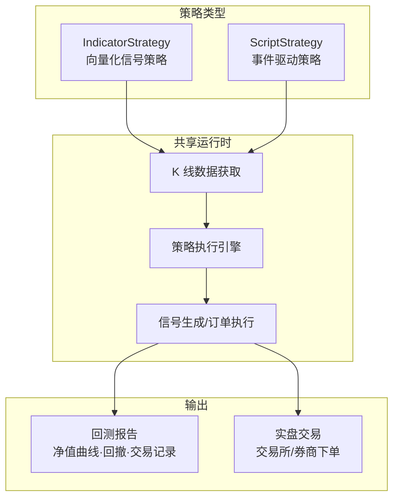
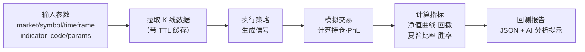
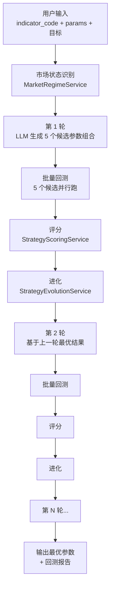

# QuantDinger 源码阅读（四）：策略引擎——双运行时、回测与实验优化

> 有了数据，下一步就是写策略。QuantDinger 的策略引擎设计了两套运行时以覆盖不同的策略范式，外加一个完整的指标 IDE 和回测+实验优化管线。这一篇逐一拆解这些设计。

## 设计思想：研究代码和实盘代码共享同一运行时

QuantDinger 的一个核心设计决策：**策略代码在回测时和在实盘交易时是同一份代码**。不需要"把 Jupyter notebook 里的策略手工翻译成交易脚本"——这是传统 DIY 量化最大的痛点之一。

支撑这个决策的是**双运行时设计**——两条路径覆盖两种策略范式：



## IndicatorStrategy：向量化信号

```python
# 典型的 IndicatorStrategy 代码
import pandas as pd
import numpy as np

my_indicator_name = "双均线交叉"
my_indicator_description = "MA5 上穿 MA20 做多，下穿做空"

# @param period_fast 5
# @param period_slow 20
# @strategy entryPct 1

df = df.copy()
df['ma_fast'] = df['close'].rolling(window=params.get('period_fast', 5)).mean()
df['ma_slow'] = df['close'].rolling(window=params.get('period_slow', 20)).mean()

# 四路信号（QuantDinger 标准）
df['open_long']  = (df['ma_fast'] > df['ma_slow']) & (df['ma_fast'].shift(1) <= df['ma_slow'].shift(1))
df['close_long'] = (df['ma_fast'] < df['ma_slow']) & (df['ma_fast'].shift(1) >= df['ma_slow'].shift(1))
df['open_short'] = (df['ma_fast'] < df['ma_slow']) & (df['ma_fast'].shift(1) >= df['ma_slow'].shift(1))
df['close_short']= (df['ma_fast'] > df['ma_slow']) & (df['ma_fast'].shift(1) <= df['ma_slow'].shift(1))

output = {
    'name': my_indicator_name,
    'plots': [{'name': 'MA5', 'data': df['ma_fast']}, {'name': 'MA20', 'data': df['ma_slow']}],
    'signals': {
        'open_long':  df['open_long'],
        'close_long': df['close_long'],
        'open_short': df['open_short'],
        'close_short':df['close_short'],
    }
}
```

核心特征：

**向量化操作**——整个策略是对 Pandas DataFrame 的向量化计算。`df['ma_fast'] > df['ma_slow']` 一次性生成所有时间点的信号，没有 Python for 循环。适合大多数技术指标类策略——均线、MACD、RSI、布林带等。一次计算就能生成所有 K 线上的信号。

**四路信号标准**——`open_long`/`close_long`/`open_short`/`close_short`。不是简单的 `buy`/`sell` 两路，而是区分开仓和平仓，且支持做多做空双向。框架根据信号时间点和 `# @strategy entryPct`（仓位比例）自动计算持仓和 PnL。

**`# @param` 标记**——代码注释中的 `# @param period_fast 5` 被 `IndicatorParamsParser` 解析为可调节参数。这些参数在回测和实验优化时可以被覆盖（不需要改代码），支撑了后面的实验优化系统。

**`output` 字典**——包含 `name`、`plots`（图表叠加线）、`signals`。`plots` 和 `signals` 的长度必须等于 DataFrame 的 `len(df)`，这是运行时校验的一部分。长度不匹配会直接报错——防止信号错位导致的回测偏差。

## ScriptStrategy：事件驱动

IndicatorStrategy 适合向量化信号，但对于需要显式管理仓位、止损止盈、分批建仓的复杂策略，事件驱动的 `on_bar` 模式更适合：

```python
# 典型的 ScriptStrategy 代码
def on_bar(ctx):
    # ctx 提供当前 K 线上下文
    bar = ctx.current_bar()       # {'time', 'open', 'high', 'low', 'close', 'volume'}
    position = ctx.position()      # 当前持仓
    balance = ctx.balance()        # 账户余额

    if bar['close'] > ctx.sma(20) and position == 0:
        ctx.buy(amount=balance * 0.5)    # 半仓买入
    elif bar['close'] < ctx.sma(20) and position > 0:
        ctx.sell(amount=position)         # 全部卖出
```

每根 K 线触发一次 `on_bar(ctx)`，策略状态（持仓、余额）在 `ctx` 中维护。这种模式适合需要精确控制交易时机和数量的策略——如网格交易、马丁格尔、Iceberg 订单等。

两种运行时共享同一个数据获取层（`DataSourceFactory`），所以策略不需要区分"现在在回测还是实盘"——数据是一样的，执行上下文不同而已。

## 指标 IDE：从代码到可复用的指标库

QuantDinger 不是让用户在 UI 里拖拽搭策略——它直接让你写 Python。但代码写完之后需要验证、存储、复用。`indicator_workspace.py` 提供了这条管线：

### 指标合约（Indicator Contract）

为了让人类和 AI 都能按统一标准写指标，QuantDinger 定义了一套**指标合约**：

```python
def get_indicator_authoring_contract():
    return {
        "required_fields": {
            "globals": ["my_indicator_name", "my_indicator_description"],
            "dataframe": "df = df.copy() at start",
            "signals_four_way": ["df['open_long']", "df['close_long']", ...],
        },
        "forbidden": [
            "Natural language in backtest `code` field",
            "os.system / subprocess / eval / exec / __import__",
            # ...
        ]
    }
```

定义清楚了**必须提供什么**（四路信号、指标名、描述）和**绝对不能做什么**（系统调用、eval、网络 I/O）。这既是给人看的规范，也是给代码验证器的规则来源。

### 安全沙箱

```python
# utils/safe_exec.py
def validate_code_safety(code):
    # 检查禁止模式：os.system, subprocess, eval, exec, __import__
    # 限制导入白名单：仅 pandas, numpy, talib
    # 检查代码长度/复杂度
    pass
```

策略代码在保存和运行前都会过安全校验。防止恶意代码或无心之失破坏服务器——因为策略代码是用户写的 Python，天然具备任意代码执行能力。

### 指标翻译器

`indicator_translator.py` 负责**把 AI 生成的自然语言描述翻译成可执行的 Python 指标代码**。这是 QuantDinger 的 AI 集成中最有趣的组件之一：用户用自然语言描述"我想做一个当 RSI 低于 30 且 MACD 金叉时买入的指标"，LLM 生成代码，translator 校验并注入参数解析框架。

## 回测管线

`services/backtest.py` 的回测流程：



`_KlineCache` 是回测专用的 K 线缓存——和全局的 `DataCache` 不同，它按 `(market, symbol, timeframe)` 组合作为 key，分钟级 K 线 TTL 5 分钟，日线 TTL 30 分钟。回测时同一标的反复跑不同参数，不用每次都重新拉数据。

回测输出包含：
- **净值曲线**：每根 K 线上的账户总价值
- **回撤序列**：从最高点到当前的百分比跌幅
- **交易记录**：每笔开仓/平仓的时间、价格、盈亏
- **汇总指标**：总收益率、最大回撤、夏普比率、胜率、盈亏比

设计上有一个容易被忽略但很实用的细节——**回测结果附带 AI 分析提示**（`POST /api/agent/v1/backtests` 的响应里包含自然语言的分析摘要）。策略执行完后，系统自动调用 LLM 分析回测结果——"这个策略胜率高但盈亏比偏低，建议优化止盈条件"——而不是让用户盯着一堆数字自己分析。

## 实验优化：从手动调参到自动化搜索

`services/experiment/` 子包是 QuantDinger 策略优化能力的核心。它实现了 LLM 驱动的多轮自动优化管线：



### 市场状态识别

`MarketRegimeService` 在优化开始前先分析当前市场处于什么状态（趋势/震荡/高波动），然后根据状态调整评分权重——趋势市场偏重收益率，震荡市场偏重胜率。防止优化的参数过拟合到特定市场状态。

### 评分系统

`StrategyScoringService` 采用多维度评分（支持用户自定义权重）：

```python
# 默认评分维度
scoring = {
    "total_return": 权重,      # 总收益率
    "max_drawdown": 权重,      # 最大回撤（负向）
    "sharpe_ratio": 权重,      # 夏普比率
    "win_rate": 权重,          # 胜率
    "profit_factor": 权重,     # 盈亏比
}
```

### LLM 驱动的参数生成

`prompts.py` 里定义了一套 system prompt 和每轮的生成 prompt：

```python
SYSTEM_PROMPT = """你是一个量化策略优化专家。根据上一轮的回测结果，
分析哪些参数组合表现最好，为什么，并生成下一轮优化的候选参数。"""
```

不是纯随机的参数搜索（如网格搜索或随机搜索），而是**LLM 分析回测结果后，基于对策略行为的理解来生成改进方向**。比如"MA 快线从 5 调到 7 后信号减少了但胜率上升，应该继续往更长周期方向探索"——纯随机搜索不知道这种语义信息。

### 进化服务

`StrategyEvolutionService` 在轮次之间做三件事：

1. **精英保留**——上一轮得分最高的 1-2 个候选直接进入下一轮（防止退化）
2. **交叉变异**——从高分候选中提取参数片段，组合出新的候选
3. **多样性保证**——确保新生成的候选不会和已有候选过于相似（防止搜索陷入局部最优）

### 早停机制

```python
EARLY_STOP_SCORE = 82.0  # 综合评分达到 82 分提前终止
```

如果某轮的最优候选评分超过阈值，整个实验提前终止——没必要把预算跑完。

## 从实验到实盘的状态跃迁

实验产出的最优参数和策略代码，通过一次状态变更就进入实盘：

```
Indicator 代码 → 保存到指标库 → 创建策略 → 绑定交易所 → 启动
                                                          ↓
                                               running 状态写入 DB
                                               ↓
                                          start_strategy() 启动执行线程
```

关键在于**同一个 `indicator_code` 和 `params`** 在回测、实验优化、实盘交易中是完全相同的。没有任何翻译、转换、重写的步骤。这也是双运行时设计的最终价值——缩小研究到生产的 gap。

## 策略引擎小结

| 组件 | 解决的问题 | 核心设计 |
|------|-----------|---------|
| IndicatorStrategy | 技术指标类策略 | 向量化信号 + 四路标准 |
| ScriptStrategy | 复杂交易逻辑 | 事件驱动 + ctx 上下文 |
| 指标 IDE | 代码验证/存储/复用 | 合约规范 + 安全沙箱 |
| BacktestService | 回测执行 | K 线缓存 + 多维指标 + AI 分析 |
| ExperimentRunner | 参数优化 | LLM 驱动多轮搜索 + 市场状态自适应 |

## 下一步

策略写得再好，最终还是要下单。下一篇深入券商执行层——10+ 个加密货币交易所加上 IBKR、MT5、Alpaca 是怎么统一抽象的，实盘订单从创建到成交经历了什么。

→ [（五）券商执行层：多交易所统一抽象与订单生命周期](05-execution.md)
