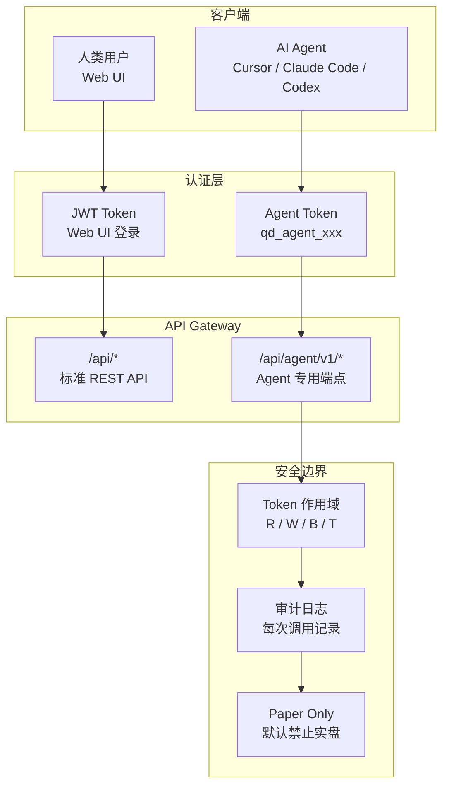

# QuantDinger 源码阅读（五）：AI 集成——Agent Gateway 与 MCP Server

> QuantDinger 的差异化定位之一是「Agent-native」——不是事后拼上去的 AI 功能，而是从 API 设计层面就让 AI 客户端可以像人类用户一样操控整个系统。这一篇拆解 Agent Gateway 的 API 设计、MCP Server 的薄封装策略、以及贯穿始终的安全模型。

## 设计哲学：API 即界面

QuantDinger 的 Agent 集成基于一个核心信念：**AI 不应该通过特殊的内部接口访问系统，而应该通过和人类用户相同的 API 路径——只是认证方式不同**。



关键区别：
- 人类用户通过 Web UI 登录获得 JWT，调用 `/api/*`
- AI Agent 通过 Agent Token 认证，调用 `/api/agent/v1/*`
- 两条路径共享相同的后端服务层，但 Agent 路径多了**作用域检查 + 审计日志 + 默认 Paper Only**三道安全门

## Agent Gateway：/api/agent/v1

`routes/agent_v1/` 目录下按功能域拆分了路由文件：

```
routes/agent_v1/
├── __init__.py      # 注册所有子路由
├── _helpers.py      # 请求解析、错误处理
├── _security.py     # Agent Token 验证、作用域检查
├── health.py        # 健康检查
├── markets.py       # 市场列表、符号搜索
├── indicators.py    # 指标合约、验证、保存
├── strategies.py    # 策略创建、更新
├── backtests.py     # 回测提交、结果查询
├── experiments.py   # 实验优化（多轮 LLM 搜索）
├── portfolio.py     # 持仓查询
├── quick_trade.py   # 快速交易（paper only）
├── jobs.py          # 异步任务状态查询
└── admin.py         # Token 管理
```

### 安全模型：三层纵深

**第一层：Token 验证**

```python
# _security.py
def verify_agent_token(token_str):
    """验证 Agent Token 是否有效，返回 token 记录（含 scopes）"""
    token_record = db.query("SELECT * FROM agent_tokens WHERE token_hash = ?",
                            hash(token_str))
    if not token_record:
        raise AgentAuthError("Invalid token")
    if token_record['expires_at'] and token_record['expires_at'] < now():
        raise AgentAuthError("Token expired")
    return token_record
```

Agent Token 在数据库里**哈希存储**，不是明文。即使数据库被拖库，攻击者也拿不到有效的 token。Token 格式为 `qd_agent_xxxxxxxx`，前缀用于快速识别，后缀为随机字符串。

**第二层：作用域检查**

```python
SCOPES = {
    'R': '读取——查市场、符号、K线、价格',
    'W': '工作区写入——保存指标、创建策略',
    'B': '回测——提交回测任务、查询结果',
    'T': '交易——实盘下单（需服务端额外开启）',
}
```

每个 API 端点声明自己需要的作用域。Token 的 scopes 不包含所需作用域时，直接返回 403。例如 `POST /api/agent/v1/backtests` 需要 `B` scope，而 `GET /api/agent/v1/markets` 只需要 `R`。

**第三层：Paper Only + 服务端双重开关**

```python
# 交易类操作需要同时满足：
# 1. Token 的 paper_only = False
# 2. 服务端环境变量 AGENT_LIVE_TRADING_ENABLED = true
if token['paper_only'] or not env_live_trading_enabled():
    raise AgentAuthError("Live trading not enabled")
```

设计意图非常明确：**防止 AI 误操作导致真实资金损失**。即使你给了 Agent `T` scope，默认情况下它也只能下 paper 订单（模拟交易）。要开启真实交易，必须同时在 Token 级别和服务端级别解锁——双重确认防止单点失误。

### 审计日志

每次 Agent API 调用都会被记录：

```python
# routes/agent_v1/_helpers.py
def audit_log(token_id, action, details):
    db.execute("INSERT INTO agent_audit_log (token_id, action, details, ip, ts) ...")
```

审计日志是 append-only 的——不提供删除和修改接口。这意味着每一笔 Agent 发起的操作都可以追溯到具体 token 和时间点。对于运行真实资金的系统来说，这是合规的底线。

### 异步任务模式

回测、实验优化等长耗时操作采用 Job 模式：

```python
# POST /api/agent/v1/backtests → 返回 {"job_id": "..."}
# GET  /api/agent/v1/jobs/{job_id} → {"status": "running", "progress": 0.6}
# GET  /api/agent/v1/jobs/{job_id} → {"status": "completed", "result": {...}}
```

Agent 提交任务 → 后台 worker 执行 → Agent 轮询状态。MCP Server 包装了一层 `wait_for_job` 和 `stream_job_until_done` 工具，让 AI 客户端可以用同步的方式等待异步任务完成，而不用自己实现轮询逻辑。

## MCP Server：薄封装

`mcp_server/src/quantdinger_mcp/server.py` 是一个 FastMCP 应用，把 Agent Gateway 的 REST API 包装成 MCP 工具：

```python
# 27 个已注册的 MCP 工具
MCP_TOOL_NAMES = (
    "whoami",                        # 验证 token 有效性
    "check_health",                  # 检查服务健康状态
    "list_markets",                  # 可用市场列表
    "search_symbols",                # 搜索交易对
    "get_klines",                    # 拉取 K 线数据
    "get_price",                     # 实时价格
    "get_indicator_authoring_contract", # 获取指标编写合约
    "validate_indicator_code",       # 验证指标代码安全
    "save_indicator",                # 保存指标到用户库
    "submit_backtest",               # 提交回测（异步）
    "submit_experiment_pipeline",    # 提交实验优化（异步）
    "submit_ai_optimize",            # 提交 AI 优化
    "list_paper_orders",             # 查询 paper 订单
    # ... 更多
)
```

### 设计原则：REST 是真相来源

```python
"""
QuantDinger MCP server — exposes the Agent Gateway as MCP tools.

This is intentionally a thin wrapper:
  * REST stays the source of truth (`/api/agent/v1`).
  * Trading (T) is NOT exposed here — use REST directly if explicitly enabled.
  * The user-supplied agent token's scopes still gate every call server-side.
"""
```

关键思想：

1. **MCP Server 不做业务逻辑**——所有逻辑仍在 Agent Gateway 的 REST API 中，MCP Server 只是把 HTTP 调用翻译成 MCP 工具函数
2. **Trading 工具不暴露**——MCP Server 刻意不包装交易类端点。如果要实盘交易，必须直接调 REST API，确保人类明确知道自己在做什么
3. **安全边界在 Gateway，不在 MCP 层**——Token 的作用域检查在服务端，MCP Server 只是透传 token

### Secret 脱敏

```python
# security.py
_SECRET_KEYS = frozenset({
    "api_key", "secret_key", "passphrase", "secret", "password",
    "private_key", "access_token", "bot_token", "webhook_secret",
})

def redact_secrets(value):
    """递归替换所有敏感字段为 '***'"""
    # api_key: "sk-abc123" → api_key: "***"
```

在返回 Agent 的响应之前，所有已知的密钥字段被替换为 `***`。这是防止 LLM 意外记忆敏感信息的最后一道防线——即使前面的验证层有疏漏，密钥也不会出现在 Agent 看到的文本中。

### 环境变量配置

```python
BASE_URL = os.environ["QUANTDINGER_BASE_URL"]   # 后端地址
AGENT_TOKEN = os.environ["QUANTDINGER_AGENT_TOKEN"]  # Agent Token
TIMEOUT_S = float(os.environ.get("QUANTDINGER_TIMEOUT_S", "60"))
```

符合 MCP 惯例。AI 客户端通过 `mcp.json` 配置这些环境变量：

```json
{
  "mcpServers": {
    "quantdinger": {
      "command": "uvx",
      "args": ["quantdinger-mcp"],
      "env": {
        "QUANTDINGER_BASE_URL": "http://localhost:8888",
        "QUANTDINGER_AGENT_TOKEN": "qd_agent_xxxxxxxx"
      }
    }
  }
}
```

## AI 自优化循环

除了让 AI 操控系统，QuantDinger 还有一个 AI 自优化的子系统：

### AI 信心度校准

`services/ai_calibration.py` 是一个后台 worker，定期分析 AI 的历史预测和实际市场走势的偏差，调整 AI 分析输出的信心度评分。如果 AI 连续高估自己的预测准确率，校准器会降低后续输出的信心度——用真实数据反馈修正模型的过度自信。

### 反思引擎

`services/reflection.py` 在策略运行后分析：AI 当初为什么选了这个参数？实际表现和预期差了多少？哪些假设被市场证伪了？这些反思结果存入数据库，用于优化后续的 AI 策略推荐。

这两个组件形成了**AI 的反馈闭环**——预测 → 验证 → 校准 → 改进预测。把量化策略的迭代优化逻辑应用到了 AI 本身。

## AI 集成小结

| 组件 | 职责 | 关键安全设计 |
|------|------|-------------|
| Agent Gateway | AI 访问系统的唯一入口 | Token 哈希 + Scope 检查 + Paper Only + 审计日志 |
| MCP Server | REST → MCP 工具翻译 | 薄封装不做业务、不暴露交易工具 |
| redact_secrets | 响应脱敏 | 递归替换所有密钥字段为 `***` |
| AI Calibration | 信心度自校准 | 历史预测 vs 实际走势偏差分析 |
| Reflection | 策略决策反思 | 预测复盘 + 假设证伪 |

## 下一步

AI、策略、执行——三大引擎都讲完了。最后一篇看基础设施：Docker 是怎么编排这些服务的、认证和计费系统是怎么设计的、安全底线在哪里。

→ [（六）基础设施：Docker 部署、认证计费与安全设计](06-infra.md)
