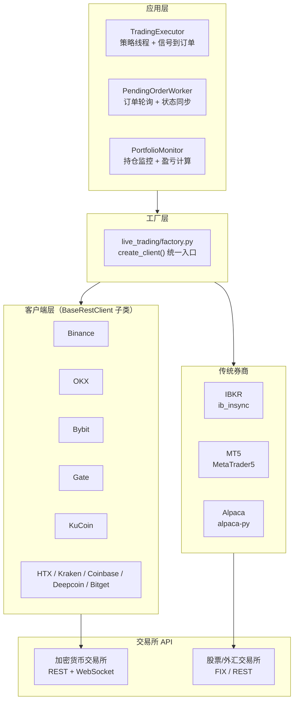
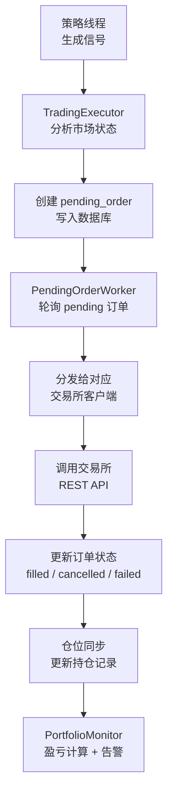

# QuantDinger 源码阅读（五）：券商执行层——多交易所统一抽象与订单生命周期

> 策略写好，回测通过，参数优化完——接下来是下单。QuantDinger 支持 10+ 个加密货币交易所外加 IBKR、MT5、Alpaca 三家传统券商。这篇拆解它是怎么用一个工厂模式统一所有执行通道的，以及一笔订单从策略信号到成交的全过程。

## 设计挑战

多券商执行有三个核心难点：

1. **每个交易所的 API 认证方式不同**——有的用 API Key + Secret + Passphrase（OKX），有的用 API Key + RSA 签名（Binance），有的用 OAuth（Coinbase）
2. **合约规格不同**——合约乘数、最小下单量、价格精度、杠杆倍数各不相同
3. **订单状态机不同**——现货和合约的订单状态转换路径不同，部分交易所还有特殊的止损单类型

QuantDinger 的解法是**两层抽象**：



## 基类设计：BaseRestClient

`live_trading/base.py` 定义了一个最小化基类：

```python
class BaseRestClient:
    """交易所 REST 客户端的基类。不做 ccxt 抽象，直接调交易所原生 API。"""

    def place_order(self, symbol, side, order_type, quantity, price=None, **kwargs):
        raise NotImplementedError

    def cancel_order(self, order_id, symbol):
        raise NotImplementedError

    def get_order(self, order_id, symbol):
        raise NotImplementedError

    def fetch_balance(self):
        raise NotImplementedError

    def fetch_positions(self):
        raise NotImplementedError
```

**为什么不用 CCXT 统一抽象？**

CCXT 确实提供了跨交易所的统一接口。但 QuantDinger 在实盘层面选择了直连交易所的原生 REST API。原因在代码里没有明确注释，但从设计可以推断：

1. **CCXT 封装会增加 latency**——交易所原生的错误码、特殊订单类型、止损机制被 CCXT 的统一接口抹平了
2. **CCXT 的维护滞后**——交易所上新功能（如 Binance 的 trailing stop），CCXT 可能要数周才支持
3. **直接控制签名和请求格式**——排查生产问题时，原生 API 调用比 CCXT 的抽象层容易定位

CCXT 在数据层（K 线拉取）仍然使用——那里不需要实时性，也不需要特殊功能。

## 工厂模式：create_client()

`live_trading/factory.py` 通过 `create_client(cfg)` 根据配置字典创建对应的交易所客户端：

```python
def create_client(cfg):
    exchange = _get(cfg, "exchange", "exchange_id").lower()

    if exchange == "binance":
        if _get(cfg, "market_type") == "spot":
            return BinanceSpotClient(cfg)
        return BinanceFuturesClient(cfg)

    elif exchange == "okx":
        return OkxClient(cfg)        # OKX 统一接口，spot/swap 自动处理

    elif exchange == "bybit":
        return BybitClient(cfg)

    elif exchange == "ibkr":
        return _create_ibkr(cfg)     # 懒加载——避免 ib_insync 未装时崩溃

    elif exchange == "mt5":
        return _create_mt5(cfg)      # 懒加载

    elif exchange == "alpaca":
        return _create_alpaca(cfg)   # 懒加载

    # ... gate, kucoin, kraken, coinbase, deepcoin, htx ...
```

**加密货币和传统券商的关键差异**：

- **加密货币交易所**（Binance/OKX/Bybit 等）通过直连 REST + WebSocket，客户端在应用内管理签名和 HTTP 调用
- **IBKR** 需要 `ib_insync` 库——这是一个异步事件驱动的库，和 Flask 的同步模型不完全兼容。`__init__.py` 里的 `ib_insync.util.patchAsyncio()` 就是专门为 IBKR 准备的
- **MT5** 需要 `MetaTrader5` Python 包——这本质上是 Windows DLL 的 Python 绑定，只能在 Windows 上运行
- **Alpaca** 使用 `alpaca-py`，API 相对现代，对 Python 环境友好

**懒加载设计**——IBKR、MT5、Alpaca 的导入不是 `from xxx import` 放在文件顶部，而是在 `_create_ibkr` 等函数内部 `import`。因为大多数用户只用加密货币交易所，装 `ib_insync` 和 `MetaTrader5` 对他们是无意义的依赖。

## 配置解析：_get() 的容错设计

```python
def _get(cfg, *keys):
    """按优先级顺序从配置字典中取值。"""
    for k in keys:
        v = cfg.get(k)
        if v is None: continue
        s = str(v).strip()
        if s: return s
    return ""
```

这个简单的工具函数支撑了整个工厂的配置解析。多个 key 别名（如 `"exchange"` 和 `"exchange_id"`）是为了兼容不同调用方的命名习惯——UI 前端可能传 `exchange`，Agent Gateway 传 `exchange_id`，内部服务可能传 `exchange_code`。

## 订单生命周期

一笔订单从策略信号到最终成交的经历：



### TradingExecutor：策略到订单的桥梁

```python
# services/trading_executor.py
class TradingExecutor:
    def start_strategy(self, strategy_id):
        """为每个策略启动独立线程"""
        thread = threading.Thread(
            target=self._strategy_loop,
            args=(strategy_id,),
            daemon=True
        )
        thread.start()

    def _strategy_loop(self, strategy_id):
        """策略主循环：拉 K 线 → 算信号 → 生成订单"""
        while strategy.status == 'running':
            # 1. 拉取最新 K 线
            klines = DataSourceFactory.get_kline(...)
            # 2. 执行策略逻辑（IndicatorStrategy 或 ScriptStrategy）
            signals = self._run_indicator(klines, params)
            # 3. 根据信号生成待执行订单
            if signals.has_open_long():
                self._enqueue_pending_order(strategy_id, 'open_long', ...)
            # 4. 按策略周期休眠
            time.sleep(interval)
```

每个策略一个独立 `daemon` 线程——主进程退出时自动清理，不会残留僵尸线程。策略循环的核心逻辑是：拉数据 → 算信号 → 如果有新信号，生成 pending_order 写入数据库，**不下单**。下单由 `PendingOrderWorker` 异步处理。这个分离设计让策略线程不会被 API 调用的网络延迟阻塞——信号计算是毫秒级，下单等待可能秒级。

### PendingOrderWorker：异步下单 + 状态同步

```python
# services/pending_order_worker.py
class PendingOrderWorker:
    def start(self):
        self._thread = threading.Thread(target=self._loop, daemon=True)
        self._thread.start()

    def _loop(self):
        while True:
            # 1. 扫 pending_orders 表
            pending = self._fetch_pending_orders()
            # 2. 逐个提交到对应交易所
            for order in pending:
                client = create_client(order.exchange_config)
                result = client.place_order(...)
                # 3. 更新数据库状态
                self._update_order_status(order.id, result)
            # 4. 同步持仓（检查已成交订单的实际状态）
            self._sync_positions()
            time.sleep(poll_interval)
```

设计选择：**轮询而非 WebSocket push**。原因：

- 不是所有交易所都提供稳定的 WebSocket 订单推送
- 轮询逻辑简单，容易调试，不会丢事件
- 对于分钟级策略（大多数场景），2-5 秒的轮询延迟完全可接受

### 仓位同步与自动止损

`_sync_positions_best_effort()` 在后台定期查询所有运行中策略的持仓状态。如果发现某个策略的交易所 API key 已经失效（无法查询持仓），会自动将该策略标记为 `stopped`——防止"策略表面在运行，实际 API 已断开，信号一直在生成但从未成交"的静默失败。

这个逻辑和之前讨论的 `restore_running_strategies` 在服务器重启后的自动止损形成了双重保障。

## PortfolioMonitor：组合级别监控

```python
# services/portfolio_monitor.py
def start_monitor_service():
    """定期计算所有策略的汇总盈亏，超过阈值发送通知"""
    # 1. 汇总所有运行中策略的当前持仓
    # 2. 计算总 PnL（已实现 + 未实现）
    # 3. 检查是否触发告警阈值（单日最大亏损、总回撤等）
    # 4. 通过 NotificationService 发送 Telegram/Email/SMS
```

这是「监控」闭环的最后一环。策略 → 订单 → 持仓 → 盈亏 → 告警，形成完整的反馈回路。

## 执行层小结

| 组件 | 职责 | 关键设计 |
|------|------|---------|
| BaseRestClient | 统一接口 | 不依赖 CCXT，直连原生 API |
| create_client() | 交易所路由 | 工厂模式 + 懒加载可选券商 |
| TradingExecutor | 策略到订单 | 独立线程 daemon，信号和下单分离 |
| PendingOrderWorker | 异步下单 | 轮询模式，简单可靠 |
| PortfolioMonitor | 盈亏监控 | 阈值告警 + 多渠道通知 |

## 下一步

人写策略、系统执行订单——这个闭环还缺 AI 的参与。下一篇深入 Agent Gateway 和 MCP Server，看看 AI 是怎么被整合进这个量化操作系统的。

→ [（六）AI 集成：Agent Gateway 与 MCP Server](06-ai-agent.md)
