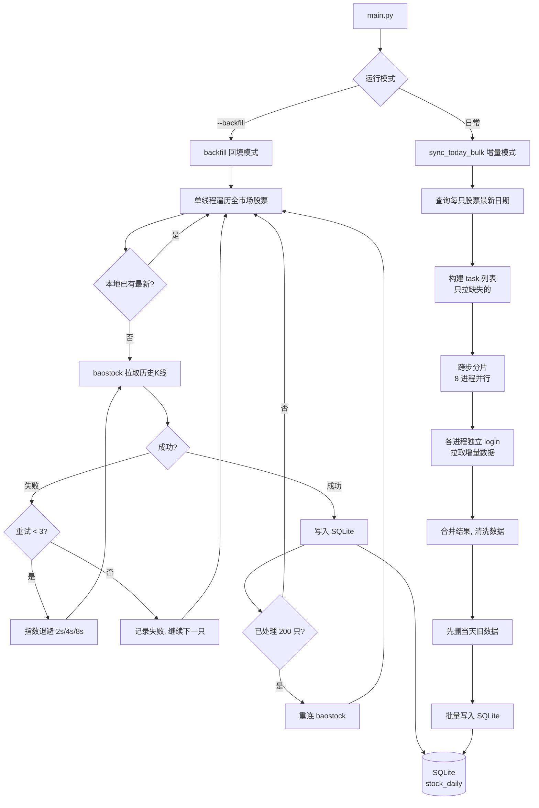

# Sequoia-X 源码阅读（一）：项目介绍与使用方式

读完这篇文章你会得到：一个跑得起来的 A 股量化选股系统，每天收盘后自动从 baostock 拉数据，跑 7 个策略，飞书推送结果。

## 这是什么

Sequoia-X 解决一个问题：**散户做量化选股，数据从哪来、策略怎么写、结果怎么推送**。

传统方案不是收费（Wind、Tushare Pro）就是反爬严重（东方财富）。Sequoia-X 用 [baostock](http://baostock.com) 做数据源——免费、无需注册、没有请求频率限制。数据拉到本地 SQLite，之后策略全在本地跑，不依赖任何外部 API。

核心特性：

- 全市场 ~5200 只 A 股日 K 数据，12 分钟回填完毕
- 8 进程并行增量更新，每个交易日收盘后 2-3 分钟跑完
- 7 个内置策略，向量化计算，OOP 架构，新增策略只需继承基类
- 飞书 Webhook 推送选股结果，策略失败有日志但没有推送不会中断其他策略
- uv 管理依赖，ruff 格式化，pytest + hypothesis 测试

## 数据流全景




## 装起来跑一遍

### 环境

Python 3.10+，推荐用 uv：

```bash
git clone https://github.com/sngyai/Sequoia-X.git
cd Sequoia-X
uv sync
```

### 配置飞书推送

建一个 `.env`，填飞书机器人的 Webhook 地址：

```bash
cp .env.example .env
```

`.env.example` 里只有四个字段：

```
FEISHU_WEBHOOK_URL_TURTLETRADE=https://open.feishu.cn/open-apis/bot/v2/hook/xxx
FEISHU_WEBHOOK_URL_MAVOLUME=
FEISHU_WEBHOOK_URL_HIGHTIGHTFLAG=
# ... 每个策略可以有自己的群，空着就不推
```

不填也能跑，策略结果只写日志不推送。

### 首次回填历史数据

```bash
python main.py --backfill
```

这一步把 A 股全市场历史后复权日 K 灌入 SQLite。输出大概长这样：

```
Sequoia-X V2 启动
进入回填模式...
获取全市场股票列表... 共 5256 只
回填进度: [████████████████████████████████████████] 100%
回填完成，耗时 731 秒
```

约 12 分钟。之后数据就一直在本地 `data/sequoia_v2.db` 里，再也不用拉全量了。

### 日常运行

```bash
python main.py
```

每天收盘后跑一次：

```
Sequoia-X V2 启动
开始拉取最新快照...
快照同步完成，写入 5168 只股票（8 进程，耗时 94 秒）
执行策略：TurtleTradeStrategy
TurtleTradeStrategy 选出 12 只股票
执行策略：MaVolumeStrategy
MaVolumeStrategy 选出 5 只股票
[...]
Sequoia-X V2 运行完成
```

丢到 crontab 里自动跑：

```cron
15 19 * * 1-5 cd /root/Sequoia-X && .venv/bin/python main.py >> log.txt 2>&1
```

## 目录结构概览

```
Sequoia-X/
├── main.py                      # 入口：argparse 分发回填/日常模式
├── pyproject.toml               # 依赖 + ruff + pytest 配置
├── sequoia_x/
│   ├── core/
│   │   ├── config.py            # pydantic-settings 读 .env
│   │   └── logger.py            # rich 结构化日志
│   ├── data/
│   │   └── engine.py            # 数据引擎：baostock 回填 + 增量 + SQLite
│   ├── strategy/
│   │   ├── base.py              # 策略抽象基类
│   │   ├── turtle_trade.py      # 海龟突破
│   │   ├── ma_volume.py         # 均线放量
│   │   ├── high_tight_flag.py   # 高窄旗形
│   │   ├── limit_up_shakeout.py # 涨停洗盘
│   │   ├── uptrend_limit_down.py # 跌停反包
│   │   ├── rps_breakout.py      # RPS 突破
│   │   └── private_placement.py # 定向增发
│   └── notify/
│       └── feishu.py            # 飞书 Webhook 推送
└── tests/                       # pytest + hypothesis
```

## main.py 主流程

`main.py` 是整个系统的调度中心，不到 110 行。核心流程 5 步：

```python
# 1. 加载 .env 和配置
settings = get_settings()

# 2. 初始化日志
logger = get_logger(__name__)

# 3. 初始化数据引擎
engine = DataEngine(settings)

# 回填模式：单线程拉全量
if args.backfill:
    all_symbols = engine.get_all_symbols()
    engine.backfill(all_symbols)
    return

# 日常模式：多进程增量更新
engine.sync_today_bulk()

# 4. 构造策略列表
strategies = [
    MaVolumeStrategy(engine=engine, settings=settings),
    TurtleTradeStrategy(engine=engine, settings=settings),
    # ... 7 个策略
]

# 5. 逐个跑策略 → 有结果推送飞书
for strategy in strategies:
    selected = strategy.run()
    if selected:
        notifier.send(symbols=selected, strategy_name=...)
```

设计上有几个值得注意的点：

- 回填模式用 `return` 提前退出，日常模式一直走到底——两种路径在同一个 `main()` 里清晰分开
- 策略列表是手动构造的 `list[BaseStrategy]`，加新策略加一行就行
- 每个策略 catch 自己内部的异常，不互相影响；全局只 catch 未预料的致命错误
- `socket.setdefaulttimeout(10.0)` 写在文件顶部——baostock 偶发超时，设上限防止卡死

## 后续阅读路线

这个系列计划拆成 4-5 篇，顺着数据流读下去：

| 篇 | 内容 | 对应文件 |
|:---|------|----------|
| 一（本文） | 项目概览、使用方式、主流程 | `main.py` |
| 二 | 数据引擎：baostock 集成、SQLite schema、增量更新 | `data/engine.py` |
| 三 | 策略体系：基类设计、向量化计算、各策略实现 | `strategy/` |
| 四 | 飞书推送 + 基础设施（配置、日志） | `notify/`、`core/` |
| 五 | 测试体系：pytest + hypothesis | `tests/` |

下一篇进入 `data/engine.py`，看看 12 分钟灌完 5200 只股票历史日 K 是怎么做到的。
