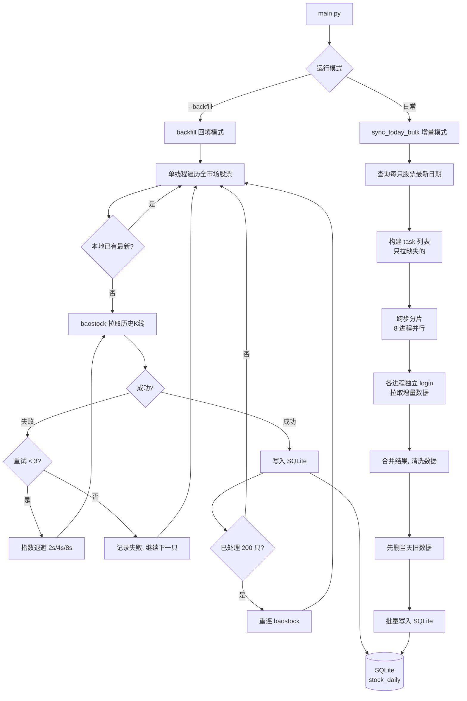

# Sequoia-X 源码阅读（二）：数据引擎

上一篇跑了全流程，这一篇钻进 `data/engine.py`——整个系统最核心的模块。一个文件，不到 340 行，搞定 A 股全市场历史数据的拉取、存储和增量更新。

读完你会看到：为什么后复权选型是对的、多进程分片怎么做到不丢数据、以及一个可中断续传的回填方案怎么写。

## 数据流全景



## 一张表，五个字段

```sql
CREATE TABLE IF NOT EXISTS stock_daily (
    id       INTEGER PRIMARY KEY AUTOINCREMENT,
    symbol   TEXT    NOT NULL,
    date     TEXT    NOT NULL,
    open     REAL,
    high     REAL,
    low      REAL,
    close    REAL,
    volume   REAL,
    turnover REAL,
    UNIQUE (symbol, date)
);
```

设计上三个关键点：

**UNIQUE(symbol, date)** — 这是幂等写入的基础。同一天同一只股票的数据写进去，不会产生重复行。增量同步的逻辑是先 `DELETE` 当天已有数据再写入，即使脚本中间断过，重新跑也不会错。

**用 TEXT 存日期而不是 DATE 类型** — SQLite 没有原生的 DATE 类型。存 `"2026-05-17"` 字符串，排序和比较行为完全可预期。Pandas 读写 SQLite 也是按 TEXT 处理的。

**后复权（adjustflag="1"）** — 这是整个数据架构最值得说的选型决策。两种复权：

| 方式 | 特点 |
|------|------|
| 前复权 | 历史价格被调整，新增数据时历史全部要重算 |
| 后复权 | 历史价格保持不变，只调整最新价格 |

后复权的优势对于增量系统是决定性的：每次只需要拉最新一天的数据追加进去，历史数据不用动。前复权每来一根除权，所有历史价格都要改一遍。所以选后复权不是偏好问题，是增量架构的硬需求。

## backfill：可中断的全量回填

`backfill()` 方法是系统里单次运行时间最长的操作——灌入全市场 ~5200 只股票历史日 K，约 12 分钟。设计假设是**过程中一定会出问题**：baostock 超时、网络闪断、机器被重启。所以它有三层容错：

**第一层：单只重试，指数退避**

```python
for attempt in range(max_retries):  # max_retries = 3
    try:
        rs = bs.query_history_k_data_plus(...)
        # 成功跳出
        break
    except Exception as exc:
        if attempt < max_retries - 1:
            wait = 2 ** (attempt + 1)  # 2s → 4s → 8s
            logger.warning(f"[{symbol}] 第{attempt + 1}次失败: {exc}，{wait}s 后重试")
            time.sleep(wait)
            bs.logout(); time.sleep(1); _login()
        else:
            logger.warning(f"[{symbol}] {max_retries}次重试均失败，跳过")
```

三次都失败不崩，记日志跳过接着跑下一只。单只失败不影响整体。

**第二层：定期重连**

```python
reconnect_interval = 200
if since_reconnect >= reconnect_interval:
    bs.logout()
    time.sleep(1)
    _login()
    since_reconnect = 0
```

baostock 长连接容易超时。每处理 200 只股票主动断掉重连一次，成本是每次 1 秒，换来了全量回填不会被长连接超时打断。

**第三层：可中断续传**

```python
last_date = self._get_last_date(symbol)
if last_date and last_date >= today_str:
    skipped += 1
    continue
```

每只股票拉之前先查本地 SQLite 里这个 symbol 的最新日期。如果已经覆盖到今天，直接 skip。这意味着跑到一半 `Ctrl+C` 也没事，重新跑会自动从中断点继续。

## sync_today_bulk：8 进程增量更新

日常模式的核心。`backfill` 是单线程的——没必要并行，一次性拉 12 年历史数据。但增量更新只有一天的数据要拉，5200 只股票如果串行会等到天荒地老。这里用 8 进程并行，2-3 分钟搞定。

**分片策略**

```python
n_workers = min(8, len(tasks))
chunks = [tasks[i::n_workers] for i in range(n_workers)]
```

不是常见的 `tasks[i:i+chunk_size]` 连续切片，而是**跨步切片**。假设 12 个 task、4 个 worker：

```
worker 0: [task0, task4, task8]
worker 1: [task1, task5, task9]
worker 2: [task2, task6, task10]
worker 3: [task3, task7, task11]
```

连续切片的缺点是：如果某些 task 特别慢（集中在连续区间），那几个 worker 会被拖死，其他 worker 闲等。跨步切片让每个 worker 拿到的 task 分布均匀，负载更平衡。

**每个进程独立登录 baostock**

```python
def _bs_fetch_batch(tasks: list) -> list:
    """多进程 worker：独立 login，批量拉取 baostock 数据。"""
    import baostock as bs
    bs.login()
    results = []
    for symbol, bs_code, start, end in tasks:
        # ...
    bs.logout()
    return results
```

这是个模块级函数（不是 `DataEngine` 的方法），因为 `multiprocessing.Pool.map` 需要 pickle 序列化。实例方法 pickle 时会带上整个对象的状态，容易出问题。把它放在模块顶层，每个进程自己 `import baostock` 然后 `login()`，互不干扰。

**写入前先清当天旧数据**

```python
for d in df["date"].unique().tolist():
    conn.execute("DELETE FROM stock_daily WHERE date = ?", (d,))
df.to_sql("stock_daily", conn, if_exists="append", ...)
```

为什么先删再写，而不是用 `INSERT OR REPLACE`？因为批量操作中 `to_sql` 的 `if_exists="append"` 性能远好于逐行 upsert。先清后写是一种常见的批处理模式——用两趟简单操作替代一趟复杂操作。

**数据清洗在写入前**

```python
df[col] = pd.to_numeric(df[col], errors="coerce")
df = df.dropna(subset=["close"])
df = df[df["volume"] > 0]
```

三行做了三件事：非数字值转 NaN、收盘价缺失的行丢弃、成交量为零的行丢弃。停牌和退市的股票不会有垃圾数据混入策略计算。

## 代码转换：sh 还是 sz

```python
@staticmethod
def _to_baostock_code(symbol: str) -> str:
    prefix = "sh" if symbol.startswith(("6", "9")) else "sz"
    return f"{prefix}.{symbol}"
```

A 股代码规则很简单：6 开头是上海主板，9 开头是上海 B 股，其余都是深圳。这个规则几十行之后被 `backfill` 和 `_bs_fetch_batch` 反复调用，抽成独立方法是对的。

## DataEngine 的初始化

```python
class DataEngine:
    def __init__(self, settings: Settings) -> None:
        self.db_path: str = settings.db_path
        self.start_date: str = settings.start_date
        self._init_db()
```

构造函数只做两件事：存路径、建表。`_init_db()` 是幂等的（`CREATE TABLE IF NOT EXISTS`），所以每次创建 DataEngine 实例都不会破坏已有数据。`db_path` 从 pydantic-settings 的配置对象注入进来，数据库路径可以改，SQLite 文件可以直接拷到别的机器上用。

## 可复用的设计模式

1. **幂等写入 = UNIQUE 约束 + 先删后写**。不需要分布式事务，不需要检查行是否存在。删掉再插入，逻辑简单，结果正确。

2. **可中断续传 = 每步操作前检查状态**。`_get_last_date()` 查一下，已经完成的跳过。不是"从头开始"，而是"从上次停的地方开始"。

3. **模块级函数做 multiprocessing worker**。不要在 Pool.map 里传实例方法和闭包——pickle 序列化它们会带来不可预期的行为。独立的模块级函数是最干净的方案。

4. **定期重连长连接**。没有心跳保活机制，不如主动断开再连。每 N 次操作重连一次，比加心跳包简单得多。

下一篇进入 `strategy/`，看策略基类怎么做到新增一个策略只需继承一个类。
