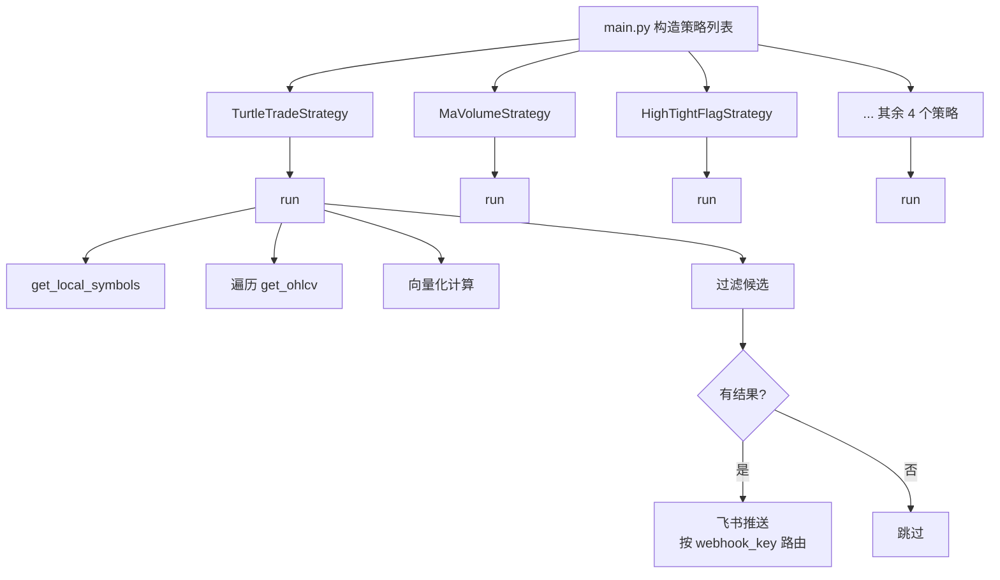

# Sequoia-X 源码阅读（三）：策略体系

前两篇把数据准备好了。这一篇看怎么用这些数据——7 个策略怎么组织、基类怎么设计、新增一个策略需要几行代码。

## 策略执行流程



## 一个 20 行的基类

`base.py` 是整个策略体系的基石。没有它也能写策略，但有了它，新增策略的成本降到了「继承 + 实现一个方法」：

```python
class BaseStrategy(ABC):
    webhook_key: str = "default"

    def __init__(self, engine: DataEngine, settings: Settings) -> None:
        self.engine = engine
        self.settings = settings

    @abstractmethod
    def run(self) -> list[str]:
        ...
```

就两个东西：

- **`run()`** — 唯一的抽象方法。输入不需要参数（数据引擎和配置已经在构造时注入），输出是一个股票代码列表。接口干净到不可能用错。
- **`webhook_key`** — 类属性，不是实例属性。策略和飞书机器人一一对应，`turtle` 策略推到一个群，`ma_volume` 推到另一个群。互不干扰。

构造函数接收 `engine` 和 `settings` 两个依赖，用的是典型的**依赖注入**。策略自己不创建 DataEngine，不读环境变量——谁创建策略谁负责传。这让策略类只做一件事：选股。

## 解剖两个策略

### MaVolumeStrategy：最简示范

这是 7 个策略里最短的一个，50 行干净逻辑：

```python
def run(self) -> list[str]:
    symbols = self.engine.get_local_symbols()
    selected: list[str] = []

    for symbol in symbols:
        try:
            df = self.engine.get_ohlcv(symbol)
            if len(df) < 20:
                continue

            # 向量化计算均线和成交量均值
            df["ma5"] = df["close"].rolling(5).mean()
            df["ma20"] = df["close"].rolling(20).mean()
            df["vol_ma20"] = df["volume"].rolling(20).mean()

            last = df.iloc[-1]
            prev = df.iloc[-2]

            golden_cross = (
                prev["ma5"] < prev["ma20"]
                and last["ma5"] > last["ma20"]
            )
            volume_surge = last["volume"] > last["vol_ma20"] * 1.5

            if golden_cross and volume_surge:
                selected.append(symbol)

        except Exception as exc:
            logger.warning(f"[{symbol}] 策略计算失败：{exc}")
            continue

    return selected
```

注意几个细节：

**`rolling()` 没有用 `apply()`** — `df["close"].rolling(5).mean()` 是 pandas 的 C 扩展实现，比 `rolling(5).apply(lambda x: x.mean())` 快一个数量级。`mean`、`max`、`min`、`std` 这些内置聚合都有 C 级实现，优先用它们。

**金叉判断用了相邻两行** — 不是遍历每一天，只比较最后两根 K 线。`prev["ma5"] < prev["ma20"]` 且 `last["ma5"] > last["ma20"]`。这个判断模式在其他策略里反复出现——只看最新的状态变化，不回溯历史。

**异常被策略内部消化** — `except Exception` 写日志然后 `continue`。单只股票数据出错不炸整个策略，单个策略出错不炸其他策略。这种分层容错是 `main.py` 和策略类各司其职的结果。

### TurtleTradeStrategy：加了防诱多和海龟交易规则

`MaVolumeStrategy` 展示了基本模式，`TurtleTradeStrategy` 在这个基础上加了三个值得关注的设计：

**用 shift 避免未来数据泄露**

```python
df["high_20"] = df["high"].shift(1).rolling(20).max()
```

不 `shift(1)` 的话，今日的最高价会被包含在滚动窗口里——等于用未来数据做判断。这是量化策略最常见也最隐蔽的 bug。`shift(1)` 把窗口往后推一根 K 线，确保用的是**今天之前**的数据。

**防诱多：阳线 + 真涨双重确认**

```python
is_yang = last["close"] > last["open"]   # 实体必须是阳线
is_up = last["close"] > prev["close"]    # 真涨，不能是假阳线
```

高开低走收红也是阳线，但实际是跌的。光判断 `close > open` 不够，还要确认 `close > prev_close`。这两行代码少任何一行，都可能把出货形态当成突破信号。

**按流通市值排序**

```python
if candidates:
    market_caps = self._get_market_caps(candidates)
    candidates.sort(key=lambda s: market_caps.get(s, 0), reverse=True)
```

市值大的排在前面。同样是突破，大市值股票和小市值股票的意义完全不同。这个排序让飞书推送结果时，盘子大的先列出来，便于人工二次判断。

### HighTightFlagStrategy：窗口计算

高窄旗形策略展示了另一种向量化模式——**区间极值**：

```python
tail40 = df.tail(40)
tail10 = df.tail(10)

high40 = tail40["high"].max()
low40 = tail40["low"].min()
momentum = high40 / low40 > 1.6        # 40天涨幅超60%

high10 = tail10["high"].max()
low10 = tail10["low"].min()
consolidation = high10 / low10 < 1.15  # 10天振幅低于15%

high_level = low10 >= high40 * 0.8      # 高位抗跌
vol_ma20 = df["volume"].iloc[-21:-1].mean()
shrink = df["volume"].iloc[-1] < vol_ma20 * 0.6  # 缩量
```

四个条件，四种向量化操作。不逐行遍历，不写 for 循环。`tail(N)` 取窗口，`.max()/.min()` 取极值，`iloc` 切片算均值。全是 pandas 原语操作，单只股票计算微秒级。

## 新增策略的成本

假设要加一个「连续放量上涨」策略，完整步骤：

```python
class ConsecutiveVolumeStrategy(BaseStrategy):
    webhook_key: str = "consecutive_volume"

    def run(self) -> list[str]:
        symbols = self.engine.get_local_symbols()
        selected = []
        for symbol in symbols:
            try:
                df = self.engine.get_ohlcv(symbol)
                if len(df) < 5:
                    continue
                last5 = df.tail(5)
                up = all(last5["close"].iloc[i] > last5["close"].iloc[i-1]
                         for i in range(1, 5))
                vol_up = all(last5["volume"].iloc[i] > last5["volume"].iloc[i-1]
                             for i in range(1, 5))
                if up and vol_up:
                    selected.append(symbol)
            except Exception:
                continue
        return selected
```

然后在 `main.py` 的策略列表里加一行：

```python
strategies: list[BaseStrategy] = [
    # ... 已有策略
    ConsecutiveVolumeStrategy(engine=engine, settings=settings),
]
```

不需要改框架代码、不需要注册、不需要配置路由。基类的抽象接口让扩展成本降到了最低。

## 可复用的设计

1. **极简抽象接口** — `run() -> list[str]`，单进单出，接口复杂度为零。一个好的抽象不是「提供很多功能」，而是「让实现者不需要想太多」。

2. **类属性做路由** — `webhook_key` 挂在类上而非实例上。策略和推送渠道的关系是声明式的——看代码就知道哪个策略推哪个群。

3. **shift(1) 防未来数据** — 任何涉及滚动窗口的技术指标，先 `shift(1)` 再算。这个习惯值一千个 bug。

4. **策略内外双层容错** — 策略内部 catch 自己的异常，主循环 catch 策略的异常。两层保护，单点故障不影响全局。

5. **向量化优先** — `rolling().mean()` 替代 `apply()`，`.tail().max()` 替代手写 for 循环。性能差距不是百分比，是数量级。

下一篇进入 `notify/` 和 `core/`，看飞书推送和配置日志基础设施。
