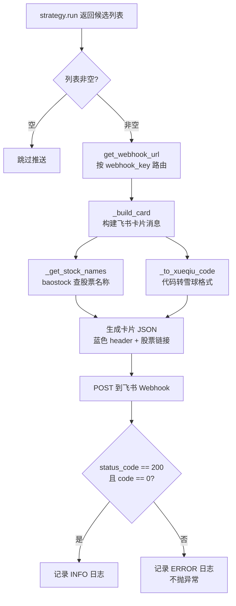

# Sequoia-X 源码阅读（四）：飞书推送与基础设施

前三篇聚焦在数据拉取和策略计算上。这一篇讲最后一步——把选股结果变成飞书群里的卡片消息，以及支撑全系统的配置和日志模块。

## 推送流程



## 飞书推送：卡在推送这一步

### 路由设计

`main.py` 调用 `notifier.send()` 时传了三个参数：

```python
notifier.send(
    symbols=selected,
    strategy_name=strategy_name,
    webhook_key=strategy.webhook_key,  # 'turtle' / 'ma_volume' / ...
)
```

`webhook_key` 决定了消息发到哪个飞书群。查找逻辑在 `get_webhook_url()` 里：

```python
def get_webhook_url(self, webhook_key: str) -> str:
    return self.strategy_webhooks.get(
        webhook_key.lower(),          # 先查专属 URL
        self.feishu_webhook_url       # 没有就 fallback 到默认
    )
```

一层 fallback：配了专属群的发专属群，没配的全部走默认 URL。不用在发送端写 `if/else`。

### 卡片消息格式

飞书的 Webhook 支持 `interactive` 类型的卡片消息。`_build_card()` 生成了一个结构化 JSON：

```python
{
    "msg_type": "interactive",
    "card": {
        "header": {
            "title": {"tag": "plain_text",
                       "content": "📈 Sequoia-X 选股播报 | TurtleTradeStrategy"},
            "template": "blue",
        },
        "elements": [
            {"tag": "div", "text": {"tag": "lark_md",
                       "content": "**日期：** 2026-05-18\n**选股数量：** 12"}},
            {"tag": "hr"},
            {"tag": "div", "text": {"tag": "lark_md",
                       "content": "**选股列表：**\n[贵州茅台](https://xueqiu.com/S/SH600519) ..."}},
        ],
    },
}
```

每只股票带上雪球链接，点一下直接跳到个股 K 线页面。`_to_xueqiu_code()` 负责这个转换：

```python
@staticmethod
def _to_xueqiu_code(code: str) -> str:
    if code.startswith("6"):
        return f"SH{code}"           # 上海主板
    elif code.startswith(("4", "8")):
        return f"BJ{code}"           # 北交所（baostock 为 sz 前缀）
    return f"SZ{code}"               # 深圳
```

注意北交所的处理——baostock 把北交所股票也归到 `sz` 前缀下，但雪球要求 `BJ` 前缀。这个差异被这个静态方法屏蔽了，上层调用不用关心。

### 容错：不抛异常

```python
try:
    resp = requests.post(url, data=json.dumps(payload),
                         headers={"Content-Type": "application/json"}, timeout=10)
    resp_json = resp.json()
    if resp.status_code != 200 or resp_json.get("code") != 0:
        logger.error(f"飞书推送失败 [{webhook_key}] HTTP状态={resp.status_code}")
    else:
        logger.info(f"飞书推送成功 [{webhook_key}]，共 {len(symbols)} 只股票")
except requests.RequestException as exc:
    logger.error(f"飞书推送请求异常 [{webhook_key}]：{exc}")
```

不抛异常的设计是刻意的——推送失败不应该中断策略执行。飞书挂了或者 webhook URL 过期了，记一条 ERROR 日志，不影响其他策略继续跑。

飞书的返回体不是 HTTP 200 就代表成功。正确的判断是 `resp.json()["code"] == 0`。只检查 HTTP 状态码会漏掉飞书返回的业务错误（比如 card 格式不对）。

## 配置管理：pydantic-settings

### 字段设计

```python
class Settings(BaseSettings):
    db_path: str = "data/sequoia_v2.db"    # 有默认值
    start_date: str = "2024-01-01"         # 有默认值
    feishu_webhook_url: str                 # 必填，缺失抛 ValidationError
    strategy_webhooks: dict[str, str] = {}  # 有默认值
```

两个可选的（有默认值），一个必填的，一个字典。启动时如果 `.env` 里没有 `FEISHU_WEBHOOK_URL`，直接抛错拦住，不会跑到一半才发现。

### 前缀扫描

`strategy_webhooks` 是这套配置系统最精巧的设计。`model_post_init()` 扫描所有以 `STRATEGY_WEBHOOK_` 开头的环境变量，自动收集到 dict 里：

```python
prefix = "STRATEGY_WEBHOOK_"
webhooks: dict[str, str] = dict(self.strategy_webhooks)
for key, value in os.environ.items():
    if key.upper().startswith(prefix):
        strategy_key = key[len(prefix):].lower()
        webhooks[strategy_key] = value
object.__setattr__(self, "strategy_webhooks", webhooks)
```

`.env` 文件里可以这样写：

```
FEISHU_WEBHOOK_URL=https://open.feishu.cn/.../default
STRATEGY_WEBHOOK_TURTLE=https://open.feishu.cn/.../turtle-group
STRATEGY_WEBHOOK_MA_VOLUME=https://open.feishu.cn/.../ma-group
```

不用写一个固定的 key 列表，新加一个策略机器人就加一行环境变量，配置文件不改、代码不改。

用 `object.__setattr__` 而不是 `self.strategy_webhooks = webhooks` 是为了绕过 pydantic 的字段校验——直接赋值会触发 `__setattr__` 的验证逻辑，而 `model_post_init` 阶段的修改用底层的 `object.__setattr__` 更安全。

### 单例

```python
_settings: Settings | None = None

def get_settings() -> Settings:
    global _settings
    if _settings is None:
        _settings = Settings()
    return _settings
```

模块级单例，首次调用时读 `.env` 并校验必填字段，之后返回缓存。每次 `Settings()` 都会重新解析 `.env`，但 `get_settings()` 只做一次。

## 日志：RichHandler

```python
def get_logger(name: str) -> logging.Logger:
    logger = logging.getLogger(name)

    if logger.handlers:       # 已有 handler，直接返回
        return logger

    handler = RichHandler(
        rich_tracebacks=True, # 彩色异常回溯
        show_path=False,      # 不显示文件路径，节省终端宽度
        log_time_format="[%Y-%m-%d %H:%M:%S]",
    )
    handler.setFormatter(logging.Formatter("%(name)s - %(message)s"))

    logger.addHandler(handler)
    logger.setLevel(logging.DEBUG)
    logger.propagate = False  # 不往根 logger 传递，避免重复输出
    return logger
```

四个关键点：

- **幂等** — 先检查 `logger.handlers`，有就不加了。多次调用 `get_logger(__name__)` 不会堆叠 handler。
- **`propagate = False`** — 不传到根 logger。不加这行，每条日志会被根 logger 和 RichHandler 各输出一次，屏幕刷屏。
- **`show_path=False`** — 日志只显示模块名，不显示完整文件路径。终端宽度有限，`sequoia_x.data.engine - 开始拉取快照...` 有用，`/Users/.../engine.py:142` 没用。
- **`rich_tracebacks=True`** — 异常回溯带语法高亮和本地变量展示。比标准 traceback 速度快一个量级的阅读速度。

## 可复用的设计

1. **推送失败 = 记日志，不抛异常** — 通知是 side effect，side effect 不能中断主流程。HTTP 超时、飞书故障、webhook URL 过期——任何推送失败都不应该影响策略执行。

2. **env 前缀扫描替代固定 key 列表** — 不用定义 `WEBHOOK_TURTLE: str`、`WEBHOOK_MA: str` 等一长串字段。约定胜于配置，一个前缀搞定所有。

3. **单例 ≠ 全局变量** — `get_settings()` 是一个函数，不是模块级 `settings = Settings()`。区别在于延迟初始化——只有真正调用时才读 `.env` 和校验。测试时可以 mock 这个函数而不影响模块加载。

4. **Logger 工厂的幂等保证** — `if logger.handlers: return logger`。这个检查成本接近于零，但保证了 `get_logger(__name__)` 可以在任何地方放心调用。

下一篇进入最后的测试体系，看 pytest + hypothesis 怎么测量化策略。
