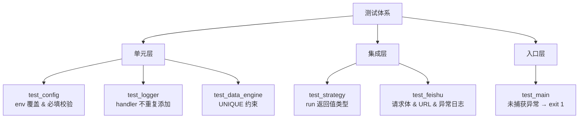

# Sequoia-X 源码阅读（五）：测试体系

前四篇把系统从上到下拆了一遍。最后一篇看测试——7 个文件，每个平均 30 行，用的是 hypothesis 属性测试，不是传统的「写死输入、断言输出」。

## 测试分层



## 属性测试 vs 传统单测

传统单测写固定输入：

```python
def test_turtle_trade():
    result = TurtleTradeStrategy(engine, settings).run()
    assert result == ["600519"]  # 只测了一种情况
```

属性测试描述不变式：

```python
@given(symbol=st.text(min_size=6, max_size=6, alphabet="0123456789"))
def test_unique_symbol_date_constraint(symbol):
    # 对于任意一个 6 位数字代码，插入两次后 count 都是 1
    ...
```

区别在于：前者测了「600519 不会重复插入」，后者测了「任何 6 位股票代码都不会重复插入」。hypothesis 会生成 50 个不同的 symbol，包括全零、全九、边界值。手动写 50 个 case 你会疯，hypothesis 自动生成。

## 解剖三个测试

### UNIQUE 约束：测试数据完整性

这是整个系统最底层的保证——同一只股票同一天的数据不能有两条：

```python
@given(
    symbol=st.text(min_size=6, max_size=6, alphabet="0123456789"),
    trade_date=st.dates(min_value=date(2024, 1, 1), max_value=date(2025, 12, 31)),
)
@h_settings(max_examples=50, deadline=None)
def test_unique_symbol_date_constraint(symbol, trade_date):
    with tempfile.TemporaryDirectory() as tmp_dir:
        engine, _ = make_engine_in(tmp_dir)
        row = {"symbol": symbol, "date": str(trade_date), ...}
        df = pd.DataFrame([row])
        with sqlite3.connect(engine.db_path) as conn:
            df.to_sql("stock_daily", conn, if_exists="append", ...)
            try:
                df.to_sql("stock_daily", conn, if_exists="append", ...)
            except sqlite3.IntegrityError:
                pass
            count = conn.execute(
                "SELECT COUNT(*) FROM stock_daily WHERE symbol=? AND date=?",
                (symbol, str(trade_date)),
            ).fetchone()[0]
        assert count == 1
```

几个值得关注的设计：

**`tempfile.TemporaryDirectory()`** — 每次测试创建独立数据库。测试之间零干扰，跑完自动清理。不需要 tearDown，不需要清理代码。

**`max_examples=50`** — hypothesis 默认跑 100 个例子，这里降到 50 因为每次都要创建临时数据库和 SQLite 连接。I/O 密集型测试适当降量。

**`deadline=None`** — hypothesis 默认有 200ms 单例超时。数据库操作可能超过这个阈值，关掉避免误报。

### 策略返回值类型：mock 掉整个数据层

```python
@given(
    symbols=st.lists(
        st.text(min_size=6, max_size=6, alphabet="0123456789"),
        min_size=0, max_size=3, unique=True,
    )
)
@h_settings(max_examples=30, deadline=None)
def test_strategy_run_returns_list_of_str(symbols):
    with tempfile.TemporaryDirectory() as tmp_dir:
        settings = Settings(db_path=..., feishu_webhook_url=...)
        engine = DataEngine(settings)

        with patch.object(engine, "get_all_symbols", return_value=symbols):
            with patch.object(engine, "get_ohlcv", return_value=pd.DataFrame()):
                strategy = MaVolumeStrategy(engine=engine, settings=settings)
                result = strategy.run()

    assert isinstance(result, list)
    assert all(isinstance(s, str) and len(s) > 0 for s in result)
```

这里 `patch.object` 同时 mock 了两个方法。`get_ohlcv` 返回空 DataFrame，策略拿到空数据直接 `continue`，最后返回空列表。测试不关心选股逻辑对不对（那是策略自己的事），只关心**无论输入什么，返回值类型不变**。

这就是属性测试的思维：找一个在所有情况下都成立的性质，然后让 hypothesis 生成所有情况去验证。

### 配置必填校验：控制环境变量

```python
def test_missing_required_field_raises():
    env_backup = os.environ.pop("FEISHU_WEBHOOK_URL", None)
    try:
        with pytest.raises(ValidationError) as exc_info:
            Settings(_env_file=None)
        assert "feishu_webhook_url" in str(exc_info.value).lower()
    finally:
        if env_backup is not None:
            os.environ["FEISHU_WEBHOOK_URL"] = env_backup
```

`_env_file=None` 强制 Settings 不走 `.env` 文件，完全依赖环境变量。`pop` 掉关键字段后校验应该失败。`finally` 块恢复环境变量——这一点很重要，否则其他测试会受影响。

## 三个核心技巧

### 1. 隔离

所有涉及数据库和文件的测试都用 `tempfile.TemporaryDirectory()`。不是「测试连测试库」，是「每次测试开一个全新数据库」。成本（创建 SQLite 文件的时间）接近于零，收益（测试之间零干扰）巨大。

### 2. Mock

Sequoia-X 的测试有个明显规律：**凡是调用外部服务的，全部 mock**。

| 外部依赖 | Mock 方式 |
|----------|----------|
| baostock 数据拉取 | `patch.object(engine, "get_ohlcv")` |
| 股票列表获取 | `patch.object(engine, "get_all_symbols")` |
| HTTP 请求 | `patch("requests.post")` |
| 环境变量 | `monkeypatch.setenv` |

绝不发真实 HTTP 请求，绝不调真实 baostock API。测试跑 50 个 hypothesis 例子只需要几秒，发真实请求要几分钟。

### 3. 随机数据生成

hypothesis 的 strategies 是本项目测试最出彩的部分：

```python
# 6 位数字股票代码，自动覆盖全零、全九、首位为零等边界
st.text(min_size=6, max_size=6, alphabet="0123456789")

# 2024-2025 之间的任意日期
st.dates(min_value=date(2024, 1, 1), max_value=date(2025, 12, 31))

# 飞书 webhook 格式的合法 URL
st.from_regex(r"https://open\.feishu\.cn/open-apis/bot/v2/hook/[a-z0-9\-]{8,36}")
```

最后一个 `from_regex` 尤其巧妙——不是随便生成一个字符串，而是生成符合飞书 webhook URL 格式的字符串。测试验证的是「用了正确的 URL」，而不是「URL 格式对不对」。生成的数据应该尽可能逼真，否则测试结果没有说服力。

## 这个系列读下来

五篇文章，顺着数据流从入口读到出口：

| 篇 | 模块 | 核心收获 |
|:---|------|----------|
| 一 | `main.py` | 双模式入口、110 行调度中心 |
| 二 | `data/engine.py` | 后复权选型、三层容错、跨步分片并行 |
| 三 | `strategy/` | 20 行基类、vector 化计算、shift(1) 防未来数据 |
| 四 | `notify/` + `core/` | webhook 多群路由、env 前缀扫描、单例 |
| 五 | `tests/` | hypothesis 属性测试、mock 隔离、随机数据生成 |

一个不到 20 个 `.py` 文件的项目，覆盖了数据拉取、存储、策略计算、消息推送、配置管理、日志、测试——麻雀虽小，五脏俱全。如果你要自己写一个「拉数据 → 做计算 → 推结果」的 Python 项目，Sequoia-X 的源码是一个很好的起点。
