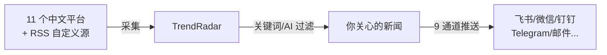
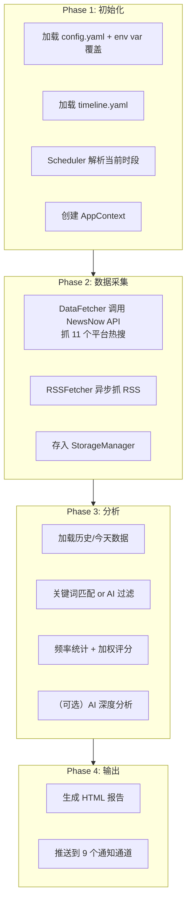
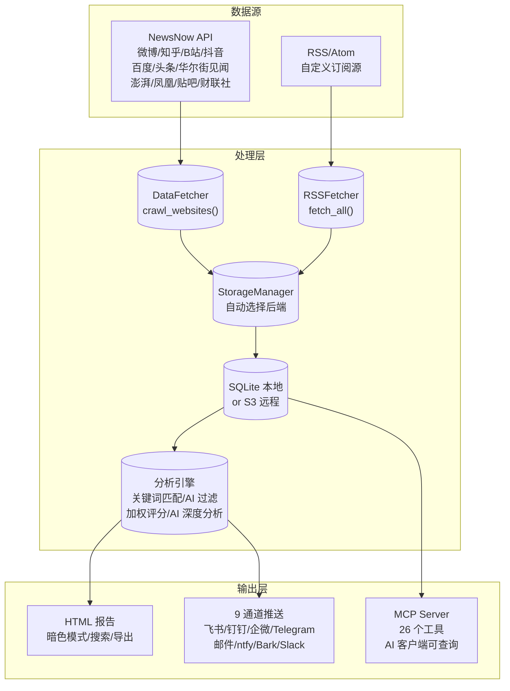

# （一）项目概览与架构全景

> 基于 TrendRadar v6.9.1，GPL-3.0，2000+ GitHub Stars。

## 这个项目解决什么问题

每天醒来，微博热搜、知乎热榜、百度风云榜——十几个平台的热点，99% 和你没关系，但你还是会刷，因为"万一错过什么呢"。

TrendRadar 做的事很直接：**你定义关键词，它帮你过滤全网热点，只推送你关心的那几条**。它是自己部署的、按你规则运转的、不需要刷的信息筛选器。



## 从用户视角看一条流水线

一个典型的使用场景：

1. 用户在 `config.yaml` 里配好关键词（比如"AI Agent"、"Rust"、"量化交易"）、推送时间、通知通道
2. GitHub Actions 定时触发（或 Docker 持续运行）
3. TrendRadar 调用 NewsNow API 拉取 11 个平台的热搜榜
4. 同时抓取用户配置的 RSS 源（博客、资讯站）
5. 用关键词匹配每条标题，选出相关的
6. （可选）调 AI 做深度分析——"今天这些新闻意味着什么"
7. 生成 HTML 报告 + 推送到飞书/钉钉/Telegram 等配置的通道

用户看到的是飞书里一条消息："今日 AI Agent 领域 3 条热点"，附上 AI 写的简要分析。不再需要打开任何一个新闻 App。

## 核心 Pipeline

`trendradar/__main__.py` 的 `NewsAnalyzer.run()` 是总入口，约 1800 行。主流程四步：



### Phase 1 — 初始化

```python
# __main__.py 中的简化逻辑
def run(self):
    config = load_config()                    # 读 yaml + 合并 env var
    scheduler = Scheduler(config["schedule"])  # 解析 timeline.yaml
    current_period = scheduler.get_current_period()
    
    ctx = AppContext(config)                   # 门面，懒加载所有子系统
    ...
```

`AppContext`（`context.py`）是整个系统的**唯一入口**。它不是简单的配置对象——它懒加载并持有所有子系统（存储、调度器、通知分发器、AI 过滤器），对外暴露统一接口。这是一种**门面模式**：调用的代码不需要知道存储是 SQLite 还是 S3，不需要知道通知是飞书还是 Telegram——`ctx` 替你屏蔽了这些差异。

### Phase 2 — 数据采集

```python
# 两类数据源
hotlist_data = DataFetcher().crawl_websites(platforms)   # NewsNow API（热搜）
rss_data = RSSFetcher().fetch_all(rss_configs)            # RSS/Atom 源
```

### Phase 3 — 分析

```python
titles = ctx.load_titles(mode="daily")             # 加载数据
matched = ctx.match_keywords(titles)               # 关键词过滤
stats = ctx.count_frequency(matched)               # 统计分析
if config.ai_analysis_enabled:
    ai_result = ctx.run_ai_analysis(stats)         # AI 深度分析
```

### Phase 4 — 输出

```python
html_path = ctx.generate_html_report(stats, ai_result)   # HTML 报告
ctx.dispatcher.dispatch_all(stats, ai_result)             # 通知推送
```

## 目录结构

```
TrendRadar/
├── trendradar/                 # 核心引擎
│   ├── __main__.py             # 入口 + NewsAnalyzer（1800+ 行）
│   ├── context.py              # AppContext 门面
│   ├── core/                   # 配置、调度、分析、频率统计
│   │   ├── loader.py           # 配置加载（600+ 行）
│   │   ├── scheduler.py        # 时间线调度
│   │   ├── analyzer.py         # 统计分析引擎
│   │   └── frequency.py        # 关键词匹配引擎
│   ├── crawler/                # 数据采集
│   │   ├── fetcher.py          # NewsNow API 调用
│   │   └── rss/fetcher.py      # RSS/Atom 并行爬取
│   ├── storage/                # 存储层
│   │   ├── base.py             # StorageBackend 抽象 + 数据模型
│   │   ├── local.py            # SQLite 本地存储
│   │   ├── remote.py           # S3 远程存储
│   │   └── manager.py          # 自动选择 + 双向同步
│   ├── ai/                     # AI 模块
│   │   ├── client.py           # LiteLLM 统一客户端
│   │   ├── analyzer.py         # AI 深度分析
│   │   ├── filter.py           # AI 兴趣分类
│   │   └── prompt_loader.py    # Prompt 模板加载
│   ├── notification/           # 通知分发
│   │   ├── dispatcher.py       # 多通道路由
│   │   ├── senders.py          # 9 个通道的发送实现
│   │   ├── formatters.py       # 各通道格式化
│   │   └── splitter.py         # 长消息拆分
│   └── report/                 # 报告生成
│       ├── generator.py        # 报告协调器
│       └── html.py             # HTML 渲染
├── mcp_server/                 # MCP Server（AI 接口）
│   ├── server.py               # FastMCP 2.0，26 个工具
│   └── tools/                  # 按功能拆分的工具类
├── config/                     # 配置文件
│   ├── config.yaml             # 主配置（12 段）
│   ├── timeline.yaml           # 调度时间线
│   ├── frequency_words.txt     # 关键词 DSL
│   └── ai_interests.txt        # AI 兴趣描述
└── output/                     # 运行产出（数据库 + HTML 报告）
```

## 三个贯穿全局的设计选择

### 1. 不依赖常驻进程——靠 cron 触发

TrendRadar 不需要 `systemctl start trendradar` 这种一直跑着的东西。每次运行是一次完整的 Pipeline：采集 → 分析 → 报告 → 推送 → 退出。这带来几个好处：

- **部署简单**：GitHub Actions 配个 cron 就搞定了，Docker 里也是一行 `docker run`
- **容错天然**：某次运行失败了，下次 cron 到点自然重来
- **状态在文件系统**：所有数据存在 SQLite/文件里，不依赖内存

### 2. LiteLLM 做模型抽象——不绑定任何 AI 厂商

```yaml
# config.yaml
ai:
  model: "deepseek/deepseek-chat"       # 今天用 DeepSeek
  fallback_model: "openai/gpt-4o-mini"  # DeepSeek 挂了自动切到 OpenAI
  api_base: "https://api.deepseek.com"
```

`ai/client.py` 封装了 `litellm.completion()`，加上 `tenacity` 重试和 fallback。切换模型只改配置，不改代码。

### 3. 两种过滤模式——关键词和 AI 互为备份

| | 关键词模式 | AI 模式 |
|------|----------|---------|
| 配置 | `frequency_words.txt`（规则 DSL） | `ai_interests.txt`（自然语言"我对 AI 和量化感兴趣"） |
| 匹配方式 | 正则/精确/排除语法 | AI 提取标签 → 语义分类 |
| 成本 | 免费 | 每次分类消耗 token |
| 何时用 | 兴趣明确且稳定 | 兴趣模糊或经常变化 |
| 失败时 | — | 自动降级到关键词模式 |

**关键词永远可用，AI 是可选的增强**——这个设计保证即使 AI API 挂了，系统不会丢新闻。

这个设计选择很务实——很多项目一上来就"AI 驱动"，然后 API 一限流就全崩。

## 信息流全景



## 本篇小结

TrendRadar 不是一个庞大的系统——核心代码约 1.2 万行 Python。但它的架构完整度很高：

- **清晰的 Pipeline 分阶段**：采集 → 分析 → 输出，阶段之间不耦合
- **AppContext 门面模式**：对外统一接口，对内懒加载子系统
- **Storage 抽象层**：SQLite 本地和 S3 远程用同一套接口
- **关键词 + AI 双保险**：AI 是增强，不是替代——不会因为 AI 挂了就罢工

下一篇深入配置系统——`config.yaml` 的 12 个配置段、`timeline.yaml` 的时间线模型、`frequency_words.txt` 的 DSL 语法设计。
