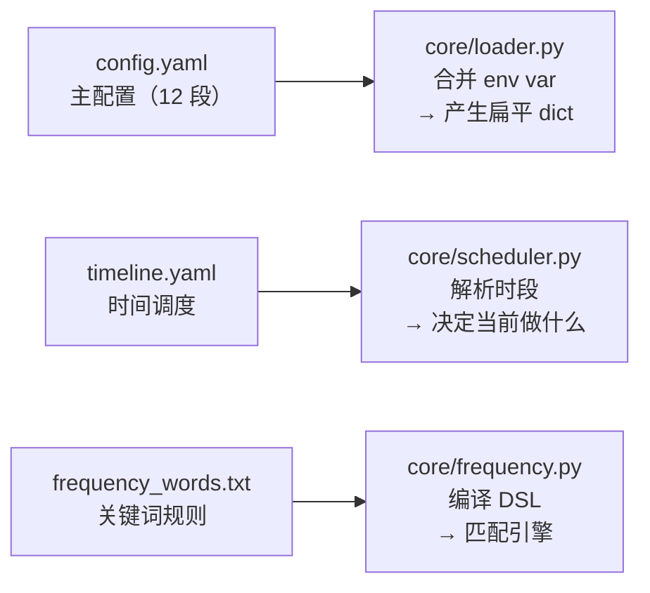
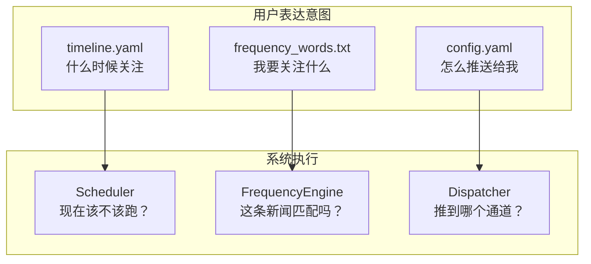

# （二）配置系统与调度引擎

> 基于 TrendRadar v6.9.1。

## 三份配置文件，三种不同的 DSL

TrendRadar 的配置不只是填几个参数——它定义了一套**小语言**让用户表达"我要监控什么、什么时候推、怎么推"。



三份文件各用一种 DSL：

| 文件 | 语言 | 表达什么 |
|------|------|----------|
| `config.yaml` | YAML | 开关、参数、凭据 |
| `timeline.yaml` | 时段-计划-周历 三层模型 | 什么时候采集、分析、推送 |
| `frequency_words.txt` | 自创的行级 DSL | 匹配什么、排除什么、怎么分组 |

## config.yaml：12 个配置段

```yaml
# config.yaml 结构（简化）
app:                  # 基础：模式、语言、时区
schedule:             # 调度：预设、时段
platforms:            # 平台：开启/关闭 11 个平台
rss:                  # RSS：订阅源列表
report:               # 报告：模式（daily/current）、主题
notification:         # 通知：9 个通道的 webhook/凭据
storage:              # 存储：本地/远程 S3
display:              # 显示：5 个内容区域的开关和排序
ai:                   # AI：模型、API、温度
ai_analysis:          # AI 分析：是否开启、prompt 模板
ai_translation:       # AI 翻译：目标语言
filter:               # 过滤：方法（keyword/ai）、最低分数
```

### 配置加载的核心逻辑

`core/loader.py`（约 600 行）做的事情：

```python
def load_config(config_path="config/config.yaml"):
    # 1. 读 YAML
    with open(config_path) as f:
        config = yaml.safe_load(f)

    # 2. 关键配置注入——env var 覆盖 yaml 值
    # 这在 CI/GitHub Actions 场景下特别有用：
    #   yaml 里写占位符，敏感信息从 GitHub Secrets 注入
    env_overrides = {
        "notification.feishu.webhook_url": os.getenv("FEISHU_WEBHOOK_URL"),
        "notification.telegram.bot_token": os.getenv("TELEGRAM_BOT_TOKEN"),
        "ai.api_key": os.getenv("AI_API_KEY"),
        "storage.remote.access_key": os.getenv("S3_ACCESS_KEY"),
        # ...
    }

    # 3. 校验——配对配置必须同时存在
    # 例如 Telegram 需要 token + chat_id 同时有值
    validate_paired_configs(config)

    # 4. 返回扁平化的 dict
    return config
```

env var 覆盖的设计很实用：`config.yaml` 可以提交到 GitHub（不含真实凭据），CI 运行时从 Secrets 注入。

## timeline.yaml：DSL 设计的亮点

这是整个配置系统最有意思的部分。一般的定时任务就是 `0 9 * * *`——每天九点跑一次。TrendRadar 要支持更复杂的场景：

> "工作日早晨 8-10 点用关键词模式，每 30 分钟跑一次；晚上 8-10 点用 AI 模式，每 1 小时跑一次。周末全天用 AI 模式，每 2 小时一次。推送只在早晚时段发。"

三层模型实现这个需求：**Periods → Day Plans → Week Map**。

### 第一层：Periods（时段定义）

```yaml
# timeline.yaml
periods:
  morning_peak:          # 时段名——自定义
    start: "08:00"
    end: "10:00"
    interval: 30         # 每 30 分钟跑一次
    collect: true        # 采集新数据
    analyze: true        # 分析
    push: true           # 推送
    frequency_file: "frequency_words.txt"     # 关键词模式
    
  evening_peak:
    start: "20:00"
    end: "22:00"
    interval: 60
    collect: true
    analyze: true
    push: true
    ai_filter: true                         # AI 模式
    ai_interests_file: "ai_interests.txt"
    
  off_hours:
    start: "00:00"
    end: "08:00"
    interval: 120
    collect: true
    analyze: false      # 只采集不分析——积攒数据
    push: false          # 不推送——不打扰用户
```

每个 Period 是一个时间窗口 + 行为配置的原子单元。关键字段：

| 字段 | 含义 | 设计意图 |
|------|------|----------|
| `start` / `end` | 时间窗口 | 支持跨午夜（`23:00-01:00`） |
| `interval` | 运行间隔（分钟） | 高峰期高频，闲时低频 |
| `collect` | 是否采集 | 闲时只攒数据不分析——省 token |
| `analyze` | 是否分析 | 控制了 AI 调用的频率 |
| `push` | 是否推送 | 不想被打扰的时段关掉 |
| `frequency_file` / `ai_filter` | 用什么过滤方式 | 同一个时间线里可以混合关键词和 AI 模式 |

### 第二层：Day Plans（天计划）

```yaml
day_plans:
  weekday:       # 工作日
    - morning_peak
    - evening_peak
    - off_hours
    
  weekend:       # 周末
    - relaxed_day  # 每 2 小时一次，AI 模式
```

Day Plan 是 Periods 的有序列表。多个 Day Plan 可以复用同一个 Period。

### 第三层：Week Map（周历）

```yaml
week_map:
  Monday: weekday
  Tuesday: weekday
  Wednesday: weekday
  Thursday: weekday
  Friday: weekday
  Saturday: weekend
  Sunday: weekend
```

Week Map 把一周七天映射到 Day Plan。和日历 App 的"重复事件"逻辑一致。

### 5 种预设

大多数用户不需要自己定义 Periods。TrendRadar 内置了 5 种预设：

```yaml
presets:
  always_on:      # 全天候——每 30 分钟，全部推送
  morning_evening: # 早晚高峰——早晨 8-10 + 晚上 20-22
  office_hours:   # 工作时间——9-18 点
  night_owl:      # 夜猫子——晚上 20 点到凌晨 2 点
  custom:         # 自定义——按 period/day_plan/week_map
```

用户选 `preset: morning_evening` 就不用再写详细配置。

### Scheduler 怎么解析

`core/scheduler.py` 的 `Scheduler` 类：

```python
class Scheduler:
    def get_current_period(self) -> Period | None:
        now = datetime.now()                        # 当前时间
        weekday = now.strftime("%A")                # Monday
        day_plan_name = self.week_map[weekday]       # weekday
        periods = self.day_plans[day_plan_name]      # [morning_peak, ...]

        for period_name in periods:
            period = self.periods[period_name]
            if period.contains(now):                 # 时间落在窗口内？
                if self._should_execute(period):     # 到 interval 了吗？
                    return period
        return None                                   # 不在任何窗口内
```

`get_current_period()` 返回 `None` 意味着当前不在任何推送窗口——程序退出，等下次 cron 触发。

`_should_execute()` 用文件时间戳做去重——记录上次执行时间，和 `interval` 比较。同一次 cron 触发内不会重复执行。

## frequency_words.txt：关键词匹配 DSL

这是用户最直接接触的"编程界面"。一个实际例子比解释更清楚：

```
# frequency_words.txt

[GLOBAL_FILTER]
!广告
!推广

[AI 与编程]
AI Agent
LLM
大模型 +大语言模型
Rust @3
Python 装饰器 => "Python 高级特性"

[金融市场]
量化交易
A股 +上证 +深证
美联储
/比特币|BTC|以太坊|ETH/

[科技公司]
Apple => 苹果
/OpenAI|Google|Microsoft/
```

### 语法规则

| 语法 | 含义 | 示例 |
|------|------|------|
| `关键词` | 标题包含即匹配 | `AI Agent` 匹配 "本周 AI Agent 融资 10 亿" |
| `+关键词` | 必须出现（AND） | `A股 +上证` 匹配 "A股暴跌 上证跌破3000"，不匹配只有 "A股" 的 |
| `!关键词` | 排除（NOT） | `!广告` 排除所有含"广告"的标题 |
| `[组名]` | 分组——统计和报告按组聚合 | 输出时按组分类展示 |
| `/regex/` | 正则表达式 | `/OpenAI\|Google/` 匹配任一 |
| `@N` | 每条新闻最多匹配 N 次（防刷屏） | `Rust @3` 每小时最多推 3 条 Rust 相关 |
| `=> "显示名"` | 显示别名——匹配用原文，展示用别名 | `Apple => 苹果` 统计报告里显示"苹果" |
| `[GLOBAL_FILTER]` | 全局过滤器——在所有组之前先过滤 | `!广告` 放这里，所有组都受益 |

### 为什么不用 JSON 或 YAML

关键词配置的核心用户**不是程序员**。每行一个规则是最自然的表达方式。而且 `frequency_words.txt` 的改动频率最高——用户天天会加关键词。用 YAML 的嵌套语法反而增加出错的概率。

```python
# core/frequency.py 中的匹配逻辑（简化）
def matches_word_groups(title: str, groups: dict) -> list[str]:
    matched = []
    for group_name, words in groups.items():
        for word in words:
            if word.is_required and not contains(title, word.text):
                break       # 必须词不满足 → 整组跳过
            if word.is_excluded and contains(title, word.text):
                break       # 排除词出现 → 整组跳过
            if word.is_regex and re.search(word.pattern, title):
                matched.append(group_name)
            elif word.text in title:
                matched.append(group_name)
    return matched
```

匹配逻辑是"组级别"的——一条新闻归入哪个关键词组，按哪个组的规则来统计。

## 配置系统的工程价值

三份配置文件合在一起，定义了一套"用户意图的编程语言"：



用户改配置不需要改代码——这是**声明式配置**的核心价值。下一篇看数据怎么进来：NewsNow API 怎么调、RSS 怎么并行抓、数据怎么存。
